# Architecture

This document defines technical structure and deployment for the product described in `docs/requirements.md` (**REQ-001–REQ-039**).

**REQ-034–REQ-039:** **REQ-034** (faint boundary cuboid + **`margin_m`**) is covered in **§3.12–§3.13**, **§4.7**, **§4.9**. **REQ-035–REQ-039** add **WLED devices**, **1:1 assignment**, **Devices UI** (**§4.15**), **server-side routines** (**§3.16–§3.17.2**), **in-memory light state** (**§3.3**, **§3.9**, **§3.21**), and **WLED push** (**§3.19–§3.20**). **The §1 table** is the **concise** trace from each REQ to sections; **if** any **bullet** **below** **still** **reads** **“SQLite** **for** **light** **triples**” **or** **“browser-only** **routine** **engine**”, **treat** **that** **as** **stale** **and** **follow** **the** **§** **links** **in** **the** **REQ-034–REQ-039** **rows** **and** **§3.9**/**§3.16** **instead**.

**REQ-001–REQ-033** **(summary):** **Go** **+** **embedded** **Next** **static** **export** **;** **models**/**scenes**/**routines** **in** **SQLite** **;** **per-light** **output** **state** **in** **`LightStateStore`** **(**not** **SQLite** **—** **REQ-039**)** **;** **three.js** **views** **§4.7**/**§4.9** **;** **scene** **spatial** **API** **§3.15** **;** **routines** **(**Python** **+** **shape** **animation**)** **run** **on** **the** **server** **(**REQ-038**)** **with** **optional** **`python3`** **subprocess** **§3.17** **.

## Architectural resolution: REQ-004 (single binary) vs Next.js

**Decision:** **Full Next.js SSR/Node at runtime is out of scope** for the shipped product. The open item in REQ-004 is resolved as follows:

- **Next.js + App Router + Tailwind** remain the **authoring** stack under `web/` (toolchain, components, styling).
- **Runtime** on the Pi is a **single Go process** that:
  - Serves the **JSON API** (`/health`, `/api/v1/...`).
  - Serves the UI as **static assets** produced by **`next build` with `output: 'export'`** (static HTML, JS, CSS), **embedded** in the binary via Go **`embed`**, or **baked in at link time** from a generated filesystem tree.
- **REQ-002 (reactive UI):** Achieved with **client-side React** (hydration and **`"use client"`** components) and browser **`fetch`** to **same-origin** `/api/v1/...` on the Go listener. **No** React Server Components that require a Node runtime at request time; any **async server-only** data patterns used during development MUST be replaced or duplicated with **client** fetches or **build-time** data before release.

This meets REQ-004 rule 1 (**no separate Node.js runtime** in the distribution) and aligns with Pi RAM constraints (**§6**).

---

## 1. Goals and constraints

| Requirement | Architectural response |
|-------------|-------------------------|
| REQ-001 | **Go** binary serves **HTTP API** + **embedded static UI** built from **Next.js + Tailwind** source in `web/`. |
| REQ-002 | **Mobile-first** Tailwind, **Client Components** for interactivity; **`fetch('/api/v1/…')`** from the browser to the same Go origin. |
| REQ-003 | Primary release target **linux/arm64** (Pi 4B, 64-bit OS); document **CPU/RAM**; **one** long-lived app process. |
| REQ-004 | **One executable file** per release target; assets **embedded** (or generated inside the process); **Docker/compose not** the canonical install path. |
| REQ-005 | **Domain types** + **CSV** contract; **ordered chain** adjacency (**id** **i** ↔ **i±1** only); **metadata** (**name**, **creation instant**) stored with each model; coordinates as **float64** in Go/API JSON. |
| REQ-006 | **REST JSON API** for models + **Next.js** client pages (list, detail, upload, delete); **multipart** upload for CSV; **409** **`model_in_scenes`** when **delete** **blocked** (**§3.13**). |
| REQ-007 | **Authoritative validation** in Go when ingesting CSV; **transactional** create (all-or-nothing); **400** responses with clear **error** envelope. |
| REQ-008 | **`scripts/run.sh`** (or documented equivalent) from repo root: **`npm run release:sync`** in `web/` then **`go run ./cmd/server`** in `backend/`; **README** documents exact invocation (**§3.7**). |
| REQ-009 | **`internal/samples`** builds three **ordered** light paths on each solid’s boundary (**500 ≤ n ≤ 1000**, **0.05–0.10 m** consecutive chords, **§3.8**) with **even** placement on **faces** / **surfaces** per **§3.8**; **`store.SeedDefaultSamples`** when **`models`** empty (**§3.8**). |
| REQ-010 | **`three`** direct; **client-only** detail: **InstancedMesh** (or equivalent **§4.7**) **ø 0.02 m** markers for **all n** lights (**no** LOD/decimation); **`LineSegments`** **i↔i+1** only (**chain**); segment colour **`#D0D0D0`**, **opacity 0.15** (**85%** transparent), thinner/subtler than spheres; **`Raycaster`** + **DOM** tooltip (**§4.7**). |
| REQ-011 | **REST** **`/api/v1/models/{id}/lights/...`** **and** **scene** **§3.15** **routes** **for** **read**/**write** **of** **logical** **state** **;** **authoritative** **data** **in** **`LightStateStore`** **(**§3.9**, **§3.21**)** **not** **SQLite** **(**REQ-039**)**. **§3.18** **(**REQ-029**)** **for** **aggregate** **paths**. |
| REQ-012 | **three.js** **materials**: **on** = **opaque** **base** **colour** × **brightness** **+** **emissive** **glow** **(**REQ-028**)**; **off** = **`#D0D0D0`**, **opacity 0.15** (match **REQ-010** segments); **client** merges **API** state; **no** indefinite staleness after **writes** (**§4.7**, **§8.7**). |
| REQ-013 | **Model detail** **light table**: **client-side** **pagination** over **`GET` detail** payload; **page size** presets **25 / 50 / 100** (default **50**); **go to id** computes target page + **inline validation**; **checkbox** multi-select with **optional** **Shift+click** range on **current page**; **selection** **retained** across pages in **React state** (**`Set<number>`**) until **clear** or **navigate away**; **bulk apply** calls **`PATCH …/lights/state/batch`** (**§3.10**); **list** and **three.js** updated from **response** (**§4.8**, **§8.8**). |
| REQ-014 | **Insert defaults** **on=false**, **`color="#ffffff"`**, **`brightness_pct=100`** (**§3.9**); **`POST …/lights/state/reset`** (**§3.11**); **model detail** **Reset** button (non–hover-only) calls reset then merges **`states`** into **UI** + **§4.7** (**§4.6**, **§8.9**). |
| REQ-015 | **`scenes`** + **`scene_models`** (**§3.12**); **`POST /scenes`** **computes** **all** **offsets** **from** **ordered** **`model_id`** **list**; **`GET /models/{id}`** **unchanged** **(canonical** **coords)**; **`GET /scenes/{id}`** **returns** **`x,y,z`** **+** **`sx,sy,sz`** (**§3.13**); **composite** **three.js** **§4.9**; **409** **`model_in_scenes`** (**§3.2**, **§8.4**). |
| REQ-016 | **§4.7** / **§4.9**: **`Reset camera`** **control** **re-applies** **`applyDefaultFraming`** **(same** **pure** **function** **as** **initial** **load** **from** **current** **bounds**)**; **`OrbitControls`** **target** **+** **camera** **position** **+** **`update()`**; **does** **not** **call** **API**. **§4.10** **IA** **optional** **link** **only**—**primary** **placement** **adjacent** **to** **viewport**. |
| REQ-017 | **`POST /api/v1/system/factory-reset`** (**§3.2**, **§3.14**); **`store.FactoryReset`** **transaction** **deletes** **`routine_runs`** **+** **`routines`** **(**including** **`shape_animation`** **rows**)** **,** **all** **`devices`** **(**REQ-035**/**REQ-036**)** **,** **then** **scenes**/**models**/**lights** **in** **FK-safe** **order** **then** **`SeedDefaultSamples`** **+** **`SeedDefaultPythonRoutines`** (**§3.8.1**); **confirmation** **dialog** **§4.10** **must** **mention** **devices** **among** **data** **removed**; **post-success** **navigate** **`/models`** **+** **success** **message** (**architectural** **default** **for** **post-reset** **navigation**). |
| REQ-018 | **§4.11**: **Tailwind** **`dark:`** **variant** on **`html`** (**add**/**remove** **`class="dark"`** **or** **`data-theme="dark"`** **per** **Tailwind** **v4**/**v3** **config**); **before** **any** **stored** **user** **choice**, **derive** **initial** **light**/**dark** **from** **`window.matchMedia('(prefers-color-scheme: dark)')`** **(or** **equivalent**)** **when** **available**; **fallback** **to** **light** **if** **the** **platform** **does** **not** **expose** **a** **scheme**; **after** **the** **user** **toggles** **theme**, **persist** **`light`** **or** **`dark`** **in** **`localStorage`** **key** **`dlm-theme`** **and** **re-apply** **on** **load** **before** **first** **paint** **(inline** **blocking** **script** **in** **`layout`** **recommended** **to** **avoid** **flash**)** **so** **the** **persisted** **value** **overrides** **`prefers-color-scheme`** **until** **cleared** **or** **changed**; **shell** **tokens**: **light** **`bg-white`** **+** **`text-gray-900`**; **dark** **`bg-gray-900`** **+** **`text-white`** (**dark** **grey** **background**, **not** **mandating** **`#000`**); **`AppShell`**: **header** **(burger,** **`faLightbulb`** **regular** **logo,** **exact** **title** **`Domestic Light & Magic`**, **theme** **toggle** **with** **icons)** **+** **collapsible** **left** **`<aside>`** **nav** **+** **`main`**; **Font Awesome** **Free** **`@fortawesome/fontawesome-svg-core`**, **`@fortawesome/react-fontawesome`**, **`@fortawesome/free-regular-svg-icons`**, **`@fortawesome/free-solid-svg-icons`**; **buttons** **and** **button-styled** **controls** **include** **a** **visible** **Font Awesome** **icon** **+** **accessible** **name**. |
| REQ-019 | **§4.7**, **§4.9**: **`ModelLightsCanvas`** **/** **`SceneLightsCanvas`** **set** **a** **fixed** **dark-grey** **clear** **/** **scene** **background** **and** **matching** **letterbox** **wrapper** **(see** **§4.7** **viewport** **subsection**)** **independent** **of** **`html`** **`dark`** **class**; **does** **not** **replace** **REQ-018** **shell** **tokens** **for** **`main`** **chrome**. |
| REQ-020 | **§3.2**, **§3.12**, **§3.13**, **§3.15**, **§8.15**: scene-space API for dimensions + full/filtered light retrieval (cuboid/sphere) + transactional bulk updates (cuboid/sphere + **`PATCH …/lights/state/scene`** + **`PATCH …/lights/state/batch`**), all computed from derived scene coordinates (**`sx/sy/sz`**) and validated with explicit geometry rules. |
| REQ-021 | **§3.2**, **§3.14**, **§3.15**, **§3.16**, **§3.17**, **§3.17.2**, **§4.9**, **§4.11**, **§4.12**, **§4.14**, **§8.16**/**§8.17**/**§8.21**/**§8.22**: **Two** **kinds** **;** **start**/**stop** **persists** **`routine_runs`** **and** **starts**/**stops** **`routineengine`** **supervisor** **(**REQ-038**)** **;** **effects** **only** **through** **§3.15** **(**not** **`/models/.../lights`** **for** **routine** **automation**)** **;** **one** **active** **run** **per** **scene** **;** **409** **while** **running** **on** **destructive** **definition** **mutations**. |
| REQ-022 | **§3.2**, **§3.15**, **§3.16**, **§3.17** **(**server** **Python** **runner** **+** **REQ-030** **in** **runner** **)** **,** **§4.9**, **§4.11**, **§4.12**, **§4.13** **(**CodeMirror** **6** **editor** **unchanged**)** **,** **§6.2**, **§8.17**: **`python_source`** **stored** **in** **SQLite** **;** **execution** **in** **Go-supervised** **`python3`** **subprocess** **(**or** **documented** **equivalent**)** **with** **`scene`** **shim** **calling** **loopback** **`127.0.0.1`** **§3.15** **(**same** **validation** **as** **browser** **would** **have** **invoked**)** **;** **cooperative** **/** **forced** **stop** **via** **supervisor** **(**§3.17**)** **. **Deployment** **MAY** **require** **`python3`** **on** **`PATH`** **on** **the** **Pi** **(**document** **in** **README**)** **—** **trade-off** **vs** **former** **Pyodide-only** **browser** **execution**. |
| REQ-023 | **§4.12** (**create** **flow** **chooses** **Python** **or** **shape** **animation** **—** **exactly** **two** **kinds**; **no** **third** **engine**), **§4.13**, **§4.14**, **§4.9**, **§4.11**; **`POST /api/v1/routines`** **`type`** **`python_scene_script`** **or** **`shape_animation`** **(**§3.16**)**. |
| REQ-024 | **§4.13** (**`<section id="python-scene-api-catalog">`** **immediately** **below** **editor** **—** **complete** **`scene`** **API** **manifest** **from** **§3.17** **including** **REQ-030** **`scene.random_hex_colour`**, **`scene.max_x`/`max_y`/`max_z`**; **per-entry** **commented** **snippets** **for** **API** **items** **only**; **REQ-032** **default** **routines** **are** **not** **required** **as** **whole-script** **catalog** **rows** **(**REQ-024** **rule** **7**)**; **picker** **+** **insert** **at** **caret** **or** **EOF**). |
| REQ-025 | **§4.13** (**`PYTHON_ROUTINE_DEFAULT_SOURCE`** **in** **`web/`** **—** **applied** **when** **creating** **`python_scene_script`** **with** **empty** **`python_source`** **and** **optional** **“Reset** **template”**); **uses** **`scene.set_lights_in_sphere`** **with** **`on`**, **`color`**, **`brightness_pct`**; **SHOULD** **use** **`scene.random_hex_colour()`** **for** **the** **demo** **colour** **(**REQ-030**)** **instead** **of** **`import** **random`** **for** **that** **single** **pattern**. |
| REQ-026 | **§3.15** (**axis** **mapping** **for** **`size.width`**, **`size.height`**, **`size.depth`** **and** **`max.x/y/z`**), **§3.17** (**Python** **`scene.width`**, **`scene.height`**, **`scene.depth`**, **`scene.max_x`**, **`scene.max_y`**, **`scene.max_z`** **from** **`GET …/dimensions`**), **§4.13** (**REQ-024** **API** **reference** **manifest**). |
| REQ-027 | **§4.13** **and** **§4.14** (**unified** **panel** **per** **kind:** **one** **scene** **`<select>`** **for** **run** **+** **`SceneLightsCanvas`**; **Start**/**Stop**; **Reset** **scene** **lights** **→** **`PATCH …/lights/state/scene`**, **Reset** **camera** **→** **`applyDefaultFraming`**), **§8.18**, **§8.22**; **resolved:** **reset** **lights** **does** **not** **auto-stop** **run**; **viewport** **works** **with** **or** **without** **active** **run**. |
| REQ-028 | **§4.7** **(**emissive** **mapping** **+** **scene** **lights**)**, **§4.9** **(**composite** **reuse**)**, **§4.13**, **§4.14** **(**unified** **live** **viewports**)**, **§6.5** **(**browser** **GPU** **on** **Pi** **and** **other** **clients**)**, **§8.5**, **§8.7** **(**material** **updates** **after** **PATCH**)**. |
| REQ-029 | **§3.2** **(**batch**/**bulk** **routes** **listed** **below**)**, **§3.10**, **§3.15**, **§3.18** **(**write** **path**, **connections**, **observer** **strategy**, **optional** **SSE**)**, **§4.3**, **§4.7**, **§4.9**, **§6**, **§7**, **§8.19**, **§9** **(**payload**/**rate** **limits**)**. |
| REQ-030 | **§3.17** (**`scene.random_hex_colour()`** **—** **local** **`random.randrange(0x1000000)`** **+** **`"#%06x"`** **in** **the** **`python3`** **subprocess**, **same** **distribution** **as** **CPython**/**Pyodide**), **§4.13** (**REQ-024** **manifest** **row** **+** **novice** **sample**; **`pythonRoutineCodemirror`** **completion**), **`web/lib/pythonSceneApiCatalog.ts`**, **`public/dlm-python-scene-worker.mjs`** **(**if** **retained** **for** **optional** **client** **lint**/**preview** **only** **—** **stay** **aligned** **with** **`scene.max_*`** **when** **present**)**. |
| REQ-031 | **§3.9**, **§3.10**, **§3.15**, **§3.16**, **§3.17**, **§3.17.2**, **§3.18**, **§3.19**, **§3.20**, **§4.7**, **§4.9**, **§4.13**, **§4.14**, **§8.7**, **§8.8**, **§8.20** **(**equivalence** **before** **memory** **update**, **device** **push**, **and** **three.js** **redraw**)**. |
| REQ-032 | **§3.8.1** **(**seed** **three** **`python_scene_script`** **rows** **on** **empty** **`routines`** **+** **factory** **reset**)** **,** **§3.17.1** **(**geometry** **+** **timing** **for** **growing** **sphere** **+** **sweeping** **cuboid** **+** **normative** **behavior** **for** **random** **colour** **cycle** **all** **lights**)** **,** **`web/lib/pythonRoutineSamples.ts`** **(**exports** **`PYTHON_SAMPLE_*`** **for** **all** **three** **bodies** **—** **single** **source** **of** **truth**)** **;** **optional** **toolbar** **“Load** **sample”** **MAY** **reuse** **those** **strings** **but** **REQ-024** **catalog** **must** **not** **be** **the** **only** **delivery** **of** **full** **default** **scripts** **;** **REQ-025** **default** **new-routine** **template** **unchanged** **unless** **product** **replaces** **it** **later**. |
| REQ-033 | **§3.16** **(**schema** **+** **`POST`/`PATCH`**)**, **§3.17.2** **(**simulation** **engine** **—** **server-side** **Go** **loop** **per** **§3.17.2** **revision**)**, **§4.12**, **§4.14**, **§6.2**, **§8.21**, **§8.22** **(**unified** **viewport** **for** **authoring** **;** **writes** **still** **§3.15** **on** **server**)**. |
| REQ-034 | **§3.12–§3.13**, **§4.7**, **§4.9**, **§4.14**: **persisted** **`margin_m`** **per** **scene**; **faint** **AABB** **wire** **on** **model** **and** **scene** **canvases** **(**tight** **light** **bounds** **+** **padding**)**. |
| REQ-035 | **§3.20**: **device** **registry**, **type** **`wled`**, **mapping** **model** **light** **`idx`** **→** **WLED** **LED** **indices** **(**architecture** **§3.20**)**. |
| REQ-036 | **§3.20**: **at** **most** **one** **`model_id`** **per** **device** **and** **vice** **versa** **(**nullable** **FK** **+** **UNIQUE** **constraints** **or** **equivalent**)**. |
| REQ-037 | **§4.11** **nav** **+** **§4.15** **(**Devices** **routes** **/** **pages**)** **—** **Must** **:** **list**, **add** **via** **manual** **`base_url`**/**host**/**port** **(**REQ-035** **MVP**)** **,** **assign**/**unassign** **,** **edit** **name** **,** **delete**/**forget** **(**cascades** **assignment** **per** **§3.20**)** **;** **discovery** **(**`POST …/devices/discover`**)** **optional** **until** **implemented**. |
| REQ-038 | **§3.16–§3.17.2**: **routine** **runs** **supervised** **by** **Go** **(**`internal/routineengine`** **or** **equivalent**)** **;** **scene** **§3.15** **handlers** **apply** **logical** **state** **then** **§3.20** **pushes** **to** **assigned** **devices** **when** **present** **;** **browser** **not** **required** **for** **progress**. |
| REQ-039 | **§3.3**, **§3.9**, **§3.21**: **`internal/lightstate`** **(**in-memory** **per** **model:** **map** **light** **`idx` →** **state** **triple**)** **;** **normative** **startup** **sync** **and** **unassign** **policies** **(**§3.21**)** **;** **API** **reads**/**writes** **hit** **memory** **first**. |

**Assumed Pi context:** Raspberry Pi 4 Model B, **64-bit OS**, **ARM64** userspace. **2–8 GB RAM** — with **no Node** at runtime, **4 GB** is practical for modest traffic; **off-device** `next export` builds recommended.

**Canonical production listener:** Single Go process on **one TCP address** (e.g. **`:8080`** or behind an **optional** reverse proxy on **`:80`/`443`** that forwards **all** paths to that one upstream). **No** second application process from the product distribution.

**Dev vs prod:** Local development **may** still run **`next dev`** alongside **`go run`** for fast iteration; that **two-process** pattern is **not** part of the **shipped** artifact (REQ-004).

---

## 2. Repository layout

Monorepo (single Git root), **one Go module** under `backend/`, **no `go.work`** unless later expanded.

```
dlm/
  scripts/
    run.sh                    # REQ-008: release:sync + go run server (repo root relative paths)
  backend/
    cmd/
      server/                 # main() — single binary entry; calls seed-if-empty (REQ-009)
    internal/
      config/
      httpapi/                # API mux + middleware + JSON handlers (incl. models HTTP)
      wiremodel/              # domain types, CSV parse + validation (REQ-005/007)
      samples/                # deterministic boundary sampling + id order: sphere, cube, cone (REQ-009 §3.8)
      store/                  # persistence for models, scenes, routines (SQLite, REQ-006); not per-light output state (REQ-039)
      lightstate/             # in-memory authoritative per-light state + load/save hooks (REQ-039, REQ-011)
      devices/                # device registry, WLED client, discovery adapter (REQ-035–REQ-038)
      routineengine/          # supervises active runs: Python subprocess and shape-animation tick in Go (REQ-038, REQ-021–REQ-033)
      webdist/                # holds embedded payload (see §3.5); populated by build, not hand-edited
        placeholder.txt       # optional tiny file so empty embed works in dev before first UI build
  web/                        # Next.js + Tailwind (source only for runtime; sibling of backend/)
    app/
    components/               # incl. AppShell, theme toggle, nav (REQ-018 §4.11); ModelLightsCanvas / SceneLightsCanvas (REQ-019 viz backdrop §4.7–§4.9)
    lib/
  docs/
```

**Boundaries:**

- **`backend/` MUST NOT import** TypeScript sources from `web/` — only **built static files** under `internal/webdist/` (or equivalent) prepared by the **build pipeline**.
- **`web/` MUST NOT** import Go.
- **Public HTTP contract:** **`GET /health`**, **`/api/v1/*`** JSON API; **static paths** for UI (`/`, `/_next/...`, assets) from embedded FS.

---

## 3. Golang service (runtime)

### 3.1 Module and packages

- **Module path:** `example.com/dlm/backend` (or successor); unchanged conceptually.
- **`cmd/server`:** Load config; construct **`http.Server`**; mount **API sub-router** and **static file server** from **`embed`**; graceful **SIGINT/SIGTERM** shutdown.
- **`internal/config`:** **Env-based** listen address, timeouts, optional **CORS** (primarily for **dev** when UI dev server uses another origin); production **same-origin** reduces CORS; **SQLite** path via **`DLM_DB_PATH`** and/or **`DLM_DATA_DIR`** (**§3.3**).
- **`internal/httpapi`:** Middleware (**request ID**, **slog**, **recover**, optional **CORS**); **JSON** handlers and error envelope `{ "error": { "code", "message", "details"? } }`; **models**, **light-state** (**via** **`internal/lightstate`**), **scenes**, **scene-region** routes (**§3.15**), **devices** (**§3.20**), **routines**/**routine-runs** (**§3.16**) delegate to **`internal/store`**, **`internal/lightstate`**, **`internal/devices`**, **`internal/routineengine`**, and **`internal/wiremodel`**. **Routine** **automation** **runs** **in** **the** **Go** **process** (**REQ-038**): **Python** **kind** **via** **supervised** **subprocess** **(**§3.17**)** **;** **shape** **animation** **via** **Go** **ticker** **(**§3.17.2**)**. **High-throughput** **and** **connection-reuse** **§3.18** (**REQ-029**).
- **`internal/lightstate`:** **Authoritative** **in-memory** **per-model** **maps** **`light idx → { on, color, brightness_pct }`** (**REQ-039**, **§3.9**, **§3.21**); **all** **§3.9**/**§3.10**/**§3.11**/**§3.15** **writes** **mutate** **here** **first**, **then** **optional** **WLED** **push** **(**§3.20**)** **;** **emits** **SSE** **seq** **on** **real** **change**.
- **`internal/devices`:** **CRUD** **for** **`devices`** **table** **(**§3.20**)** **;** **WLED** **HTTP** **JSON** **API** **client** **;** **optional** **discovery** **adapter** **(**mDNS** **/** **subnet** **probe** **—** **not** **required** **for** **MVP**)** **;** **startup** **/** **post-assign** **sync** **with** **`LightStateStore`** **(**§3.21**)**.
- **`internal/routineengine`:** **One** **supervisor** **per** **active** **`routine_runs`** **row** **with** **`status=running`** **;** **starts**/**stops** **Python** **worker** **process** **or** **shape** **animation** **loop** **;** **cooperative** **/** **forced** **termination** **(**§3.17**)** **without** **requiring** **any** **browser** **tab**.
- **`internal/wiremodel`:** Parses and validates uploaded **CSV** per **§3.6**; returns structured errors for HTTP **400** responses (**REQ-007**).
- **`internal/store`:** **SQLite** repository (see **§3.3**, **§3.12**, **§3.16**); **persists** **models** **(geometry** **only** **for** **lights** **rows** **—** **§3.3**)** **,** **scenes**, **scene_models**, **routines**, **routine_runs**, **devices** **metadata** **;** **does** **not** **store** **per-light** **`on`/`color`/`brightness`** **(**REQ-039**)**. **Idempotent** **seed** **(**§3.8**, **§3.8.1**)** **and** **factory** **reset** **(**§3.14**)** **:** **factory** **reset** **MUST** **`DELETE`** **all** **`devices`** **rows** **(**REQ-017**/**REQ-035**)** **before** **re-seed**.
- **`internal/samples`:** Pure functions that return **`[]wiremodel.Light`** (sequential **id**s from **0**) for the three canonical shapes: **on-surface** positions, **even** coverage per **§3.8**, consecutive **dᵢ** in band; no I/O (**REQ-009**).

### 3.2 HTTP surface

| Kind | Path | Purpose |
|------|------|--------|
| API | `GET /health` | Liveness; **no auth**. |
| API | `GET /api/v1/models` | List models (**metadata** + **light_count**). **REQ-006** |
| API | `POST /api/v1/models` | Create model: **`multipart/form-data`** with **`name`** (string) + **`file`** (CSV). **REQ-006/007** |
| API | `GET /api/v1/models/{id}` | Model **metadata** + ordered **lights** `{ id, x, y, z, on, color, brightness_pct }[]` (**§3.9**). **REQ-006**, **REQ-011** |
| API | `DELETE /api/v1/models/{id}` | Delete model (**204** / **404**). **409** if the model is **assigned** to **any** scene (**REQ-006** rule **5**, **§3.13**). **REQ-006** |
| API | `GET /api/v1/scenes` | List scenes (**id**, **name**, **created_at**, **model_count**). **REQ-015** |
| API | `POST /api/v1/scenes` | Create scene: **JSON** **`{ "name", "models": [ { "model_id": "<uuid>" }, … ] }`** — **≥ 1** **element**; **array** **order** **is** **placement** **order** (**REQ-015** **rule** **2**). **Server** **computes** **all** **`offset_x/y/z`** **(§3.12** **create-time** **algorithm**)**; **client** **MUST** **not** **send** **offsets** **on** **create** (**reject** **or** **ignore** **unknown** **offset** **fields** **per** **§3.13**). **201** + scene summary. **REQ-015** |
| API | `GET /api/v1/scenes/{id}` | Scene **metadata** + **placements** + **full** **lights** (positions + state) **per** **model** for **one** **round-trip** (**§3.13**). **REQ-015** |
| API | `DELETE /api/v1/scenes/{id}` | Delete scene and **all** **placements** (**204** / **404**). Used after **user** **confirms** **deleting** **the** **whole** **scene** when **removing** **the** **last** **model** (**REQ-015**). |
| API | `POST /api/v1/scenes/{id}/models` | **Add** a **model** to an **existing** scene: **`{ "model_id", "offset_x"?, "offset_y"?, "offset_z"? }`** — if **offsets** **omitted**, server **computes** **default** **“to** **the** **right”** **placement** (**§3.13**). **201** / **400** / **404** / **409** (duplicate model in scene). |
| API | `PATCH /api/v1/scenes/{id}/models/{modelId}` | **Update** **integer** **offsets** **`{ "offset_x", "offset_y", "offset_z" }`** (all required or **PATCH** **semantics** per implementor—**must** **re-validate** **containment**). **200** with **updated** **placement** + **optional** **derived** **bounds** **metadata**. |
| API | `DELETE /api/v1/scenes/{id}/models/{modelId}` | **Remove** **model** **from** **scene**. If **> 1** models: **204**. If **this** **is** **the** **last** **model**: **409** **`scene_last_model`** — **no** **mutation**; **message** **states** **that** **confirming** **will** **delete** **the** **entire** **scene**; client **shows** **modal** then calls **`DELETE /api/v1/scenes/{id}`** (**§3.13**). |
| API | `GET /api/v1/scenes/{id}/dimensions` | Return scene-space dimensions used for region queries: **`origin`**, **`size`**, **`max`**, and **`margin_m`** (see **§3.15**). **REQ-020** |
| API | `GET /api/v1/scenes/{id}/lights/events` | **SSE** (**`text/event-stream`**): JSON **`data:`** lines **`{ "seq": <uint64> }`** after scene-relevant light state commits (**REQ-029**, **§3.18**). |
| API | `GET /api/v1/scenes/{id}/lights` | Return all scene lights as a flattened list in scene coordinates (**`sx/sy/sz`**) plus model/light identity. **REQ-020** |
| API | `POST /api/v1/scenes/{id}/lights/query/cuboid` | Return only lights inside a caller-supplied cuboid in scene space. **REQ-020** |
| API | `POST /api/v1/scenes/{id}/lights/query/sphere` | Return only lights inside a caller-supplied sphere in scene space. **REQ-020** |
| API | `PATCH /api/v1/scenes/{id}/lights/state/cuboid` | Transactional bulk state update for all lights inside a cuboid in scene space; state semantics match **REQ-011**. **REQ-020** |
| API | `PATCH /api/v1/scenes/{id}/lights/state/sphere` | Transactional bulk state update for all lights inside a sphere in scene space; state semantics match **REQ-011**. **REQ-020** |
| API | `PATCH /api/v1/scenes/{id}/lights/state/scene` | Transactional bulk state update for **every** light currently in the scene (all derived **`sx/sy/sz`**); body is **only** **`on`**, **`color`**, **`brightness_pct`** (at least one required); **no** geometry object. **REQ-020** (**uniform** **whole-scene** **patch** **for** **routines** **§3.16**) |
| API | `PATCH /api/v1/scenes/{id}/lights/state/batch` | Transactional **per-light** **updates** **within** **one** **scene**: body **`{ "updates": [ { "model_id", "light_id", "on"?, "color"?, "brightness_pct"? }, … ] }`** — **each** **object** **identifies** **one** **light** **by** **`model_id` + `light_id` (idx)** **and** **must** **be** **a** **member** **of** **the** **scene** **at** **request** **time** **else** **`400`**; **at** **least** **one** **state** **field** **per** **element**; **partial** **merge** **per** **row** **like** **§3.9**; **all** **or** **nothing** **in** **one** **transaction**. **REQ-020** (**scene-level** **batch** **for** **routines** **and** **integrators** **§3.15**) |
| API | `GET /api/v1/routines` | List routine definitions (**id**, **name**, **description**, **`type`**, **`python_source`**, **`definition_json`**, **created_at**). **`python_scene_script`** **rows** **include** **`python_source`** **and** **`definition_json`** **null** **or** **omitted**; **`shape_animation`** **rows** **include** **`definition_json`** **(**object** **—** **§3.17.2**)** **and** **`python_source`** **as** **empty** **string** **or** **omitted**. **REQ-021**, **REQ-022**, **REQ-033** |
| API | `GET /api/v1/routines/{id}` | **200** **one** **definition** **(same** **shape** **as** **list** **row**)**. **404** **if** **unknown**. **REQ-022**, **REQ-033** |
| API | `POST /api/v1/routines` | Create definition. **Body** **`name`** **(required,** **trimmed** **non-empty)**, **`description`** **(string,** **may** **be** **`""`)**, **`type`**: **`python_scene_script`** **|** **`shape_animation`**. **If** **`python_scene_script`:** **`python_source`** **string** **(**client** **MAY** **substitute** **`PYTHON_ROUTINE_DEFAULT_SOURCE`** **per** **§4.13**)**; **`definition_json`** **omitted** **or** **null**. **If** **`shape_animation`:** **`definition_json`** **required** **object** **—** **server** **validates** **per** **§3.17.2** **(**reject** **`400`** **on** **schema**/**range**/**shape** **count** **errors**)**; **`python_source`** **ignored** **or** **stored** **as** **`""`**. **Unknown** **`type`** → **400**. **201** + full row. **REQ-021**, **REQ-022**, **REQ-023**, **REQ-033** |
| API | `PATCH /api/v1/routines/{id}` | **JSON** **with** **≥ 1** **field** **among** **`name`**, **`description`**, **`python_source`** **(**only** **when** **`type`** **is** **`python_scene_script`**)**, **`definition_json`** **(**only** **when** **`type`** **is** **`shape_animation`)**. **200** **updated** **row**. **404** **if** **missing**. **409** **`routine_not_editable`** **for** **legacy** **unsupported** **`type`** **rows** **only**. **409** **`routine_run_active`** **if** **a** **`running`** **run** **exists** **for** **this** **`routine_id`**. **REQ-021**, **REQ-022**, **REQ-033** |
| API | `DELETE /api/v1/routines/{id}` | Delete definition. **204** / **404**. **409** **`routine_run_active`** if a **persisted** **run** **row** **exists** **with** **`status=running`** **for** **this** **`routine_id`** (**§3.16**). **REQ-021** |
| API | `POST /api/v1/scenes/{id}/routines/{routineId}/start` | Start (or **idempotently** **confirm**) an **automated** **run** **of** **`routineId`** **on** **scene** **`id`**. **201** **`{ "run_id", "scene_id", "routine_id", "status" }`** **or** **200** **if** **already** **running** **same** **pair** **(see** **§3.16**)**. **404** missing scene or routine; **409** **`scene_routine_conflict`** if **another** **routine** **already** **has** **`status=running`** **on** **this** **scene**. **REQ-021** |
| API | `POST /api/v1/scenes/{id}/routines/runs/{runId}/stop` | Stop **run** **`runId`** **if** **it** **belongs** **to** **scene** **`id`**. **200** **`{ "run_id", "status": "stopped" }`** **or** **204**. **404** if **mismatch** **or** **unknown**. **REQ-021** |
| API | `GET /api/v1/scenes/{id}/routines/runs` | **`200`**: **`{ "runs": [ { "id", "routine_id", "routine_name", "status" } ] }`** — **only** **`status=running`** **rows** **for** **this** **scene** (**empty** **array** **or** **one** **element** **per** **§3.16** **concurrency** **rule**). **REQ-021** |
| API | `GET /api/v1/models/{id}/lights/state` | **All** lights’ **state** for the model (**ordered** by **`id`**). **REQ-011** |
| API | `GET /api/v1/models/{id}/lights/events` | **SSE** (**`text/event-stream`**): **`data:`** lines **`{ "seq": <uint64> }`** after successful light-state writes for this model (**REQ-029**, **§3.18**). |
| API | `GET /api/v1/models/{id}/lights/{lightId}/state` | **One** light’s **state** (**404** if model or **lightId** missing). **REQ-011** |
| API | `PATCH /api/v1/models/{id}/lights/{lightId}/state` | **Partial** update of **`on`**, **`color`**, **`brightness_pct`** (JSON body; omitted fields unchanged). **200** returns the **full** **updated** **state** object. **REQ-011** |
| API | `PATCH /api/v1/models/{id}/lights/state/batch` | **Atomic** partial update of **many** lights: JSON body **`{ "ids": [<int>, …], "on"?, "color"?, "brightness_pct"? }`** with **at least one** of **`on`**, **`color`**, **`brightness_pct`** present; **omitted** fields **unchanged** per row. **200** returns **`{ "states": [ { "id", "on", "color", "brightness_pct" }, … ] }`** sorted by **`id`**. **400** if **`ids`** empty, duplicate ids, any id **∉ [0, n−1]**, or merged values invalid. **REQ-013** (**§3.10**). |
| API | `POST /api/v1/models/{id}/lights/state/reset` | **REQ-014:** **no** body (or empty **JSON** object). **One** **transaction** sets **every** light in the model to **`on=false`**, **`color="#ffffff"`**, **`brightness_pct=100`**. **200** returns **`{ "states": [ … ] }`** for **all** **n** lights, **`id`** ascending. **404** if model missing. |
| API | `POST /api/v1/system/factory-reset` | **REQ-017:** **no** body (or **`{}`**). **One** **transaction** **per** **§3.14** **(**deletes** **`routine_runs`**, **`routines`**, **`devices`**, **then** **scenes**/**models**/**lights** **in** **FK-safe** **order**)** **then** **`SeedDefaultSamples`** **(**§3.8**)** **and** **`SeedDefaultPythonRoutines`** **(**§3.8.1**)**. **200** **`{ "ok": true }`**. **500** **only** **on** **unexpected** **store** **failure** **(no** **partial** **wipe** **visible** **after** **commit**)**. **Register** **before** **any** **`{id}`** **catch-alls** **so** **`system`** **is** **not** **parsed** **as** **an** **id**. |
| API | `GET /api/v1/devices` | **REQ-035**/**REQ-037:** **List** **registered** **devices** **(**see** **§3.20**)**. |
| API | `POST /api/v1/devices` | **REQ-035**/**REQ-037:** **Register** **device** **(**manual** **`base_url`** **+** **`name`** **+** **`type`**) **—** **MVP** **path**. |
| API | `POST /api/v1/devices/discover` | **Optional** **:** **LAN** **candidate** **discovery** **(**§3.20**)** **—** **may** **return** **`501`** **or** **omit** **route** **until** **implemented**. |
| API | `GET /api/v1/devices/{id}` | **Device** **detail** **(**§3.20**)**. |
| API | `PATCH /api/v1/devices/{id}` | **Edit** **metadata** **/** **connection** **fields** **(**§3.20**)**. |
| API | `DELETE /api/v1/devices/{id}` | **Remove** **device** **;** **MUST** **clear** **`model_id`** **assignment** **in** **same** **transaction** **(**REQ-037**)** **then** **delete** **row** **(**§3.20**)**. |
| API | `POST /api/v1/devices/{id}/assign` | **Body** **`{ "model_id" }`** **;** **REQ-036** **enforcement** **;** **post-commit** **§3.21** **sync** **(**§3.20**)**. |
| API | `POST /api/v1/devices/{id}/unassign` | **Clears** **`model_id`** **;** **physical** **output** **policy** **§3.21**. |
| API | `/api/v1/*` | Other versioned **JSON** endpoints as the product grows. |
| Static | `/`, `/*.html`, **`/_next/**`**, other export assets | **Next static export** tree from embed; **SPA / HTML5** fallback policy: serve **`index.html`** for unmatched **non-API** GET if needed (implementor defines exact fallback rules). |

**Ordering:** Register **API** routes **before** static/`NotFound` handling so `/api/v1` is never swallowed by UI fallback. Register **literal** **path** **segments** **`routines`**, **`start`**, **`stop`**, **`factory-reset`**, **`reset`**, **`state`**, **`events`**, **`batch`**, **`system`**, **`devices`**, **`discover`**, **`assign`**, **`unassign`** **before** **any** **`{id}`** **pattern** **that** **could** **swallow** **them** (**`lights/events`** **before** **`lights/{lightId}`**; **`POST …/devices/discover`** **before** **`GET …/devices/{id}`**). Register **`PATCH /api/v1/routines/{id}`** **so** **`routines`** **is** **not** **matched** **as** **an** **id** **elsewhere**.

### 3.3 Persistence (**REQ-006**)

- **Engine:** **SQLite** accessed from the **same Go process** (prefer a **pure Go** driver such as **`modernc.org/sqlite`** to avoid **cgo** cross-compile friction on **linux/arm64**).
- **Location:** Configurable path via environment (e.g. **`DLM_DB_PATH`**), defaulting to a file under an application **data directory** (e.g. **`DLM_DATA_DIR`** + `dlm.db`). The DB file is **runtime state**, not embedded in the binary; creating/opening it at startup satisfies **REQ-004** (no extra shipped daemon).
- **Schema (logical):**
  - **`models`:** `id` (TEXT UUID primary key), `name` (TEXT **NOT NULL**, **UNIQUE**), `created_at` (TEXT **RFC3339 UTC**).
  - **`lights`:** `model_id` (TEXT FK → `models.id`), `idx` (INTEGER light index), `x`, `y`, `z` (REAL) **only** — **no** **`on`**, **`color`**, or **`brightness_pct`** **columns** **(**REQ-039**)**. **Per-light** **output** **state** **lives** **only** **in** **`LightStateStore`** **(**§3.21**)** **for** **the** **running** **process**.
  - **`devices`:** `id` (TEXT UUID PK), `type` (TEXT **NOT NULL**, **first** **value** **`wled`**), `name` (TEXT **NOT NULL**), `base_url` (TEXT **NOT NULL** — **e.g.** **`http://192.168.1.50`**), optional **`bearer`**/**`password`** **storage** **per** **§3.20**, `model_id` (TEXT **NULL** **UNIQUE** FK → **`models.id`** **ON DELETE SET NULL** **or** **RESTRICT** **—** **implementor** **documents** **unassign** **semantics** **(**REQ-036**)**), `created_at` (TEXT **RFC3339**). **At** **most** **one** **non-null** **`model_id`** **across** **rows** **for** **a** **given** **model** **(**UNIQUE** **on** **`model_id`** **where** **not** **null**)**.
  - **`scenes`:** **Optional** **`margin_m`** **REAL** **(**REQ-034**/**REQ-015**)** **—** **if** **already** **present** **in** **implementation**, **keep** **documented** **here**.
- **Transactions:** **`POST /api/v1/models`** MUST parse+validate CSV, then insert **`models`** + **geometry** **`lights`** **rows** **in** **one** **transaction**; **on** **commit**, **`LightStateStore`** **MUST** **allocate** **default** **triples** **for** **every** **`idx`** **(**REQ-014**/**REQ-039**)** **in** **memory** **(**all** **off**, **`#ffffff`**, **`brightness_pct=100`**)**. **Rollback** **on** **failure** **clears** **any** **in-memory** **entries** **created** **for** **that** **attempt** **(**REQ-007**)**.
- **Migration** **from** **legacy** **schemas** **that** **stored** **`on`/`color`/`brightness_pct`** **on** **`lights`:** **One-time** **migration** **drops** **those** **columns** **(**or** **ignores** **them**)** **and** **initializes** **`LightStateStore`** **at** **process** **start** **from** **defaults** **+** **§3.21** **sync** **rules** **(**do** **not** **reload** **dropped** **values** **as** **authoritative** **—** **REQ-039**)**.
- **Migrations:** Implementor MAY use a minimal migration hook or `CREATE TABLE IF NOT EXISTS` at startup; document schema version if evolved.

**Architectural resolutions (requirements open questions):**

- **Model name uniqueness:** **UNIQUE** on `models.name` so the list UI stays unambiguous; duplicate names return **409** with a clear message (product may relax later if requirements change).
- **Creation date:** Set by the **server** at successful create time, stored and exposed as **UTC RFC3339** (no client clock trust).
- **Upload naming:** **`name`** is a **required** multipart field (non-empty after trim); **not** inferred from filename alone.
- **Empty model:** **Allowed**: CSV may contain **only** the header row (**0** lights); still creates a model row with **light_count = 0**.

### 3.4 Build and cross-compile (release artifact)

- **Release binary (Pi):** After the **web static bundle** is copied into **`internal/webdist/`** (or embed path the implementor chooses):

  `GOOS=linux GOARCH=arm64 go build -o bin/dlm-arm64 ./cmd/server`

- **Single file:** The **only** shipped application binary is **`dlm-arm64`** (name per project convention). **systemd** may wrap it with **`ExecStart=/usr/local/bin/dlm`** etc.; that is allowed per REQ-004.

### 3.5 Embedding static UI

- **Mechanism:** `//go:embed` on a package (e.g. **`internal/webdist`**), embedding the **full** `out/` tree from **`next export`** (path names preserved: **`_next/static/...`**).
- **Build contract:** A **documented** step (**Make**, `task`, or **CI** script) runs **`npm ci && npm run build`** in `web/` (with **`output: 'export'`**), then **syncs** `web/out/` → `backend/internal/webdist/` (or `backend/web/build/`).
- **`embed` empty-dir issue:** Repository may keep a **small placeholder** file under `webdist/` so **`go test ./...`** works **before** the first UI bake; release builds **replace** the directory contents with the real export.

### 3.6 CSV interchange and validation (**REQ-005**, **REQ-007**)

- **Encoding:** **UTF-8** text; parse with Go **`encoding/csv`**.
- **Delimiter:** Comma (`,`). **RFC 4180** quoting rules SHOULD be supported so numeric fields may be quoted.
- **Header row:** **Required** first record; must be **exactly** the four fields **`id`**, **`x`**, **`y`**, **`z`** in that order (case-sensitive, no extra columns). Wrong or missing header → **400** with **format** error (matches acceptance scenario for `idx,x,y,z`).
- **Data rows:** Each row provides one light; **`id`** must parse as an integer; **`x`**, **`y`**, **`z`** must parse as **finite** floating-point numbers (reject **NaN** / **Inf**).
- **Row count:** After the header, **0 ≤ n ≤ 1000** data rows; **n > 1000** → **400** referencing the cap.
- **Id sequence:** Let **n** be the number of data rows. Sorting rows by **`id`**, the multiset of ids MUST equal **`{0,1,…,n−1}`** exactly once each (contiguous from **0**, no gaps, no duplicates). Implementor MAY require rows to appear sorted by **`id`** ascending for simpler validation, or accept any order and validate the set—behavior MUST match tests derived from **`docs/acceptance_criteria.md`**.
- **Authoritative checks:** All rules above are enforced **in Go** on upload; the UI MAY add client-side hints but MUST NOT trust them for security or integrity.

**Chain topology (REQ-005 rule 6):** The **CSV** does **not** encode edges explicitly; **logical** adjacency is **only** **(i, i+1)** for **i = 0 … n−2**. **Visualization** and **any** future features MUST **not** introduce **extra** adjacencies between **non-consecutive** **ids**.

**JSON API shapes (illustrative):**

- **List item:** `{ "id": "<uuid>", "name": "…", "created_at": "<RFC3339>", "light_count": <int> }`
- **Detail:** same metadata plus `"lights": [ { "id": 0, "x": 0, "y": 0, "z": 0, "on": true, "color": "#RRGGBB", "brightness_pct": 100 }, … ]` ordered by **`id`** ascending (**§3.9**).

**HTTP errors:** Use existing **`{ "error": { "code", "message" } }`** envelope; optional **`details`** field for row/column hints (**REQ-007**). **409 Conflict** for duplicate **`name`**.

### 3.7 Local build-and-run script (**REQ-008**)

- **Canonical path:** **`scripts/run.sh`** at the **repository root**, executable (`chmod +x`), **`#!/usr/bin/env bash`** with **`set -euo pipefail`** (or equivalent strictness).
- **Behavior (single invocation):**
  1. Resolve repo root (e.g. `ROOT="$(cd "$(dirname "$0")/.." && pwd)"`).
  2. Under **`cwd = $ROOT/web`**: run **`npm ci`** when **`node_modules`** is missing or **`DLM_FORCE_NPM_CI=1`**; skip **`npm ci`** when **`DLM_SKIP_NPM_CI=1`** or when **`node_modules`** already exists (see **README** for trade-offs). Then **`npm run release:sync`** so **`web/out/`** is copied to **`backend/internal/webdist/dist/`**.
  3. Run **`go run ./cmd/server`** with **`cwd = $ROOT/backend`** (or **`go build -o … && exec ./dlm`** if preferred—document in **README**). Use **`exec`** for the final Go process so **SIGINT** reaches the server.
- **Prerequisites:** **Node.js** + **npm** on **PATH**, **Go** on **PATH**; network for **`npm ci`** on cold clone or when forcing a clean install.
- **README.md** MUST show the exact line, e.g. **`./scripts/run.sh`** or **`bash scripts/run.sh`**, and note **WSL / Git Bash** on Windows if applicable.
- **AGENTS.md** already references **REQ-008**; keep **README** and this section aligned when the script changes.
- **Not** a substitute for **Pi** production install (still **one binary** + optional **systemd**); operators may build off-device and copy **`dlm-arm64`** per **§3.4**.

### 3.8 Default sample models (**REQ-009**)

**Units:** **SI meters**. Each sample returns **`[]wiremodel.Light`** with sequential **`id` 0 … n−1** (this order is the **polyline** order for **REQ-010** segment drawing).

**Counts:** Each of the three samples MUST have **500 ≤ n ≤ 1000** vertices (**REQ-009** / **REQ-005**). Choose a **deterministic** **n** per shape (fixed constant or derived from a reproducible rule) so tests and seeds are stable.

**Consecutive spacing:** For every **i ∈ {0,…,n−2}**, let **dᵢ** be the Euclidean distance between light **i** and **i+1**. Require **0.05 ≤ dᵢ ≤ 0.10** (5–10 cm). Tests SHOULD use a small tolerance (e.g. **`1e-3`** m) on the bounds to absorb floating-point error; document the chosen **ε**.

**Surface placement (nominal solids, centered/aligned as today):**

- **Nominal boundary:** Analytic surface of the intended **sphere** (**radius R = 1.0** m, diameter **2 m**, center **origin**), **axis-aligned cube** (**edge 2** m, center **origin**, faces at **±1** m), or **right circular cone** (**height 2** m, base radius **1** m, base in **z = 0** plane, apex at **(0,0,2)** — or equivalent consistent pose documented in code).
- **Exterior only:** Each vertex MUST lie **on** the nominal boundary **or** in the **thin outer shell** allowed by requirements: **closest** distance from the point to the **nominal surface** MUST be **≤ 0.03** m, and the point MUST **not** lie in the **interior** of the solid (e.g. sphere: **‖p‖ ≥ R − δ** with **δ** tiny for float; cube: not strictly inside the **2×2×2** volume; cone: on or outside the **lateral surface + base disk** region as defined by implementor’s half-space test).

**Coverage intent (REQ-009 “not edge-only”):**

- **Cube:** Lights MUST be placed on **all six** exterior **square face planes**. A **wireframe** layout (vertices and **edges only**) is **not** sufficient. The **majority** of lights MUST lie in the **interior** of each face’s square (parameterized patch), not only on **edges** or **corners**—architecture sets a **quota**: at least **⌊0.85 n⌋** lights MUST lie **strictly** in the **open** face patches (each coordinate on a face is **inside** the **(−1,1)²** parameter rectangle for that face, i.e. not on the **rim** of the square in face-local **(u,v)**). The remaining lights MAY be used for **transitions** between faces or to satisfy **dᵢ** if needed. **Evenness (cube):** Partition **n** across the six faces with counts differing by **at most one** (e.g. base **q = ⌊n/6⌋**, **r = n mod 6** faces get **q+1** lights). On each face, place that many points on a **deterministic quasi-uniform 2D pattern** in **(u,v)** (e.g. **regular staggered grid**, **2D Halton** pairs, or **boustrophedon** rows) so **area** coverage is **even** within the face; document the chosen pattern in code comments.
- **Sphere:** Lights MUST lie on **‖p‖ = R** and MUST **not** read as **concentrated on a single narrow strip** or **one 1D curve** only. **Evenness (sphere):** Use a **point set** known for **approximate equal area** per point on the sphere (e.g. **Fibonacci / golden-angle** lattice, **HEALPix-style** construction, or **subdivided icosahedron** vertices). After placement, **order** into the final polyline (below) so **REQ-010** still shows a connected path; the **underlying** set MUST pass tests that **no** hemisphere (or other fixed **cap** of bounded area) contains more than a **documented fraction** of lights (e.g. **≤ 55%** of **n** in any closed hemisphere through the center)—implementor picks caps and thresholds to match acceptance tests.
- **Cone:** Lights MUST cover **both** the **lateral** (curved) surface **and** the **flat base disk** (**z = 0**, **ρ ≤ r**). **Evenness (cone):** Split **n** between **lateral** and **base** in proportion to **surface areas** (lateral **π r ℓ**, base **π r²** with slant height **ℓ**), rounding with a **deterministic rule** so the two counts sum to **n**. On the lateral patch, use a **(height, azimuth)** quasi-uniform grid or spiral; on the base, use a **polar** or **2D** quasi-uniform pattern in the **disk**. Same **≥ 85%** rule as the cube applies **within each part**: at least **⌊0.85 n_lat⌋** lateral lights MUST lie in the **interior** of the lateral patch (not only on the **rim** or **apex**), and at least **⌊0.85 n_base⌋** base lights in the **interior** of the **disk** (**ρ** strictly between **0** and **r**), unless **n** for that part is too small—in which case document the **degenerate** exception in tests.

**Ordering vs spacing (two-step design):**

Requirements demand **both** **even** **2D/area** placement **and** **consecutive** **dᵢ** in **[0.05, 0.10]**. Architecturally, treat this as:

1. **Target positions:** Produce an **unordered** (or weakly ordered) multiset of **on-surface** points meeting **evenness** and **per-face/per-part quotas** above.
2. **Path construction:** Build a **single open polyline** **P₀,…,P_{n−1}** through **exactly** those points (or through **refined** points after **subdivision**) such that every **dᵢ** lies in the band. **Allowed techniques:** (a) generate points **along** a **space-filling** or **serpentine** path on the unfolded or parameterized surface so consecutive samples are naturally **~0.075 m** apart; (b) **sort** / **chain** with **greedy nearest-neighbor** from a **fixed seed** and then **split long edges** / **merge short jumps** by inserting or removing intermediates **on the same surface**; (c) **walk** face patches in a **fixed order** (cube) with **boustrophedon** rows at **~0.075 m** step, using **short** **surface** segments across **edges** only where needed. **Subdivide** any segment longer than **0.10 m** with collinear **on-surface** inserts; **avoid** interior shortcuts that leave the boundary.

**Spacing algorithm (implementor):** After the polyline exists, **verify** all **dᵢ**; adjust with **subdivision** or **local reordering** while **preserving** **evenness** tests. If **n** falls outside **[500,1000]**, **retune** step size or **pattern density** and regenerate—do **not** relax **dᵢ** or **surface** rules.

**Architectural resolutions (requirements open questions):**

- **Open vs closed path:** **Open polyline** is the default; **REQ-010** draws segments **(i, i+1)** only, so **no** automatic **(n−1,0)** unless requirements change.
- **User deletes samples:** **Seed only when `SELECT COUNT(*) FROM models` is 0** immediately after migrations on **process startup**. Deleting a subset does **not** re-seed during that run; if the user deletes **all** models, **next** process start seeds again.
- **Fixed English names:** **`Sample sphere`**, **`Sample cube`**, **`Sample cone`**.

**Per-shape summary (`internal/samples`):**

| Shape | Characteristic size | Coverage + ordering |
|-------|---------------------|---------------------|
| **Sphere** | **R = 1** m | **Area-even** point set on **‖p‖ = R**; **ordered** into a polyline with **dᵢ ∈ [0.05,0.10]**; **n ∈ [500,1000]**; **hemisphere / cap** tests to block **single-strip** dominance. |
| **Cube** | **Edge 2** m | **Six faces**, **~n/6** lights per face (±1); **interior** **(u,v)** patterns; **open polyline** visiting faces with **dᵢ** in band—**not** an **edge-only** walk. |
| **Cone** | **h = 2** m, **r = 1** m | **Area-split** between **lateral** and **base**; **quasi-uniform** on each; **open polyline** with **dᵢ** in band covering **both** parts. |

**Integration:**

- After **`store.Open`** + **`migrate`**, if **model count is 0**, **`store.SeedDefaultSamples(ctx)`** runs **one transaction** inserting three models and lights via **`samples.SphereLights()`**, **`samples.CubeLights()`**, **`samples.ConeLights()`**.
- Samples use the **same** persistence path as user CSV so **REQ-005** invariants hold; **`LightStateStore`** MUST receive **default** **triples** **per** **§3.9** **for** **each** **inserted** **`idx`** **after** **the** **seed** **transaction** **commits**.

### 3.8.1 Default sample Python routines (**REQ-032**, **REQ-017**)

**Purpose:** When the **`routines`** **table** **has** **zero** **rows** **(**fresh** **DB** **after** **migrations**)** **or** **after** **factory** **reset** **(**§3.14**)** **,** **insert** **exactly** **three** **`python_scene_script`** **definitions** **whose** **`python_source`** **text** **implements** **the** **normative** **behaviors** **in** **§3.17.1** **(**growing** **sphere**, **sweeping** **cuboid**, **random** **colour** **cycle** **—** **all** **scene** **lights**)**.

**Single source of truth:** **`web/lib/pythonRoutineSamples.ts`** **exports** **three** **string** **constants** **(**e.g.** **`PYTHON_SAMPLE_GROWING_SPHERE_SOURCE`**, **`PYTHON_SAMPLE_SWEEPING_CUBOID_SOURCE`**, **`PYTHON_SAMPLE_RANDOM_COLOUR_CYCLE_ALL_SOURCE`** **—** **exact** **export** **names** **are** **implementor** **choice** **if** **documented**)**. **The** **Go** **binary** **MUST** **receive** **the** **same** **UTF-8** **text** **at** **seed** **time** **(**no** **accidental** **drift** **from** **the** **editor** **experience**)** **via** **one** **of:** **(**a**)** **`//go:generate`** **or** **release** **script** **that** **copies** **or** **embeds** **from** **the** **TS** **module** **into** **`internal/seed`** **/** **`embed`** **;** **(**b**)** **hand-maintained** **mirrored** **`.go`** **string** **literals** **with** **CI** **check** **that** **diffs** **against** **TS** **exports** **;** **(**c**)** **JSON** **bundle** **written** **during** **`npm run release:sync`**. **Pick** **one** **approach** **and** **document** **it** **in** **`README.md`**.

**Store API:** **`SeedDefaultPythonRoutines(ctx, tx)`** **(**or** **equivalent**)** **:** **`INSERT`** **three** **rows** **with** **`type = 'python_scene_script'`**, **distinct** **`name`**/**`description`** **recognizable** **per** **REQ-032**, **`python_source`** **set** **to** **each** **sample** **string**, **`description`** **may** **be** **`""`**.

**Ordering:** **Call** **after** **`SeedDefaultSamples`** **in** **`Open`** **when** **`SELECT COUNT(*) FROM routines` = 0** **(**same** **process** **start** **transaction** **or** **adjacent** **transaction** **—** **avoid** **partial** **seed** **without** **documented** **recovery**)**.

**User** **deletes** **defaults:** **No** **automatic** **re-seed** **until** **next** **factory** **reset** **or** **fresh** **DB** **(**REQ-032**)**.

**Tests** **(REQ-032):** **Integration** **or** **store** **tests** **assert** **that** **after** **fresh** **`Open`** **(**empty** **`routines`** **table**)** **`GET /api/v1/routines`** **returns** **exactly** **three** **definitions** **with** **`type`** **`python_scene_script`**, **distinct** **recognizable** **names**, **and** **non-empty** **`python_source`** **that** **parses** **(**e.g.** **`ast.parse`** **in** **CI** **optional**)**.

**Tests** **(REQ-009,** **§3.8** **samples** **only**)**:** **`internal/samples`**: assert **500 ≤ n ≤ 1000**; **0.05 − ε ≤ dᵢ ≤ 0.10 + ε** for all consecutive pairs; **surface** predicates (distance-to-nominal-surface **≤ 0.03**, not interior) per shape; characteristic **~2 m** extent within documented tolerance; **cube**: each of the **six** faces has the expected **light count** (±**1** of **⌊n/6⌋** / **⌈n/6⌉**) and **≥ ⌊0.85 n⌋** lights in **open** face interiors; **sphere**: **cap / hemisphere** bound per **§3.8**; **cone**: **both** lateral and base receive lights per **area** split, with **interior** quotas analogous to the cube where **n** per part allows. Integration: fresh DB list shows **three** expected model names.

### 3.9 Per-light state API and authoritative memory (**REQ-011**, **REQ-012**, **REQ-031**, **REQ-039**)

**Storage split:** **SQLite** **`lights`** **rows** **hold** **only** **`x,y,z`** **(**§3.3**)**. **Operational** **triples** **`(on, color, brightness_pct)`** **are** **authoritative** **in** **`LightStateStore`** **(**§3.21**)** **for** **the** **lifetime** **of** **the** **process** **;** **they** **MUST** **not** **be** **written** **to** **SQLite** **for** **durability** **(**REQ-039**)**.

**Canonical JSON field names (API):**

| Field | Type | Rules |
|-------|------|--------|
| **`on`** | boolean | **`true`** = lit appearance (**REQ-012**); **`false`** = **off** (**REQ-012** **`#D0D0D0`** at **85%** transparency in **three.js**, **§4.7**). |
| **`color`** | string | **`#` + 6** **hex** digits **`[0-9A-Fa-f]`** **(**normalize** **lowercase** **on** **output**)**. |
| **`brightness_pct`** | number | **[0, 100]** **;** **when** **`on`** **is** **false**, **value** **is** **stored** **in** **memory** **but** **does** **not** **produce** **a** **lit** **appearance**. |

**Default state (REQ-014):** **Whenever** **a** **model** **gains** **`n`** **lights** **(**create** **or** **seed**)** **,** **`LightStateStore`** **MUST** **contain** **exactly** **`n`** **entries** **`idx` 0…n−1** **with** **`on=false`**, **`color="#ffffff"`**, **`brightness_pct=100`**.

**Endpoints** **(**unchanged** **URLs** **—** **see** **§3.2**)** **:** **Handlers** **read**/**merge**/**write** **`LightStateStore`** **;** **after** **any** **successful** **mutation** **that** **changes** **effective** **triple** **for** **any** **light** **(**§3.19**)** **,** **emit** **SSE** **`seq`** **(**§3.18**)** **and** **invoke** **`devices.SyncModelLights`** **(**§3.20**)** **for** **models** **with** **an** **assigned** **WLED** **device** **(**REQ-038**)**.

**`GET /api/v1/models/{id}`** **and** **`GET /api/v1/scenes/{id}`** **compose** **responses** **by** **joining** **geometry** **from** **SQLite** **with** **triples** **from** **`LightStateStore`**.

**REQ-031:** **Compare** **merged** **vs** **current** **in-memory** **triple** **before** **recording** **a** **change** **;** **skip** **device** **I/O** **when** **equivalent** **(**§3.19**)**.

**Upload limits:** **Unchanged** **from** **prior** **text** **(**small** **`PATCH`**, **larger** **batch** **cap** **§3.10**)**.

### 3.10 Batch light state update (**REQ-013**, extends **REQ-011**)

**Rationale:** **One** **round-trip** **applies** **many** **ids** **;** **server** **updates** **`LightStateStore`** **atomically** **(**single** **mutex** **/** **per-model** **lock** **—** **document** **in** **code**)** **without** **SQLite** **writes** **for** **state** **(**REQ-039**)**.

**Endpoint:** **`PATCH /api/v1/models/{id}/lights/state/batch`**

**Request body (JSON):**

| Field | Type | Rules |
|-------|------|--------|
| **`ids`** | array of int | **Required**; **non-empty**; **no** duplicates; each **id** MUST satisfy **0 ≤ id ≤ n−1** for the model’s light count **n** (**REQ-005**). |
| **`on`** | boolean | **Optional**; if present, applied to **every** listed light. |
| **`color`** | string | **Optional**; if present, canonical **`#RRGGBB`** for **all** listed lights (**same** validation as **§3.9**). |
| **`brightness_pct`** | number | **Optional**; if present, **in** **[0, 100]** for **all** listed lights. |

**Rule:** At **least one** of **`on`**, **`color`**, **`brightness_pct`** MUST appear in the body (otherwise **400** — empty patch object is rejected to catch client bugs).

**REQ-031** **note:** **When** **every** **listed** **light** **already** **matches** **the** **merged** **triple** **,** **return** **`200`** **with** **`states[]`** **and** **perform** **no** **memory** **writes** **/** **no** **device** **push** **(**optional** **`unchanged_all`: true**)** **—** **§3.19**.

**Behavior:**

1. **Validate** model exists (**404** if not).
2. **Validate** **`ids`** (non-empty, unique, in range); on failure **400** with **`error.message`** naming **out-of-range** or **duplicate** ids where practical.
3. **For each** id, **merge** the provided fields onto the **current** **in-memory** **triple** (**same** semantics as **single** **`PATCH`**).
4. **Reject** with **400** if **merged** **`color`** or **`brightness_pct`** would be invalid (same rules as **§3.9**).
5. **Commit** **all** **changes** **under** **`LightStateStore`** **lock** **;** **then** **fan-out** **SSE** **and** **WLED** **(**§3.20**)** **for** **actually** **changed** **indices** **only** **(**§3.19**)** **;** **200** **with** **`{ "states": [ … ] }`**.

**Implementation:** **`internal/lightstate.BatchPatch`** **(**or** **equivalent**)** **;** **handlers** **in** **`internal/httpapi`**.

**Client:** After **200**, **merge** **`states`** into the **in-memory** **`lights`** array used by **§4.7** and the **paginated** table (**§4.8**) in **one** **React** **setState** (or equivalent) so **REQ-012** **timeliness** holds for **bulk** applies (**no** **indefinite** **staleness**).

**Compatibility:** Single-light **`PATCH …/lights/{lightId}/state`** remains **available** for integrators and simple UI paths (**REQ-011**).

### 3.11 Reset all lights to default state (**REQ-014**)

**Endpoint:** **`POST /api/v1/models/{id}/lights/state/reset`**

**Request:** **No** JSON body required (**`Content-Length: 0`** or **`{}`** accepted and ignored).

**Behavior:**

1. **404** if the model does **not** exist.
2. **Under** **`LightStateStore`** **lock** **,** **set** **every** **`idx`** **0…n−1** **to** **`on=false`**, **`color="#ffffff"`**, **`brightness_pct=100`** **(**REQ-014**)**.
3. **200** **with** **`{ "states": [ … ] }`** **;** **SSE** **+** **device** **sync** **per** **§3.9** **(**may** **no-op** **if** **already** **default** **—** **§3.19**)**.

**Implementation:** **`internal/lightstate.ResetAll`** **;** **not** **`internal/store`** **SQL** **`UPDATE`** **for** **state** **fields**.

**Client:** **Model detail** exposes a **Reset** (or **Reset lights**) **button** (**§4.6**). On **200**, **merge** **`states`** into **`lights`** and refresh **§4.7** + **§4.8** in **one** update (**same** **timeliness** expectation as **§8.7**).

**Integrators:** **Idempotent** aside from **touching** **`updated`** semantics if added later; **safe** to call repeatedly.

### 3.12 Scene persistence and containment (**REQ-015**)

**Tables (logical, SQLite):**

| Table | Columns | Notes |
|-------|---------|--------|
| **`scenes`** | `id` (TEXT **UUID** PK), `name` (TEXT **NOT NULL**, **UNIQUE**), `created_at` (TEXT **RFC3339** UTC) | One row per scene. **No** row without **≥ 1** **`scene_models`** row **after** successful **create** (**transaction**). |
| **`scene_models`** | `scene_id` (TEXT **FK** → **`scenes.id`** **ON DELETE CASCADE**), `model_id` (TEXT **FK** → **`models.id`** **ON DELETE RESTRICT** or **check** before **model** **delete**), `offset_x`, `offset_y`, `offset_z` (INTEGER **NOT NULL**) | **PK** **`(scene_id, model_id)`** — each **model** **at most once** per **scene**. **Offsets** are **signed** **integers** **interpreted** **as** **whole** **SI** **meters** added to **each** **light’s** **`x`**, **`y`**, **`z`** (**float64**) from **`lights`**. **API** **accepts** **only** **non-negative** **offsets**; **invalid** **combinations** **fail** **containment** **checks** below. |

**Referential integrity:** **Deleting** a **model** **MUST** **fail** with **409** if **any** **`scene_models`** row references **`model_id`** (**REQ-006** **rule** **5**). Use **`ON DELETE RESTRICT`** on **`scene_models.model_id`** and/or an **explicit** **pre-check** in the **handler** so the **JSON** **error** **matches** **`model_in_scenes`** (**§3.13**).

**Scene-space position:** For **light** **`L`** **with** **model-space** **`(x, y, z)`** and **placement** **`(ox, oy, oz)`**:

**`sx = x + ox`**, **`sy = y + oy`**, **`sz = z + oz`** (all **float64** **arithmetic**).

**Canonical vs derived (REQ-015 rule 4):** **`lights`** **rows** **and** **`GET /api/v1/models/{id}`** **always** **expose** **the** **stored** **`x`**, **`y`**, **`z`** **(REQ-005)** — **never** **rewritten** **when** **a** **model** **joins** **or** **leaves** **a** **scene** **or** **when** **`scene_models`** **offsets** **change**. **Only** **`scene_models`** **stores** **`offset_*`**. **`GET /api/v1/scenes/{id}`** **and** **the** **scene** **three.js** **view** **use** **derived** **`sx`**, **`sy`**, **`sz`** **(plus** **canonical** **`x`**, **`y`**, **`z`** **on** **each** **light** **object** **for** **labels** **/** **comparison**).**

**Containment (authoritative in Go):** For **every** **light** **in** **every** **model** **in** **the** **scene**, **`sx`, `sy`, `sz`** **MUST** be **≥ 0** (treat **tiny** **negative** **float** **noise** **< 1e‑9** as **0** if needed—**document** **ε**). **Violations** → **400** on **create**/**add**/**patch** with **`error.message`** **naming** **model** **and** **axis** **where** **possible**.

**Automatic bounds / margin for rendering:** Let **`Mmax_x`**, **`Mmax_y`**, **`Mmax_z`** be the **maxima** **of** **`sx`**, **`sy`**, **`sz`** **respectively** **over** **all** **lights** **in** **the** **scene**. The **visual**/**framing** **AABB** **uses** **origin** **`(0,0,0)`** and **upper** **corner** **`(Mmax_x + 1, Mmax_y + 1, Mmax_z + 1)`** **meters** (**≥ 1 m** **padding** **beyond** **tight** **max** **per** **axis**; **mins** **at** **0** **per** **REQ-015**). **Camera** **framing** (**§4.9**) **uses** **this** **box** **(+** **sphere** **radius** **for** **2** **cm** **markers**).

**Canonical “right” axis (+X):** **three.js** **default** **camera** **looks** **toward** **−Z** **with** **+Y** **up**; **“to** **the** **right”** **of** **the** **existing** **layout** **means** **increasing** **scene** **`+X`**. **Document** **in** **UI** **copy** **if** **needed** **for** **user** **mental** **model**.

**Default placement for `POST …/scenes/{id}/models` (omit offsets):**

1. **Compute** **`M_x`** = **maximum** **`sx`** over **all** **lights** **already** **in** **the** **scene** (if **no** **lights**, **`M_x = 0`**).
2. **Gap:** **`gap_m = 0`** **meters** **abutting** **(architecture** **default**; **implementor** **MAY** **use** **a** **small** **positive** **constant** **e.g.** **`0.1`** **if** **tests** **prefer** **visual** **separation**—**document**).
3. For the **incoming** **model**, **load** **all** **lights**; **let** **`m_min_x`** = **min(x)**, **`m_min_y`** = **min(y)**, **`m_min_z`** = **min(z)** **over** **its** **lights**.
4. **`offset_x`** = **smallest** **integer** **≥** **`M_x + gap_m - m_min_x`** **(ceil** **to** **int**). **`offset_y`** = **smallest** **integer** **≥** **`−m_min_y`** **so** **that** **`y + offset_y ≥ 0`** **for** **all** **lights** **(typically** **`max(0, ⌈−m_min_y⌉)`** **if** **all** **`y`** **share** **offset**). **`offset_z`** **analogous** **for** **`z`**. **Re-run** **full** **containment** **check** **after** **rounding**.

**Create-time placement for `POST /api/v1/scenes` (REQ-015 rule 2):** **Input** **is** **an** **ordered** **list** **`[model_id₁, …, model_idₙ]`** **(JSON** **array** **order**)**.** **Store** **implementation** **`CreateScene(ctx, name, modelIDs []string)`** **(or** **equivalent**)**:**

1. **Validate** **unique** **ids**, **existence**, **`len ≥ 1`**, **scene** **name**.
2. **`placed := []scenePlacementLights{}`** **(empty** **accumulator**)**.**
3. **For** **each** **`mid`** **in** **`modelIDs`** **order**:
   - **Load** **`Detail(mid)`** **lights**.
   - **If** **`len(placed) == 0`**: **first** **model** — **compute** **minimal** **non-negative** **integers** **`ox`, `oy`, `oz`** **so** **every** **light** **has** **`x+ox ≥ 0`**, **`y+oy ≥ 0`**, **`z+oz ≥ 0`** **(e.g.** **`ox = max(0, ⌈−min_x(lights) − ε⌉)`**, **same** **for** **`y`**, **`z`**)**. **This** **anchors** **the** **first** **footprint** **in** **the** **non-negative** **octant** **without** **user** **input**.
   - **Else**: **`ox`, `oy`, `oz` ← `DefaultOffsetsForNewModel(placed, lights)`** **(same** **routine** **as** **`POST …/scenes/{id}/models`** **with** **omitted** **offsets**)**.**
   - **Append** **`{model_id: mid, offsetX/Y/Z: ox/oy/oz, lights}`** **to** **`placed`**; **run** **`validateScenePlacements(placed)`**; **on** **failure** **abort** **whole** **transaction** **with** **400**.
4. **BEGIN**; **insert** **`scenes`** **+** **all** **`scene_models`** **rows**; **COMMIT**.

**Optional** **REQ-015** **advanced** **override** **(not** **MVP**)**:** **If** **product** **later** **allows** **client-supplied** **offsets** **on** **create**, **document** **a** **separate** **flag** **or** **endpoint**; **default** **path** **remains** **fully** **automatic**.

**Scene name uniqueness:** **Reuse** **same** **policy** **as** **models**: **`UNIQUE`** **on** **`scenes.name`**; **duplicate** → **409**.

### 3.13 Scenes HTTP API behavior (**REQ-015**)

**`POST /api/v1/scenes`** — **Body** **`{ "name": string, "models": [ { "model_id": "<uuid>" }, … ] }`**. **Each** **object** **SHOULD** **contain** **only** **`model_id`**; **if** **`offset_x`**, **`offset_y`**, **`offset_z`** **appear**, **return** **`400`** **`validation_failed`** **(do** **not** **accept** **client** **offsets** **on** **create** **—** **REQ-015** **rule** **2**)** **or** **strict** **JSON** **schema** **rejection**. **Validate:** **`name`** **non-empty** **trimmed**; **`models.length ≥ 1`**; **no** **duplicate** **`model_id`**; **every** **`model_id`** **exists**. **Server** **runs** **§3.12** **create-time** **placement** **algorithm** **(no** **offsets** **from** **client**)**; **then** **transaction:** **insert** **`scenes`** + **`scene_models`**. **Response** **`201`:** **`{ "id", "name", "created_at", "model_count" }`**. **Canonical** **`lights`** **rows** **are** **never** **updated** **by** **this** **handler**.

**`GET /api/v1/scenes/{id}`** — **`200`:** **`{ "id", "name", "created_at", "items": [ { "model_id", "name", "offset_x", "offset_y", "offset_z", "lights": [ { "id", "x", "y", "z", "sx", "sy", "sz", "on", "color", "brightness_pct" }, … ] } ] }`**. **`x`, `y`, `z`** **MUST** **match** **persisted** **`lights`** **(canonical** **REQ-005**)**; **`sx`, `sy`, `sz`** **MUST** **equal** **canonical** **+** **offsets** **(derived)**. **Scene** **tooltip**/**labels** **SHOULD** **show** **both** **scene** **and** **model-local** **coordinates** **where** **space** **allows** (**§4.9**). **`PATCH /api/v1/scenes/{id}/models/{modelId}`** **updates** **only** **`scene_models`** **offsets** **—** **never** **`lights`**.**

**`POST /api/v1/scenes/{id}/models`** — **Add** **one** **model**. **Optional** **offsets** → **default** **§3.12**. **409** if **`model_id`** **already** **in** **scene**.

**`PATCH /api/v1/scenes/{id}/models/{modelId}`** — **Update** **offsets**; **re-validate** **full** **scene** **containment**.

**`DELETE /api/v1/scenes/{id}/models/{modelId}`** — If **remaining** **model** **count** **after** **delete** **≥ 1**: **delete** **row**, **204**. If **this** **is** **the** **only** **model**: **409** **`{ "error": { "code": "scene_last_model", "message": "…", "details": { "scene_id": "…" } } }`** — **no** **row** **deleted**. **Client** **shows** **confirm** **dialog** **then** **`DELETE /api/v1/scenes/{id}`**.

**`DELETE /api/v1/models/{id}`** — **Before** **delete**, **`SELECT`** **from** **`scene_models`**. If **any** **row**: **`409`** **`{ "error": { "code": "model_in_scenes", "message": "…", "details": { "scenes": [ { "id", "name" }, … ] } } }`** (**REQ-006** **rule** **5**).

**Light state in scene view:** **Same** **persistence** **as** **model** **detail**; **composite** **view** **uses** **`GET /api/v1/scenes/{id}`** **payload** **or** **parallel** **`PATCH`** **to** **`/models/{id}/lights/…`** **after** **pick** **model**+**light** **(implementor** **chooses** **simplest** **consistent** **with** **REQ-012** **timeliness**)**.** **Recommended:** **scene** **detail** **response** **includes** **current** **state**; **per-light** **PATCH** **from** **scene** **page** **reuses** **existing** **endpoints** **by** **`model_id`** **+** **`lightId`** **then** **merge** **into** **local** **state** **for** **that** **model’s** **group** **in** **three.js**.

### 3.14 Factory reset (**REQ-017**)

**Purpose:** **Atomically** return **persisted** **catalog** **data** **(**models** **geometry**, **scenes**, **routines**)** **and** **the** **device** **registry** **to** **the** **same** **logical** **outcome** **as** **first** **startup** **(**REQ-009** **+** **§3.8.1**)** **with** **no** **registered** **devices** **(**REQ-017**/**REQ-035**/**REQ-036**)** **;** **rebuild** **in-memory** **light** **state** **after** **commit** **(**REQ-039**)**.

**Store API (conceptual):** **`FactoryReset(ctx) error`** **in** **`internal/store`** **+** **`LightStateStore.LoadLightStateFromDB()`** **(**or** **equivalent** **full** **rebuild**)** **after** **commit** **:**

1. **`BEGIN IMMEDIATE`** **;** **stop** **all** **`routineengine`** **supervisors** **(**best-effort** **before** **or** **after** **transaction** **—** **document** **ordering**)** **.**
2. **`DELETE FROM routine_runs`** **.**
3. **`DELETE FROM routines`** **.**
4. **`DELETE FROM scene_models`** **.**
5. **`DELETE FROM scenes`** **.**
6. **`DELETE FROM devices`** **(**REQUIRED** **—** **REQ-017** **/** **REQ-035** **)** **.**
7. **`DELETE FROM lights`** **.**
8. **`DELETE FROM models`** **.**
9. **`SeedDefaultSamples`** **+** **`SeedDefaultPythonRoutines`** **(**§3.8**/**§3.8.1**)** **in** **the** **same** **transaction** **.**
10. **`COMMIT`** **.**
11. **`LightStateStore`** **:** **drop** **all** **prior** **maps** **;** **rebuild** **from** **current** **models** **(**defaults** **per** **REQ-014** **for** **each** **model**)** **(**REQ-017**/**REQ-039**)** **.**

**Invariants:** **After** **200**, **`GET /api/v1/models`** **lists** **only** **the** **three** **samples**; **`GET /api/v1/scenes`** **is** **empty**; **`GET /api/v1/routines`** **lists** **exactly** **the** **three** **default** **Python** **sample** **routines** **;** **`GET /api/v1/devices`** **is** **empty**.

**Security / abuse:** **Endpoint** **is** **unauthenticated** **(same** **as** **the** **rest** **of** **the** **MVP** **API**)**.** **Operator** **documentation** **should** **state** **that** **any** **client** **that** **can** **reach** **the** **server** **can** **invoke** **factory** **reset**; **future** **auth** **may** **protect** **this** **route** **first**.

**HTTP:** **`POST /api/v1/system/factory-reset`** **—** **empty** **body** **or** **`{}`** **accepted**; **200** **`{ "ok": true }`**. **Idempotent** **in** **effect:** **repeated** **calls** **still** **yield** **three** **deterministic** **samples** **per** **§3.8**.

### 3.15 Scene spatial API (dimensions, region queries, and region bulk updates) (**REQ-020**)

This section extends **REQ-015** scene composition with explicit API contracts for querying and updating lights by **scene-space geometry**. All region checks are performed against **derived** coordinates (**`sx/sy/sz`**), never canonical model coordinates (**`x/y/z`**).

**Canonical invariants reused from §3.12 / §3.13:**

1. **Derived coordinate rule:** **`sx = x + offset_x`**, **`sy = y + offset_y`**, **`sz = z + offset_z`**.
2. **No canonical rewrite:** Region reads and writes MUST NOT mutate stored canonical coordinates.
3. **State semantics:** Bulk update fields follow **REQ-011** exactly (**`on`**, canonical **`#RRGGBB`** **`color`**, **`brightness_pct`** in **0..100**).

**Geometry payload contracts (JSON):**

- **Cuboid query/update body**
  - **`position`**: `{ "x": number, "y": number, "z": number }` (minimum corner in scene space).
  - **`dimensions`**: `{ "width": number, "height": number, "depth": number }` (all strictly `> 0`).
- **Sphere query/update body**
  - **`center`**: `{ "x": number, "y": number, "z": number }`.
  - **`radius`**: number strictly `> 0`.
- All numeric inputs MUST be finite (`NaN` / `Inf` rejected).
- **Boundary policy resolution (REQ-020 open question):** inclusion is **inclusive**:
  - Cuboid: `sx ∈ [x, x+width]`, `sy ∈ [y, y+height]`, `sz ∈ [z, z+depth]`.
  - Sphere: Euclidean distance `dist((sx,sy,sz), center) <= radius`.

**Dimensions endpoint (resolves REQ-020 dimensions shape):**

- **`GET /api/v1/scenes/{id}/dimensions`** returns the **axis-aligned bounding box** of **all** lights in **scene space** (**`sx/sy/sz`**), expanded by **`margin_m`** on **each** side (**REQ-033** motion and region queries share this box):
  - `origin`: **`{ "x", "y", "z" }`** = **lower** corner (**`max(0, min(sx) − margin_m)`** per axis — **clamp** so **origin** **never** **goes** **negative**).
  - `max`: **`{ "x", "y", "z" }`** = **upper** corner (**`max(sx) + margin_m`** per axis over all lights).
  - `size`: **`{ "width", "height", "depth" }`** = **`max − origin`** per axis (**true** **extent** **of** **the** **lit** **volume** **plus** **padding**).
  - `margin_m`: numeric margin value (`1` in current architecture baseline).
  - **Empty** **scene** **(no** **lights**)**:** **`origin`** **`(0,0,0)`**, **`max`** **`(margin_m, margin_m, margin_m)`**, **`size`** **matches**.
- **REQ-015** **still** **requires** **lights** **`sx,sy,sz ≥ 0`**; **`origin.x`** **is** **usually** **`0`** **for** **single-model** **scenes** **but** **may** **be** **`> 0`** **when** **multiple** **models** **leave** **a** **gap** **along** **+X** **(**shape** **animation** **must** **use** **`origin`..`max`**, **not** **assume** **`0`..`max`** **alone** **)**.
**Axis mapping for `size` (REQ-026, REQ-015 “right” convention):** **`width`** **=** **extent** **along** **scene** **+X** **(the** **default** **“right”** **axis** **when** **adding** **models** **after** **create)**; **`height`** **=** **extent** **along** **+Y** **(vertical** **up** **in** **the** **default** **three.js** **view** **—** **must** **match** **`SceneLightsCanvas`** **/** **`ModelLightsCanvas`** **orientation)**; **`depth`** **=** **extent** **along** **+Z** **(depth** **into** **the** **screen** **in** **the** **same** **default** **camera** **framing)**. **Python** **`scene.width`**, **`scene.height`**, **`scene.depth`** **MUST** **read** **these** **same** **three** **numbers** **from** **one** **`GET …/dimensions`** **response** **(cached** **in** **the** **worker** **for** **the** **iteration** **if** **needed)**.

**Read endpoints (scene coordinates only):**

- **`GET /api/v1/scenes/{id}/lights`** → flattened list:
  - Each item includes at minimum `{ "scene_id", "model_id", "light_id", "x", "y", "z", "sx", "sy", "sz", "on", "color", "brightness_pct" }`.
  - `x/y/z` are canonical for traceability; region matching and client spatial behavior MUST use `sx/sy/sz`.
- **`POST /api/v1/scenes/{id}/lights/query/cuboid`** and **`.../query/sphere`**:
  - Validate geometry payload then return only matching lights in the same flattened shape.

**Bulk update endpoints (all-or-nothing):**

- **`PATCH /api/v1/scenes/{id}/lights/state/cuboid`**
- **`PATCH /api/v1/scenes/{id}/lights/state/sphere`**
- **`PATCH /api/v1/scenes/{id}/lights/state/scene`** — **whole-scene** **uniform** update (**REQ-020** **+** **REQ-021**):
  - **Body:** **`{ "on"?, "color"?, "brightness_pct"? }`** with **at least one** field present (**same** **partial-merge** **semantics** **as** **per-light** **PATCH** **§3.9** **—** **omitted** **fields** **leave** **existing** **in-memory** **authoritative** **values** **unchanged** **;** **no** **SQLite** **writes** **for** **these** **fields** **)**.
  - **Matching set:** **every** **light** **row** **reachable** **through** **current** **`scene_models`** **for** **`scene_id`** **(zero** **lights** **is** **valid** **—** **`updated_count: 0`**).
  - **Transaction:** **one** **locked** **update** **wave** **on** **`LightStateStore`** **per** **matched** **`(model_id, idx)`** **(**§3.9**/**§3.19**)** **;** **rollback** **on** **any** **validation** **failure** **(e.g.** **invalid** **hex** **after** **merge**)** **;** **then** **SSE** **+** **§3.20** **as** **for** **other** **mutations** **.**
  - **Response:** **same** **shape** **as** **region** **bulk** **updates** **(recommended** **`updated_count` + `states[]`)** **—** **MAY** **omit** **`sx/sy/sz`** **in** **`states`** **if** **payload** **size** **is** **a** **concern**.

- **`PATCH /api/v1/scenes/{id}/lights/state/batch`** — **per-light** **updates** **scoped** **to** **one** **scene** (**REQ-020** **extension** **for** **REQ-021** **and** **integrators**):
  - **Body:** **`{ "updates": [ { "model_id": "<uuid>", "light_id": <int>, "on"?, "color"?, "brightness_pct"? }, … ] }`**.
  - **Rules:** **`updates`** **non-empty**; **no** **duplicate** **`(model_id, light_id)`** **in** **the** **array**; **each** **`(model_id, light_id)`** **must** **exist** **in** **`lights`** **and** **`scene_models`** **for** **`scene_id`**; **each** **element** **has** **≥ 1** **of** **`on`**, **`color`**, **`brightness_pct`**; **validate** **merged** **state** **per** **row** **like** **§3.9**/**§3.10**.
  - **Transaction:** **all** **rows** **updated** **in** **one** **`BEGIN…COMMIT`**; **on** **any** **error**, **rollback** **(no** **partial** **apply**)**.
  - **Response:** **`{ "updated_count": <int>, "states": [ { "model_id", "id", "on", "color", "brightness_pct" }, … ] }`** **in** **request** **order** **or** **sorted** **by** **`model_id`** **then** **`id`** **(document** **chosen** **order**)**.

- Request body for **cuboid**/**sphere** = geometry payload + at least one state field (`on`, `color`, `brightness_pct`).
- Execution model:
  1. Validate scene id exists and geometry/state payload is valid.
  2. Resolve matching lights by derived coordinates (`sx/sy/sz`) from current scene composition.
  3. In one DB transaction, apply validated state fields to all matched `(model_id, idx)` rows.
  4. On any validation/store failure, rollback entire operation (no partial updates).
- Recommended response shape:
  - `{ "updated_count": <int>, "states": [ { "model_id", "id", "on", "color", "brightness_pct", "sx", "sy", "sz" }, ... ] }`
  - `updated_count` MAY be `0` (valid no-op if region matches no lights).

**Error model (REQ-020 rule 9):**

- Geometry validation failure → **`400`** with `error.code = "validation_failed"` and actionable `details`.
- Scene missing → **`404`**.
- Any transactional failure after validation → **`500`** with generic message (no partial writes committed).

### 3.16 Scene routines — persistence and HTTP (**REQ-021**, **REQ-022**, **REQ-033**)

**Architectural resolution (two creatable kinds):**

- **Creatable** **`routines.type`** **values** **are** **`python_scene_script`** **and** **`shape_animation`** **only.** **`POST /api/v1/routines`** **MUST** **reject** **any** **other** **`type`** **with** **`400`**. **If** **`type`** **is** **omitted**, **default** **`python_scene_script`** **(**backward** **compatibility** **with** **clients** **that** **only** **send** **`name`**/**`description`**/**`python_source`**)**.
- **`python_scene_script`:** **`python_source`** **TEXT** **NOT** **NULL** **(**may** **be** **`""`** **before** **client** **template** **substitution**)**; **`definition_json`** **NULL** **or** **absent** **column** **treated** **as** **no** **shape** **definition**.
- **`shape_animation`:** **`definition_json`** **TEXT** **NOT** **NULL** **storing** **canonical** **JSON** **(**UTF-8**)** **of** **the** **declarative** **spec** **(**§3.17.2**)**; **`python_source`** **stored** **as** **`""`** **or** **omitted** **from** **API** **responses** **as** **documented** **in** **§3.2** **table**.
- **Legacy** **`random_colour_cycle_all`** **rows** **SHOULD** **be** **removed** **or** **migrated** **to** **`python_scene_script`** **(**§3.17.1** **sample**)** **or** **cleared** **on** **factory** **reset** **(**§3.14**)**.
- **Server-side** **execution** **(**REQ-038**)** **:** **`POST …/start`** **persists** **`routine_runs.status=running`** **and** **starts** **`routineengine`** **supervisor** **(**§3.17** **/** **§3.17.2**)** **in** **the** **Go** **process** **. **Stopping** **(**`POST …/stop`**)** **sets** **`stopped`** **and** **signals** **supervisor** **shutdown** **. **No** **browser** **is** **required** **for** **the** **run** **to** **progress** **.**
- **Concurrency:** **At** **most** **one** **`routine_runs`** **row** **with** **`status = 'running'`** **per** **`scene_id`**. **Second** **start** **→** **`409`** **`scene_routine_conflict`**.
- **Delete** **/** **PATCH** **while** **running:** **`409`** **`routine_run_active`** **when** **any** **`routine_runs`** **row** **for** **that** **`routine_id`** **has** **`status = 'running'`**.

**Tables (logical, SQLite):**

| Table | Columns | Notes |
|-------|---------|--------|
| **`routines`** | `id` (TEXT **UUID** PK), `name`, `description`, `type` (**`python_scene_script`** \| **`shape_animation`** \| **legacy**), `python_source` (TEXT **NOT** **NULL**, **`""`** **allowed**), `definition_json` (TEXT **NULL** — **required** **non-null** **for** **`shape_animation`** **rows**), `created_at` | **Unchanged** **from** **prior** **architecture** **. |
| **`routine_runs`** | *(unchanged)* | **One** **`running`** **per** **`scene_id`**. |

**Execution model:** **`routineengine`** **owns** **the** **automation** **loop** **. **Python** **kind** **:** **§3.17** **subprocess** **with** **`scene`** **shim** **to** **loopback** **HTTP** **§3.15** **. **Shape** **animation** **:** **§3.17.2** **Go** **`time.Ticker`** **(**or** **`time.AfterFunc`** **pattern**)** **calling** **the** **same** **§3.15** **store**/**lightstate** **code** **paths** **the** **HTTP** **handlers** **use** **(**no** **user** **Python**)** **.**

**REQ-021:** **Neither** **kind** **may** **mutate** **lights** **through** **`PATCH /api/v1/models/{id}/lights/…`** **for** **routine** **effects** **;** **only** **§3.15** **scene** **routes** **(**internal** **or** **HTTP** **—** **same** **validation**)** **.**

**Start/stop semantics:**

- **`POST …/start`:** **Validate** **scene** **+** **routine**; **`type`** **must** **be** **`python_scene_script`** **or** **`shape_animation`**. **Same** **idempotency** **and** **`409`** **conflict** **rules** **as** **before**. **`201`** **/** **`200`** **shapes** **unchanged**.
- **`POST …/stop`:** **Unchanged** **(**set** **`stopped`**, **`stopped_at`**)**.
- **REQ-038** **business** **rule** **6** **(**headless** **control**)** **:** **these** **are** **the** **same** **`/api/v1`** **routes** **the** **web** **UI** **calls** **;** **integrators** **MAY** **use** **`curl`**, **scripts**, **or** **automation** **against** **the** **identical** **URLs** **unless** **a** **documented** **alias** **is** **added** **later** **with** **matching** **semantics** **.**

**Scene deletion:** **`ON DELETE CASCADE`** **on** **`routine_runs.scene_id`**.

**UI support:** **§4.12** **(**two-kind** **create** **—** **REQ-023**)**; **§4.13** **(**Python**)**; **§4.14** **(**shape** **animation**)**; **§4.9** **(**scene** **detail** **start**/**stop**)**.

**Server-side** **shape** **engine:** **In** **scope** **(**REQ-038**/**REQ-033**)** **—** **§3.17.2** **Go** **implementation** **.

### 3.17 Python scene routines — editor, server runner, `scene` shim, loop, and forced stop (**REQ-022**, **REQ-026**, **REQ-030**, **REQ-032**, **REQ-038**)

**Execution placement (revised for REQ-038):** **Python** **routine** **bodies** **execute** **in** **a** **supervised** **`python3`** **child** **process** **spawned** **by** **Go** **(**`internal/routineengine/pythonrun`** **or** **equivalent**)** **. **The** **child** **receives** **a** **minimal** **bootstrap** **that** **installs** **`scene`** **methods** **implemented** **with** **`urllib.request`** **/** **`httpx`** **(**product** **choice**)** **against** **`http://127.0.0.1:{DLM_API_PORT}/api/v1/scenes/{sceneId}/…`** **(**or** **in-process** **handler** **invocation** **via** **Go** **callbacks** **exported** **through** **`cgo`/embedded** **Python** **—** **advanced** **;** **default** **loopback** **HTTP** **keeps** **one** **validation** **path**)** **. **REQ-004** **remains** **satisfied** **(**single** **shipped** **binary**)** **;** **the** **Pi** **host** **MAY** **need** **`python3`** **installed** **(**document** **in** **README** **and** **§6**)** **—** **trade-off** **vs** **former** **Pyodide** **browser-only** **approach** **(**smaller** **web** **bundle** **,** **headless-capable** **)** **.**

**`scene` API (Python, bound per run):** **Inject** **a** **`scene`** **object** **into** **the** **user’s** **globals** **before** **each** **iteration** **(or** **once** **per** **process** **lifetime** **with** **captured** **`sceneId`)**. **Most** **members** **are** **thin** **wrappers** **around** **`urllib.request`** **/** **`httpx`** **(**or** **equivalent**)** **HTTP** **calls** **to** **`{DLM_BASE_URL}/api/v1/scenes/{sceneId}/…`** **(**§3.15**)** **—** **same** **JSON** **and** **validation** **as** **any** **other** **client**. **REQ-030** **resolved:** **`scene.random_hex_colour()`** **is** **synchronous**, **invokes** **no** **HTTP**, **and** **uses** **only** **the** **standard** **Python** **`random`** **module:** **each** **call** **returns** **`"#%06x"** **%** **`random.randrange(0x1000000)`** **(**lowercase** **hex** **digits** **—** **same** **string** **shape** **and** **uniform** **24-bit** **distribution** **as** **that** **expression** **in** **CPython**)**. **Canonical** **mapping** **(names** **in** **§4.13** **REQ-024** **API** **reference** **manifest** **MUST** **match** **these** **or** **document** **aliases**)**:**

| Python surface (canonical names) | HTTP (§3.15) |
|----------------------------------|--------------|
| **`scene.random_hex_colour()`** **(returns** **`str`,** **REQ-030)** | **None** **—** **local** **`random.randrange(0x1000000)`** **→** **`"#%06x"`** |
| **`scene.width`** **(float,** **meters)** | **`GET …/dimensions`** **→** **`size.width`** **(REQ-026** **—** **+X** **extent** **per** **§3.15** **mapping)** |
| **`scene.height`** **(float,** **meters)** | **`GET …/dimensions`** **→** **`size.height`** **(+Y** **extent)** |
| **`scene.depth`** **(float,** **meters)** | **`GET …/dimensions`** **→** **`size.depth`** **(+Z** **extent)** |
| **`scene.max_x`**, **`scene.max_y`**, **`scene.max_z`** **(float,** **meters,** **REQ-032** **+** **general** **dimensions** **access)** | **`GET …/dimensions`** **→** **`max.x`**, **`max.y`**, **`max.z`** **(**inclusive** **upper** **corner** **of** **query** **AABB** **—** **§3.15**)** |
| **`scene.get_lights_within_sphere(center, radius)`** | **`POST …/lights/query/sphere`** **with** **`center`**, **`radius`** |
| **`scene.get_lights_within_cuboid(position, dimensions)`** | **`POST …/lights/query/cuboid`** |
| **`scene.get_all_lights()`** | **`GET …/lights`** |
| **`scene.set_lights_in_sphere(center, radius, on=…, color=…, brightness_pct=…)`** | **`PATCH …/lights/state/sphere`** |
| **`scene.set_lights_in_cuboid(…)`** | **`PATCH …/lights/state/cuboid`** |
| **`scene.set_all_lights(…)`** | **`PATCH …/lights/state/scene`** |
| **`scene.update_lights_batch(updates)`** | **`PATCH …/lights/state/batch`** **with** **`{ "updates": … }`** |

**Return** **types** **should** **mirror** **JSON** **(e.g.** **lists** **of** **dicts** **with** **`model_id`**, **`light_id`**, **`sx`**, **`sy`**, **`sz`**, **state** **fields)** **—** **exact** **shapes** **documented** **in** **§4.13** **for** **novices**.

**Loop** **(**`python_scene_script` **only**)** **:** **`routineengine`** **starts** **the** **subprocess** **with** **`python_source`** **and** **environment** **`DLM_SCENE_ID`**, **`DLM_RUN_ID`**, **`DLM_BASE_URL=http://127.0.0.1:…`**. **Each** **iteration** **executes** **the** **user** **script** **body** **once** **(**same** **semantic** **as** **prior** **Pyodide** **outer** **loop**)** **;** **default** **host** **gap** **between** **iterations** **50** **ms** **(**`time.sleep(0.05)`** **in** **bootstrap** **or** **supervisor** **sleep**)** **. **Shape** **animation** **§3.17.2** **uses** **Go** **ticker** **instead** **.

**Cooperative stop:** **Between** **iterations**, **supervisor** **checks** **`routine_runs`** **or** **in-memory** **cancel** **flag** **(**fast** **path**)** **;** **on** **stop**, **child** **exits** **cleanly** **.

**Forced stop (REQ-022 rule 8):** **If** **the** **child** **does** **not** **exit** **within** **`T_force`** **(**default** **5000** **ms**)** **after** **`POST …/stop`**, **supervisor** **sends** **`SIGTERM`** **then** **`SIGKILL`** **(**platform** **equivalent**)** **.

**Editor** **(§4.13,** **REQ-022** **rules** **2–4):** **CodeMirror** **6** **unchanged** **. **Diagnostics** **MAY** **use** **optional** **server** **`POST …/routines/{id}/lint`** **(**not** **required** **by** **requirements**)** **or** **lightweight** **client** **regex**/**tree-sitter** **if** **bundled** **;** **optional** **Pyodide** **in** **browser** **only** **for** **authoring** **comfort** **is** **allowed** **but** **must** **not** **be** **the** **only** **execution** **path** **(**REQ-038**)** **. **Completion** **for** **`scene.`** **from** **static** **manifest** **;** **format** **on** **save** **best-effort** **without** **shipping** **full** **Pyodide** **if** **removed** **.

**REQ-021** **rule** **3** **(scene** **API** **only):** **Python** **must** **not** **call** **`/models/.../lights`** **for** **routine** **effects**; **the** **`scene`** **shim** **only** **targets** **§3.15** **scene** **routes**.

### 3.17.1 REQ-032 default sample routines — geometry, timing, random cycle, and delivery

**Purpose:** **Three** **complete** **`python_source`** **bodies** **(**growing** **sphere**, **sweeping** **cuboid**, **random** **colour** **cycle** **—** **all** **scene** **lights**)** **that** **use** **only** **the** **§3.17** **`scene`** **surface** **(**plus** **`scene.random_hex_colour()`** **per** **REQ-030** **where** **needed**)** **,** **with** **short** **`#`** **comments** **for** **novices** **(**REQ-024** **sample** **style**)**. **They** **are** **inserted** **by** **`SeedDefaultPythonRoutines`** **(**§3.8.1**)** **and** **are** **the** **authoritative** **place** **users** **read** **full** **scripts** **(**not** **REQ-024** **catalog** **rows** **for** **whole** **programs** **—** **REQ-024** **rule** **7**)**.

**Single source of truth:** **`web/lib/pythonRoutineSamples.ts`** **exports** **three** **strings** **(**e.g.** **`PYTHON_SAMPLE_GROWING_SPHERE_SOURCE`**, **`PYTHON_SAMPLE_SWEEPING_CUBOID_SOURCE`**, **`PYTHON_SAMPLE_RANDOM_COLOUR_CYCLE_ALL_SOURCE`** **)** **—** **same** **bytes** **seeded** **into** **SQLite** **and** **optionally** **reused** **by** **toolbar** **“Load** **sample”** **actions** **(**§4.13**)**. **REQ-024** **catalog** **lists** **only** **`scene.*`** **API** **items** **with** **small** **per-method** **snippets** **;** **it** **MUST** **not** **be** **the** **only** **delivery** **mechanism** **for** **these** **three** **defaults**.

**Relation to REQ-025:** **`PYTHON_ROUTINE_DEFAULT_SOURCE`** **remains** **the** **minimal** **sphere** **demo** **for** **brand-new** **blank** **routines** **unless** **product** **replaces** **it** **later**.

**Scene axes** **(**§3.15** **+** **REQ-026**)** **for** **geometric** **samples:** **`origin`** **is** **`(0,0,0)`** **;** **`size.width`** **→** **+X** **(**`scene.width`**)** **;** **`size.height`** **→** **+Y** **(**`scene.height`**)** **;** **`size.depth`** **→** **+Z** **(**`scene.depth`**)** **. **`max`** **from** **`GET …/dimensions`** **is** **`(max.x, max.y, max.z)`** **(**§3.15**)**.

**Time base:** **`time.monotonic()`** **for** **10** **s** **animation** **cycles** **in** **the** **two** **geometric** **samples**.

**Growing-sphere routine** **(**REQ-032** **business** **rule** **3**)** **:**

1. **Per** **cycle:** **`colour = scene.random_hex_colour()`** **(**REQ-030**)**.
2. **Center:** **`cx = scene.width / 2`**, **`cy = scene.height / 2`**, **`cz = scene.depth / 2`** **(**scene** **center** **in** **scene** **space**)**.
3. **Final** **radius** **so** **every** **light** **is** **inside** **the** **closed** **sphere** **(**§3.15** **inclusive** **`<=`** **)** **:** **read** **`scene.max_x`**, **`scene.max_y`**, **`scene.max_z`** **from** **the** **same** **`GET …/dimensions`** **payload** **the** **shim** **caches** **(**§3.17** **table**)** **;** **`R = math.hypot(scene.max_x - cx, scene.max_y - cy, scene.max_z - cz)`** **(**distance** **from** **center** **to** **far** **corner** **of** **the** **query** **box** **—** **worst-case** **light** **)** **+** **a** **tiny** **epsilon** **(**e.g.** **`1e-6`** **m**)** **so** **boundary** **lights** **are** **not** **missed** **by** **floating** **rounding**.
4. **Growth:** **Choose** **starting** **radius** **`r0`** **with** **`0 < r0 < R`** **(**e.g.** **`0.05`** **m** **or** **`R * 0.02`** **—** **document** **in** **sample** **comments**)**. **For** **`elapsed`** **from** **`0`** **to** **`10`** **s** **(**SI**)** **,** **`r = r0 + (R - r0) * (elapsed / 10.0)`** **(**linear** **interpolation** **—** **simplest** **for** **novices**)**.
5. **Updates** **per** **frame:** **`await scene.set_lights_in_sphere({"x": cx, "y": cy, "z": cz}, r, on=True, color=colour, brightness_pct=100)`** **(**or** **equivalent** **positional** **args** **per** **shim** **signature**)**. **Do** **not** **issue** **a** **second** **call** **to** **force** **off** **lights** **outside** **the** **sphere** **during** **growth** **(**REQ-032**)**.
6. **Loop** **structure** **(**pseudocode** **for** **the** **worker** **iteration** **model**)** **:** **outer** **`while`** **run** **active** **(**cooperative** **stop** **check** **between** **cycles** **—** **§3.17**)** **;** **inner** **`while elapsed < 10`** **with** **`await asyncio.sleep(step)`** **where** **architecture** **default** **`step = 0.05`** **s** **(**20** **updates/s** **during** **motion** **—** **same** **order** **as** **default** **iteration** **gap** **§3.17**)** **;** **after** **inner** **completes**, **immediately** **start** **the** **next** **cycle** **with** **a** **new** **colour**.

**Sweeping-cuboid routine** **(**REQ-032** **business** **rule** **4**)** **:**

1. **Per** **cycle:** **`colour = scene.random_hex_colour()`** **.**
2. **Cuboid** **size:** **`w = scene.width`**, **`d = scene.depth`**, **`h = 0.2`** **(**20** **cm** **SI** **meters**)** **—** **full** **footprint** **on** **the** **XZ** **plane** **(**width×depth** **per** **§3.15** **mapping**)**.
3. **Vertical** **motion** **along** **+Y:** **Place** **the** **cuboid’s** **minimum** **corner** **at** **`y_min = 0`** **at** **cycle** **start** **(**bottom** **of** **scene** **volume** **)**. **For** **the** **top** **of** **the** **sweep,** **use** **`y_top = max(0, scene.max_y - h)`** **so** **the** **slab** **fits** **under** **the** **dimensions** **`max.y`** **(**if** **`scene.max_y < h`**, **`y_top = 0`** **—** **degenerate** **but** **valid** **;** **comment** **in** **sample**)**. **Linear** **interpolate** **`y0 = y_min + (y_top - y_min) * (elapsed / 10.0)`** **for** **`elapsed`** **from** **`0`** **to** **`10`** **s** **. **Minimum** **corner** **`position = {"x": 0, "y": y0, "z": 0}`** **,** **`dimensions = {"width": w, "height": h, "depth": d}`** **(**§3.15** **cuboid** **JSON**)**.
4. **Per** **frame:** **`inside = await scene.get_lights_within_cuboid(position, dimensions)`** **(**or** **sync** **equivalent**)** **. **Build** **`current_inside`** **as** **a** **set** **of** **`(model_id, light_id)`** **from** **`inside`** **. **Then:**
   - **`await scene.set_lights_in_cuboid(position, dimensions, on=True, color=colour, brightness_pct=100)`** **(**one** **bulk** **call** **for** **all** **lights** **in** **the** **slab** **)** **.
   - **For** **each** **pair** **that** **was** **in** **`previous_inside`** **but** **not** **in** **`current_inside`**,** **`await scene.update_lights_batch([{ "model_id", "light_id", "on": False }, …])`** **(**REQ-011** **`on`** **false** **)** **. **(**The** **sample** **comments** **should** **explain** **why** **batch** **is** **used** **for** **exited** **lights** **.)**
5. **Store** **`previous_inside`** **for** **the** **next** **iteration** **;** **on** **cycle** **start** **(**new** **colour** **at** **bottom**)** **,** **reset** **`previous_inside`** **to** **empty** **so** **no** **spurious** **offs** **fire** **before** **the** **first** **query**.
6. **Same** **inner** **`step = 0.05`** **s** **cadence** **as** **the** **sphere** **routine** **unless** **profiling** **on** **Pi** **motivates** **a** **documented** **larger** **step** **(**trade-off:** **smoothness** **vs** **HTTP** **load** **—** **REQ-029** **§3.18**)**.

**Random** **colour** **cycle** **—** **all** **scene** **lights** **(**REQ-032** **business** **rule** **5**;** **replaces** **legacy** **server** **`random_colour_cycle_all`** **)** **:**

1. **On** **first** **entry** **after** **start** **(**or** **once** **per** **outer** **loop** **iteration**)** **:** **`await scene.set_all_lights(on=True, color=…, brightness_pct=100)`** **with** **a** **valid** **initial** **hex** **(**e.g.** **`#ffffff`** **or** **`scene.random_hex_colour()`**)** **so** **every** **light** **in** **the** **scene** **is** **on** **at** **100%**.
2. **Thereafter,** **at** **most** **once** **per** **~1** **s** **wall** **clock** **(**SI**)** **while** **the** **run** **stays** **active** **:** **build** **`updates[]`** **with** **one** **entry** **per** **light** **from** **`scene.get_all_lights()`** **(**or** **equivalent**)** **,** **each** **`on: true`**, **`brightness_pct: 100`**, **`color: scene.random_hex_colour()`** **(**REQ-030**)** **;** **`await scene.update_lights_batch(updates)`**.
3. **Use** **`time.monotonic()`** **and** **a** **stored** **`last_tick`** **(**or** **`asyncio.sleep(1)`** **between** **colour** **passes** **if** **the** **host** **iteration** **gap** **is** **small** **enough**)** **so** **the** **~1** **s** **cadence** **is** **approximate** **but** **not** **faster** **than** **once** **per** **elapsed** **second** **per** **REQ-032** **(**document** **exact** **approach** **in** **sample** **`#`** **comments** **and** **`README.md`** **)**.
4. **Stopping** **is** **only** **via** **`POST …/stop`** **(**§3.16**)** **—** **the** **script** **must** **cooperate** **with** **the** **worker** **stop** **check** **between** **iterations** **(**§3.17**)**.

**Performance note:** **Geometric** **samples** **at** **~20** **updates/s** **stress** **HTTP** **more** **than** **the** **random** **cycle** **(**~1** **batch/s**)** **;** **reuse** **`fetch`** **pools** **and** **§3.19** **equivalence** **short-circuits** **where** **helpful**.

### 3.17.2 Shape animation routines — `definition_json`, server simulation, light painting (**REQ-033**, **REQ-020**, **REQ-026**, **REQ-030**, **REQ-038**)

**Placement:** **`routineengine`** **runs** **a** **Go** **package** **(e.g.** **`internal/routineengine/shapeanim`)** **on** **`time.Ticker`** **after** **`POST …/start`**. **Each** **tick** **computes** **geometry** **and** **calls** **the** **same** **internal** **functions** **used** **by** **`PATCH …/lights/state/batch`** **/** **region** **routes** **(**§3.15**)** **—** **no** **HTTP** **loopback** **required** **unless** **implementor** **prefers** **reuse** **via** **internal** **API** **. **The** **browser** **§4.14** **page** **only** **observes** **state** **(**poll**/**SSE**)** **and** **sends** **start**/**stop** **;** **it** **MUST** **not** **be** **the** **sole** **driver** **of** **ticks** **(**REQ-038**)** **. **Optional** **TypeScript** **preview** **engine** **MAY** **remain** **for** **offline** **UX** **prototyping** **—** **not** **normative** **for** **production** **runs** **.**

**Persistence (`definition_json` — normative field names for implementor):** **Single** **JSON** **object** **validated** **on** **`POST`/`PATCH`**. **Top-level:**

- **`version`**: **integer** **`1`** **(bump** **when** **schema** **breaks**)**.
- **`background`**: **`{ "mode": "lights_on" | "lights_off", "color"?: "#rrggbb", "brightness_pct"?: number }`** — **`lights_on`** **requires** **`color`** **+** **`brightness_pct`** **0–100**; **`lights_off`** **ignores** **colour** **fields** **for** **background** **(**REQ-033** **rule** **1**)**.
- **`shapes`**: **array** **length** **1–20**, **each** **element** **(**order** **=** **precedence** **index** **for** **overlap** **—** **REQ-033** **rule** **8** **default:** **lower** **index** **wins** **over** **higher** **when** **a** **light** **is** **inside** **multiple** **volumes**)** **:**

| Field | Purpose |
|-------|---------|
| **`kind`** | **`"sphere"`** \| **`"cuboid"`** |
| **`size`** | **`{ "mode": "fixed", "radius_m"?: number, "width_m"?, "height_m"?, "depth_m"? }`** **or** **`{ "mode": "random_uniform", "radius_min_m"?, "radius_max_m"?, … }`** — **sphere** **uses** **`radius_m`** **(**REQ-033** **—** **architecture** **fixes** **radius** **vs** **diameter** **here**)**; **cuboid** **uses** **three** **positive** **extents** **along** **scene** **+X**/**+Y**/**+Z** **(**§3.15** **mapping**)**. |
| **`color`** | **`{ "mode": "fixed", "color": "#rrggbb" }`** **or** **`{ "mode": "random" }`** **—** **random** **draws** **uniform** **24-bit** **as** **`"#%06x" % randrange(0x1000000)`** **(**same** **as** **REQ-030**)** **in** **the** **browser** **(**no** **HTTP**)**. |
| **`brightness_pct`** | **number** **0–100** **(**per** **shape** **—** **REQ-033**)**. |
| **`placement`** | **`{ "mode": "fixed", "center_m": {x,y,z} }`** **for** **sphere** **or** **`{ "mode": "fixed", "min_corner_m": {x,y,z} }`** **for** **cuboid** **(**minimum** **corner** **inclusive** **—** **matches** **§3.15** **`position`**) **or** **`{ "mode": "random_face", "face": "top"|"bottom"|"left"|"right"|"back"|"front" }`**. |
| **`motion`** | **`{ "direction": { "dx": number, "dy": number, "dz": number }, "speed": { "mode": "fixed", "m_s": number } | { "mode": "random_uniform", "min_m_s": number, "max_m_s": number } }`** — **not** **all** **`dx,dy,dz`** **zero**; **normalize** **to** **unit** **vector** **û** **;** **velocity** **=** **û** **×** **`speed_m_s`** **(**stored** **speed** **always** **SI** **m/s**; **UI** **may** **label** **cm/s** **and** **multiply** **by** **0.01** **on** **save**)**. |
| **`edge_behavior`** | **`"wrap"`** **(**Pac-Man**)** **\|** **`"stop"`** **(**stop** **and** **disappear**)** **\|** **`"deflect_random"`** **\|** **`"deflect_specular"`** **(**inflection** **—** **reflect** **velocity** **component** **across** **struck** **AABB** **face**)**. |

**Resolved** **values** **(**random** **size**/**speed**/**colour**/**placement**)** **are** **re-drawn** **on** **each** **run** **start** **and** **each** **loop** **cycle** **(**REQ-033** **rules** **3**, **6**, **10**)** **unless** **tests** **require** **a** **documented** **deterministic** **seed** **(**optional** **`seed`** **field** **in** **v2** **—** **not** **required** **for** **MVP**)**.

**Simulation tick:** **Default** **`Δt = 1/60` s** **(**~**60** **Hz** **client** **loop** **for** **smooth** **motion** **—** **tunable**)**. **Integrate** **`position += velocity * Δt`**. **Boundary** **(**closed** **scene** **AABB** **from** **`GET …/dimensions`:** **`origin.x ≤ x ≤ max.x`**, **same** **for** **`y`,`z`**, **using** **`sx/sy/sz`** **semantics** **for** **shape** **centers**/**corners** **—** **implementor** **documents** **sphere** **vs** **cuboid** **collision** **test** **against** **that** **box**)** **:**

- **`wrap`:** **When** **the** **shape** **would** **exit**, **translate** **its** **reference** **point** **(**center** **or** **min** **corner**)** **by** **whole** **scene** **extents** **so** **the** **volume** **re-enters** **from** **the** **opposite** **face** **(**Pac-Man**)**.
- **`stop`:** **Remove** **shape** **from** **active** **set** **for** **the** **run**.
- **`deflect_random`:** **Replace** **û** **with** **uniform** **random** **unit** **vector** **(**independent** **per** **event**)**; **keep** **\|`speed_m_s`\|**.
- **`deflect_specular`:** **Reflect** **velocity** **across** **the** **plane** **of** **the** **first** **struck** **face** **(**if** **multiple** **faces** **in** **one** **tick** **—** **resolve** **in** **axis** **order** **+X** **then** **+Y** **then** **+Z** **or** **documented** **equivalent** **so** **tests** **are** **stable**)**.

**Light** **assignment** **each** **tick** **(**REQ-033** **rules** **8–9**)** **:**

1. **Load** **scene** **light** **positions** **+** **state** **from** **`LightStateStore`** **+** **store** **geometry** **(**in-process** **—** **no** **HTTP** **)** **.
2. **For** **each** **active** **shape**, **compute** **inclusion** **in** **scene** **space** **(**§3.15**)** **.
3. **Build** **winning** **(**color**,** **brightness_pct**)** **per** **light** **by** **lowest** **shape** **index** **.
4. **Apply** **`BatchPatchSceneLights`** **(**internal** **)** **or** **equivalent** **transactional** **memory** **update** **across** **all** **lights** **in** **the** **scene** **.
5. **§3.19** **:** **skip** **writes** **/** **device** **push** **when** **unchanged** **.

**Loop** **termination** **(**REQ-033** **rule** **10**)** **:** **Supervisor** **marks** **`stopped`** **and** **stops** **ticker** **when** **terminal** **conditions** **met** **or** **user** **`POST …/stop`**.

**Start** **hook:** **`routineengine`** **reads** **`definition_json`** **from** **SQLite** **,** **preloads** **dimensions** **cache** **,** **starts** **ticker** **(**§8.22** **revised**)** **.**

### 3.18 High-throughput light state updates (**REQ-029**)

**Design target:** Workloads with **on the order of hundreds** of lights (**REQ-005** upper bound) and **multiple aggregate update cycles per second** across **writes** and **viewer refresh**, while staying **credible** on **Raspberry Pi 4** (**REQ-003**). Prefer **fewer, larger HTTP transactions** and **reused TCP connections** over **storms** of **per-light** **`PATCH`** calls.

**Write path (aggregate APIs — satisfies REQ-029 business rule 2 alongside REQ-011 per-light endpoints):**

- **Model scope:** **`PATCH /api/v1/models/{id}/lights/state/batch`** (**§3.10**) — **one** **locked** **update** **on** **`LightStateStore`** **;** **`POST …/lights/state/reset`** (**§3.11**)** **.
- **Scene scope:** **`PATCH /api/v1/scenes/{id}/lights/state/{cuboid|sphere|scene|batch}`** (**§3.15**) — **region**, **whole-scene**, or **explicit** **per-light** **rows** in **one** **request** **body**.
- **Granular control:** **`PATCH …/lights/{lightId}/state`** remains **required** (**REQ-011**); **integrators** **driving** **high-frequency** **multi-light** **effects** **SHOULD** **prefer** **batch**/**bulk** **routes** **above**.

**Connection reuse (REQ-029 business rule 3):**

- Go’s **`net/http.Server`** uses **HTTP/1.1 keep-alive** by **default** for **eligible** clients. **Document** in **README** that **integrators** **SHOULD** **reuse** connections (**Go** **`http.Client`** **with** **shared** **`Transport`**; **curl** **keep-alive**; **browser** **`fetch`** **—** **same-origin** **tabs** **typically** **pool** **per** **origin**).
- **Optional reverse proxy** (**§7**, **canonical** **production** **listener** **note** **in** **§1**): Terminate **TLS** and expose **HTTP/2** to **browsers** (**multiplexing** **many** **requests** **over** **one** **connection**) while **proxying** **HTTP/1.1** to **`127.0.0.1:8080`** **(or** **configured** **upstream**)** — **recommended** when **many** **parallel** **API** **calls** are **expected**.

**Observer path — freshness without polling the full state every tick (REQ-029 business rule 4):**

- **Shipped architectural default:** **Bounded polling** meets **REQ-012** **timeliness** for **typical** **UI** **use:** **§4.7** **optional** **`GET …/models/{id}/lights/state`** **every** **≤ 5 s** on **model** **detail**; **§4.9** **`GET …/scenes/{id}`** **every** **≤ 2 s** while **a** **routine** **run** **is** **active**. **Rationale:** **Simple**, **stateless** **on** **the** **server**, **low** **connection** **count** **on** **Pi**, **adequate** when **external** **write** **rates** **are** **modest** **or** **only** **the** **acting** **tab** **needs** **instant** **feedback** (**local** **`fetch`** **merge** **after** **PATCH** **—** **§4.7** **State** **sync**).
- **When** **sustained** **multi-Hz** **writes** **from** **external** **clients** **must** **propagate** **to** **open** **browser** **tabs** **without** **short-interval** **full** **state** **polling:** **implementor** **SHOULD** **add** **Server-Sent** **Events** (**SSE**): e.g. **`GET /api/v1/models/{id}/lights/events`** **or** **`GET /api/v1/scenes/{id}/lights/events`** with **`Content-Type: text/event-stream`**, **emitting** **`data:`** **JSON** **lines** **after** **successful** **`COMMIT`** (**minimal** **payload** **e.g.** **`{ "seq": <uint64> }`** **or** **`{ "revision": … }`**) **so** **clients** **using** **`EventSource`** **trigger** **one** **`GET`** **of** **authoritative** **state** **(or** **apply** **documented** **deltas** **if** **added** **later**)**. **WebSocket** **is** **acceptable** **if** **bidirectional** **integration** **is** **required**; **SSE** **is** **preferred** **for** **one-way** **server→client** **fan-out** **(simpler** **upgrade** **path** **behind** **some** **proxies**)**. **Multi-tab** **behavior** **(REQ-029** **open** **question**)**:** **each** **tab** **may** **open** **its** **own** **SSE** **connection**, **or** **the** **product** **may** **document** **a** **single-tab** **subscriber** **pattern** **with** **`BroadcastChannel`** **(advanced**)**.
- **SQLite** **limits:** **Still** **apply** **to** **catalog** **mutations** **(**models** **/** **scenes** **/** **routines**)** **;** **per-light** **state** **is** **memory-bound** **(**§3.21**)** **so** **hot** **paths** **avoid** **SQLite** **writer** **contention** **(**REQ-039**)** **. **See** **§6**/**§9** **for** **Pi** **and** **abuse** **bounds**.
- **REQ-031** **:** **§3.19** **covers** **equivalence** **for** **memory**, **device** **push**, **and** **client** **redraw** **.

### 3.19 Redundant light-state elision and WLED traffic (**REQ-031**, **REQ-035–REQ-038**)

**Goals:** (1) **Skip** **three.js** **rebuilds** **when** **effective** **triples** **unchanged** **(**client**)** **. (2) **Skip** **`LightStateStore`** **writes** **when** **merged** **≡** **current** **(**server**)** **. (3) **Skip** **WLED** **HTTP** **calls** **when** **device** **output** **would** **not** **change** **(**§3.20** **last-applied** **cache**)** **.

#### Canonical equivalence (logical state)

**Effective** **state** **for** **comparison** **is** **the** **triple** **`(on: bool, color: string, brightness_pct: float64)`** **after** **merge** **(**partial** **`PATCH`** **applied** **to** **current** **row** **per** **§3.9**)**.

**Normalization** **(shared** **by** **Go** **and** **TypeScript** **—** **implement** **one** **pure** **function** **per** **language**, **unit-tested**)**:

1. **`on`:** **boolean** **as** **stored** **/** **JSON** **decoded**.
2. **`color`:** **lowercase** **the** **hex** **body** **(**`#RRGGBB`** **→** **`#rrggbb`**)**; **reject** **invalid** **shapes** **before** **comparison** **(**validation** **unchanged** **§3.9**)**.
3. **`brightness_pct`:** **treat** **as** **numeric** **in** **[0,** **100]**; **for** **equality**, **compare** **at** **fixed** **tolerance** **e.g.** **`|a−b| ≤ 1e-9`** **(**or** **round** **to** **a** **documented** **decimal** **precision** **if** **JSON** **float** **noise** **appears**)**.

**Two** **triples** **are** **equivalent** **iff** **all** **three** **normalized** **fields** **match**.

**Not** **compared** **here:** **light** **`x,y,z`**, **scene** **offsets**, **model** **metadata** **—** **REQ-031** **applies** **only** **to** **per-light** **state** **fields** **above**.

#### Server (`internal/lightstate` + §3.15 handlers)

**Single-light** **`PATCH`**, **batch**, **scene** **region** **routes** **,** **and** **`routineengine`:** **Use** **one** **helper** **`mergeIfChanged(modelID, idx, patch) (newTriple, changed bool)`** **under** **per-model** **mutex** **(**or** **RW** **mutex** **map**)** **so** **read** **+** **compare** **+** **conditional** **write** **are** **atomic** **in** **memory** **. **On** **`changed==false`**, **still** **`200`** **with** **full** **body** **and** **optional** **`unchanged`** **/** **`unchanged_all`** **. **On** **`true`**, **record** **triple** **,** **bump** **SSE** **`seq`**, **enqueue** **WLED** **segment** **updates** **(**§3.20**)** **only** **for** **indices** **that** **differ** **from** **last-applied** **device** **state** **.

**Concurrency:** **Per-model** **locking** **prevents** **lost** **updates** **from** **interleaved** **HTTP** **and** **routine** **ticks** **.

#### Client (Next.js + three.js)

**Last-rendered** **cache:** **Keep** **a** **`Map`** **or** **parallel** **arrays** **of** **normalized** **triples** **(**or** **hashes**)** **aligned** **to** **`lights[i]`** **for** **the** **mounted** **model** **or** **scene** **view**. **On** **every** **authoritative** **merge** **(**successful** **`PATCH`**, **`GET`** **poll**, **SSE-triggered** **refetch**)**:

1. **For** **each** **light**, **if** **new** **triple** **≡** **last-rendered** **triple**, **skip** **any** **per-light** **material** **/** **`InstancedMesh`** **attribute** **work** **for** **that** **index** **(**including** **emissive** **recalc** **§4.7**)**.
2. **If** **all** **indices** **are** **unchanged** **(**whole** **payload** **equivalent**)**:** **skip** **full** **scene** **rebuild** **(**no** **new** **`BufferGeometry`**, **no** **re** **`setMatrixAt`** **storm** **for** **unchanged** **instances**)** **—** **still** **update** **React** **state** **if** **needed** **for** **reference** **equality** **(**prefer** **structural** **sharing** **/** **stable** **references** **when** **the** **server** **sent** **`unchanged`** **)**.
3. **On** **navigation** **away** **from** **model**/**scene** **detail**, **or** **after** **factory** **reset** **success**, **drop** **the** **cache**.

**Optimistic** **UI** **(**if** **any**)**:** **If** **the** **client** **pre-merges** **a** **user** **edit**, **do** **not** **send** **`PATCH`** **when** **the** **control** **value** **matches** **the** **already** **known** **authoritative** **triple** **(**reduces** **HTTP** **as** **well** **as** **DB** **work**)** — **still** **send** **when** **the** **user** **explicitly** **chooses** **“Apply”** **on** **bulk** **panels** **if** **the** **product** **defines** **that** **as** **always** **confirming** **(**optional** **UX** **choice** **—** **prefer** **skip** **for** **performance** **per** **REQ-031**)**.

**Python** **subprocess** **(**§3.17**)** **:** **MAY** **cache** **GET** **results** **inside** **the** **child** **to** **skip** **redundant** **HTTP** **when** **equivalent** **—** **server** **remains** **authoritative** **on** **each** **applied** **`PATCH`** **.

#### Observer path alignment (**REQ-029** + **REQ-031**)

**When** **`GET …/lights/state`** **or** **`GET …/scenes/{id}`** **returns** **data** **unchanged** **from** **the** **client’s** **last** **merge** **(**byte-for-byte** **or** **per-light** **equivalence**)**:** **do** **not** **trigger** **a** **full** **three.js** **rebuild** **—** **update** **timestamps**/**refs** **only** **if** **required** **for** **React**. **This** **complements** **bounded** **polling** **without** **adding** **jank** **when** **nothing** **moved**.

#### WLED push (REQ-035–REQ-038)

**After** **logical** **state** **changes** **(**`changed==true`** **from** **§3.19** **helper**)** **for** **a** **model** **with** **an** **assigned** **WLED** **device** **(**`devices.model_id` **=** **that** **model**)** **,** **`internal/devices`** **maps** **each** **`idx`** **to** **WLED** **segment**/**LED** **indices** **(**document** **mapping** **table** **—** **default** **1:1** **idx** **→** **LED** **index** **for** **a** **single** **addressable** **strip** **)** **and** **calls** **WLED** **JSON** **API** **(**e.g.** **`/json/state`** **)** **. **Maintain** **`lastApplied[idx]`** **in** **memory** **per** **device** **;** **suppress** **HTTP** **when** **projected** **RGB**/**brightness**/**on** **matches** **(**same** **normalization** **+** **optional** **8-bit** **quantization**)** **. **Startup** **and** **post-assign** **sync** **(**REQ-039** **business** **rule** **7**)** **—** **normative** **for** **this** **product:** **after** **loading** **geometry** **,** **initialize** **`LightStateStore`** **for** **that** **model** **to** **REQ-014** **defaults** **(**all** **off**, **`#ffffff`**, **`brightness_pct=100`**)** **,** **then** **`SyncModelLights`** **(**or** **equivalent**)** **pushes** **those** **triples** **to** **WLED** **so** **the** **running** **service** **remains** **authoritative** **after** **restart** **(**device** **follows** **server** **)** **. **Reading** **live** **state** **from** **WLED** **into** **`LightStateStore`** **on** **startup** **is** **not** **the** **default** **(**avoids** **silent** **divergence** **from** **REQ-014** **)** **;** **if** **a** **future** **product** **mode** **trusts** **the** **device** **first** **,** **document** **it** **as** **an** **explicit** **operator** **option**.

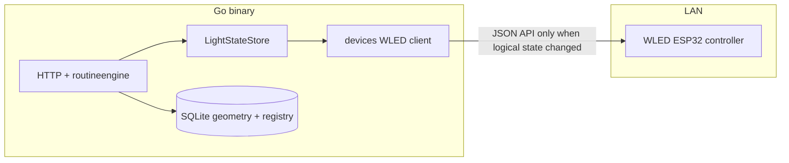

---

### 3.20 Physical devices (WLED) and discovery (**REQ-035**, **REQ-036**, **REQ-037**)

**HTTP** **(**add** **to** **§3.2** **table** **—** **exact** **paths** **implementor** **choice**)** **:**

| Method | Path | Purpose |
|--------|------|--------|
| **GET** | **`/api/v1/devices`** | **List** **registered** **devices** **(**id**,** **type**,** **name**,** **`model_id`**,** **base_url** **redacted** **optional**)** **. |
| **POST** | **`/api/v1/devices`** | **Register** **(**manual**)** **:** **JSON** **`{ "type":"wled", "name", "base_url", … }`** **. |
| **POST** | **`/api/v1/devices/discover`** | **Optional** **:** **returns** **candidate** **list** **(**mDNS** **Service** **`wled`** **or** **subnet** **probe** **—** **document** **)** **. |
| **GET** | **`/api/v1/devices/{id}`** | **Detail** **. |
| **PATCH** | **`/api/v1/devices/{id}`** | **Edit** **name** **/** **connection** **fields** **. |
| **DELETE** | **`/api/v1/devices/{id}`** | **MUST** **clear** **`model_id`** **on** **the** **device** **row** **(**if** **set**)** **and** **delete** **the** **device** **in** **one** **transaction** **(**REQ-037** **business** **rule** **6**)** **—** **no** **orphaned** **assignment** **. |
| **POST** | **`/api/v1/devices/{id}/assign`** | **Body** **`{ "model_id" }`** **;** **enforce** **REQ-036** **(**reject** **409** **on** **conflict**)** **;** **after** **success** **,** **run** **§3.21** **sync** **(**push** **defaults** **then** **logical** **state** **per** **§3.19**)** **. |
| **POST** | **`/api/v1/devices/{id}/unassign`** | **Clears** **`devices.model_id`** **. **Normative** **physical** **policy** **(**REQ-039** **business** **rule** **8**)** **:** **do** **not** **automatically** **drive** **a** **final** **pattern** **on** **the** **hardware** **(**leave** **LEDs** **as** **last** **rendered** **)** **;** **logical** **authority** **for** **the** **model** **remains** **in** **`LightStateStore`** **and** **the** **model** **no** **longer** **receives** **WLED** **pushes** **until** **a** **new** **device** **is** **assigned** **or** **the** **operator** **changes** **lights** **via** **API**/**UI** **(**which** **would** **only** **affect** **visualization** **/** **other** **outputs** **,** **not** **the** **old** **strip** **)** **. **If** **product** **later** **adds** **“push** **all** **off** **on** **unassign”** **,** **document** **as** **optional** **behavior**.

**Security** **:** **LAN-only** **assumption** **;** **WLED** **password** **in** **body** **never** **logged** **;** **store** **hashed** **or** **opaque** **blob** **per** **product** **threat** **model** **(**§9**)** **.**

---

### 3.21 `LightStateStore` lifecycle (**REQ-039**)

**Package:** **`internal/lightstate`** **(**current** **code**)** **—** **this** **section** **uses** **`LightStateStore`** **as** **the** **conceptual** **name** **for** **that** **authoritative** **in-memory** **layer**.

1. **Process** **start** **:** **For** **each** **model** **in** **SQLite** **,** **allocate** **`n`** **slots** **. **If** **no** **device** **assigned** **,** **initialize** **all** **to** **REQ-014** **defaults** **. **If** **a** **WLED** **device** **is** **assigned** **,** **apply** **the** **same** **REQ-014** **defaults** **into** **`LightStateStore`** **first** **,** **then** **invoke** **§3.20** **`SyncModelLights`** **so** **the** **strip** **matches** **server** **authority** **(**§3.19** **WLED** **paragraph** **—** **push-after-defaults** **policy**)** **.**
2. **Model** **create** **/** **delete** **:** **Extend** **/** **shrink** **maps** **in** **lockstep** **with** **geometry** **transactions** **;** **on** **create** **,** **defaults** **per** **REQ-014** **;** **if** **the** **new** **model** **is** **linked** **to** **a** **device** **,** **run** **assign** **sync** **as** **in** **(1)** **.**
3. **Assign** **device** **to** **model** **(**REQ-039** **BR** **4**)** **:** **After** **the** **`devices.model_id`** **update** **commits** **,** **run** **the** **same** **sequence** **as** **(1)** **for** **that** **model** **(**defaults** **in** **memory** **+** **push** **to** **WLED**)** **.**
4. **Unassign** **device** **:** **Clear** **`model_id`** **only** **;** **do** **not** **change** **`LightStateStore`** **triples** **for** **that** **model** **as** **part** **of** **unassign** **(**logical** **view** **and** **API** **still** **report** **prior** **state**)** **;** **§3.20** **stops** **pushing** **to** **the** **former** **device** **(**hardware** **left** **unchanged** **—** **§3.20** **unassign** **row**)** **.**
5. **API** **read** **:** **Always** **merge** **geometry** **from** **SQLite** **with** **triples** **from** **`LightStateStore`** **(**O(1)** **per** **light** **after** **load**)** **.**
6. **No** **SQLite** **persistence** **of** **operational** **triples** **(**REQ-039**)** **.**

---

## 4. Next.js + Tailwind (build-time / authoring)

### 4.1 Stack

- **Next.js App Router** under `web/app/` for structure and layouts.
- **Tailwind** + **TypeScript** as today.
- **`next.config`:** **`output: 'export'`** (static HTML export). **`images`:** use **`unoptimized: true`** or avoid `next/image` features incompatible with export.

### 4.2 Runtime-incompatible patterns (must not ship)

- **`next start`**, **standalone** Node output, **SSR** dependencies, **Route Handlers** or **middleware** that must execute on Node for **navigations**, **rewrites** to a separate upstream for **HTML**.
- **Server Components** that **fetch at request time** without a static **generateStaticParams** strategy — for MVP, prefer **client `fetch`** to **`/api/v1/...`**.

### 4.3 Data access patterns (shipped UI)

| Pattern | Use |
|--------|-----|
| **Client `fetch('/api/v1/...')`** | Primary pattern for reactive UI (**REQ-002**) against **same Go origin**. **Reuse** **connections** **per** **origin** **(browser** **default)** **and** **prefer** **batch**/**bulk** **endpoints** **for** **many** **light** **updates** **(**§3.18**, **REQ-029**)**. |
| **Optional `EventSource` (future)** | **If** **SSE** **endpoints** **from** **§3.18** **ship**, **subscribe** **for** **push** **notifications** **then** **`GET`** **authoritative** **state** **—** **keeps** **tabs** **fresh** **under** **high** **external** **write** **rates** **without** **sub-second** **polling**. |
| **Build-time static** | `generateStaticParams` / SSG **only** if values are fixed at build; API must still be available at runtime for live data where needed. |

### 4.4 Environment

- **Runtime** UI has **no** `process.env.NEXT_PUBLIC_*` server injection from Node; **build-time** env may set **`NEXT_PUBLIC_API_BASE`** to **`''`** (same origin) so client code calls relative URLs.

### 4.5 Responsive behavior (**REQ-002**)

Unchanged intent: **Tailwind breakpoints**, **touch targets**, **`"use client"`** for interactivity.

### 4.6 Models UI (**REQ-002**, **REQ-006**, **REQ-010**, **REQ-011**, **REQ-012**, **REQ-014**)

- **Routes (App Router):** e.g. **`/models`** (list), **`/models/new`** (upload form: **name** text input + **file** input), **`/models/[id]`** (detail: metadata; **§4.8** **paginated** light **table** + **§4.7** **3D** view; per-light or bulk controls per **REQ-011** / **REQ-013**; **Reset lights** **button** calling **`POST …/lights/state/reset`** per **§3.11** (**REQ-014**), **reachable** on **mobile** / **tablet** / **desktop** without **hover-only** use). **Model** **delete** **control:** on **`409`** **`model_in_scenes`**, **show** **`error.message`** **and** **`details.scenes`** (names/links to **`/scenes/{id}`**) per **§3.13**.
- **Client data:** **`"use client"`** pages/components call **`fetch`** with **`GET`**, **`POST`** (**`FormData`** for multipart), **`DELETE`**, and **`PATCH`** (**JSON**) against **`/api/v1/models…`** on the **same origin** (**§4.3**).
- **Feedback:** Inline / banner display of **400** / **409** **`message`** from API; loading states on list, detail, upload, and delete (**REQ-002**).
- **Navigation:** **Primary** **IA** **is** **the** **collapsible** **left** **nav** **in** **§4.11** (**Models**, **Scenes**, **Routines**, **Devices**, **Options**, **home** **`/`** **if** **distinct**); **no** **hover-only** **paths** **to** **these** **destinations** (**REQ-002**, **REQ-018**).

### 4.7 Three.js visualization on model detail (**REQ-010**, **REQ-012**, **REQ-016**, **REQ-019**, **REQ-028**, **REQ-031**)

**Dependency:** Declare **`three`** in **`web/package.json`** as a **direct** dependency (satisfies REQ-010 business rule 2). Pin a **stable semver** range in lockfile; bump intentionally when upgrading. Using **`@react-three/fiber`** / **`@react-three/drei`** is **optional**—if used, **`three`** MUST still appear **directly** in **`dependencies`** (not only as a transitive peer).

**Where:** The **model detail** route (**`/models/[id]`** or equivalent, e.g. **`/models/detail?id=`** for static export) MUST mount a **client-only** visualization after **`GET /api/v1/models/{id}`** returns **`lights`** including **`on`**, **`color`**, **`brightness_pct`** (**§3.6**, **§3.9**). All geometry uses **world-space meters** (**REQ-005** / **REQ-009**).

**SSR / static export:** **WebGL** is **browser-only**. The Three.js entry MUST run only on the client: e.g. **`"use client"`** + **`WebGLRenderer`** after mount, or **`next/dynamic`** with **`ssr: false`**. **Do not** assume **`window`**, **`document`**, or **GPU** during **Node** prerender of that subtree.

#### Geometry and materials (REQ-010 rules 4–5, 7; REQ-012; REQ-028)

- **Per-light marker:** Each light is a **sphere** with **diameter 0.02 m** (**2 cm**) → **`SphereGeometry`** with **radius `0.01`**.
- **Canonical visualization grey:** **`#D0D0D0`** — parse once to **`THREE.Color`** for **wire segments** and **off** spheres (**REQ-010** / **REQ-012**).
- **On vs off (REQ-012):**
  - **`on === true`:** **Filled** **opaque** (or effectively **opaque**) **surface** **that** **also** **satisfies** **REQ-028** **(**emissive** **glow** **—** **see** **subsection** **below**)**. **Canonical** **material:** **`MeshStandardMaterial`** **(or** **`MeshPhysicalMaterial`**) **`side: FrontSide`**, **`transparent: false`** (or **opacity 1**), **`metalness: 0`**, **`roughness`** **in** **~0.25–0.45** **(pick** **constants** **and** **document** **in** **code**)**. **Base** **`color`:** parse API **`color`** **hex** **to** **`THREE.Color`**, **convert** **to** **linear** **working** **space** **as** **appropriate** **for** **the** **renderer**, **then** **multiply** **RGB** **by** **`brightness_pct / 100`** **for** **the** **diffuse** **albedo** **(REQ-012)**, **clamping** **per** **channel** **to** **[0,1]**. **`MeshBasicMaterial`** **without** **an** **additional** **documented** **glow** **technique** **does** **not** **meet** **REQ-028**. At **`brightness_pct === 0`**, the **on** sphere MAY appear **nearly** **black** **with** **minimal** **emissive**; **product** **“off”** **in** **the** **persistence** **sense** **remains** **`on: false`**.
  - **`on === false`:** **Filled** **sphere** (same **geometry** as **on**) with **`MeshBasicMaterial`** (**or** equivalent): **`color`** = **`#D0D0D0`**, **`transparent: true`**, **`opacity: 0.15`** (**85%** transparency per requirements), **`depthWrite: false`** if needed to reduce **z-fighting** with **segments** and **neighbors**. **`emissive`** **MUST** **be** **black** **and** **`emissiveIntensity`** **MUST** **be** **0** **if** **the** **material** **exposes** **those** **fields** **(REQ-028** **rule** **4)**. **Do not** present **off** lights as **more** visually **prominent** than **on** lights or than **wire** segments (**REQ-012**).
- **Emissive glow (REQ-028, on lights only):**
  - **`emissive`:** **Set** **from** **the** **same** **hex** **as** **the** **light** **(typically** **the** **linear** **RGB** **of** **the** **parsed** **`color`** **before** **or** **after** **brightness** **scaling** **—** **choose** **one** **rule** **and** **apply** **consistently** **so** **hue** **matches** **the** **sphere)**.
  - **`emissiveIntensity`:** **Map** **`brightness_pct`** **(0–100)** **monotonically** **to** **a** **non-negative** **intensity** **e.g.** **`k * (brightness_pct / 100)`** **with** **documented** **`k`** **(tune** **~0.6–1.2** **so** **100%** **reads** **clearly** **bright** **on** **`VIZ_VIEWPORT_BG`** **and** **low** **percents** **read** **weaker)** **or** **`k * max(ε, brightness_pct/100)^γ`** **with** **small** **ε** **and** **γ** **≥** **1** **for** **perceptual** **spacing**. **Higher** **`brightness_pct`** **MUST** **never** **produce** **a** **weaker** **glow** **than** **a** **lower** **`brightness_pct`** **for** **the** **same** **`color`** **(REQ-028** **rule** **3)**.
  - **Scene** **lights** **in** **three.js:** **Use** **modest** **`AmbientLight`** **and** **optionally** **a** **very** **low-intensity** **`DirectionalLight`** **so** **the** **non-emissive** **shading** **does** **not** **flatten** **or** **wash** **out** **the** **emissive** **read**; **avoid** **bright** **key** **lights** **that** **make** **all** **spheres** **look** **evenly** **lit** **plastic**.
  - **Clipping** **and** **many** **100%** **lights** **(REQ-028** **open** **question):** **Apply** **a** **per-instance** **cap** **on** **`emissiveIntensity`** **after** **the** **brightness** **curve** **if** **needed**; **use** **renderer** **`outputColorSpace = THREE.SRGBColorSpace`** **(or** **current** **equivalent)** **and** **sane** **`toneMapping`** **(**e.g.** **`ACESFilmic`** **or** **`Reinhard`**) **with** **`toneMappingExposure`** **tuned** **so** **the** **frame** **does** **not** **blow** **out** **to** **flat** **white**. **Prefer** **this** **over** **mandatory** **full-screen** **bloom** **passes** **on** **Pi-class** **or** **integrated** **GPUs** **unless** **profiling** **shows** **headroom** **(**§6.5**)**.
  - **Instancing:** **When** **using** **`InstancedMesh`** **for** **on** **lights**, **either** **one** **shared** **`MeshStandardMaterial`** **with** **per-instance** **`setColorAt`** **/** **`instanceColor`** **for** **base** **and** **a** **custom** **`onBeforeCompile`** **or** **`ShaderMaterial`** **variant** **for** **per-instance** **`emissiveIntensity`**, **or** **document** **an** **equivalent** **approach** **(e.g.** **rebuild** **instance** **attributes** **on** **state** **change** **—** **O(n)** **acceptable** **for** **n** **≤** **1000**)**.
- **Draw all lights (no omission):** For **n** lights (**n ≤ 1000**), the scene MUST contain **exactly n** **visible** markers at the **correct** **positions**—**no** decimation. **Rendering strategy (implementor picks one):**
  - **A.** **Two** **`InstancedMesh`** **layers**: (**1**) **on** lights — **`InstancedMesh`** + **`instanceColor`** (and **brightness** factored per instance or via **custom** attribute); (**2**) **off** lights — second **`InstancedMesh`** with **shared** **`#D0D0D0`**, **`opacity 0.15`**, **non-wireframe** **material**. When **`on`** toggles, **move** instances between **layers** or **rebuild** **both** from **authoritative** **state** (**O(n)** OK for **n ≤ 1000**).
  - **B.** **Up to n** **individual** **`Mesh`** **nodes** — acceptable if **performance** on **Pi-class** **clients** remains acceptable.
- **Wire polyline (REQ-005 chain, REQ-010):** **`LineSegments`** (or **`LineBasicMaterial`** **lines**) only between **(i, i+1)** for **i = 0 … n−2**. **Colour** **`#D0D0D0`**, **`transparent: true`**, **`opacity: 0.15`**; **linewidth** where supported is **thin** (note: **WebGL** **line** **width** is often **1** px); segments MUST read **subtler** than **spheres**. **Style** does **not** vary with **on/off** (**REQ-012** **out** **of** **scope** for segment state).
- **Framing (baseline for REQ-016):** **Implement** a **pure** **helper** **`applyDefaultFraming(bounds: THREE.Box3, camera, controls, viewportWidth, viewportHeight)`** **(name** **local** **to** **codebase**)** **that:**
  - Sets **`controls.target`** **to** **the** **center** **of** **`bounds`** **(axis-aligned** **bounding** **box** **of** **all** **light** **positions** **±** **0.01** **m** **sphere** **radius**)**.
  - Positions **`camera`** **outside** **the** **bounds** **on** **a** **stable** **direction** **(e.g.** **normalized** **`(1, 1, 1)`** **from** **center** **scaled** **so** **the** **entire** **bounds** **fits** **in** **the** **vertical** **and** **horizontal** **FOV** **with** **a** **small** **padding** **factor** **≥** **1.1**)**—** **document** **chosen** **vector** **and** **padding** **in** **code** **comments** **so** **reset** **and** **first** **load** **match**.
  - Calls **`camera.updateProjectionMatrix()`**, **`controls.update()`** **as** **needed** **after** **`ResizeObserver`** **driven** **size** **changes**.
- **Initial load:** **After** **`lights`** **arrive**, **compute** **`bounds`**, **then** **`applyDefaultFraming`** **once**.
- **Reset camera (REQ-016):** **Secondary** **button** **(e.g.** **label** **“Reset camera”)** **next** **to** **the** **canvas** **toolbar** **or** **overlay** **corner** **calls** **`applyDefaultFraming`** **again** **using** **the** **current** **`lights`** **bounds** **(recomputed** **if** **data** **changed**)**—** **no** **`fetch`**. **Repeat** **clicks** **yield** **the** **same** **baseline** **for** **the** **same** **`lights`** **and** **viewport** **size** **(REQ-016** **rule** **4**)**. **Architectural** **resolution** **for** **REQ-016** **open** **question:** **reset** **affects** **only** **camera** **and** **`OrbitControls`** **state**; **implementor** **MAY** **clear** **the** **hover**/**tap** **label** **for** **less** **confusion** **but** **is** **not** **required** **to** **clear** **list** **selection** **or** **pagination**.

#### State sync (REQ-012 rule 3; REQ-029 observer path; REQ-031 elision)

- **After a successful `PATCH …/lights/{lightId}/state`**, **`PATCH …/lights/state/batch`** (**§3.10**, **REQ-013**), or **`POST …/lights/state/reset`** (**§3.11**, **REQ-014**) initiated from **this** **browser** **session**, the **client** MUST **merge** the **JSON** **response** (or **refetch** **`GET …/lights/state`** / **model** **detail**) and **update** **three.js** **meshes** **before** the **next** **`requestAnimationFrame`** **paint** **following** **the** **`fetch`** **resolution** (i.e. **no** **indefinite** **staleness** **after** **confirmed** **write**). **REQ-031:** **When** **the** **merged** **per-light** **state** **is** **equivalent** **to** **what** **was** **already** **rendered** **(**§3.19** **normalization**)** **,** **skip** **redundant** **mesh**/**material**/**instance** **rebuild** **for** **those** **lights** **(**§3.19** **client** **subsection**)**.
- **Concurrent** **sessions** **(another** **tab** **or** **REST** **client):** **Optional** **`setInterval`** **poll** of **`GET /api/v1/models/{id}/lights/state`** every **≤ 5 s** while the **detail** **route** **is** **mounted**; if **absent**, **manual** **browser** **refresh** **still** **shows** **truth** — **document** **in** **README** **that** **live** **multi-user** **sync** **may** **lag** **up** **to** **one** **poll** **period**. **Under** **sustained** **multi-Hz** **writes** **from** **other** **clients**, **this** **polling** **alone** **may** **not** **meet** **every** **integrator** **expectation** **—** **see** **§3.18** **(optional** **SSE**)** **and** **§8.19**. **REQ-031:** **Poll** **responses** **that** **match** **the** **last** **merged** **state** **should** **not** **force** **a** **full** **three.js** **rebuild** **(**§3.19** **observer** **alignment**)**.

#### Picking, hover, and touch (REQ-010 rule 6; REQ-012 rule 4)

- **Raycasting:** Use **`THREE.Raycaster`** against the **same** **meshes** **used** **for** **filled**/**wire** **markers** (**union** **of** **both** **`InstancedMesh`** **layers** **or** **all** **`Mesh`** **targets**). Map **`instanceId`** / **object** **back** **to** **`lights[i]`**.
- **Desktop hover:** Show **`id`**, **`x`**, **`y`**, **`z`**; **MAY** **also** **show** **`on`**, **`color`**, **`brightness_pct`** (**REQ-012** **open** **question** **resolved** **here** **as** **optional** **but** **recommended** **for** **debuggability**).
- **Touch / tablet equivalent:** Same **tap** **threshold** **behavior** **as** **before**; **pinned** **label** **may** **include** **state** **fields**.

**Interaction (orbit, REQ-002, REQ-016):** Retain **`OrbitControls`** for **rotate / zoom / pan**; **touch** gestures as today. **REQ-016** **reset** **does** **not** **change** **polar**/**azimuth** **limits** **unless** **already** **set**; **if** **limits** **exist**, **ensure** **default** **camera** **pose** **remains** **within** **them** **or** **temporarily** **relax** **limits** **during** **reset** **(implementor** **picks** **simplest** **consistent** **behavior**)**.**

**Layout:** **WebGL canvas** in a **responsive** container (**full width**, **bounded height** via **`min-h-[…]`** / **`max` viewport height**). **`ResizeObserver`** updates **camera.aspect** and **`renderer.setSize`**.

**Viewport background (REQ-019):** **Independently** **of** **REQ-018** **shell** **light**/**dark**, **set** **`scene.background`** **and** **`WebGLRenderer.setClearColor`** **(same** **RGB)** **to** **one** **fixed** **dark** **grey** **that** **reads** **clearly** **as** **grey** **(not** **white** **or** **near-white**)**—** **architecture** **default** **`#262626`** **(≈** **Tailwind** **`neutral-800`**)**, **centralized** **as** **a** **named** **constant** **e.g.** **`VIZ_VIEWPORT_BG`** **in** **`web/lib/`** **so** **model** **and** **scene** **canvases** **stay** **aligned**. **If** **the** **canvas** **is** **letterboxed** **inside** **a** **wrapper**, **style** **that** **wrapper** **(and** **any** **padding** **region** **inside** **the** **same** **visual** **frame** **as** **the** **WebGL** **element**)** **with** **the** **same** **hex** **so** **light** **shell** **mode** **does** **not** **show** **white** **margins** **around** **the** **3D** **view**. **Do** **not** **tie** **this** **colour** **to** **`html`** **`dark`** **or** **to** **shell** **`bg-white`**/**`bg-gray-900`** **tokens**.

**Edge cases:** **`n === 0`:** Initialize renderer + empty scene + overlay copy; **no** spheres or segments. **`n === 1`:** One sphere; **no** segments. **WebGL unavailable:** Inline / console error acceptable per prior REQ-010 note.

**Testing note:** Unit-test **pure** helpers (**hex** + **brightness** → **THREE.Color**, **segment** **vertex** **pairs**, **instance** **matrices**, **pick** **index**) in **`web/lib/`**; **manual** verify **on/off** **appearance**, **PATCH** **refresh**, **hover** and **tap** on **mobile** + **desktop**.

### 4.8 Model detail: paginated light list, go-to-id, multi-select, bulk apply (**REQ-013**)

**Data source:** The **detail** page already loads **all** **`lights`** (positions + state) via **`GET /api/v1/models/{id}`** (**§3.6**, **§3.9**). **Pagination** is **purely client-side**: slice **`lights`** by **`page`** and **`pageSize`** so **REQ-005**’s **n ≤ 1000** stays a **single** **HTTP** **fetch** while the **table** shows one page at a time.

**Page size:** Expose **exactly three** choices: **25**, **50**, **100** lights per page (**REQ-013** rule 2). **Default** **`pageSize = 50`**. Changing **page size** resets **`page`** to **1** or **clamps** so the **first** light on the **prior** page remains **visible** if possible (implementor picks **simplest**: reset to **1** is acceptable).

**Trivial case:** For **n = 1** light, **REQ-013** allows **omitting** pagination chrome or showing a **single** row **without** **page** controls.

**Navigation controls:** **Previous** / **Next** (disabled at bounds); **“Page X of Y”** (derived from **n** and **`pageSize`**); optional **first/last** if space allows (**REQ-002** **touch** targets).

**Go to light id:** Text field (or number input) + **“Go”** / submit: parse **integer**; if **id ∉ [0, n−1]**, show **inline** **error** (do **not** change **page**); else set **`page = floor(id / pageSize) + 1`** (0-based indexing: **`page`** for **id** is **`⌊id / pageSize⌋ + 1`** in **1-based** UI terms). **Scroll** or **focus** the **row** for that **id** if the table is scrollable within the page.

**Multi-select:**

- **Per row:** **checkbox** in the **first** column (**touch-friendly**, **REQ-002**).
- **Header:** **“Select page”** toggles **all** **ids** on the **current** **page** only.
- **Shift+click** (desktop): **optional** **range** select between **last** **anchor** and **clicked** row **on the same page** only (reduces accidental cross-page ambiguity).
- **Cross-page selection (architectural resolution for REQ-013 open question):** Maintain **`selectedIds: Set<number>`** in **component** **state**. **Changing pages** does **not** clear **selection**. **Clear selection** button and **unmounting** the **detail** route **do** clear. **Bulk apply** sends **`selectedIds`** (as **array**) to **`PATCH …/state/batch`**.

**Bulk apply panel:** When **`selectedIds.size ≥ 1`**, show **controls** mirroring **REQ-011** fields: **on/off** toggle, **colour** (**`#RRGGBB`** input or picker), **brightness** (**0–100**). **Apply** calls **`PATCH /api/v1/models/{id}/lights/state/batch`** (**§3.10**). **Disable** **Apply** while **request** **in** **flight**; on **success**, **merge** **`states`** into **`lights`** and refresh **table** + **§4.7** scene (**REQ-012**). On **400**, show **API** **`message`**.

**Accessibility / responsive:** Table **MAY** **stack** as **cards** on **narrow** **viewports**; **checkboxes** and **bulk** **panel** remain **reachable** **without** **hover-only** **affordances** (**REQ-013** rule 7).

### 4.9 Scenes UI and composite three.js (**REQ-015**, **REQ-010**, **REQ-012**, **REQ-016**, **REQ-019**, **REQ-021**, **REQ-022**, **REQ-023**, **REQ-027**, **REQ-028**, **REQ-029**, **REQ-031**, **REQ-033**)

- **Routes:** **`/scenes`** (list), **`/scenes/new`** (**create** **flow**: **scene** **name** + **ordered** **multi-select** **of** **≥ 1** **model** **—** **no** **per-row** **offset** **inputs**; **submit** **`POST /api/v1/scenes`** **with** **`models`** **in** **that** **order** **and** **let** **the** **server** **compute** **offsets** **per** **§3.12**), **`/scenes/[id]`** (**detail** **composite** **view** **+** **optional** **offset** **editing** **via** **`PATCH …/models/{modelId}`** **after** **create**).
- **Routines on scene detail (REQ-021, REQ-022, REQ-023, REQ-033):** **Panel** **or** **toolbar** **with** **`GET /api/v1/routines`** **(**`<select>`** **or** **list** **—** **each** **row** **shows** **`type`** **or** **icon** **for** **Python** **vs** **shape** **animation**)**; **`POST …/start`** **and** **`POST …/stop`** **with** **Font Awesome** **icons**. **After** **`GET …/routines/runs`**, **show** **active** **run** **(**name** **+** **Stop**)** **or** **“No** **routine** **running”**. **On** **`409`** **`scene_routine_conflict`**, **surface** **`error.message`**. **Optional** **“Edit** **routine”** **→** **`/routines/python/[id]`** **or** **`/routines/shape/[id]`** **by** **`type`** **(**§4.13**/**§4.14**)** **—** **must** **not** **replace** **primary** **create** **via** **`/routines/new`** **(§4.12)**.
- **Data:** **`GET /api/v1/scenes`**, **`POST /api/v1/scenes`**, **`GET /api/v1/scenes/{id}`**, **`POST …/models`**, **`PATCH …/models/{modelId}`**, **`DELETE …/models/{modelId}`**, **`DELETE /api/v1/scenes/{id}`** per **§3.13**. **On** **`409`** **`scene_last_model`**, **show** **modal** **copy** **that** **removing** **the** **last** **model** **deletes** **the** **entire** **scene**; **on** **confirm**, **`DELETE /api/v1/scenes/{id}`** **then** **redirect** **to** **`/scenes`**.
- **Live updates while a routine runs (REQ-012, REQ-029, REQ-031):** **While** **`/scenes/[id]`** **is** **mounted** **and** **`GET …/routines/runs`** **shows** **`running`**, **poll** **`GET /api/v1/scenes/{id}`** **every** **`≤ 2 s`** **(covers** **Python** **subprocess** **iterations**, **~1** **s** **effects**, **and** **shape** **animation** **server** **ticks** **—** **editor** **tabs** **also** **refetch** **after** **local** **`PATCH`** **per** **§4.13**/**§4.14**)** **and** **merge** **`items[].lights`** **into** **`SceneLightsCanvas`**. **Apply** **§3.19** **equivalence** **so** **unchanged** **poll** **payloads** **skip** **redundant** **canvas** **work**. **Active** **runs** **mutate** **state** **only** **via** **the** **server** **`routineengine`** **(**§3.17** **Python** **runner** **/** **§3.17.2** **Go** **shape** **loop**)** **calling** **§3.15** **internally** **;** **the** **browser** **only** **observes** **through** **polling** **/** **SSE**. **Stop** **polling** **when** **no** **run** **is** **active** **or** **on** **unmount**. **High-frequency** **external** **writers** **SHOULD** **use** **§3.15** **bulk**/**batch** **(**§3.18**)**; **optional** **SSE** **(**§3.18**/**§8.19**)** **reduces** **polling** **when** **implemented**.
- **Composite** **three.js:** **Refactor** **or** **duplicate** **§4.7** **patterns** **into** **a** **`SceneLightsCanvas`** **(or** **extend** **`ModelLightsCanvas`**) **that** **accepts** **`items[]`**: **for** **each** **model**, **build** **the** **same** **2** **cm** **spheres** **and** **`#D0D0D0`** **`opacity`** **0.15** **segments** **between** **consecutive** **`id`** **only** **within** **that** **model**, **using** **`sx`, `sy`, `sz`** **from** **API** **(or** **client-composed** **positions** **identical** **to** **server** **rules**). **No** **segments** **between** **models**. **Per-light** **state** **materials** **match** **§4.7** (**REQ-012**, **REQ-028** **emissive** **rules**). **Apply** **the** **same** **REQ-019** **fixed** **dark-grey** **viewport** **treatment** **as** **§4.7** **(scene** **background** **+** **renderer** **clear** **+** **letterbox** **wrapper**)**. **Picking** **must** **identify** **which** **model** **and** **which** **light** **id** **for** **hover**/**tap** **(show** **scene** **coordinates** **and** **model** **id** **+** **light** **`id`** **as** **needed**).
- **Framing (REQ-016):** **Fit** **camera** **to** **§3.12** **AABB** **`[0,0,0]`** **–** **`(Mmax+1)`** **per** **axis** **plus** **marker** **radius** **margin** **using** **the** **same** **`applyDefaultFraming`** **pattern** **as** **§4.7** **but** **with** **bounds** **derived** **from** **scene-space** **positions** **`(sx,sy,sz)`** **for** **all** **lights**. **A** **“Reset camera”** **control** **on** **the** **scene** **canvas** **re-invokes** **that** **same** **fit** **(no** **API** **call**)**.**
- **Add** **model** **control:** **calls** **`POST …/scenes/{id}/models`** **without** **offsets** **to** **get** **default** **+X** **placement** **or** **with** **explicit** **integers** **after** **user** **edit**. **Placement** **inputs** **validate** **≥ 0** **client-side** **for** **fast** **feedback**; **authoritative** **errors** **from** **API** **400**.
- **REQ-002:** **Same** **touch**/**pointer** **expectations** **as** **model** **detail**; **no** **hover-only** **blocking** **flows** **for** **add**/**remove**/**confirm**.

### 4.10 Options and factory reset (**REQ-017**)

**Route:** **`/options`** **(App Router)** **or** **equivalent** **single** **page** **with** **`<h1>Options</h1>`** **(or** **product** **title** **+** **“Options”**)** **and** **a** **short** **explanation** **that** **this** **area** **holds** **destructive** **maintenance** **actions**.

**Information architecture:** **“Options”** **lives** **in** **the** **same** **collapsible** **left** **navigation** **as** **Models**, **Scenes**, **and** **Routines** (**§4.11**); **when** **the** **aside** **is** **collapsed** **on** **mobile**, **open** **it** **with** **the** **burger** **to** **reach** **primary** **destinations** **(REQ-002**, **REQ-018**).

**Factory reset row:** **Primary** **button** **or** **destructive-styled** **control** **labeled** **Factory reset** **(or** **Reset all data**)** **opens** **a** **native** **`<dialog>`** **or** **modal** **with:**
- **Title** **e.g.** **“Erase all data?”**
- **Body** **text** **stating** **explicitly** **that** **all** **models** **(including** **uploads**)** **,** **all** **scenes**, **and** **all** **saved** **routines** **(built-in** **and** **Python,** **including** **any** **routine** **run** **records**)** **will** **be** **permanently** **deleted**, **that** **the** **action** **cannot** **be** **undone**, **and** **that** **after** **completion** **only** **the** **three** **default** **sample** **models** **will** **remain**.
- **Cancel** **(default** **focus** **on** **desktop** **where** **appropriate**)** **closes** **with** **no** **request**.
- **Confirm** **(e.g.** **button** **label** **Erase everything**)** **submits** **`POST /api/v1/system/factory-reset`** **(disable** **while** **in-flight** **to** **prevent** **double** **submit**)**.**

**Client behavior on success:** **On** **`200`**, **clear** **any** **client** **cached** **model**/**scene** **detail** **state** **(React** **query** **cache** **or** **router** **refresh**)**; **navigate** **to** **`/models`** **via** **`router.push`** **or** **`router.replace`** **and** **show** **a** **non-blocking** **success** **banner** **e.g.** **“All data was reset. Sample models were restored.”** **This** **resolves** **the** **REQ-017** **post-reset** **navigation** **open** **question** **as** **the** **architectural** **default**.

**Client behavior on failure:** **Show** **API** **`error.message`** **or** **generic** **failure** **text**; **leave** **user** **on** **Options** **with** **dialog** **closed** **or** **open** **per** **UX** **consistency**.

**REQ-017** **typed** **phrase** **(e.g.** **type** **RESET**)**:** **Not** **required** **for** **MVP** **per** **this** **architecture** **(optional** **hardening** **later**)**.**

**Accessibility:** **Modal** **must** **trap** **focus** **or** **use** **native** **`dialog`** **with** **visible** **Cancel**/**Confirm**; **Escape** **cancels** **if** **the** **implementor** **enables** **it** **(recommended).**

### 4.11 Application shell, themes, navigation, and Font Awesome (**REQ-018**)

**Goal:** One **client-side** **shell** wraps **all** **App Router** **pages** (**`web/app/layout.tsx`** **mounts** **`AppShell`** **as** **`"use client"`** **wrapper** **or** **layout** **composition** **that** **does** **not** **break** **static** **export**): **branding**, **theme**, **burger**/**aside**, **and** **icon** **conventions** **stay** **consistent** **across** **models**, **scenes**, **and** **options**.

#### Layout structure

- **Top** **header** **(full** **width,** **sticky** **optional):**
  - **Burger** **`<button>`** **(left):** **toggles** **`navOpen`** **state**; **icon** **`faBars`** **(solid)** **or** **equivalent** **from** **the** **same** **Font Awesome** **Free** **kit**.
  - **Branding** **(after** **burger):** **`FontAwesomeIcon`** **with** **`faLightbulb`** **from** **`@fortawesome/free-regular-svg-icons`** — **same** **glyph** **as** [Font Awesome lightbulb classic regular](https://fontawesome.com/icons/lightbulb?f=classic&s=regular). **Adjacent** **visible** **title** **text** **must** **be** **exactly** **`Domestic Light & Magic`** **(REQ-018** **rule** **5**)**.**
  - **Theme** **toggle** **`<button>`** **(right** **or** **next** **to** **branding** **per** **space):** **icons** **`faSun`**/**`faMoon`** **(solid)** **or** **one** **icon** **that** **flips** **with** **`aria-pressed`**; **toggle** **between** **light** **and** **dark** **modes**.
- **Left** **`<aside>`** **(primary** **navigation):**
  - **When** **expanded:** **vertical** **list** **of** **`next/link`** **entries** **(or** **buttons** **that** **`router.push`**) **for** **`/`** **(home),** **`/models`**, **`/scenes`**, **`/routines`**, **`/options`** — **each** **row** **is** **a** **button-styled** **control** **with** **a** **Font Awesome** **icon** **+** **label** **(REQ-018** **rule** **7**)**. **Do** **not** **add** **a** **separate** **nav** **destination** **that** **only** **creates** **Python** **routines** **(REQ-023** **—** **Python** **is** **chosen** **on** **`/routines/new`** **via** **`type`** **`<select>`** **§4.12**)**.**
  - **When** **collapsed** **(narrow** **viewport):** **aside** **is** **off-screen** **or** **`hidden`** **except** **as** **an** **overlay** **drawer** **(full-height** **`fixed`** **panel** **`z-index`** **above** **`main`**) **opened** **by** **burger**; **tapping** **a** **backdrop** **or** **a** **close** **control** **dismisses** **the** **drawer** **(REQ-018** **responsive** **notes** — **no** **focus** **trap** **without** **escape**)**.**
  - **When** **collapsed** **(wide** **desktop):** **optional** **pattern** **—** **narrow** **rail** **(icons** **only)** **vs** **full** **labels**; **burger** **still** **toggles** **between** **those** **two** **widths** **so** **REQ-018** **“collapsible** **left** **menu”** **is** **satisfied** **even** **if** **default** **is** **expanded** **at** **`lg+`**.**
- **`<main>`** **fills** **remaining** **width** **with** **page** **content**; **apply** **shell** **background**/**text** **tokens** **here** **per** **REQ-018**. **three.js** **viewports** **(REQ-019)** **do** **not** **inherit** **shell** **background** **for** **the** **WebGL** **clear** **/** **scene** **fill**:** **they** **use** **the** **fixed** **dark-grey** **policy** **in** **§4.7** **regardless** **of** **light**/**dark** **shell**.

#### Theming (Tailwind)

- **Mechanism:** **Enable** **Tailwind** **`darkMode: 'class'`** **(v3)** **or** **the** **v4** **equivalent** **so** **light** **=** **absence** **of** **`dark`** **on** **`<html>`**, **dark** **=** **`class="dark"`** **on** **`<html>`** **(set** **from** **a** **small** **client** **effect** **on** **mount** **+** **on** **toggle**)**.**
- **Initial** **vs** **persisted** **(REQ-018** **rule** **1**)**:** **On** **load**, **if** **`localStorage`** **`dlm-theme`** **is** **`light`** **or** **`dark`**, **apply** **that** **value** **and** **ignore** **`prefers-color-scheme`** **for** **the** **shell**. **If** **the** **key** **is** **absent** **or** **invalid**, **read** **`window.matchMedia('(prefers-color-scheme: dark)')`** **(or** **equivalent**)** **and** **apply** **`dark`** **when** **it** **matches**, **else** **`light`** **when** **the** **API** **exists** **but** **does** **not** **match** **dark**; **if** **no** **media-query** **signal** **is** **available**, **default** **shell** **to** **`light`**. **When** **the** **user** **presses** **the** **theme** **toggle**, **write** **`dlm-theme`** **to** **`light`** **or** **`dark`** **and** **update** **`<html>`** **immediately**. **Optional** **product** **enhancement** **(not** **required** **by** **REQ-018**)**:** **a** **third** **“Use** **system**” **control** **that** **removes** **`dlm-theme`** **and** **re-subscribes** **to** **`prefers-color-scheme`** **changes**.
- **Tokens** **(implement** **via** **Tailwind** **`bg-*`**, **`text-*`**, **`border-*`** **with** **`dark:`** **variants):**
  - **Light:** **`bg-white`** **(or** **`bg-neutral-50`**) **for** **shell** **+** **`main`**; **`text-gray-900`** **(or** **`text-neutral-900`**) **for** **primary** **reading** **text** **and** **nav** **labels**.
  - **Dark:** **`bg-gray-900`** **for** **shell** **+** **`main`** **—** **dark** **grey** **background** **per** **REQ-018** **(not** **`#000`** **as** **the** **only** **choice**)**; **`text-white`** **for** **primary** **text**. **Cards**/**panels** **inside** **`main`** **MAY** **use** **`bg-gray-800`** **for** **elevation** **contrast** **against** **`bg-gray-900`** **(architecture** **allows** **one** **step** **lighter** **grey** **for** **nested** **surfaces**)**.**
- **Contrast:** **Keep** **WCAG-minded** **pairings** **for** **shell** **body** **text** **vs** **surface** **(REQ-018**)**. **three.js** **backdrop** **is** **governed** **by** **REQ-019** **(§4.7**)** **and** **is** **not** **required** **to** **match** **shell** **grey**; **pick** **helper**/**grid** **colours** **that** **stay** **visible** **on** **`VIZ_VIEWPORT_BG`** **without** **competing** **with** **lights** **and** **segments**.

#### Font Awesome (delivery and licensing)

- **Packages** **(npm,** **bundled** **into** **static** **export**)**:** **`@fortawesome/fontawesome-svg-core`**, **`@fortawesome/react-fontawesome`**, **`@fortawesome/free-regular-svg-icons`** **(contains** **`faLightbulb`**), **`@fortawesome/free-solid-svg-icons`** **(e.g.** **`faBars`**, **`faSun`**, **`faMoon`**, **`faTrash`**, **`faUpload`**, **`faPlus`)**. **Pin** **versions** **in** **`package-lock.json`**; **respect** **[Font Awesome Free license](https://fontawesome.com/license/free)** **(attribution** **in** **`README`** **or** **About** **if** **required** **by** **license** **at** **ship** **time**)**.**
- **Alternative** **not** **preferred** **for** **MVP:** **Kit** **script** **tag** **from** **CDN** **—** **adds** **runtime** **network** **dependency** **and** **complicates** **offline**/**Pi** **use**; **SVG-in-JS** **tree-shaking** **above** **is** **the** **default** **architecture**.
- **Button** **rule** **(REQ-018** **rule** **7**)**:** **Every** **`<button>`** **used** **for** **actions** **(submit,** **delete,** **cancel,** **reset,** **camera** **reset,** **pagination,** **bulk** **apply,** **modal** **confirm/cancel,** **factory** **reset,** **go** **to** **id,** **etc.**)** **MUST** **render** **a** **`<FontAwesomeIcon`** **`icon={…}`** **`/>`** **before** **or** **after** **the** **visible** **label** **(consistent** **placement** **per** **component** **family**)**. **Exempt:** **native** **form** **fields** **(`<input>`**, **`<textarea>`**, **`<select>`**, **`type="file"`**) **and** **plain** **text** **links** **without** **button** **styling**. **Button-styled** **links** **`className`** **matching** **primary**/**secondary** **button** **treatment** **MUST** **also** **include** **an** **icon**. **Icon-only** **buttons** **MUST** **have** **`aria-label`** **or** **visually** **hidden** **text**.

#### Interaction with existing sections

- **§4.6–§4.9, §4.12–§4.13:** **Replace** **ad-hoc** **page** **headers** **with** **reliance** **on** **`AppShell`** **title** **area** **where** **redundant**; **page** **`<h1>`** **MAY** **remain** **for** **route** **topic** **(e.g.** **“Models”)** **below** **the** **global** **brand** **strip** **or** **omit** **if** **the** **nav** **already** **disambiguates** **(implementor** **chooses** **minimal** **duplication**)**.**
- **§4.7** **/§4.9** **“Reset** **camera”** **and** **other** **toolbar** **buttons:** **each** **gets** **a** **Font Awesome** **icon** **per** **above**.

#### Static export note

- **Font Awesome** **SVG** **icons** **are** **pure** **React** **+** **tree-shaken** **JS** — **compatible** **with** **`output: 'export'`**; **no** **server** **runtime** **required**.

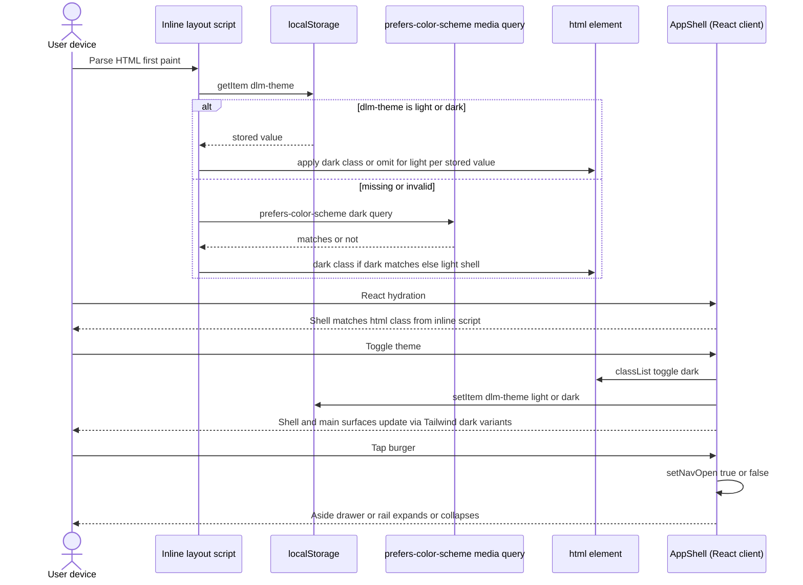

### 4.12 Routines management UI (**REQ-021**, **REQ-023**, **REQ-033**)

- **Routes:** **`/routines`** **—** **list** **`GET /api/v1/routines`** **with** **`type`** **column** **or** **badge** **(**`Python`** **/** **`Shape`** **animation`**)**. **`/routines/new`** **—** **kind** **choice** **then** **branch** **(**REQ-023**)**.
- **Create:** **Step** **1:** **`name`** **(required)**, **`description`**. **Step** **2:** **Kind** **radio** **or** **two** **equal** **primary** **actions** **(**“Python”** **/** **“Shape** **animation”**)** **—** **no** **third** **engine**. **Python** **path:** **substitute** **`PYTHON_ROUTINE_DEFAULT_SOURCE`** **if** **needed**, **`POST`** **`type: python_scene_script`**, **navigate** **`/routines/python/[id]`**. **Shape** **path:** **`POST`** **`type: shape_animation`** **with** **minimal** **valid** **`definition_json`** **(**defaults** **from** **a** **`SHAPE_ANIMATION_DEFAULT_DEFINITION`** **constant** **in** **`web/`**)** **or** **navigate** **to** **`/routines/shape/[id]`** **with** **wizard** **that** **`PATCH`**es **before** **first** **save** **—** **implementor** **chooses** **(**document** **in** **`README`**)**. **REQ-023** **rule** **3:** **no** **duplicate** **buttons** **for** **the** **same** **flow**.
- **Delete:** **`DELETE /api/v1/routines/{id}`**; **`409`** **when** **run** **active**.
- **Rows:** **Edit** **→** **`/routines/python/[id]`** **or** **`/routines/shape/[id]`** **by** **`type`**. **Duplicate:** **`POST`** **copy** **with** **appropriate** **payload** **(**Python** **:** **source** **text** **;** **shape** **:** **parsed** **`definition_json`** **)**.
- **Run**/**stop** **optional** **here** **;** **primary** **run** **UX** **remains** **§4.9** **scene** **detail** **and** **the** **unified** **panels** **§4.13**/**§4.14**.
- **REQ-002**/**REQ-018:** **Font** **Awesome** **on** **buttons** **;** **no** **hover-only** **essential** **steps**.

**REQ-023 — create flow (browser → API):**

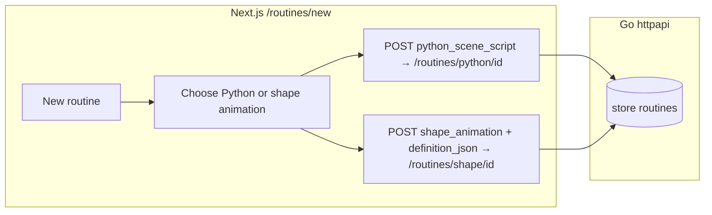

### 4.13 Python routine editor, API reference below editor, unified run and live viewport (**REQ-022**–**REQ-032**, **REQ-023**)

- **Routes (App Router):** **`/routines/python/[id]`** **(edit** **existing** **—** **primary** **after** **`POST`** **from** **§4.12**)**. **`/routines/python/new`** **MAY** **redirect** **to** **`/routines/new`** **or** **`POST`** **a** **placeholder** **then** **redirect** **—** **MUST** **not** **be** **the** **only** **documented** **primary** **create** **path** **(**REQ-023**)**.
- **Vertical** **page** **order** **(REQ-002,** **REQ-022,** **REQ-024,** **REQ-027):** **(1)** **toolbar** **+** **persistence** **actions**; **(2)** **CodeMirror** **editor** **(full-width** **primary** **code** **area)**; **(3)** **`<section id="python-scene-api-catalog">`** **or** **equivalent** **landmark** **—** **the** **REQ-024** **API** **reference** **—** **placed** **immediately** **below** **the** **editor** **in** **DOM** **order** **with** **no** **other** **primary** **workflow** **block** **between** **editor** **and** **reference** **except** **a** **single** **heading**/**divider** **if** **needed**; **(4)** **one** **unified** **“run** **and** **watch”** **region** **(REQ-027)** **after** **the** **reference** **section** **containing** **together:** **a** **single** **`GET /api/v1/scenes`** **`<select>`** **(or** **accessible** **combobox)** **that** **is** **the** **only** **scene** **target** **for** **both** **routine** **start**/**stop** **and** **`SceneLightsCanvas`**, **Start**/**Stop** **buttons**, **`SceneLightsCanvas`** **(§4.9** **reuse)**, **Reset** **scene** **lights**, **Reset** **camera**. **Forbidden:** **two** **parallel** **top-level** **sections** **that** **separate** **“run** **in** **scene”** **from** **“visual** **debug”** **with** **duplicate** **scene** **pickers** **or** **viewports**. **Mobile** **(REQ-002):** **stack** **(1)–(4)** **vertically**; **optional** **accordion** **only** **if** **every** **panel** **remains** **discoverable** **and** **does** **not** **place** **the** **API** **reference** **above** **the** **editor** **or** **split** **the** **unified** **run**/**viewport** **into** **two** **primary** **accordions** **for** **the** **same** **workflow**. **Desktop** **MAY** **widen** **the** **editor** **and** **reference** **but** **MUST** **not** **move** **REQ-024** **above** **the** **editor** **or** **interleave** **other** **primary** **blocks** **between** **editor** **and** **reference**.
- **Editor** **stack** **(mandatory** **per** **REQ-022):** **CodeMirror** **6** **only** — **Primary** **pattern** **in** **this** **repo:** **client** **component** **(e.g.** **`web/components/PythonCodeMirrorEditor.tsx`)** **creates** **`EditorView`** **in** **`React.useEffect`**, **`EditorState.create({ doc, extensions })`** **with** **`basicSetup`** **from** **`codemirror`**, **`python()`** **from** **`@codemirror/lang-python`**, **`lintGutter`**/**`linter`**/**`autocompletion`** **from** **`@codemirror/lint`** **/** **`@codemirror/autocomplete`**, **`oneDark`** **(or** **equivalent)** **from** **`@codemirror/theme-one-dark`**, **`keymap.of([indentWithTab])`**, **and** **`EditorView.updateListener`** **for** **`onChange`**; **expose** **`EditorView`** **ref** **or** **callback** **to** **parent** **so** **REQ-024** **insert** **can** **`dispatch`** **transactions**. **Sync** **external** **`value`** **when** **it** **differs** **from** **the** **document** **(e.g.** **after** **`GET /api/v1/routines/{id}`)**. **Alternatives:** **a** **thin** **React** **wrapper** **such** **as** **`@uiw/react-codemirror`** **MAY** **replace** **hand-rolled** **`EditorView`** **lifecycle** **if** **the** **buffer** **remains** **pure** **CodeMirror** **6**. **Do** **not** **use** **Monaco** **or** **other** **non-CodeMirror** **editors**. **Wire** **`scene.`** **completion** **from** **the** **same** **manifest** **as** **§3.17** **/** **REQ-024** **(parameter** **snippets** **for** **novices)**. **Format** **button** **and/or** **format-on-save** **per** **§3.17**.
- **Instructional** **copy** **(REQ-022** **rule** **10):** **Section** **headings**, **form** **labels**, **primary** **tooltips**, **empty** **states**, **and** **short** **inline** **help** **on** **this** **page** **MUST** **use** **simple** **language** **appropriate** **for** **a** **twelve-year-old** **who** **has** **just** **started** **Python** **—** **short** **sentences**, **common** **words**, **brief** **explanations** **when** **a** **technical** **term** **is** **required**, **and** **no** **long** **expository** **paragraphs** **in** **page** **chrome**.
- **Default** **template** **(REQ-025):** **Define** **`PYTHON_ROUTINE_DEFAULT_SOURCE`** **(or** **equivalent)** **in** **`web/`** **as** **the** **initial** **`doc`** **when** **the** **client** **creates** **`python_scene_script`** **with** **`python_source: ""`** **(or** **omit** **and** **let** **client** **substitute** **before** **`PATCH`)** **—** **content** **MUST** **demonstrate** **`await scene.set_lights_in_sphere(...)`** **(or** **sync** **wrapper** **if** **architecture** **uses** **sync** **shim)** **with** **reasonable** **`center`**/**`radius`**, **setting** **`on`**, **`color`** **(canonical** **`#rrggbb`)**, **and** **`brightness_pct`**. **For** **the** **random** **demo** **colour,** **SHOULD** **use** **`colour = scene.random_hex_colour()`** **(**REQ-030**)** **rather** **than** **`import random`** **and** **`"#%06x"** **%** **`random.randrange(0x1000000)`** **alone** **—** **so** **beginners** **see** **the** **documented** **helper** **first**. **Every** **template** **line** **or** **logical** **block** **MUST** **include** **brief** **Python** **`#`** **comments** **matching** **the** **brevity** **standard** **for** **REQ-024** **samples**. **Optional** **toolbar** **“Reset** **to** **template”** **MAY** **replace** **the** **buffer** **after** **confirm**.
- **Default** **sample** **routines** **(REQ-032):** **Three** **full** **scripts** **in** **`web/lib/pythonRoutineSamples.ts`** **(**§3.8.1**, **§3.17.1**)** **are** **seeded** **into** **`routines`** **and** **listed** **on** **`/routines`** **—** **users** **open** **them** **like** **any** **definition**. **Optional** **toolbar** **“Load** **sample”** **actions** **MAY** **replace** **the** **editor** **buffer** **from** **the** **same** **exports** **(**after** **confirm** **if** **dirty**)**. **REQ-024** **catalog** **MUST** **remain** **focused** **on** **`scene.*`** **API** **items** **with** **short** **per-entry** **snippets** **(**REQ-024** **rule** **7**)** **—** **do** **not** **require** **three** **dedicated** **catalog** **rows** **that** **are** **the** **only** **way** **to** **obtain** **the** **full** **default** **scripts**.
- **API** **reference** **(REQ-024):** **Rendered** **from** **the** **same** **ordered** **manifest** **as** **§3.17** **(every** **`scene`** **property** **and** **method,** **including** **`scene.random_hex_colour`** **per** **REQ-030**)**. **UI** **requirements:** **(a)** **picker** **—** **`<select>`**, **searchable** **list**, **or** **equivalent** **—** **so** **exactly** **one** **catalog** **entry** **is** **in** **focus** **at** **a** **time**; **(b)** **detail** **area** **showing** **plain-language** **description**, **parameters**/**returns** **at** **novice** **level**, **and** **at** **least** **one** **sample** **usage** **string** **that** **includes** **Python** **`#`** **comments** **with** **short**, **non-verbose** **explanations**; **(c)** **Insert** **example** **button** **(REQ-018** **icon** **+** **label** **in** **simple** **wording)** **that** **inserts** **the** **currently** **shown** **sample** **via** **`EditorView.dispatch`** **of** **a** **CodeMirror** **6** **`Transaction`** **(**e.g.** **`insert`**, **`replaceSelection`**, **or** **equivalent** **change** **spec**)** **at** **the** **main** **selection** **anchor** **when** **the** **editor** **view** **has** **focus** **and** **a** **defined** **anchor** **(implementor** **MAY** **replace** **the** **current** **selection** **or** **insert** **at** **caret** **only** **—** **document** **the** **choice** **when** **implemented)**; **if** **no** **caret** **is** **available**, **append** **at** **the** **end** **of** **the** **document**. **Sample** **rendering** **MAY** **use** **read-only** **CodeMirror** **or** **styled** **`<pre>`**. **Heading** **e.g.** **“Scene** **API** **(**pick** **one** **to** **read** **more**)**”** **with** **anchor** **`#python-scene-api-catalog`**. **Implementor** **MUST** **keep** **manifest** **and** **§3.17** **in** **sync** **(single** **TS** **module** **exporting** **rows** **recommended)**.
- **Unified** **live** **viewport** **(REQ-027,** **REQ-028,** **REQ-031):** **The** **single** **scene** **`<select>`** **in** **the** **unified** **region** **determines** **`sceneId`** **for** **`SceneLightsCanvas`** **fed** **by** **`GET /api/v1/scenes/{id}`** **(per-light** **state** **+** **`sx/sy/sz`)**. **While** **a** **run** **is** **active** **for** **that** **`sceneId`**, **poll** **`GET …/scenes/{id}`** **(**or** **`GET …/lights`**)** **on** **the** **same** **interval** **as** **§4.9** **(**`≤ 2 s`**)** **and** **merge** **into** **the** **canvas** **(**REQ-012**/**REQ-028** **—** **no** **indefinite** **staleness**)** **;** **apply** **§3.19** **so** **unchanged** **payloads** **skip** **redundant** **canvas** **work**. **Reset** **scene** **lights** **→** **`PATCH /api/v1/scenes/{sceneId}/lights/state/scene`** **with** **`{ "on": false, "color": "#ffffff", "brightness_pct": 100 }`** **then** **merge**; **does** **not** **auto** **`POST …/stop`** **—** **user** **stops** **the** **run** **separately** **or** **accepts** **the** **next** **server** **iteration** **may** **overwrite**. **Reset** **camera** **→** **`applyDefaultFraming`** **(REQ-016,** **client-only)**. **Viewport** **usable** **with** **no** **active** **run** **(static** **inspection)** **and** **with** **an** **active** **run** **(live** **updates)**.
- **Persistence** **actions** **(toolbar):** **Load** **`GET /api/v1/routines/{id}`** **on** **mount**; **Save** **`PATCH /api/v1/routines/{id}`** **(or** **initial** **`POST`** **on** **new)**; **Duplicate** **—** **`POST /api/v1/routines`** **with** **copied** **fields**; **Delete** **`DELETE …`** **(same** **409** **rules)**; **Load** **list** **is** **the** **`/routines`** **page** **—** **this** **page** **MAY** **include** **a** **`<select>`** **of** **other** **Python** **routines** **for** **quick** **switch** **(optional)**.
- **Start**/**Stop** **(same** **`sceneId`** **as** **canvas):** **Optional** **`?scene=id`** **from** **`/scenes/[id]`** **(§4.9)** **pre-selects** **the** **unified** **scene** **`<select>`**. **Start** **`POST …/scenes/{sceneId}/routines/{routineId}/start`** **—** **Go** **`routineengine`** **starts** **the** **§3.17** **`python3`** **subprocess** **(**or** **§3.17.2** **shape** **loop**)** **;** **the** **browser** **does** **not** **spawn** **a** **worker** **for** **production** **execution**. **Stop** **`POST …/stop`** **—** **supervisor** **signals** **cooperative** **shutdown** **then** **`SIGTERM`**/**`SIGKILL`** **after** **`T_force`** **(**§3.17**)** **if** **needed**.
- **REQ-018:** **Toolbar** **and** **reference** **buttons** **(Save,** **Format,** **Run/Stop,** **Duplicate,** **Delete,** **Insert** **example,** **Reset** **scene** **lights,** **Reset** **camera** **where** **present)** **each** **include** **a** **visible** **Font** **Awesome** **icon**.

**Vertical** **layout** **(summary** **—** **REQ-024** **+** **REQ-027):**

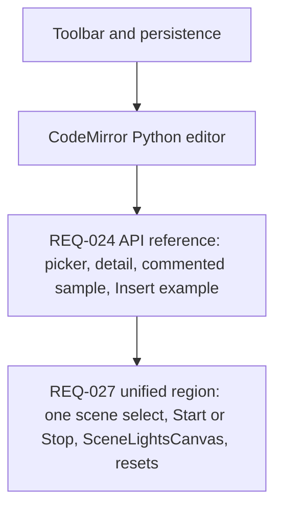

### 4.14 Shape animation routine editor and unified run / live viewport (**REQ-033**, **REQ-027**, **REQ-028**, **REQ-002**)

- **Route:** **`/routines/shape/[id]`** **(App** **Router)** **—** **edit** **`shape_animation`** **definitions** **only** **(**`404`** **or** **redirect** **if** **`type`** **≠** **`shape_animation`**)**.
- **Page** **structure** **(mirror** **REQ-027** **without** **CodeMirror** **or** **REQ-024):** **(1)** **toolbar** **—** **Save** **`PATCH`** **(**merge** **`definition_json`** **from** **form** **state**)** , **Duplicate**, **Delete** **(**same** **§3.16** **rules**)**; **(2)** **authoring** **panel** **—** **responsive** **form** **for** **`background`**, **ordered** **list** **of** **up** **to** **20** **shapes** **(**add**/**remove**/**reorder** **—** **touch-friendly** **per** **REQ-002**)** **mapping** **to** **§3.17.2** **schema** **(**speed** **inputs** **MAY** **use** **cm/s** **labels** **with** **0.01** **×** **conversion** **to** **`m_s`** **in** **JSON**)**; **(3)** **one** **unified** **region** **after** **the** **form** **—** **exactly** **one** **scene** **`<select>`**, **Start**/**Stop**, **`SceneLightsCanvas`**, **Reset** **scene** **lights**, **Reset** **camera** **(**same** **behavior** **as** **§4.13** **unified** **block**)**. **Forbidden:** **second** **scene** **picker** **or** **viewport** **for** **this** **workflow**.
- **Run** **driver** **(**REQ-038**)** **:** **On** **Start**, **`POST …/start`** **starts** **the** **server** **§3.17.2** **ticker** **;** **the** **page** **only** **polls**/**SSE** **for** **fresh** **scene** **state** **and** **run** **status** **. **On** **Stop** **or** **unmount**, **`POST …/stop`** **(**idempotent**)** **. **Do** **not** **rely** **on** **a** **browser** **tab** **to** **advance** **ticks** **.**
- **Viewport** **sync:** **While** **a** **run** **is** **active**, **poll** **`GET /api/v1/scenes/{id}`** **(**or** **`GET …/lights`**)** **on** **the** **same** **interval** **as** **§4.9** **and** **merge** **into** **`SceneLightsCanvas`** **(**REQ-012**/**REQ-028**)** **;** **the** **browser** **does** **not** **observe** **each** **server** **tick** **via** **a** **direct** **callback** **from** **the** **shape** **loop** **(**§3.19** **still** **applies** **to** **skip** **redundant** **canvas** **work** **when** **payloads** **are** **unchanged**)**.
- **Instructional** **copy:** **Use** **plain** **language** **(**short** **sentences**)** **for** **non-Python** **users** **;** **no** **REQ-022** **twelve-year-old** **Python** **tone** **requirement** **on** **this** **page** **unless** **product** **unifies** **copy** **style** **later**.
- **REQ-018:** **Toolbar** **and** **form** **actions** **that** **are** **buttons** **include** **Font** **Awesome** **icons**.

**Vertical** **layout** **summary:**

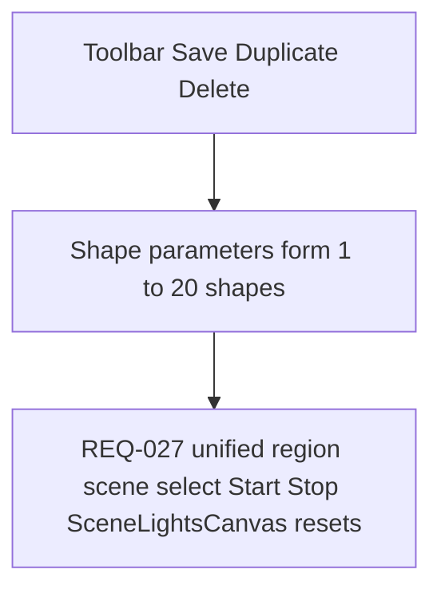

### 4.15 Devices UI (**REQ-037**, **REQ-035**, **REQ-002**, **REQ-018**)

- **Priority:** **REQ-037** **is** **Must** **;** **polish** **is** **secondary** **to** **correct** **§3.20**/**§3.21** **sync** **and** **routine**/**device** **behavior** **(**REQ-039**)** **. **MVP** **SHOULD** **ship** **readable** **list** **+** **detail** **with** **REQ-002** **touch**/**keyboard** **baselines** **.**
- **Routes:** **`/devices`** **(**list**)** **;** **`/devices/new`** **(**manual** **add** **—** **form** **fields** **at** **minimum** **`name`**, **`type`** **(**`wled`** **only** **at** **first**)** **,** **`base_url`** **(**full** **URL** **or** **`http://host:port`** **as** **architecture** **normalizes**)** **)** **;** **`/devices/[id]`** **(**detail** **,** **edit** **name** **/** **connection** **,** **assign**/**unassign** **via** **`POST …/assign`** **/** **`POST …/unassign`** **or** **equivalent** **combined** **save** **)** **.**
- **Manual-first** **(**REQ-035** **BR** **5**)** **:** **“Add** **device”** **MUST** **work** **without** **discovery** **;** **do** **not** **gate** **MVP** **on** **`POST …/discover`**. **Discovery** **button** **MAY** **call** **`POST /api/v1/devices/discover`** **when** **the** **backend** **implements** **it** **;** **until** **then** **,** **hide** **the** **button** **or** **show** **disabled** **state** **with** **copy** **that** **manual** **entry** **is** **supported**.
- **Model** **detail** **(**REQ-036** **BR** **5**)** **:** **SHOULD** **show** **linked** **device** **name**/**id** **(**read-only** **or** **link** **to** **`/devices/[id]`**)** **;** **MAY** **duplicate** **assign**/**unassign** **if** **the** **same** **API** **is** **used**.
- **Nav** **:** **“Devices”** **in** **`AppShell`** **aside** **with** **Font** **Awesome** **icon** **(**REQ-018**)** **,** **peer** **to** **Models**/**Scenes**/**Routines** **.**

---

## 5. UI ↔ API coordination (single process)

**Production:**

1. User opens **`https://host/`** (or `http://host:8080/`).
2. **Go** serves **`index.html`** and **JS/CSS** from embed.
3. React hydrates; components call **`fetch('/api/v1/…')`** (e.g. **models** endpoints, **`/api/v1/status`** if present) → **same Go server**.
4. Optional **Caddy/nginx** terminates TLS and proxies **everything** to **one** Go port (**REQ-029** **§3.18:** **HTTP/2** **to** **clients** **here** **is** **recommended** **when** **many** **API** **requests** **are** **in** **flight**).

**No** path-based split between Node and Go inside the product.

**Development (non-shipping):** Engineers may use **`next dev`** with **proxy** to Go API or **dual ports** + CORS; **document** in `README` as dev-only.

---

## 6. Raspberry Pi 4 Model B deployment

### 6.1 ARM64 and resources

- **Target:** **linux/arm64** executable.
- **RAM:** **Single Go** process + embedded static assets — significantly lower than **Go + Node**; **2–4 GB** can suffice for light use; **4 GB+** recommended headroom.
- **CPU:** **No SSR** on device; Go serves files and JSON — suitable for Pi **4**.

### 6.2 Process model

- **One** `systemd` service — the **application binary** only.
- **Scene** **routines** **(REQ-021**/**REQ-038**)** **:** **`routineengine`** **runs** **in** **Go** **:** **Python** **via** **supervised** **`python3`** **subprocess** **(**§3.17**)** **;** **shape** **animation** **via** **Go** **`time.Ticker`** **(**§3.17.2**)** **. **Headless** **operation** **does** **not** **require** **any** **browser** **.
- **Python** **(REQ-022)** **:** **Editor** **static** **bundle** **no** **longer** **requires** **shipping** **Pyodide** **for** **execution** **(**may** **still** **be** **optional** **for** **client-side** **lint** **only** **—** **§3.17**)** **. **Pi** **deployments** **SHOULD** **document** **`python3`** **on** **`PATH`** **for** **Python** **routine** **runs** **and** **CPU**/**RAM** **impact** **of** **concurrent** **subprocesses** **.
- **Optional** separate **`caddy.service`** or **`nginx`** is **OS/infrastructure**, not part of REQ-004’s single binary (the **product** remains one file).

### 6.3 Distribution (**REQ-004** / anti-Docker)

- **Canonical install:** copy **one binary** + optional **unit file**; **not** Docker-first.
- **Docs** (`README`, this file) MUST describe **binary + systemd** path; **do not** require **Dockerfile** or **compose** for production.

### 6.4 Networking

- Go binds **`:8080`** (or configured); reverse proxy maps **80/443** → that socket.
- **REQ-029:** **Enabling** **HTTP/2** **(and** **TLS**)** **on** **the** **proxy** **toward** **browsers** **reduces** **connection** **churn** **for** **many** **parallel** **`fetch`** **calls** **—** **see** **§3.18**. **The** **Go** **listener** **may** **remain** **HTTP/1.1** **behind** **the** **proxy**.

### 6.5 Browser WebGL / three.js on constrained clients (**REQ-003**, **REQ-028**)

- **Rendering** **runs** **in** **the** **user’s** **browser**, **not** **on** **the** **Pi** **CPU** **unless** **the** **user** **opens** **the** **UI** **on** **the** **Pi** **itself** **(Chromium** **on** **Raspberry** **Pi** **OS)**. **REQ-028** **emissive** **spheres** **use** **standard** **three.js** **material** **paths** **(**`MeshStandardMaterial`** **+** **`emissive`**/**`emissiveIntensity`**) **that** **are** **broadly** **supported** **on** **WebGL2**; **avoid** **depending** **on** **optional** **post-processing** **bloom** **for** **baseline** **compliance**.
- **Integrated** **GPUs** **(Pi** **browser,** **older** **laptops):** **Keep** **fragment** **work** **bounded** **—** **≤** **1000** **instanced** **spheres** **+** **tone** **mapping** **as** **in** **§4.7** **is** **the** **expected** **ceiling**; **profile** **if** **adding** **extra** **passes**.

---

## 7. System boundaries (flowchart)

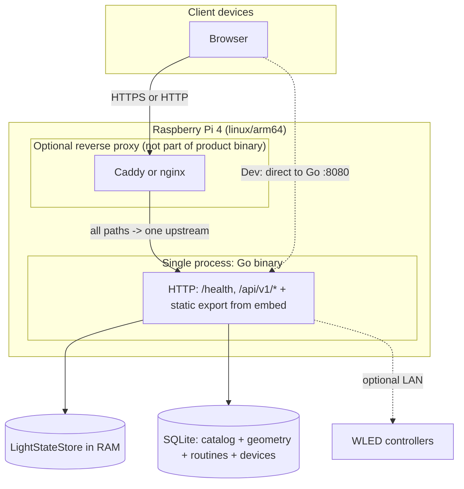

---

## 8. Request flows (sequence diagrams)

### 8.1 Initial page load (static + hydration)

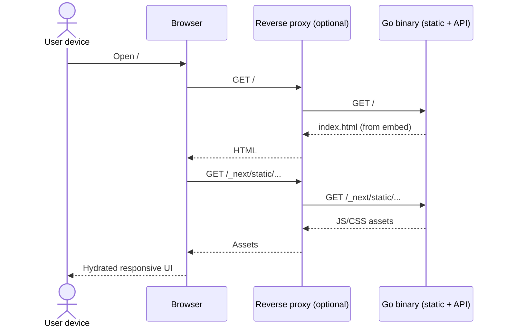

**REQ-018** **(shell** **theme**)**:** **Before** **first** **paint**, **an** **inline** **script** **in** **`web/app/layout.tsx`** **(or** **equivalent**)** **MUST** **read** **`localStorage`** **`dlm-theme`** **and** **fall** **back** **to** **`prefers-color-scheme`** **when** **the** **key** **is** **absent**/**invalid**, **then** **set** **`html`** **`class`** **per** **§4.11** **so** **the** **document** **does** **not** **flash** **the** **wrong** **shell** **theme**.

### 8.2 Client calls JSON API (same origin)

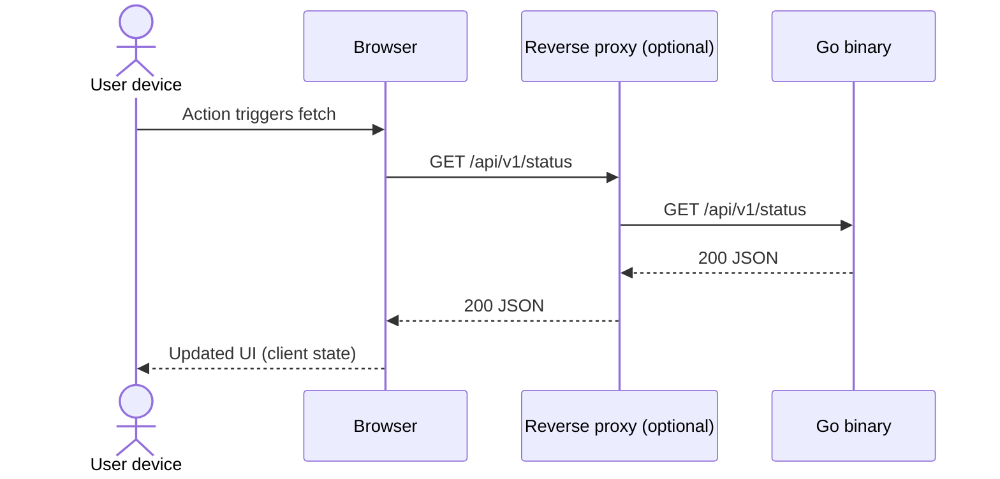

### 8.3 Create model (multipart CSV upload)

```mermaid
sequenceDiagram
  actor User as User device
  participant B as Browser
  participant P as Reverse proxy (optional)
  participant G as Go binary
  participant S as SQLite store

  User->>B: Submit name + CSV file
  B->>P: POST /api/v1/models (multipart)
  P->>G: POST /api/v1/models (multipart)
  G->>G: Parse CSV + validate (wiremodel)
  alt validation failure
    G-->>P: 400 JSON error
    P-->>B: 400 JSON error
    B-->>User: Show actionable message
  else duplicate name
    G-->>P: 409 JSON error
    P-->>B: 409 JSON error
    B-->>User: Show conflict message
  else success
    G->>S: BEGIN; insert model + lights; COMMIT
    S-->>G: OK
    G-->>P: 201 JSON (id, metadata, light_count)
    P-->>B: 201 JSON
    B-->>User: Navigate or refresh list
  end
```

### 8.4 List, view, and delete models

```mermaid
sequenceDiagram
  actor User as User device
  participant B as Browser
  participant P as Reverse proxy (optional)
  participant G as Go binary
  participant S as SQLite store

  User->>B: Open models list
  B->>P: GET /api/v1/models
  P->>G: GET /api/v1/models
  G->>S: Query model summaries
  S-->>G: Rows
  G-->>P: 200 JSON array
  P-->>B: 200 JSON array
  B-->>User: Render responsive list

  User->>B: Select model
  B->>P: GET /api/v1/models/{id}
  P->>G: GET /api/v1/models/{id}
  G->>S: Load model + lights (positions + on color brightness_pct)
  S-->>G: Rowset
  G-->>P: 200 JSON detail
  P-->>B: 200 JSON detail
  B-->>User: Render detail (metadata + three.js 3D of lights + state, client-side)

  User->>B: Confirm delete
  B->>P: DELETE /api/v1/models/{id}
  P->>G: DELETE /api/v1/models/{id}
  alt model referenced by scenes
    G->>S: Check scene_models for model_id
    S-->>G: One or more rows
    G-->>P: 409 JSON model_in_scenes with scene list
    P-->>B: 409 JSON
    B-->>User: Explain model in use; link to scenes
  else success
    G->>S: Delete model (cascade lights)
    S-->>G: OK
    G-->>P: 204 No Content
    P-->>B: 204 No Content
    B-->>User: Update list / redirect
  end
```

### 8.5 Model detail: JSON from Go, WebGL in the browser (**REQ-010**, **REQ-012**, **REQ-019**, **REQ-028**)

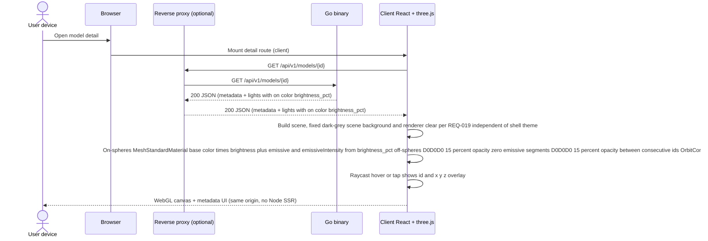

**Boundary:** **Go** returns **positions** and **state** **fields**; **all** **WebGL** allocation and **draw** calls run in the **browser** on the **user device**.

### 8.6 Picking: raycast → id and coordinates (**REQ-010** rule 6)

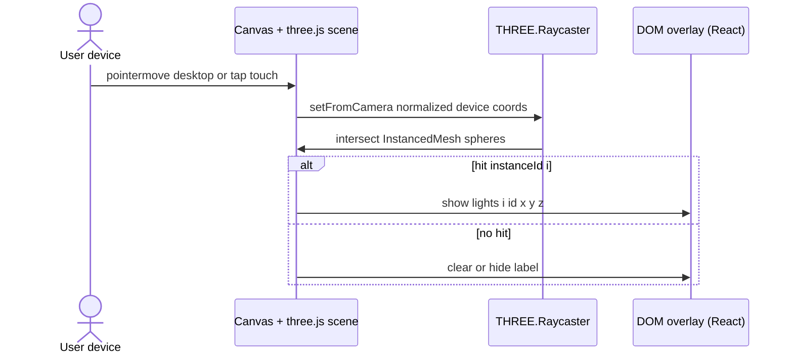

**Boundary:** **No** round-trip to **Go** for hover; labels use **already-fetched** **`lights`** from **§8.5**.

### 8.7 Update light state (**PATCH**) and refresh 3D (**REQ-011**, **REQ-012**)

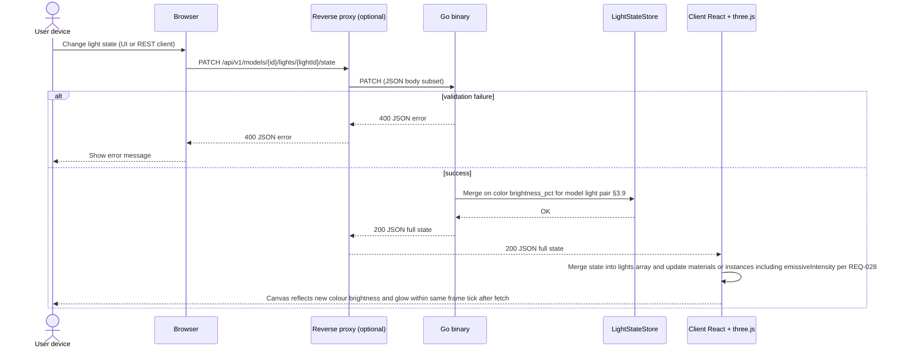

**Boundary:** **Validation** **and** **authoritative** **per-light** **triples** **live** **in** **Go** **`LightStateStore`** **(**REQ-039**)** **;** **SQLite** **holds** **geometry** **only**. **The** **browser** **must** **reconcile** **three.js** **with** **the** **`200`** **response** **(or** **immediate** **refetch)** **so** **the** **view** **does** **not** **stay** **stale** **after** **a** **successful** **write** **(REQ-012**, **including** **REQ-028** **emissive** **strength** **when** **`brightness_pct`** **or** **`on`** **changes**)**.

### 8.8 Bulk update light state (**REQ-013**, **§3.10**)

```mermaid
sequenceDiagram
  actor User as User device
  participant B as Browser
  participant P as Reverse proxy (optional)
  participant G as Go binary
  participant L as LightStateStore
  participant R as Client React + three.js + light table

  User->>B: Select multiple lights and apply on color brightness
  B->>R: User confirms bulk apply
  R->>P: PATCH /api/v1/models/{id}/lights/state/batch (ids + patch fields)
  P->>G: PATCH JSON body
  alt validation failure
    G-->>P: 400 JSON error
    P-->>R: 400 JSON error
    R-->>User: Show actionable message
  else success
    G->>L: Merge batch triples §3.10 §3.19 equivalence
    L-->>G: OK
    G-->>P: 200 JSON states array
    P-->>R: 200 JSON states array
    R->>R: Merge states into lights; refresh table and three.js meshes
    R-->>User: List and canvas match authoritative in-memory state
  end
```

**Boundary:** **Go** **applies** **the** **batch** **atomically** **to** **`LightStateStore`** **(**REQ-039**)** **;** **the** **UI** **must** **treat** **`200`** **`states`** **as** **authoritative** **for** **both** **§4.8** **and** **§4.7**.

### 8.9 Reset all lights to defaults (**REQ-014**, **§3.11**)

```mermaid
sequenceDiagram
  actor User as User device
  participant B as Browser
  participant P as Reverse proxy (optional)
  participant G as Go binary
  participant L as LightStateStore
  participant R as Client React + three.js + light table

  User->>B: Click Reset lights
  B->>R: Invoke reset handler
  R->>P: POST /api/v1/models/{id}/lights/state/reset (no body)
  P->>G: POST
  alt model missing
    G-->>P: 404 JSON error
    P-->>R: 404
    R-->>User: Show error message
  else success
    G->>L: Set all lights in model to defaults §3.11 REQ-014
    L-->>G: OK
    G-->>P: 200 JSON states array for all lights
    P-->>R: 200 JSON states array
    R->>R: Merge states into lights; refresh table and three.js meshes
    R-->>User: Model matches default visual and list state
  end
```

**Boundary:** **Same** **timeliness** expectation as **§8.7** — **no** **indefinite** **staleness** after **200**.

### 8.10 Create scene with models (**REQ-015**)

```mermaid
sequenceDiagram
  actor User as User device
  participant B as Browser
  participant P as Reverse proxy (optional)
  participant G as Go binary
  participant S as SQLite store

  User->>B: Submit scene name and ordered model list (no offsets)
  B->>P: POST /api/v1/scenes (JSON: model_id list only)
  P->>G: POST /api/v1/scenes
  G->>G: Compute offsets per §3.12 create-time algorithm; validate containment
  alt validation failure
    G-->>P: 400 JSON error
    P-->>B: 400
    B-->>User: Show actionable message
  else success
    G->>S: BEGIN; insert scenes + scene_models; COMMIT
    S-->>G: OK
    G-->>P: 201 JSON scene id
    P-->>B: 201
    B-->>User: Navigate to scene detail
  end
```

### 8.11 Load scene detail and render composite WebGL (**REQ-015**, **REQ-019**, **REQ-012**, **REQ-028**)

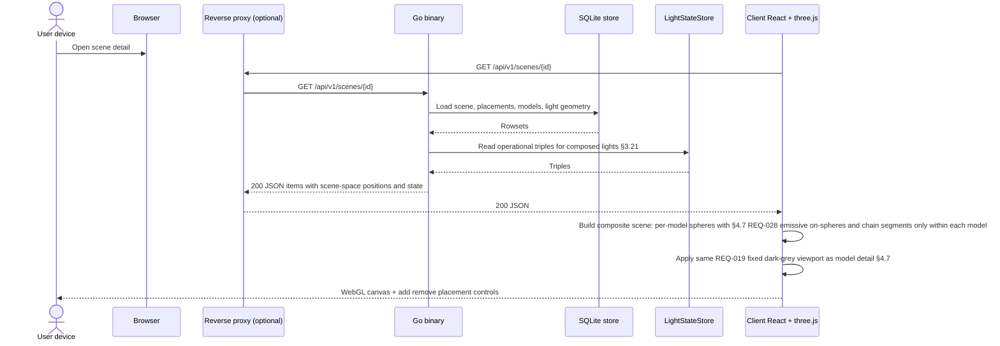

### 8.12 Remove last model from scene (**REQ-015**)

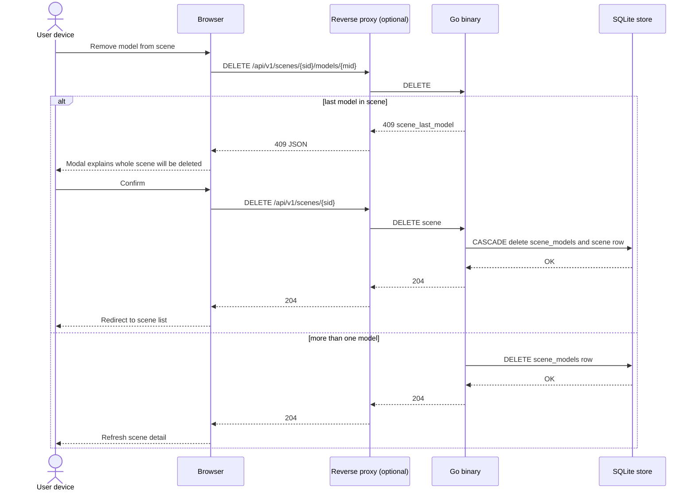

### 8.13 Factory reset all data (**REQ-017**, **§3.14**)

```mermaid
sequenceDiagram
  actor User as User device
  participant B as Browser
  participant P as Reverse proxy (optional)
  participant G as Go binary
  participant S as SQLite store

  User->>B: Open Options then Factory reset
  B-->>User: Show blocking warning dialog
  User->>B: Confirm erase
  B->>P: POST /api/v1/system/factory-reset
  P->>G: POST
  alt success
    G->>S: BEGIN; DELETE routine_runs, routines, devices, scene_models, scenes, lights, models; SeedDefaultSamples; SeedDefaultPythonRoutines; COMMIT
    Note over G,S: routines delete removes shape_animation and python_scene_script rows; devices clears registry REQ-017 REQ-035
    S-->>G: OK
    G->>G: Rebuild LightStateStore from seeded models §3.21 REQ-039
    G-->>P: 200 { ok: true }
    P-->>B: 200
    B->>B: Clear client caches; navigate to /models; show success banner
    B-->>User: Model list shows three samples; routines three default Python only; Devices empty
  else failure
    G-->>P: 500 JSON error
    P-->>B: 500
    B-->>User: Show error; data unchanged if transaction rolled back
  end
```

### 8.14 Reset camera (client only) (**REQ-016**)

```mermaid
sequenceDiagram
  actor User as User device
  participant R as Client React + three.js + OrbitControls

  User->>R: Click Reset camera on model or scene view
  R->>R: applyDefaultFraming from current bounds; controls.update()
  R-->>User: View returns to default framing; no HTTP request
```

### 8.15 Scene region query and bulk update in scene coordinates (**REQ-020**)

```mermaid
sequenceDiagram
  actor User as Integrator or UI user
  participant B as Browser or API client
  participant P as Reverse proxy (optional)
  participant G as Go binary
  participant S as SQLite store
  participant L as LightStateStore

  User->>B: Query cuboid or sphere region in a scene
  B->>P: POST /api/v1/scenes/{id}/lights/query/{shape}
  P->>G: POST
  G->>G: Validate geometry payload (finite numbers, positive dimensions/radius)
  alt invalid geometry
    G-->>P: 400 validation_failed
    P-->>B: 400 JSON error with actionable details
  else valid geometry
    G->>S: Load scene placements + light rows
    S-->>G: Rows
    G->>G: Compute sx,sy,sz and filter inclusion (inclusive boundaries)
    G-->>P: 200 matched lights in scene coordinates
    P-->>B: 200 JSON
  end

  User->>B: Bulk update state for same region
  B->>P: PATCH /api/v1/scenes/{id}/lights/state/{shape}
  P->>G: PATCH
  G->>G: Validate geometry + REQ-011 state fields
  G->>S: Load geometry + placements to resolve matches by sx/sy/sz
  S-->>G: Rowsets
  G->>L: Merge triples for matched lights §3.15 §3.9
  alt validation failure or internal error
    G-->>P: 4xx or 5xx JSON error
    P-->>B: Error response; no partial writes
  else success
    L-->>G: OK
    G-->>P: 200 updated_count + updated states
    P-->>B: 200 JSON
  end
```

### 8.16 Scene routine start, server Python loop, and stop (**REQ-021**, **REQ-038**, **§3.16**, **§3.17**)

```mermaid
sequenceDiagram
  actor User as User device
  participant B as Browser
  participant P as Reverse proxy (optional)
  participant G as Go binary
  participant R as routineengine supervisor
  participant Py as python3 subprocess
  participant L as LightStateStore
  participant S as SQLite store

  User->>B: Create routine (python_scene_script)
  B->>P: POST /api/v1/routines
  P->>G: POST
  G->>S: INSERT routines row
  S-->>G: OK
  G-->>P: 201 routine json
  P-->>B: 201

  User->>B: Start routine on scene
  B->>P: POST /api/v1/scenes/{sid}/routines/{rid}/start
  P->>G: POST
  G->>S: BEGIN; INSERT routine_runs running; COMMIT
  S-->>G: OK
  G->>R: Start supervised run
  R->>Py: spawn with python_source scene shim §3.17
  G-->>P: 201 run json
  P-->>B: 201

  loop Each iteration until supervisor stop
    Py->>P: HTTP loopback §3.15 PATCH/GET
    P->>G: HTTP
    G->>L: Merge state §3.9 §3.15
    L-->>G: OK
    G-->>Py: 200 JSON
    R->>R: Check stop flag / routine_runs
  end

  User->>B: Stop routine
  B->>P: POST /api/v1/scenes/{sid}/routines/runs/{runId}/stop
  P->>G: POST
  G->>S: UPDATE routine_runs set stopped
  S-->>G: OK
  G->>R: Signal shutdown
  R->>Py: cooperative then SIGTERM SIGKILL if needed §3.17
  G-->>P: 200
  P-->>B: 200
```

**§8.17** **adds** **the** **Next.js** **editor** **save** **path** **and** **REQ-030** **(**`scene.random_hex_colour()`** **local** **to** **the** **`python3`** **child** **only**)**.

### 8.17 Python routine: editor save, server subprocess loop, scene API over loopback, cooperative and forced stop (**REQ-022**, **REQ-030**, **REQ-038**, **§3.17**)

**REQ-030** **note:** **`scene.random_hex_colour()`** **runs** **only** **inside** **the** **`python3`** **child** **(**standard** **`random`** **module**)** **and** **does** **not** **add** **HTTP** **traffic** **to** **§3.15**; **it** **does** **not** **appear** **as** **an** **HTTP** **leg** **in** **the** **diagram** **below**.

```mermaid
sequenceDiagram
  actor User as User device
  participant Page as Next.js page (§4.13)
  participant P as Reverse proxy (optional)
  participant G as Go binary
  participant R as routineengine
  participant Py as python3 subprocess
  participant L as LightStateStore
  participant S as SQLite store

  User->>Page: Save Python routine
  Page->>P: PATCH /api/v1/routines/{id} (python_source, …)
  P->>G: PATCH
  G->>S: UPDATE routines
  S-->>G: OK
  G-->>Page: 200

  User->>Page: Start on scene
  Page->>P: POST /api/v1/scenes/{sid}/routines/{rid}/start
  P->>G: POST
  G->>S: INSERT routine_runs running (§3.16)
  S-->>G: OK
  G->>R: start python run
  R->>Py: spawn bootstrap + user source
  G-->>Page: 201 run_id

  loop Each iteration until R signals stop
    Py->>P: urllib/httpx to 127.0.0.1 §3.15
    P->>G: HTTP
    G->>L: merge §3.15 handlers
    L-->>G: OK
    G-->>Py: JSON
    R->>R: sleep iteration gap; check stop
  end

  User->>Page: Stop
  Page->>P: POST …/routines/runs/{runId}/stop
  P->>G: POST
  G->>S: UPDATE routine_runs stopped
  G->>R: shutdown
  R->>Py: cooperative stop then SIGTERM SIGKILL §3.17
  G-->>Page: 200
```

---

### 8.18 Python routine page: unified scene target, polling viewport sync, and resets (**REQ-027**, **REQ-028**, **§4.13**)

```mermaid
sequenceDiagram
  actor User as User device
  participant Page as Next.js §4.13 page
  participant Canvas as SceneLightsCanvas
  participant G as Go binary §3.15 §3.17

  User->>Page: Select target scene (run + viewport)
  Page->>G: GET /api/v1/scenes/{id}
  G-->>Page: items + lights + state
  Page->>Canvas: mount / update props

  User->>Page: Start routine on same scene
  Page->>G: POST …/routines/…/start
  G-->>Page: 201 run_id
  Note over G: routineengine runs python3 child; browser does not execute script

  loop Poll while run active §4.9 §4.13
    Page->>G: GET …/scenes/{id} or GET …/routines/runs
    G-->>Page: fresh lights + state
    Page->>Canvas: merge state REQ-012 REQ-028 §3.19
  end

  User->>Page: Reset scene lights
  Page->>G: PATCH …/lights/state/scene (off, #ffffff, 100%)
  G-->>Page: 200
  Page->>Canvas: merge state

  User->>Page: Reset camera
  Page->>Canvas: applyDefaultFraming (REQ-016, no API)
```

### 8.21 Scene routine start — Python subprocess vs Go shape loop (**REQ-021**, **REQ-038**, **§3.16**, **§3.17**, **§3.17.2**)

```mermaid
sequenceDiagram
  actor User as User device
  participant Page as Next.js routine page
  participant G as Go binary
  participant R as routineengine
  participant Py as python3 subprocess
  participant Eng as shape loop §3.17.2

  User->>Page: Start on scene
  Page->>G: POST …/scenes/sid/routines/rid/start
  G->>R: start run for routine type
  G-->>Page: 201 run_id

  alt routine type python_scene_script
    R->>Py: spawn §3.17
    loop iterations until stop
      Py->>G: loopback HTTP §3.15
      G-->>Py: 200 JSON
      R->>R: supervise gap and stop
    end
  else routine type shape_animation
    R->>Eng: start ticker definition_json sceneId
    loop each tick until stop
      Eng->>G: internal §3.15 lightstate paths
      G-->>Eng: OK
    end
  end

  User->>Page: Stop
  Page->>G: POST …/runs/runId/stop
  G->>R: shutdown
  R->>Py: SIGTERM chain if needed
  R->>Eng: cancel ticker
```

### 8.22 Shape animation page — unified viewport and server tick writes (**REQ-033**, **REQ-027**, **REQ-038**, **§3.17.2**)

```mermaid
sequenceDiagram
  actor User as User device
  participant Page as Next.js §4.14
  participant G as Go §3.15 §3.17.2
  participant C as SceneLightsCanvas

  User->>Page: Select scene in unified panel
  Page->>G: GET /api/v1/scenes/id
  G-->>Page: lights + state
  Page->>C: mount SceneLightsCanvas

  User->>Page: Start
  Page->>G: POST …/start
  G-->>Page: 201 run_id
  Note over G: routineengine shape ticker runs inside Go; not in the browser bundle

  loop Poll + server ticks until stop
    G->>G: ticker integrates shapes PATCH batch §3.15
    Page->>G: GET scene or GET lights §4.14
    G-->>Page: fresh state
    Page->>C: merge REQ-012 REQ-028 §3.19
  end

  User->>Page: Stop
  Page->>G: POST …/stop
  G-->>Page: 200
```

### 8.19 Optional push path for high-throughput observers (**REQ-029**, **§3.18**)

**Note:** **This** **diagram** **describes** **an** **optional** **future** **or** **parallel** **implementation** **path** **when** **bounded** **polling** **(**§4.7**, **§4.9**)** **is** **insufficient** **for** **multi-tab** **freshness** **under** **sustained** **external** **writes**.

```mermaid
sequenceDiagram
  participant Ext as External client
  participant G as Go binary
  participant L as LightStateStore
  participant S as SQLite store
  participant B as Browser observer tab

  Ext->>G: PATCH bulk model or scene state
  G->>L: Merge triples §3.9 §3.19
  L-->>G: OK
  Note over G,S: SQLite touched only for catalog or geometry mutations
  G-->>Ext: 200 JSON
  Note over G,B: Optional SSE after successful state commit per §3.18
  G-->>B: text/event-stream data line
  B->>G: GET authoritative state
  G->>S: read geometry or scene rows if needed
  S-->>G: rows
  G->>L: read triples §3.21
  L-->>G: state
  G-->>B: 200 JSON
  B->>B: merge into three.js and tables REQ-012
```

### 8.20 Light state write with no-op elision (**REQ-031**, **§3.19**)

```mermaid
sequenceDiagram
  actor User as User device
  participant R as Client React + three.js
  participant G as Go binary
  participant L as LightStateStore

  User->>R: Edit light to same values as shown
  R->>R: Compare merged triple to last rendered (§3.19)
  alt client skip HTTP
    R-->>User: No fetch; canvas unchanged
  else client sends PATCH
    R->>G: PATCH .../lights/{id}/state
    G->>L: Read current; merge; §3.19 equivalence vs new triple
    alt merged equivalent to stored in L
      L-->>G: no logical change
      G-->>R: 200 full state optional unchanged true
      R->>R: Skip three.js rebuild if triple matches cache
    else state changed
      G->>L: store new triple
      L-->>G: OK
      G-->>R: 200 full state
      R->>R: Update materials instances REQ-012 REQ-028
    end
    R-->>User: Timely correct appearance
  end
```

**Note:** **Integrators** **that** **bypass** **the** **shipped** **UI** **still** **benefit** **from** **server-side** **§3.19** **skips** **;** **the** **client** **branch** **in** **the** **diagram** **is** **optional** **but** **recommended** **for** **fewer** **round-trips**.


## 9. Security notes (baseline)

- Prefer **same-origin** in production to minimize **CORS** surface.
- **Secrets** via env only; **no** secrets baked into client bundles beyond **public** constants.
- **No** mandatory **container** trust boundary from the product’s perspective (REQ-004).
- **Upload limits:** Enforce a **maximum request body size** on **`POST /api/v1/models`** (e.g. **`http.MaxBytesReader`** or server limit) large enough for **1000** CSV rows but small enough to bound **memory** and **DoS** risk on the Pi.
- **Scene batch updates:** **`PATCH /api/v1/scenes/{id}/lights/state/batch`** **can** **carry** **one** **JSON** **object** **per** **light** **(up** **to** **~1000** **per** **scene** **in** **worst** **case**)**; **enforce** **a** **reasonable** **max** **body** **size** **(e.g.** **several** **MB** **below** **Pi** **RAM** **headroom**)** **and** **reject** **oversize** **with** **`413`** **or** **`400`** **before** **full** **parse** **if** **needed**.
- **SQLite file:** Treat **`DLM_DB_PATH`** as **persistent** storage on the Pi (e.g. SD card or USB); operators should **back up** the DB file with normal file backup practices.
- **Factory reset:** **`POST /api/v1/system/factory-reset`** **is** **destructive** **and** **unauthenticated** **in** **MVP**; **treat** **network** **exposure** **accordingly** **(see** **§3.14**)**.**
- **User-authored Python (REQ-022):** **Production** **execution** **is** **in** **a** **supervised** **`python3`** **child** **process** **(**§3.17**)** **whose** **`scene`** **shim** **calls** **loopback** **§3.15** **(**or** **in-process** **equivalent**)** **—** **treat** **untrusted** **code** **as** **able** **to** **reach** **the** **local** **API** **and** **filesystem** **within** **that** **process** **;** **harden** **with** **timeouts**, **resource** **limits**, **and** **rate** **/** **body** **limits** **§9**. **Optional** **browser** **Pyodide** **(**§3.17**)** **must** **not** **be** **the** **only** **execution** **path** **(**REQ-038**)**. **Do** **not** **expose** **admin** **tokens** **or** **third-party** **API** **keys** **into** **routine** **sources** **or** **bundles**.

---

## 10. Traceability to requirements

| REQ | Addressed in sections |
|-----|------------------------|
| REQ-001 | §1–§5, §7–§8 |
| REQ-002 | §1, §4, §5, §8 |
| REQ-003 | §1, §3.4, §6, §7 |
| REQ-004 | §1 (resolution), §3.3–§3.5, §4.1–§4.2, §5–§6 |
| REQ-005 | §1, §3.1, §3.6 |
| REQ-006 | §1, §3.1–§3.3, §3.2, §3.12–§3.13, §4.3, §4.6, §7–§8 (incl. **§8.4** **409** **path**) |
| REQ-007 | §1, §3.3, §3.6, §8.3 |
| REQ-008 | §1, §2, §3.1, §3.7, §3.5 (release:sync contract) |
| REQ-009 | §1, §2, §3.1, §3.3, §3.8 |
| REQ-010 | §1, §4.6, §4.7, §8.4–§8.6 |
| REQ-011 | §1, §3.2, §3.3, §3.9, §3.10 (validation semantics shared with batch), §4.6, §8.7 |
| REQ-012 | §1, §3.9, §4.6, §4.7 (with REQ-028 emissive on-spheres), §8.5, §8.7 |
| REQ-013 | §1, §3.2, §3.10, §4.6, §4.8, §4.7 (state sync), §8.8 |
| REQ-014 | §1, §3.2, §3.3, §3.8, §3.9 (defaults), §3.11, §4.6, §4.7 (state sync), §8.9 |
| REQ-015 | §1, §3.1, §3.2, §3.12–§3.13, §4.6, §4.9 (composite three.js + REQ-028 via §4.7), §7 (DB), §8.10–§8.12 |
| REQ-016 | §1, §4.7, §4.9, §8.14 |
| REQ-017 | §1, §3.2, §3.14, §4.6, §4.10, §8.13, §9 |
| REQ-018 | §1, §2, §4.5, §4.6, §4.7, §4.9, §4.10, §4.11, §4.12, §4.13, §4.14, §8.1 (inline theme + hydration), §10 |
| REQ-019 | §1, §4.7, §4.9, §4.11 (contrast note), §8.5, §8.11, §10 |
| REQ-020 | §1, §3.2, §3.12, §3.13, §3.15, §8.15 |
| REQ-021 | §1, §3.2, §3.8.1, §3.14, §3.15, §3.16, §3.17, §3.17.2, §4.9, §4.11, §4.12, §4.14, §7, §8.16, §8.17, §8.21 |
| REQ-022 | §1, §3.2, §3.15, §3.16, §3.17, §3.17.1 (REQ-032 uses same `scene` shim), §4.9, §4.11, §4.12, §4.13, §6.2, §7, §8.16, §8.17 |
| REQ-023 | §1, §3.2 (`POST /routines` two kinds), §3.16, §4.9, §4.11, §4.12, §4.13, §4.14 |
| REQ-024 | §4.13 (`#python-scene-api-catalog` below editor; picker + commented samples + insert; manifest sync with §3.17 incl. REQ-030, `scene.max_*`; REQ-032 full default scripts also via seed + §3.8.1) |
| REQ-025 | §4.13 (`PYTHON_ROUTINE_DEFAULT_SOURCE`, sphere colour demo; SHOULD use `scene.random_hex_colour()` per REQ-030) |
| REQ-026 | §3.15 (axis mapping for `size` and `max`), §3.17 (`scene.width` / `height` / `depth` / `max_*`), §4.13 |
| REQ-027 | §3.15 (`PATCH …/lights/state/scene` for reset), §4.7, §4.9, §4.13, §4.14, §8.18, §8.22 (with REQ-028 materials via shared canvas) |
| REQ-028 | §1, §4.7, §4.9, §4.13, §4.14, §6.5, §8.5, §8.7 |
| REQ-029 | §1, §3.2, §3.10, §3.15, §3.18, §3.19 (observer alignment), §4.3, §4.7, §4.9, §6, §7, §8.19, §9 |
| REQ-030 | §1, §3.17, §3.17.2 (random colour distribution for shape mode), §4.13, §8.17 (`scene.random_hex_colour()` local to `python3` child; no §3.15 HTTP) |
| REQ-031 | §3.9, §3.10 (batch note), §3.15 (bulk semantics), §3.16 (`routine_runs` persistence), §3.17.2 (optional tick skip), §3.18, §3.19, §4.7, §4.9, §4.13, §4.14, §8.7, §8.8, §8.20 |
| REQ-032 | §3.8.1 (seed three defaults), §3.17.1 (geometry, timing, algorithms), §4.13 (optional toolbar + REQ-024 catalog), `web/lib/pythonRoutineSamples.ts` |
| REQ-033 | §3.2 (routines API rows), §3.16, §3.17.2, §4.12, §4.14, §6.2, §8.21, §8.22 |
| REQ-034 | §3.12–§3.13, §4.7, §4.9, §4.14 |
| REQ-035 | §3.19–§3.20, §4.15, §7 |
| REQ-036 | §3.20, §4.15 |
| REQ-037 | §4.11, §4.15 |
| REQ-038 | §3.16–§3.17.2, §4.9, §4.13–§4.14, §6.2, §8.16–§8.22 |
| REQ-039 | §3.3, §3.9, §3.19, §3.21 (startup push-after-defaults; unassign stops push, hardware unchanged), §8.7–§8.9, §8.11, §8.15, §8.19–§8.20 |

---

**Next step:** Invoke **`@implementor`** **then** **`@verifier`** **to** **implement** **against** **this** **document** **(**including** **`internal/lightstate`**, **`internal/routineengine`** **with** **`python3`** **subprocess** **+** **Go** **shape** **ticker**, **`internal/devices`** **/** **WLED** **push** **§3.20**, **`shape_animation`** **`definition_json`** **validation**, **routes**, **`/routines/shape/[id]`**, **`/devices`**, **two-kind** **create** **flow**)** **and** **update** **`docs/traceability_matrix.md`**. **REQ-022** **editor** **remains** **CodeMirror** **6** **(**§4.13**)** **;** **execution** **is** **server-side** **(**§3.17**, **REQ-038**)** **—** **optional** **Pyodide** **in** **the** **browser** **is** **non-authoritative** **only**. **REQ-023** **is** **the** **§4.12** **two-kind** **create** **path**. **REQ-027** **applies** **to** **§4.13** **and** **§4.14** **unified** **panels** **(**§8.18**, **§8.22**)**. **Client-only** **`shapeAnimationEngine.ts`** **(**if** **present**)** **is** **for** **authoring** **preview** **/** **tests** **only** **—** **not** **the** **production** **tick** **driver** **(**REQ-038**/**REQ-033**)**.
