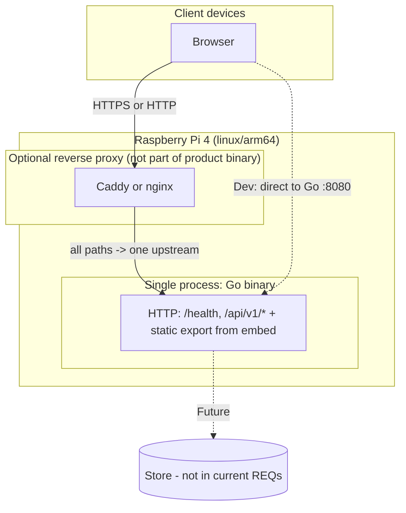
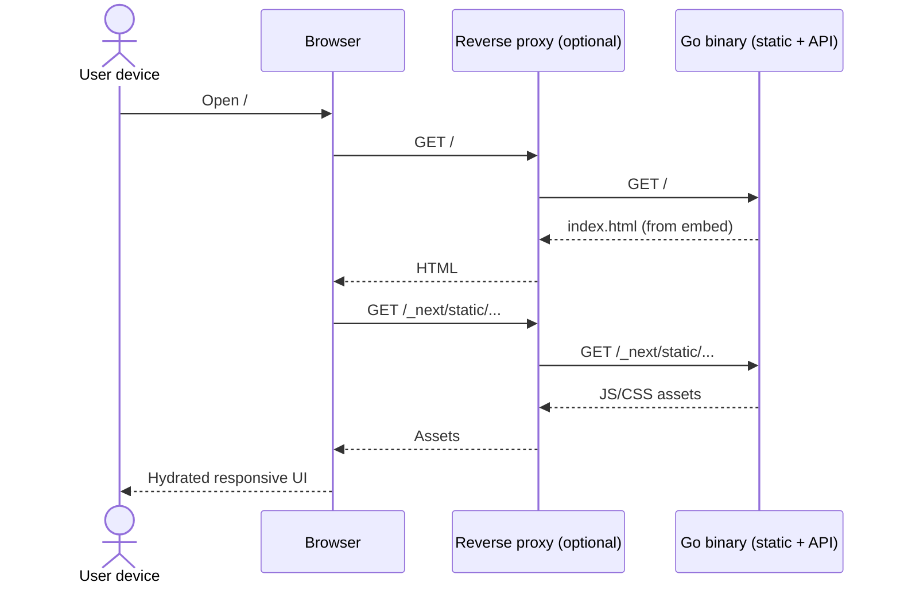
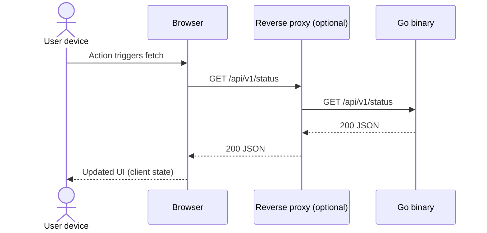

# Architecture

This document defines technical structure and deployment for the product described in `docs/requirements.md` (**REQ-001–REQ-004**). It satisfies **REQ-001** (Go + Next.js + Tailwind, coordinated as defined here), **REQ-002** (responsive, client-interactive UI), **REQ-003** (Raspberry Pi 4 Model B, **ARM64**, resource awareness), and **REQ-004** (**one runnable executable** per release target; **no** mandatory Docker/OCI/compose packaging at this stage).

## Architectural resolution: REQ-004 (single binary) vs Next.js

**Decision:** **Full Next.js SSR/Node at runtime is out of scope** for the shipped product. The open item in REQ-004 is resolved as follows:

- **Next.js + App Router + Tailwind** remain the **authoring** stack under `web/` (toolchain, components, styling).
- **Runtime** on the Pi is a **single Go process** that:
  - Serves the **JSON API** (`/health`, `/api/v1/...`).
  - Serves the UI as **static assets** produced by **`next build` with `output: 'export'`** (static HTML, JS, CSS), **embedded** in the binary via Go **`embed`**, or **baked in at link time** from a generated filesystem tree.
- **REQ-002 (reactive UI):** Achieved with **client-side React** (hydration and **`"use client"`** components) and browser **`fetch`** to **same-origin** `/api/v1/...` on the Go listener. **No** React Server Components that require a Node runtime at request time; any **async server-only** data patterns used during development MUST be replaced or duplicated with **client** fetches or **build-time** data before release.

This meets REQ-004 rule 1 (**no separate Node.js runtime** in the distribution) and aligns with Pi RAM constraints (**§6**).

---

## 1. Goals and constraints

| Requirement | Architectural response |
|-------------|-------------------------|
| REQ-001 | **Go** binary serves **HTTP API** + **embedded static UI** built from **Next.js + Tailwind** source in `web/`. |
| REQ-002 | **Mobile-first** Tailwind, **Client Components** for interactivity; **`fetch('/api/v1/…')`** from the browser to the same Go origin. |
| REQ-003 | Primary release target **linux/arm64** (Pi 4B, 64-bit OS); document **CPU/RAM**; **one** long-lived app process. |
| REQ-004 | **One executable file** per release target; assets **embedded** (or generated inside the process); **Docker/compose not** the canonical install path. |

**Assumed Pi context:** Raspberry Pi 4 Model B, **64-bit OS**, **ARM64** userspace. **2–8 GB RAM** — with **no Node** at runtime, **4 GB** is practical for modest traffic; **off-device** `next export` builds recommended.

**Canonical production listener:** Single Go process on **one TCP address** (e.g. **`:8080`** or behind an **optional** reverse proxy on **`:80`/`443`** that forwards **all** paths to that one upstream). **No** second application process from the product distribution.

**Dev vs prod:** Local development **may** still run **`next dev`** alongside **`go run`** for fast iteration; that **two-process** pattern is **not** part of the **shipped** artifact (REQ-004).

---

## 2. Repository layout

Monorepo (single Git root), **one Go module** under `backend/`, **no `go.work`** unless later expanded.

```
dlm/
  backend/
    cmd/
      server/                 # main() — single binary entry
    internal/
      config/
      httpapi/                # API mux + middleware + JSON handlers
      webdist/                # holds embedded payload (see §3.5); populated by build, not hand-edited
        placeholder.txt       # optional tiny file so empty embed works in dev before first UI build
    web/                      # symlink or copy strategy avoided — UI source stays ../web from repo root
  web/                        # Next.js + Tailwind (source only for runtime)
    app/
    components/
    lib/
  docs/
```

**Boundaries:**

- **`backend/` MUST NOT import** TypeScript sources from `web/` — only **built static files** under `internal/webdist/` (or equivalent) prepared by the **build pipeline**.
- **`web/` MUST NOT** import Go.
- **Public HTTP contract:** **`GET /health`**, **`/api/v1/*`** JSON API; **static paths** for UI (`/`, `/_next/...`, assets) from embedded FS.

---

## 3. Golang service (runtime)

### 3.1 Module and packages

- **Module path:** `example.com/dlm/backend` (or successor); unchanged conceptually.
- **`cmd/server`:** Load config; construct **`http.Server`**; mount **API sub-router** and **static file server** from **`embed`**; graceful **SIGINT/SIGTERM** shutdown.
- **`internal/config`:** **Env-based** listen address, timeouts, optional **CORS** (primarily for **dev** when UI dev server uses another origin); production **same-origin** reduces CORS.
- **`internal/httpapi`:** Middleware (**request ID**, **slog**, **recover**, optional **CORS**); **JSON** handlers and error envelope `{ "error": { "code", "message" } }`.

### 3.2 HTTP surface

| Kind | Path | Purpose |
|------|------|--------|
| API | `GET /health` | Liveness; **no auth**. |
| API | `/api/v1/*` | Versioned **JSON API**. |
| Static | `/`, `/*.html`, **`/_next/**`**, other export assets | **Next static export** tree from embed; **SPA / HTML5** fallback policy: serve **`index.html`** for unmatched **non-API** GET if needed (implementor defines exact fallback rules). |

**Ordering:** Register **API** routes **before** static/`NotFound` handling so `/api/v1` is never swallowed by UI fallback.

### 3.3 Persistence

Reserved **`internal/store`** only; no DB in current REQs.

### 3.4 Build and cross-compile (release artifact)

- **Release binary (Pi):** After the **web static bundle** is copied into **`internal/webdist/`** (or embed path the implementor chooses):

  `GOOS=linux GOARCH=arm64 go build -o bin/dlm-arm64 ./cmd/server`

- **Single file:** The **only** shipped application binary is **`dlm-arm64`** (name per project convention). **systemd** may wrap it with **`ExecStart=/usr/local/bin/dlm`** etc.; that is allowed per REQ-004.

### 3.5 Embedding static UI

- **Mechanism:** `//go:embed` on a package (e.g. **`internal/webdist`**), embedding the **full** `out/` tree from **`next export`** (path names preserved: **`_next/static/...`**).
- **Build contract:** A **documented** step (**Make**, `task`, or **CI** script) runs **`npm ci && npm run build`** in `web/` (with **`output: 'export'`**), then **syncs** `web/out/` → `backend/internal/webdist/` (or `backend/web/build/`).
- **`embed` empty-dir issue:** Repository may keep a **small placeholder** file under `webdist/` so **`go test ./...`** works **before** the first UI bake; release builds **replace** the directory contents with the real export.

---

## 4. Next.js + Tailwind (build-time / authoring)

### 4.1 Stack

- **Next.js App Router** under `web/app/` for structure and layouts.
- **Tailwind** + **TypeScript** as today.
- **`next.config`:** **`output: 'export'`** (static HTML export). **`images`:** use **`unoptimized: true`** or avoid `next/image` features incompatible with export.

### 4.2 Runtime-incompatible patterns (must not ship)

- **`next start`**, **standalone** Node output, **SSR** dependencies, **Route Handlers** or **middleware** that must execute on Node for **navigations**, **rewrites** to a separate upstream for **HTML**.
- **Server Components** that **fetch at request time** without a static **generateStaticParams** strategy — for MVP, prefer **client `fetch`** to **`/api/v1/...`**.

### 4.3 Data access patterns (shipped UI)

| Pattern | Use |
|--------|-----|
| **Client `fetch('/api/v1/...')`** | Primary pattern for reactive UI (**REQ-002**) against **same Go origin**. |
| **Build-time static** | `generateStaticParams` / SSG **only** if values are fixed at build; API must still be available at runtime for live data where needed. |

### 4.4 Environment

- **Runtime** UI has **no** `process.env.NEXT_PUBLIC_*` server injection from Node; **build-time** env may set **`NEXT_PUBLIC_API_BASE`** to **`''`** (same origin) so client code calls relative URLs.

### 4.5 Responsive behavior (**REQ-002**)

Unchanged intent: **Tailwind breakpoints**, **touch targets**, **`"use client"`** for interactivity.

---

## 5. UI ↔ API coordination (single process)

**Production:**

1. User opens **`https://host/`** (or `http://host:8080/`).
2. **Go** serves **`index.html`** and **JS/CSS** from embed.
3. React hydrates; components call **`fetch('/api/v1/status')`** (relative) → **same Go server**.
4. Optional **Caddy/nginx** terminates TLS and proxies **everything** to **one** Go port.

**No** path-based split between Node and Go inside the product.

**Development (non-shipping):** Engineers may use **`next dev`** with **proxy** to Go API or **dual ports** + CORS; **document** in `README` as dev-only.

---

## 6. Raspberry Pi 4 Model B deployment

### 6.1 ARM64 and resources

- **Target:** **linux/arm64** executable.
- **RAM:** **Single Go** process + embedded static assets — significantly lower than **Go + Node**; **2–4 GB** can suffice for light use; **4 GB+** recommended headroom.
- **CPU:** **No SSR** on device; Go serves files and JSON — suitable for Pi **4**.

### 6.2 Process model

- **One** `systemd` service — the **application binary** only.
- **Optional** separate **`caddy.service`** or **`nginx`** is **OS/infrastructure**, not part of REQ-004’s single binary (the **product** remains one file).

### 6.3 Distribution (**REQ-004** / anti-Docker)

- **Canonical install:** copy **one binary** + optional **unit file**; **not** Docker-first.
- **Docs** (`README`, this file) MUST describe **binary + systemd** path; **do not** require **Dockerfile** or **compose** for production.

### 6.4 Networking

- Go binds **`:8080`** (or configured); reverse proxy maps **80/443** → that socket.

---

## 7. System boundaries (flowchart)



---

## 8. Request flows (sequence diagrams)

### 8.1 Initial page load (static + hydration)



### 8.2 Client calls JSON API (same origin)



---

## 9. Security notes (baseline)

- Prefer **same-origin** in production to minimize **CORS** surface.
- **Secrets** via env only; **no** secrets baked into client bundles beyond **public** constants.
- **No** mandatory **container** trust boundary from the product’s perspective (REQ-004).

---

## 10. Traceability to requirements

| REQ | Addressed in sections |
|-----|------------------------|
| REQ-001 | §1–§5, §7–§8 |
| REQ-002 | §1, §4, §5, §8 |
| REQ-003 | §1, §3.4, §6, §7 |
| REQ-004 | §1 (resolution), §3.4–§3.5, §4.1–§4.2, §5–§6 |

---

**Next step:** Invoke the **`@verifier`** agent to confirm the implementation matches this document, run **`go test ./...`** and **`npm run release:sync`** + **`go build`** as needed, then update **`docs/traceability_matrix.md`**.
