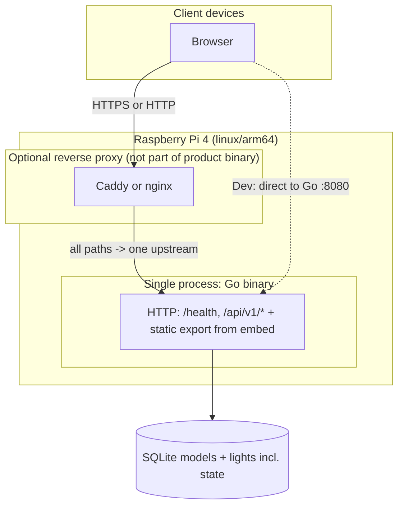
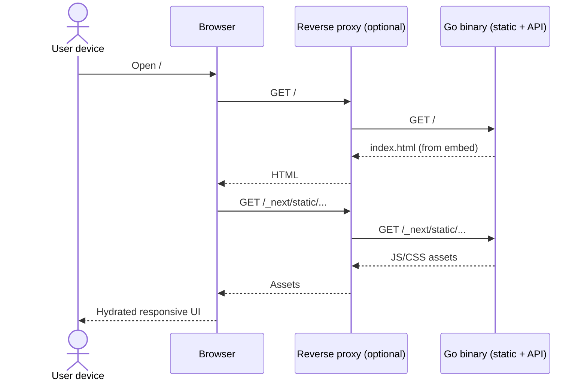
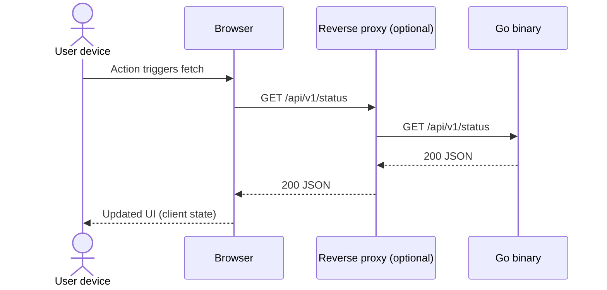
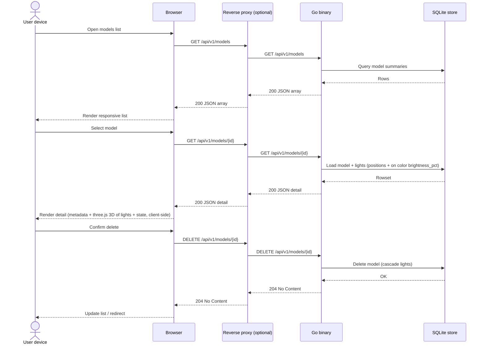
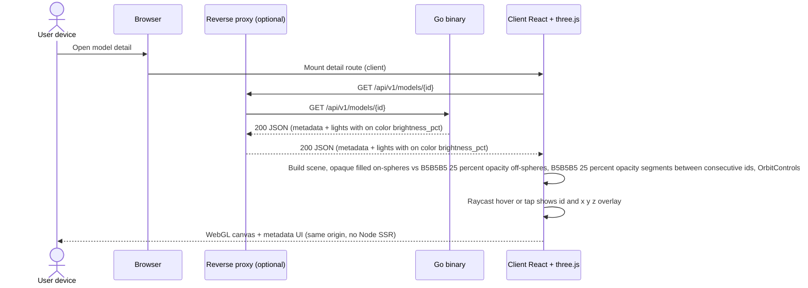
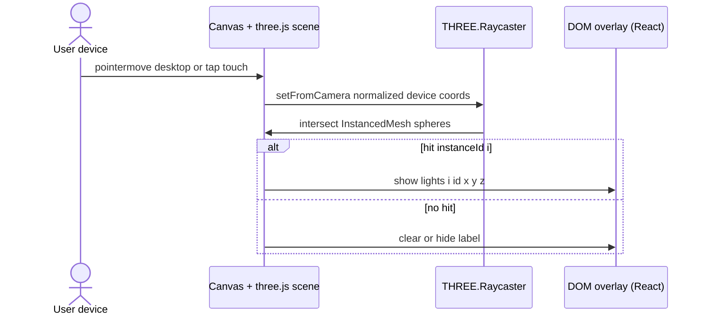
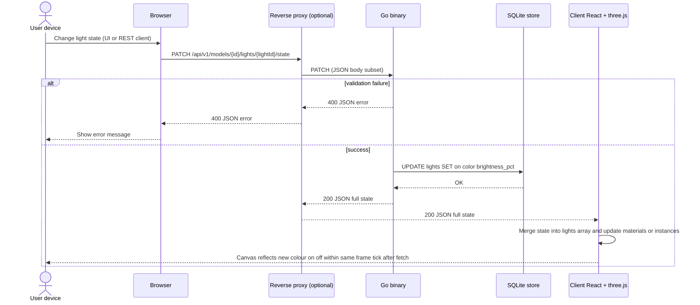

# Architecture

This document defines technical structure and deployment for the product described in `docs/requirements.md` (**REQ-001–REQ-014**). It satisfies **REQ-001** (Go + Next.js + Tailwind), **REQ-002** (responsive, client-interactive UI), **REQ-003** (Raspberry Pi 4 Model B, **ARM64**, resource awareness), **REQ-004** (**one runnable executable** per release target; **no** mandatory Docker/OCI/compose packaging at this stage), **REQ-005** (wire light **chain** model: **CSV** interchange, **metadata**, **at most two** logical neighbors per light by **consecutive id**—**endpoints** have **one**), **REQ-006** (list / view / delete / create via CSV upload), **REQ-007** (server-side CSV validation and actionable errors), **REQ-008** (single command to build UI and run the Go server locally), **REQ-009** (default **sphere**, **cube**, **cone** samples: lights on **exterior** nominal surfaces with **even** coverage of **face planes** (**cube**) and **surface area** (**sphere** / **cone**), **not** **edge-only** or **single-curve-only** layouts; consecutive spacing **0.05–0.10 m**; **500–1000** lights each; **≤ 0.03 m** surface deviation; **~2 m** characteristic size), **REQ-010** (**three.js** **3D** view on **model detail**: **every** light as **2 cm** sphere; **all** lights drawn for **n ≤ 1000**; **wire** segments **only** between **consecutive** **ids**; segments **`#B5B5B5`** at **75% transparency** (**25% opacity**), **subtler** than spheres; **hover** / **touch** disclosure of **id** and **coordinates**), **REQ-011** (**REST** **read/write** of per-light **on/off**, **hex** **#RRGGBB** colour, **brightness** **0–100%**, persisted in **SQLite**), **REQ-012** (**3D** **spheres** reflect state: **on** = **opaque** **filled** **colour** × **brightness**; **off** = **`#B5B5B5`** at **75% transparency** matching segments; **timely** UI sync after **writes**), **REQ-013** (**model detail**: **paginated** light **list** with **page-size** control and **go to id**; **multi-select** and **bulk apply** via **batch** **PATCH**), and **REQ-014** (**default** all lights **off**, **`#FFFFFF`**, **100%** brightness on create/seed; **reset** control + **authoritative** API to restore that state for **all** lights in **one** action).

## Architectural resolution: REQ-004 (single binary) vs Next.js

**Decision:** **Full Next.js SSR/Node at runtime is out of scope** for the shipped product. The open item in REQ-004 is resolved as follows:

- **Next.js + App Router + Tailwind** remain the **authoring** stack under `web/` (toolchain, components, styling).
- **Runtime** on the Pi is a **single Go process** that:
  - Serves the **JSON API** (`/health`, `/api/v1/...`).
  - Serves the UI as **static assets** produced by **`next build` with `output: 'export'`** (static HTML, JS, CSS), **embedded** in the binary via Go **`embed`**, or **baked in at link time** from a generated filesystem tree.
- **REQ-002 (reactive UI):** Achieved with **client-side React** (hydration and **`"use client"`** components) and browser **`fetch`** to **same-origin** `/api/v1/...` on the Go listener. **No** React Server Components that require a Node runtime at request time; any **async server-only** data patterns used during development MUST be replaced or duplicated with **client** fetches or **build-time** data before release.

This meets REQ-004 rule 1 (**no separate Node.js runtime** in the distribution) and aligns with Pi RAM constraints (**§6**).

---

## 1. Goals and constraints

| Requirement | Architectural response |
|-------------|-------------------------|
| REQ-001 | **Go** binary serves **HTTP API** + **embedded static UI** built from **Next.js + Tailwind** source in `web/`. |
| REQ-002 | **Mobile-first** Tailwind, **Client Components** for interactivity; **`fetch('/api/v1/…')`** from the browser to the same Go origin. |
| REQ-003 | Primary release target **linux/arm64** (Pi 4B, 64-bit OS); document **CPU/RAM**; **one** long-lived app process. |
| REQ-004 | **One executable file** per release target; assets **embedded** (or generated inside the process); **Docker/compose not** the canonical install path. |
| REQ-005 | **Domain types** + **CSV** contract; **ordered chain** adjacency (**id** **i** ↔ **i±1** only); **metadata** (**name**, **creation instant**) stored with each model; coordinates as **float64** in Go/API JSON. |
| REQ-006 | **REST JSON API** for models + **Next.js** client pages (list, detail, upload, delete); **multipart** upload for CSV. |
| REQ-007 | **Authoritative validation** in Go when ingesting CSV; **transactional** create (all-or-nothing); **400** responses with clear **error** envelope. |
| REQ-008 | **`scripts/run.sh`** (or documented equivalent) from repo root: **`npm run release:sync`** in `web/` then **`go run ./cmd/server`** in `backend/`; **README** documents exact invocation (**§3.7**). |
| REQ-009 | **`internal/samples`** builds three **ordered** light paths on each solid’s boundary (**500 ≤ n ≤ 1000**, **0.05–0.10 m** consecutive chords, **§3.8**) with **even** placement on **faces** / **surfaces** per **§3.8**; **`store.SeedDefaultSamples`** when **`models`** empty (**§3.8**). |
| REQ-010 | **`three`** direct; **client-only** detail: **InstancedMesh** (or equivalent **§4.7**) **ø 0.02 m** markers for **all n** lights (**no** LOD/decimation); **`LineSegments`** **i↔i+1** only (**chain**); segment colour **`#B5B5B5`**, **opacity 0.25** (**75%** transparent), thinner/subtler than spheres; **`Raycaster`** + **DOM** tooltip (**§4.7**). |
| REQ-011 | **REST** **`/api/v1/models/{id}/lights/...`** for **bulk** + **per-id** **state** **read** and **`PATCH`** **per** **light**; **validation** and **defaults** in **Go** (**§3.2**, **§3.3**, **§3.9**). |
| REQ-012 | **three.js** **materials**: **on** = **opaque** **fill** **colour** × **brightness**; **off** = **`#B5B5B5`**, **opacity 0.25** (match **REQ-010** segments); **client** merges **API** state; **no** indefinite staleness after **writes** (**§4.7**, **§8.7**). |
| REQ-013 | **Model detail** **light table**: **client-side** **pagination** over **`GET` detail** payload; **page size** presets **25 / 50 / 100** (default **50**); **go to id** computes target page + **inline validation**; **checkbox** multi-select with **optional** **Shift+click** range on **current page**; **selection** **retained** across pages in **React state** (**`Set<number>`**) until **clear** or **navigate away**; **bulk apply** calls **`PATCH …/lights/state/batch`** (**§3.10**); **list** and **three.js** updated from **response** (**§4.8**, **§8.8**). |
| REQ-014 | **Insert defaults** **on=false**, **`color="#ffffff"`**, **`brightness_pct=100`** (**§3.9**); **`POST …/lights/state/reset`** (**§3.11**); **model detail** **Reset** button (non–hover-only) calls reset then merges **`states`** into **UI** + **§4.7** (**§4.6**, **§8.9**). |

**Assumed Pi context:** Raspberry Pi 4 Model B, **64-bit OS**, **ARM64** userspace. **2–8 GB RAM** — with **no Node** at runtime, **4 GB** is practical for modest traffic; **off-device** `next export` builds recommended.

**Canonical production listener:** Single Go process on **one TCP address** (e.g. **`:8080`** or behind an **optional** reverse proxy on **`:80`/`443`** that forwards **all** paths to that one upstream). **No** second application process from the product distribution.

**Dev vs prod:** Local development **may** still run **`next dev`** alongside **`go run`** for fast iteration; that **two-process** pattern is **not** part of the **shipped** artifact (REQ-004).

---

## 2. Repository layout

Monorepo (single Git root), **one Go module** under `backend/`, **no `go.work`** unless later expanded.

```
dlm/
  scripts/
    run.sh                    # REQ-008: release:sync + go run server (repo root relative paths)
  backend/
    cmd/
      server/                 # main() — single binary entry; calls seed-if-empty (REQ-009)
    internal/
      config/
      httpapi/                # API mux + middleware + JSON handlers (incl. models HTTP)
      wiremodel/              # domain types, CSV parse + validation (REQ-005/007)
      samples/                # deterministic boundary sampling + id order: sphere, cube, cone (REQ-009 §3.8)
      store/                  # persistence for models (SQLite, REQ-006); SeedDefaultSamples (REQ-009)
      webdist/                # holds embedded payload (see §3.5); populated by build, not hand-edited
        placeholder.txt       # optional tiny file so empty embed works in dev before first UI build
  web/                        # Next.js + Tailwind (source only for runtime; sibling of backend/)
    app/
    components/
    lib/
  docs/
```

**Boundaries:**

- **`backend/` MUST NOT import** TypeScript sources from `web/` — only **built static files** under `internal/webdist/` (or equivalent) prepared by the **build pipeline**.
- **`web/` MUST NOT** import Go.
- **Public HTTP contract:** **`GET /health`**, **`/api/v1/*`** JSON API; **static paths** for UI (`/`, `/_next/...`, assets) from embedded FS.

---

## 3. Golang service (runtime)

### 3.1 Module and packages

- **Module path:** `example.com/dlm/backend` (or successor); unchanged conceptually.
- **`cmd/server`:** Load config; construct **`http.Server`**; mount **API sub-router** and **static file server** from **`embed`**; graceful **SIGINT/SIGTERM** shutdown.
- **`internal/config`:** **Env-based** listen address, timeouts, optional **CORS** (primarily for **dev** when UI dev server uses another origin); production **same-origin** reduces CORS; **SQLite** path via **`DLM_DB_PATH`** and/or **`DLM_DATA_DIR`** (**§3.3**).
- **`internal/httpapi`:** Middleware (**request ID**, **slog**, **recover**, optional **CORS**); **JSON** handlers and error envelope `{ "error": { "code", "message" } }`; **models** and **light-state** routes (including **batch** **PATCH** per **§3.10**) delegate to **`internal/store`** and **`internal/wiremodel`**.
- **`internal/wiremodel`:** Parses and validates uploaded **CSV** per **§3.6**; returns structured errors for HTTP **400** responses (**REQ-007**).
- **`internal/store`:** **SQLite** repository (see **§3.3**); opened at process start; migrations or `CREATE IF NOT EXISTS` for schema (**REQ-006**); **idempotent default seed** when no models exist (**§3.8**, **REQ-009**).
- **`internal/samples`:** Pure functions that return **`[]wiremodel.Light`** (sequential **id**s from **0**) for the three canonical shapes: **on-surface** positions, **even** coverage per **§3.8**, consecutive **dᵢ** in band; no I/O (**REQ-009**).

### 3.2 HTTP surface

| Kind | Path | Purpose |
|------|------|--------|
| API | `GET /health` | Liveness; **no auth**. |
| API | `GET /api/v1/models` | List models (**metadata** + **light_count**). **REQ-006** |
| API | `POST /api/v1/models` | Create model: **`multipart/form-data`** with **`name`** (string) + **`file`** (CSV). **REQ-006/007** |
| API | `GET /api/v1/models/{id}` | Model **metadata** + ordered **lights** `{ id, x, y, z, on, color, brightness_pct }[]` (**§3.9**). **REQ-006**, **REQ-011** |
| API | `DELETE /api/v1/models/{id}` | Delete model (**204** / **404**). **REQ-006** |
| API | `GET /api/v1/models/{id}/lights/state` | **All** lights’ **state** for the model (**ordered** by **`id`**). **REQ-011** |
| API | `GET /api/v1/models/{id}/lights/{lightId}/state` | **One** light’s **state** (**404** if model or **lightId** missing). **REQ-011** |
| API | `PATCH /api/v1/models/{id}/lights/{lightId}/state` | **Partial** update of **`on`**, **`color`**, **`brightness_pct`** (JSON body; omitted fields unchanged). **200** returns the **full** **updated** **state** object. **REQ-011** |
| API | `PATCH /api/v1/models/{id}/lights/state/batch` | **Atomic** partial update of **many** lights: JSON body **`{ "ids": [<int>, …], "on"?, "color"?, "brightness_pct"? }`** with **at least one** of **`on`**, **`color`**, **`brightness_pct`** present; **omitted** fields **unchanged** per row. **200** returns **`{ "states": [ { "id", "on", "color", "brightness_pct" }, … ] }`** sorted by **`id`**. **400** if **`ids`** empty, duplicate ids, any id **∉ [0, n−1]**, or merged values invalid. **REQ-013** (**§3.10**). |
| API | `POST /api/v1/models/{id}/lights/state/reset` | **REQ-014:** **no** body (or empty **JSON** object). **One** **transaction** sets **every** light in the model to **`on=false`**, **`color="#ffffff"`**, **`brightness_pct=100`**. **200** returns **`{ "states": [ … ] }`** for **all** **n** lights, **`id`** ascending. **404** if model missing. |
| API | `/api/v1/*` | Other versioned **JSON** endpoints as the product grows. |
| Static | `/`, `/*.html`, **`/_next/**`**, other export assets | **Next static export** tree from embed; **SPA / HTML5** fallback policy: serve **`index.html`** for unmatched **non-API** GET if needed (implementor defines exact fallback rules). |

**Ordering:** Register **API** routes **before** static/`NotFound` handling so `/api/v1` is never swallowed by UI fallback.

### 3.3 Persistence (**REQ-006**)

- **Engine:** **SQLite** accessed from the **same Go process** (prefer a **pure Go** driver such as **`modernc.org/sqlite`** to avoid **cgo** cross-compile friction on **linux/arm64**).
- **Location:** Configurable path via environment (e.g. **`DLM_DB_PATH`**), defaulting to a file under an application **data directory** (e.g. **`DLM_DATA_DIR`** + `dlm.db`). The DB file is **runtime state**, not embedded in the binary; creating/opening it at startup satisfies **REQ-004** (no extra shipped daemon).
- **Schema (logical):**
  - **`models`:** `id` (TEXT UUID primary key), `name` (TEXT **NOT NULL**, **UNIQUE**), `created_at` (TEXT **RFC3339 UTC**).
  - **`lights`:** `model_id` (TEXT FK → `models.id`), `idx` (INTEGER light index), `x`, `y`, `z` (REAL), **`on`** (INTEGER **NOT NULL**, **0** = off / **1** = on), **`color`** (TEXT **NOT NULL**, canonical **`#RRGGBB`**), **`brightness_pct`** (REAL **NOT NULL**, **0..100** inclusive), primary key **`(model_id, idx)`**.
- **Transactions:** **`POST /api/v1/models`** MUST parse+validate CSV, then insert **`models`** + all **`lights`** in **one transaction**; each new **`lights`** row MUST receive **default** **`on`**, **`color`**, **`brightness_pct`** per **§3.9** (**REQ-014**); rollback on any validation failure so **no partial model** is stored (**REQ-007**).
- **Migrations:** Implementor MAY use a minimal migration hook or `CREATE TABLE IF NOT EXISTS` at startup; document schema version if evolved.

**Architectural resolutions (requirements open questions):**

- **Model name uniqueness:** **UNIQUE** on `models.name` so the list UI stays unambiguous; duplicate names return **409** with a clear message (product may relax later if requirements change).
- **Creation date:** Set by the **server** at successful create time, stored and exposed as **UTC RFC3339** (no client clock trust).
- **Upload naming:** **`name`** is a **required** multipart field (non-empty after trim); **not** inferred from filename alone.
- **Empty model:** **Allowed**: CSV may contain **only** the header row (**0** lights); still creates a model row with **light_count = 0**.

### 3.4 Build and cross-compile (release artifact)

- **Release binary (Pi):** After the **web static bundle** is copied into **`internal/webdist/`** (or embed path the implementor chooses):

  `GOOS=linux GOARCH=arm64 go build -o bin/dlm-arm64 ./cmd/server`

- **Single file:** The **only** shipped application binary is **`dlm-arm64`** (name per project convention). **systemd** may wrap it with **`ExecStart=/usr/local/bin/dlm`** etc.; that is allowed per REQ-004.

### 3.5 Embedding static UI

- **Mechanism:** `//go:embed` on a package (e.g. **`internal/webdist`**), embedding the **full** `out/` tree from **`next export`** (path names preserved: **`_next/static/...`**).
- **Build contract:** A **documented** step (**Make**, `task`, or **CI** script) runs **`npm ci && npm run build`** in `web/` (with **`output: 'export'`**), then **syncs** `web/out/` → `backend/internal/webdist/` (or `backend/web/build/`).
- **`embed` empty-dir issue:** Repository may keep a **small placeholder** file under `webdist/` so **`go test ./...`** works **before** the first UI bake; release builds **replace** the directory contents with the real export.

### 3.6 CSV interchange and validation (**REQ-005**, **REQ-007**)

- **Encoding:** **UTF-8** text; parse with Go **`encoding/csv`**.
- **Delimiter:** Comma (`,`). **RFC 4180** quoting rules SHOULD be supported so numeric fields may be quoted.
- **Header row:** **Required** first record; must be **exactly** the four fields **`id`**, **`x`**, **`y`**, **`z`** in that order (case-sensitive, no extra columns). Wrong or missing header → **400** with **format** error (matches acceptance scenario for `idx,x,y,z`).
- **Data rows:** Each row provides one light; **`id`** must parse as an integer; **`x`**, **`y`**, **`z`** must parse as **finite** floating-point numbers (reject **NaN** / **Inf**).
- **Row count:** After the header, **0 ≤ n ≤ 1000** data rows; **n > 1000** → **400** referencing the cap.
- **Id sequence:** Let **n** be the number of data rows. Sorting rows by **`id`**, the multiset of ids MUST equal **`{0,1,…,n−1}`** exactly once each (contiguous from **0**, no gaps, no duplicates). Implementor MAY require rows to appear sorted by **`id`** ascending for simpler validation, or accept any order and validate the set—behavior MUST match tests derived from **`docs/acceptance_criteria.md`**.
- **Authoritative checks:** All rules above are enforced **in Go** on upload; the UI MAY add client-side hints but MUST NOT trust them for security or integrity.

**Chain topology (REQ-005 rule 6):** The **CSV** does **not** encode edges explicitly; **logical** adjacency is **only** **(i, i+1)** for **i = 0 … n−2**. **Visualization** and **any** future features MUST **not** introduce **extra** adjacencies between **non-consecutive** **ids**.

**JSON API shapes (illustrative):**

- **List item:** `{ "id": "<uuid>", "name": "…", "created_at": "<RFC3339>", "light_count": <int> }`
- **Detail:** same metadata plus `"lights": [ { "id": 0, "x": 0, "y": 0, "z": 0, "on": true, "color": "#RRGGBB", "brightness_pct": 100 }, … ]` ordered by **`id`** ascending (**§3.9**).

**HTTP errors:** Use existing **`{ "error": { "code", "message" } }`** envelope; optional **`details`** field for row/column hints (**REQ-007**). **409 Conflict** for duplicate **`name`**.

### 3.7 Local build-and-run script (**REQ-008**)

- **Canonical path:** **`scripts/run.sh`** at the **repository root**, executable (`chmod +x`), **`#!/usr/bin/env bash`** with **`set -euo pipefail`** (or equivalent strictness).
- **Behavior (single invocation):**
  1. Resolve repo root (e.g. `ROOT="$(cd "$(dirname "$0")/.." && pwd)"`).
  2. Under **`cwd = $ROOT/web`**: run **`npm ci`** when **`node_modules`** is missing or **`DLM_FORCE_NPM_CI=1`**; skip **`npm ci`** when **`DLM_SKIP_NPM_CI=1`** or when **`node_modules`** already exists (see **README** for trade-offs). Then **`npm run release:sync`** so **`web/out/`** is copied to **`backend/internal/webdist/dist/`**.
  3. Run **`go run ./cmd/server`** with **`cwd = $ROOT/backend`** (or **`go build -o … && exec ./dlm`** if preferred—document in **README**). Use **`exec`** for the final Go process so **SIGINT** reaches the server.
- **Prerequisites:** **Node.js** + **npm** on **PATH**, **Go** on **PATH**; network for **`npm ci`** on cold clone or when forcing a clean install.
- **README.md** MUST show the exact line, e.g. **`./scripts/run.sh`** or **`bash scripts/run.sh`**, and note **WSL / Git Bash** on Windows if applicable.
- **AGENTS.md** already references **REQ-008**; keep **README** and this section aligned when the script changes.
- **Not** a substitute for **Pi** production install (still **one binary** + optional **systemd**); operators may build off-device and copy **`dlm-arm64`** per **§3.4**.

### 3.8 Default sample models (**REQ-009**)

**Units:** **SI meters**. Each sample returns **`[]wiremodel.Light`** with sequential **`id` 0 … n−1** (this order is the **polyline** order for **REQ-010** segment drawing).

**Counts:** Each of the three samples MUST have **500 ≤ n ≤ 1000** vertices (**REQ-009** / **REQ-005**). Choose a **deterministic** **n** per shape (fixed constant or derived from a reproducible rule) so tests and seeds are stable.

**Consecutive spacing:** For every **i ∈ {0,…,n−2}**, let **dᵢ** be the Euclidean distance between light **i** and **i+1**. Require **0.05 ≤ dᵢ ≤ 0.10** (5–10 cm). Tests SHOULD use a small tolerance (e.g. **`1e-3`** m) on the bounds to absorb floating-point error; document the chosen **ε**.

**Surface placement (nominal solids, centered/aligned as today):**

- **Nominal boundary:** Analytic surface of the intended **sphere** (**radius R = 1.0** m, diameter **2 m**, center **origin**), **axis-aligned cube** (**edge 2** m, center **origin**, faces at **±1** m), or **right circular cone** (**height 2** m, base radius **1** m, base in **z = 0** plane, apex at **(0,0,2)** — or equivalent consistent pose documented in code).
- **Exterior only:** Each vertex MUST lie **on** the nominal boundary **or** in the **thin outer shell** allowed by requirements: **closest** distance from the point to the **nominal surface** MUST be **≤ 0.03** m, and the point MUST **not** lie in the **interior** of the solid (e.g. sphere: **‖p‖ ≥ R − δ** with **δ** tiny for float; cube: not strictly inside the **2×2×2** volume; cone: on or outside the **lateral surface + base disk** region as defined by implementor’s half-space test).

**Coverage intent (REQ-009 “not edge-only”):**

- **Cube:** Lights MUST be placed on **all six** exterior **square face planes**. A **wireframe** layout (vertices and **edges only**) is **not** sufficient. The **majority** of lights MUST lie in the **interior** of each face’s square (parameterized patch), not only on **edges** or **corners**—architecture sets a **quota**: at least **⌊0.85 n⌋** lights MUST lie **strictly** in the **open** face patches (each coordinate on a face is **inside** the **(−1,1)²** parameter rectangle for that face, i.e. not on the **rim** of the square in face-local **(u,v)**). The remaining lights MAY be used for **transitions** between faces or to satisfy **dᵢ** if needed. **Evenness (cube):** Partition **n** across the six faces with counts differing by **at most one** (e.g. base **q = ⌊n/6⌋**, **r = n mod 6** faces get **q+1** lights). On each face, place that many points on a **deterministic quasi-uniform 2D pattern** in **(u,v)** (e.g. **regular staggered grid**, **2D Halton** pairs, or **boustrophedon** rows) so **area** coverage is **even** within the face; document the chosen pattern in code comments.
- **Sphere:** Lights MUST lie on **‖p‖ = R** and MUST **not** read as **concentrated on a single narrow strip** or **one 1D curve** only. **Evenness (sphere):** Use a **point set** known for **approximate equal area** per point on the sphere (e.g. **Fibonacci / golden-angle** lattice, **HEALPix-style** construction, or **subdivided icosahedron** vertices). After placement, **order** into the final polyline (below) so **REQ-010** still shows a connected path; the **underlying** set MUST pass tests that **no** hemisphere (or other fixed **cap** of bounded area) contains more than a **documented fraction** of lights (e.g. **≤ 55%** of **n** in any closed hemisphere through the center)—implementor picks caps and thresholds to match acceptance tests.
- **Cone:** Lights MUST cover **both** the **lateral** (curved) surface **and** the **flat base disk** (**z = 0**, **ρ ≤ r**). **Evenness (cone):** Split **n** between **lateral** and **base** in proportion to **surface areas** (lateral **π r ℓ**, base **π r²** with slant height **ℓ**), rounding with a **deterministic rule** so the two counts sum to **n**. On the lateral patch, use a **(height, azimuth)** quasi-uniform grid or spiral; on the base, use a **polar** or **2D** quasi-uniform pattern in the **disk**. Same **≥ 85%** rule as the cube applies **within each part**: at least **⌊0.85 n_lat⌋** lateral lights MUST lie in the **interior** of the lateral patch (not only on the **rim** or **apex**), and at least **⌊0.85 n_base⌋** base lights in the **interior** of the **disk** (**ρ** strictly between **0** and **r**), unless **n** for that part is too small—in which case document the **degenerate** exception in tests.

**Ordering vs spacing (two-step design):**

Requirements demand **both** **even** **2D/area** placement **and** **consecutive** **dᵢ** in **[0.05, 0.10]**. Architecturally, treat this as:

1. **Target positions:** Produce an **unordered** (or weakly ordered) multiset of **on-surface** points meeting **evenness** and **per-face/per-part quotas** above.
2. **Path construction:** Build a **single open polyline** **P₀,…,P_{n−1}** through **exactly** those points (or through **refined** points after **subdivision**) such that every **dᵢ** lies in the band. **Allowed techniques:** (a) generate points **along** a **space-filling** or **serpentine** path on the unfolded or parameterized surface so consecutive samples are naturally **~0.075 m** apart; (b) **sort** / **chain** with **greedy nearest-neighbor** from a **fixed seed** and then **split long edges** / **merge short jumps** by inserting or removing intermediates **on the same surface**; (c) **walk** face patches in a **fixed order** (cube) with **boustrophedon** rows at **~0.075 m** step, using **short** **surface** segments across **edges** only where needed. **Subdivide** any segment longer than **0.10 m** with collinear **on-surface** inserts; **avoid** interior shortcuts that leave the boundary.

**Spacing algorithm (implementor):** After the polyline exists, **verify** all **dᵢ**; adjust with **subdivision** or **local reordering** while **preserving** **evenness** tests. If **n** falls outside **[500,1000]**, **retune** step size or **pattern density** and regenerate—do **not** relax **dᵢ** or **surface** rules.

**Architectural resolutions (requirements open questions):**

- **Open vs closed path:** **Open polyline** is the default; **REQ-010** draws segments **(i, i+1)** only, so **no** automatic **(n−1,0)** unless requirements change.
- **User deletes samples:** **Seed only when `SELECT COUNT(*) FROM models` is 0** immediately after migrations on **process startup**. Deleting a subset does **not** re-seed during that run; if the user deletes **all** models, **next** process start seeds again.
- **Fixed English names:** **`Sample sphere`**, **`Sample cube`**, **`Sample cone`**.

**Per-shape summary (`internal/samples`):**

| Shape | Characteristic size | Coverage + ordering |
|-------|---------------------|---------------------|
| **Sphere** | **R = 1** m | **Area-even** point set on **‖p‖ = R**; **ordered** into a polyline with **dᵢ ∈ [0.05,0.10]**; **n ∈ [500,1000]**; **hemisphere / cap** tests to block **single-strip** dominance. |
| **Cube** | **Edge 2** m | **Six faces**, **~n/6** lights per face (±1); **interior** **(u,v)** patterns; **open polyline** visiting faces with **dᵢ** in band—**not** an **edge-only** walk. |
| **Cone** | **h = 2** m, **r = 1** m | **Area-split** between **lateral** and **base**; **quasi-uniform** on each; **open polyline** with **dᵢ** in band covering **both** parts. |

**Integration:**

- After **`store.Open`** + **`migrate`**, if **model count is 0**, **`store.SeedDefaultSamples(ctx)`** runs **one transaction** inserting three models and lights via **`samples.SphereLights()`**, **`samples.CubeLights()`**, **`samples.ConeLights()`**.
- Samples use the **same** persistence path as user CSV so **REQ-005** invariants hold; inserted **`lights`** rows MUST receive **default** **`on`**, **`color`**, **`brightness_pct`** per **§3.9**.

**Tests:** **`internal/samples`**: assert **500 ≤ n ≤ 1000**; **0.05 − ε ≤ dᵢ ≤ 0.10 + ε** for all consecutive pairs; **surface** predicates (distance-to-nominal-surface **≤ 0.03**, not interior) per shape; characteristic **~2 m** extent within documented tolerance; **cube**: each of the **six** faces has the expected **light count** (±**1** of **⌊n/6⌋** / **⌈n/6⌉**) and **≥ ⌊0.85 n⌋** lights in **open** face interiors; **sphere**: **cap / hemisphere** bound per **§3.8**; **cone**: **both** lateral and base receive lights per **area** split, with **interior** quotas analogous to the cube where **n** per part allows. Integration: fresh DB list shows **three** expected names.

### 3.9 Per-light state API and persistence (**REQ-011**, **REQ-012**)

**Canonical JSON field names (API):**

| Field | Type | Rules |
|-------|------|--------|
| **`on`** | boolean | **`true`** = lit appearance (**REQ-012** **opaque** **filled**); **`false`** = **off** (**REQ-012** **`#B5B5B5`** at **75%** transparency in **three.js**, **§4.7**). |
| **`color`** | string | **Exactly** **`#` + 6** **hex** digits **`[0-9A-Fa-f]`** (normalize to **lowercase** in responses if desired; accept any case on input). |
| **`brightness_pct`** | number | **IEEE-754** number **in** **[0, 100]**; semantics for **rendering** in **§4.7**; when **`on`** is **`false`**, stored value is **still** persisted but **does not** drive a **lit** appearance. |

**Default state (REQ-011 rule 6 + REQ-014):** On **insert** of each **`lights`** row (**CSV** create, **sample** seed, or **migration** backfill), set **`on = false`**, **`color = "#ffffff"`** (canonical lowercase in DB/API responses acceptable), **`brightness_pct = 100`**. This matches **REQ-014** (**all off**, **full white** stored, **100%** brightness for when the light is **turned on**).

**Legacy databases** that used **`on = true`** on insert SHOULD be **migrated** (or **reset** via **UI/API**) so **product** **behavior** matches **REQ-014**; **implementor** documents the **chosen** **path**.

**Endpoints (summary — see §3.2 table):**

- **`GET /api/v1/models/{id}/lights/state`** → **`{ "states": [ { "id": <int>, "on": <bool>, "color": "<hex>", "brightness_pct": <num> }, … ] }`** sorted by **`id`** ascending. **`id`** is the light index (**REQ-005**).
- **`GET /api/v1/models/{id}/lights/{lightId}/state`** → **`{ "id", "on", "color", "brightness_pct" }`** (**404** if unknown model or **`lightId`** not in **`[0, n−1]`**).
- **`PATCH /api/v1/models/{id}/lights/{lightId}/state`** with **`Content-Type: application/json`** body containing **any subset** of **`on`**, **`color`**, **`brightness_pct`**. Unspecified fields **remain unchanged**. **Validate** merged result: **`color`** format, **`brightness_pct`** in **[0, 100]**; reject with **400** and **`error.message`** on violation. **200** response body is the **full** **updated** state object (same shape as the single-light **GET**).

**Implementation notes:**

- **`internal/store`:** Implement **read**/**patch** against **`lights`** columns; **`PATCH`** SHOULD run in a **short** transaction (**BEGIN IMMEDIATE** optional) so concurrent updates stay consistent.
- **`GET /api/v1/models/{id}`** MUST embed **`on`**, **`color`**, **`brightness_pct`** on **each** element of **`lights`** so the **detail** page needs **one** round-trip for positions + state (**REQ-006** + **REQ-011**).
- **Bulk** **`PUT`** of **all** states in **one** request is **not** required by requirements; **optional** future endpoint if product needs **show-mode** uploads.

**Upload limits:** **`PATCH`** bodies are **tiny**; existing **`MaxBytesReader`** on **`POST /api/v1/models`** is unchanged; add a **small** limit (e.g. **8 KiB**) on **single-light** **`PATCH`** **JSON** if a **global** body cap is not already applied. **`PATCH …/state/batch`** MAY allow a **larger** cap (e.g. **64 KiB**) so **≤ 1000** integer **ids** fit comfortably (**REQ-013**).

### 3.10 Batch light state update (**REQ-013**, extends **REQ-011**)

**Rationale:** Applying the **same** **`on`**, **`color`**, and **`brightness_pct`** to **many** selected lights via **N** sequential **`PATCH …/lights/{lightId}/state`** calls risks **slow** UX, **partial** failure mid-batch, and **many** round trips on **Pi-class** networks. **REQ-013** is satisfied with **one** **authoritative** **transaction** on the server.

**Endpoint:** **`PATCH /api/v1/models/{id}/lights/state/batch`**

**Request body (JSON):**

| Field | Type | Rules |
|-------|------|--------|
| **`ids`** | array of int | **Required**; **non-empty**; **no** duplicates; each **id** MUST satisfy **0 ≤ id ≤ n−1** for the model’s light count **n** (**REQ-005**). |
| **`on`** | boolean | **Optional**; if present, applied to **every** listed light. |
| **`color`** | string | **Optional**; if present, canonical **`#RRGGBB`** for **all** listed lights (**same** validation as **§3.9**). |
| **`brightness_pct`** | number | **Optional**; if present, **in** **[0, 100]** for **all** listed lights. |

**Rule:** At **least one** of **`on`**, **`color`**, **`brightness_pct`** MUST appear in the body (otherwise **400** — no-op batches are rejected to catch client bugs).

**Behavior:**

1. **Validate** model exists (**404** if not).
2. **Validate** **`ids`** (non-empty, unique, in range); on failure **400** with **`error.message`** naming **out-of-range** or **duplicate** ids where practical.
3. **For each** id, **merge** the provided fields onto the **current** row (**same** semantics as **single** **`PATCH`**).
4. **Reject** with **400** if **merged** **`color`** or **`brightness_pct`** would be invalid (same rules as **§3.9**).
5. Run **all** updates in **one** **SQLite** **transaction** (**BEGIN** … **COMMIT**); on success **200** with **`{ "states": [ … ] }`** containing the **full** **post-update** state for **each** id in **ascending** **id** order.

**Store:** Implement in **`internal/store`** as e.g. **`BatchPatchLightStates(ctx, modelID, ids, patch)`**; **`internal/httpapi`** maps **JSON** ↔ **store** and **error** envelope.

**Client:** After **200**, **merge** **`states`** into the **in-memory** **`lights`** array used by **§4.7** and the **paginated** table (**§4.8**) in **one** **React** **setState** (or equivalent) so **REQ-012** **timeliness** holds for **bulk** applies (**no** **indefinite** **staleness**).

**Compatibility:** Single-light **`PATCH …/lights/{lightId}/state`** remains **available** for integrators and simple UI paths (**REQ-011**).

### 3.11 Reset all lights to default state (**REQ-014**)

**Endpoint:** **`POST /api/v1/models/{id}/lights/state/reset`**

**Request:** **No** JSON body required (**`Content-Length: 0`** or **`{}`** accepted and ignored).

**Behavior:**

1. **404** if the model does **not** exist.
2. **BEGIN** transaction; **UPDATE** **every** **`lights`** row for **`model_id`** to **`on = 0`**, **`color = '#ffffff'`** (or stored canonical case), **`brightness_pct = 100`**.
3. **COMMIT**; **200** with **`{ "states": [ { "id", "on", "color", "brightness_pct" }, … ] }`** covering **all** **n** lights, sorted by **`id`**.

**Store:** e.g. **`ResetAllLightStates(ctx, modelID)`** in **`internal/store`**; register **`POST …/lights/state/reset`** on the **API** mux with the **other** **`…/lights/…`** **routes** so the **literal** **`reset`** **segment** is **not** mistaken for a **`lightId`** in any **future** **catch-all** patterns (**ordering** per **§3.2**).

**Client:** **Model detail** exposes a **Reset** (or **Reset lights**) **button** (**§4.6**). On **200**, **merge** **`states`** into **`lights`** and refresh **§4.7** + **§4.8** in **one** update (**same** **timeliness** expectation as **§8.7**).

**Integrators:** **Idempotent** aside from **touching** **`updated`** semantics if added later; **safe** to call repeatedly.

---

## 4. Next.js + Tailwind (build-time / authoring)

### 4.1 Stack

- **Next.js App Router** under `web/app/` for structure and layouts.
- **Tailwind** + **TypeScript** as today.
- **`next.config`:** **`output: 'export'`** (static HTML export). **`images`:** use **`unoptimized: true`** or avoid `next/image` features incompatible with export.

### 4.2 Runtime-incompatible patterns (must not ship)

- **`next start`**, **standalone** Node output, **SSR** dependencies, **Route Handlers** or **middleware** that must execute on Node for **navigations**, **rewrites** to a separate upstream for **HTML**.
- **Server Components** that **fetch at request time** without a static **generateStaticParams** strategy — for MVP, prefer **client `fetch`** to **`/api/v1/...`**.

### 4.3 Data access patterns (shipped UI)

| Pattern | Use |
|--------|-----|
| **Client `fetch('/api/v1/...')`** | Primary pattern for reactive UI (**REQ-002**) against **same Go origin**. |
| **Build-time static** | `generateStaticParams` / SSG **only** if values are fixed at build; API must still be available at runtime for live data where needed. |

### 4.4 Environment

- **Runtime** UI has **no** `process.env.NEXT_PUBLIC_*` server injection from Node; **build-time** env may set **`NEXT_PUBLIC_API_BASE`** to **`''`** (same origin) so client code calls relative URLs.

### 4.5 Responsive behavior (**REQ-002**)

Unchanged intent: **Tailwind breakpoints**, **touch targets**, **`"use client"`** for interactivity.

### 4.6 Models UI (**REQ-002**, **REQ-006**, **REQ-010**, **REQ-011**, **REQ-012**, **REQ-014**)

- **Routes (App Router):** e.g. **`/models`** (list), **`/models/new`** (upload form: **name** text input + **file** input), **`/models/[id]`** (detail: metadata; **§4.8** **paginated** light **table** + **§4.7** **3D** view; per-light or bulk controls per **REQ-011** / **REQ-013**; **Reset lights** **button** calling **`POST …/lights/state/reset`** per **§3.11** (**REQ-014**), **reachable** on **mobile** / **tablet** / **desktop** without **hover-only** use).
- **Client data:** **`"use client"`** pages/components call **`fetch`** with **`GET`**, **`POST`** (**`FormData`** for multipart), **`DELETE`**, and **`PATCH`** (**JSON**) against **`/api/v1/models…`** on the **same origin** (**§4.3**).
- **Feedback:** Inline / banner display of **400** / **409** **`message`** from API; loading states on list, detail, upload, and delete (**REQ-002**).
- **Navigation:** Clear entry point from **home** or **app shell** to **models** list (**implementor** chooses IA).

### 4.7 Three.js visualization on model detail (**REQ-010**, **REQ-012**)

**Dependency:** Declare **`three`** in **`web/package.json`** as a **direct** dependency (satisfies REQ-010 business rule 2). Pin a **stable semver** range in lockfile; bump intentionally when upgrading. Using **`@react-three/fiber`** / **`@react-three/drei`** is **optional**—if used, **`three`** MUST still appear **directly** in **`dependencies`** (not only as a transitive peer).

**Where:** The **model detail** route (**`/models/[id]`** or equivalent, e.g. **`/models/detail?id=`** for static export) MUST mount a **client-only** visualization after **`GET /api/v1/models/{id}`** returns **`lights`** including **`on`**, **`color`**, **`brightness_pct`** (**§3.6**, **§3.9**). All geometry uses **world-space meters** (**REQ-005** / **REQ-009**).

**SSR / static export:** **WebGL** is **browser-only**. The Three.js entry MUST run only on the client: e.g. **`"use client"`** + **`WebGLRenderer`** after mount, or **`next/dynamic`** with **`ssr: false`**. **Do not** assume **`window`**, **`document`**, or **GPU** during **Node** prerender of that subtree.

#### Geometry and materials (REQ-010 rules 4–5, 7; REQ-012)

- **Per-light marker:** Each light is a **sphere** with **diameter 0.02 m** (**2 cm**) → **`SphereGeometry`** with **radius `0.01`**.
- **Canonical visualization grey:** **`#B5B5B5`** — parse once to **`THREE.Color`** for **wire segments** and **off** spheres (**REQ-010** / **REQ-012**).
- **On vs off (REQ-012):**
  - **`on === true`:** **Filled** **opaque** (or effectively **opaque**) **surface** — e.g. **`MeshStandardMaterial`** or **`MeshBasicMaterial`** **`side: FrontSide`**, **`transparent: false`** (or **opacity 1**). **Colour** from API **`color`** **hex** parsed to **`THREE.Color`**. **Brightness:** multiply **linear** RGB by **`brightness_pct / 100`** **before** display (e.g. **`color.multiplyScalar(brightness_pct / 100)`** on a **clone**, **clamped** to **[0,1]** per channel). At **`brightness_pct === 0`**, the **on** sphere MAY appear **black**; **“off”** in the **product** sense remains **`on: false`**.
  - **`on === false`:** **Filled** **sphere** (same **geometry** as **on**) with **`MeshBasicMaterial`** (**or** equivalent): **`color`** = **`#B5B5B5`**, **`transparent: true`**, **`opacity: 0.25`** (**75%** transparency per requirements), **`depthWrite: false`** if needed to reduce **z-fighting** with **segments** and **neighbors**. **Do not** present **off** lights as **more** visually **prominent** than **on** lights or than **wire** segments (**REQ-012**).
- **Draw all lights (no omission):** For **n** lights (**n ≤ 1000**), the scene MUST contain **exactly n** **visible** markers at the **correct** **positions**—**no** decimation. **Rendering strategy (implementor picks one):**
  - **A.** **Two** **`InstancedMesh`** **layers**: (**1**) **on** lights — **`InstancedMesh`** + **`instanceColor`** (and **brightness** factored per instance or via **custom** attribute); (**2**) **off** lights — second **`InstancedMesh`** with **shared** **`#B5B5B5`**, **`opacity 0.25`**, **non-wireframe** **material**. When **`on`** toggles, **move** instances between **layers** or **rebuild** **both** from **authoritative** **state** (**O(n)** OK for **n ≤ 1000**).
  - **B.** **Up to n** **individual** **`Mesh`** **nodes** — acceptable if **performance** on **Pi-class** **clients** remains acceptable.
- **Wire polyline (REQ-005 chain, REQ-010):** **`LineSegments`** (or **`LineBasicMaterial`** **lines**) only between **(i, i+1)** for **i = 0 … n−2**. **Colour** **`#B5B5B5`**, **`transparent: true`**, **`opacity: 0.25`**; **linewidth** where supported is **thin** (note: **WebGL** **line** **width** is often **1** px); segments MUST read **subtler** than **spheres**. **Style** does **not** vary with **on/off** (**REQ-012** **out** **of** **scope** for segment state).
- **Framing:** Compute bounds from **sphere centers**, place **camera** / **`OrbitControls.target`** so the full model fits (**0.01 m** **radius** **margin** for **2 cm** spheres).

#### State sync (REQ-012 rule 3)

- **After a successful `PATCH …/lights/{lightId}/state`**, **`PATCH …/lights/state/batch`** (**§3.10**, **REQ-013**), or **`POST …/lights/state/reset`** (**§3.11**, **REQ-014**) initiated from **this** **browser** **session**, the **client** MUST **merge** the **JSON** **response** (or **refetch** **`GET …/lights/state`** / **model** **detail**) and **update** **three.js** **meshes** **before** the **next** **`requestAnimationFrame`** **paint** **following** **the** **`fetch`** **resolution** (i.e. **no** **indefinite** **staleness** **after** **confirmed** **write**).
- **Concurrent** **sessions** **(another** **tab** **or** **REST** **client):** **Optional** **`setInterval`** **poll** of **`GET /api/v1/models/{id}/lights/state`** every **≤ 5 s** while the **detail** **route** **is** **mounted**; if **absent**, **manual** **browser** **refresh** **still** **shows** **truth** — **document** **in** **README** **that** **live** **multi-user** **sync** **may** **lag** **up** **to** **one** **poll** **period**.

#### Picking, hover, and touch (REQ-010 rule 6; REQ-012 rule 4)

- **Raycasting:** Use **`THREE.Raycaster`** against the **same** **meshes** **used** **for** **filled**/**wire** **markers** (**union** **of** **both** **`InstancedMesh`** **layers** **or** **all** **`Mesh`** **targets**). Map **`instanceId`** / **object** **back** **to** **`lights[i]`**.
- **Desktop hover:** Show **`id`**, **`x`**, **`y`**, **`z`**; **MAY** **also** **show** **`on`**, **`color`**, **`brightness_pct`** (**REQ-012** **open** **question** **resolved** **here** **as** **optional** **but** **recommended** **for** **debuggability**).
- **Touch / tablet equivalent:** Same **tap** **threshold** **behavior** **as** **before**; **pinned** **label** **may** **include** **state** **fields**.

**Interaction (orbit, REQ-002):** Retain **`OrbitControls`** for **rotate / zoom / pan**; **touch** gestures as today.

**Layout:** **WebGL canvas** in a **responsive** container (**full width**, **bounded height** via **`min-h-[…]`** / **`max` viewport height**). **`ResizeObserver`** updates **camera.aspect** and **`renderer.setSize`**.

**Edge cases:** **`n === 0`:** Initialize renderer + empty scene + overlay copy; **no** spheres or segments. **`n === 1`:** One sphere; **no** segments. **WebGL unavailable:** Inline / console error acceptable per prior REQ-010 note.

**Testing note:** Unit-test **pure** helpers (**hex** + **brightness** → **THREE.Color**, **segment** **vertex** **pairs**, **instance** **matrices**, **pick** **index**) in **`web/lib/`**; **manual** verify **on/off** **appearance**, **PATCH** **refresh**, **hover** and **tap** on **mobile** + **desktop**.

### 4.8 Model detail: paginated light list, go-to-id, multi-select, bulk apply (**REQ-013**)

**Data source:** The **detail** page already loads **all** **`lights`** (positions + state) via **`GET /api/v1/models/{id}`** (**§3.6**, **§3.9**). **Pagination** is **purely client-side**: slice **`lights`** by **`page`** and **`pageSize`** so **REQ-005**’s **n ≤ 1000** stays a **single** **HTTP** **fetch** while the **table** shows one page at a time.

**Page size:** Expose **exactly three** choices: **25**, **50**, **100** lights per page (**REQ-013** rule 2). **Default** **`pageSize = 50`**. Changing **page size** resets **`page`** to **1** or **clamps** so the **first** light on the **prior** page remains **visible** if possible (implementor picks **simplest**: reset to **1** is acceptable).

**Trivial case:** For **n = 1** light, **REQ-013** allows **omitting** pagination chrome or showing a **single** row **without** **page** controls.

**Navigation controls:** **Previous** / **Next** (disabled at bounds); **“Page X of Y”** (derived from **n** and **`pageSize`**); optional **first/last** if space allows (**REQ-002** **touch** targets).

**Go to light id:** Text field (or number input) + **“Go”** / submit: parse **integer**; if **id ∉ [0, n−1]**, show **inline** **error** (do **not** change **page**); else set **`page = floor(id / pageSize) + 1`** (0-based indexing: **`page`** for **id** is **`⌊id / pageSize⌋ + 1`** in **1-based** UI terms). **Scroll** or **focus** the **row** for that **id** if the table is scrollable within the page.

**Multi-select:**

- **Per row:** **checkbox** in the **first** column (**touch-friendly**, **REQ-002**).
- **Header:** **“Select page”** toggles **all** **ids** on the **current** **page** only.
- **Shift+click** (desktop): **optional** **range** select between **last** **anchor** and **clicked** row **on the same page** only (reduces accidental cross-page ambiguity).
- **Cross-page selection (architectural resolution for REQ-013 open question):** Maintain **`selectedIds: Set<number>`** in **component** **state**. **Changing pages** does **not** clear **selection**. **Clear selection** button and **unmounting** the **detail** route **do** clear. **Bulk apply** sends **`selectedIds`** (as **array**) to **`PATCH …/state/batch`**.

**Bulk apply panel:** When **`selectedIds.size ≥ 1`**, show **controls** mirroring **REQ-011** fields: **on/off** toggle, **colour** (**`#RRGGBB`** input or picker), **brightness** (**0–100**). **Apply** calls **`PATCH /api/v1/models/{id}/lights/state/batch`** (**§3.10**). **Disable** **Apply** while **request** **in** **flight**; on **success**, **merge** **`states`** into **`lights`** and refresh **table** + **§4.7** scene (**REQ-012**). On **400**, show **API** **`message`**.

**Accessibility / responsive:** Table **MAY** **stack** as **cards** on **narrow** **viewports**; **checkboxes** and **bulk** **panel** remain **reachable** **without** **hover-only** **affordances** (**REQ-013** rule 7).

---

## 5. UI ↔ API coordination (single process)

**Production:**

1. User opens **`https://host/`** (or `http://host:8080/`).
2. **Go** serves **`index.html`** and **JS/CSS** from embed.
3. React hydrates; components call **`fetch('/api/v1/…')`** (e.g. **models** endpoints, **`/api/v1/status`** if present) → **same Go server**.
4. Optional **Caddy/nginx** terminates TLS and proxies **everything** to **one** Go port.

**No** path-based split between Node and Go inside the product.

**Development (non-shipping):** Engineers may use **`next dev`** with **proxy** to Go API or **dual ports** + CORS; **document** in `README` as dev-only.

---

## 6. Raspberry Pi 4 Model B deployment

### 6.1 ARM64 and resources

- **Target:** **linux/arm64** executable.
- **RAM:** **Single Go** process + embedded static assets — significantly lower than **Go + Node**; **2–4 GB** can suffice for light use; **4 GB+** recommended headroom.
- **CPU:** **No SSR** on device; Go serves files and JSON — suitable for Pi **4**.

### 6.2 Process model

- **One** `systemd` service — the **application binary** only.
- **Optional** separate **`caddy.service`** or **`nginx`** is **OS/infrastructure**, not part of REQ-004’s single binary (the **product** remains one file).

### 6.3 Distribution (**REQ-004** / anti-Docker)

- **Canonical install:** copy **one binary** + optional **unit file**; **not** Docker-first.
- **Docs** (`README`, this file) MUST describe **binary + systemd** path; **do not** require **Dockerfile** or **compose** for production.

### 6.4 Networking

- Go binds **`:8080`** (or configured); reverse proxy maps **80/443** → that socket.

---

## 7. System boundaries (flowchart)



---

## 8. Request flows (sequence diagrams)

### 8.1 Initial page load (static + hydration)



### 8.2 Client calls JSON API (same origin)



### 8.3 Create model (multipart CSV upload)

```mermaid
sequenceDiagram
  actor User as User device
  participant B as Browser
  participant P as Reverse proxy (optional)
  participant G as Go binary
  participant S as SQLite store

  User->>B: Submit name + CSV file
  B->>P: POST /api/v1/models (multipart)
  P->>G: POST /api/v1/models (multipart)
  G->>G: Parse CSV + validate (wiremodel)
  alt validation failure
    G-->>P: 400 JSON error
    P-->>B: 400 JSON error
    B-->>User: Show actionable message
  else duplicate name
    G-->>P: 409 JSON error
    P-->>B: 409 JSON error
    B-->>User: Show conflict message
  else success
    G->>S: BEGIN; insert model + lights; COMMIT
    S-->>G: OK
    G-->>P: 201 JSON (id, metadata, light_count)
    P-->>B: 201 JSON
    B-->>User: Navigate or refresh list
  end
```

### 8.4 List, view, and delete models



### 8.5 Model detail: JSON from Go, WebGL in the browser (**REQ-010**, **REQ-012**)



**Boundary:** **Go** returns **positions** and **state** **fields**; **all** **WebGL** allocation and **draw** calls run in the **browser** on the **user device**.

### 8.6 Picking: raycast → id and coordinates (**REQ-010** rule 6)



**Boundary:** **No** round-trip to **Go** for hover; labels use **already-fetched** **`lights`** from **§8.5**.

### 8.7 Update light state (**PATCH**) and refresh 3D (**REQ-011**, **REQ-012**)



**Boundary:** **Persistence** and **validation** are **authoritative** in **Go**; the **browser** **must** **reconcile** **three.js** **with** **the** **`200`** **response** **(or** **immediate** **refetch)** **so** **the** **view** **does** **not** **stay** **stale** **after** **a** **successful** **write** **(REQ-012)**.

### 8.8 Bulk update light state (**REQ-013**, **§3.10**)

```mermaid
sequenceDiagram
  actor User as User device
  participant B as Browser
  participant P as Reverse proxy (optional)
  participant G as Go binary
  participant S as SQLite store
  participant R as Client React + three.js + light table

  User->>B: Select multiple lights and apply on color brightness
  B->>R: User confirms bulk apply
  R->>P: PATCH /api/v1/models/{id}/lights/state/batch (ids + patch fields)
  P->>G: PATCH JSON body
  alt validation failure
    G-->>P: 400 JSON error
    P-->>R: 400 JSON error
    R-->>User: Show actionable message
  else success
    G->>S: BEGIN; UPDATE lights for each id; COMMIT
    S-->>G: OK
    G-->>P: 200 JSON states array
    P-->>R: 200 JSON states array
    R->>R: Merge states into lights; refresh table and three.js meshes
    R-->>User: List and canvas match persisted state
  end
```

**Boundary:** **One** **transaction** in **SQLite** for **all** **ids** in the **batch**; the **UI** **must** **treat** **`200`** **`states`** as **authoritative** for **both** **§4.8** and **§4.7**.

### 8.9 Reset all lights to defaults (**REQ-014**, **§3.11**)

```mermaid
sequenceDiagram
  actor User as User device
  participant B as Browser
  participant P as Reverse proxy (optional)
  participant G as Go binary
  participant S as SQLite store
  participant R as Client React + three.js + light table

  User->>B: Click Reset lights
  B->>R: Invoke reset handler
  R->>P: POST /api/v1/models/{id}/lights/state/reset (no body)
  P->>G: POST
  alt model missing
    G-->>P: 404 JSON error
    P-->>R: 404
    R-->>User: Show error message
  else success
    G->>S: BEGIN; UPDATE all lights to off, white, 100 percent brightness; COMMIT
    S-->>G: OK
    G-->>P: 200 JSON states array for all lights
    P-->>R: 200 JSON states array
    R->>R: Merge states into lights; refresh table and three.js meshes
    R-->>User: Model matches default visual and list state
  end
```

**Boundary:** **Same** **timeliness** expectation as **§8.7** — **no** **indefinite** **staleness** after **200**.

---

## 9. Security notes (baseline)

- Prefer **same-origin** in production to minimize **CORS** surface.
- **Secrets** via env only; **no** secrets baked into client bundles beyond **public** constants.
- **No** mandatory **container** trust boundary from the product’s perspective (REQ-004).
- **Upload limits:** Enforce a **maximum request body size** on **`POST /api/v1/models`** (e.g. **`http.MaxBytesReader`** or server limit) large enough for **1000** CSV rows but small enough to bound **memory** and **DoS** risk on the Pi.
- **SQLite file:** Treat **`DLM_DB_PATH`** as **persistent** storage on the Pi (e.g. SD card or USB); operators should **back up** the DB file with normal file backup practices.

---

## 10. Traceability to requirements

| REQ | Addressed in sections |
|-----|------------------------|
| REQ-001 | §1–§5, §7–§8 |
| REQ-002 | §1, §4, §5, §8 |
| REQ-003 | §1, §3.4, §6, §7 |
| REQ-004 | §1 (resolution), §3.3–§3.5, §4.1–§4.2, §5–§6 |
| REQ-005 | §1, §3.1, §3.6 |
| REQ-006 | §1, §3.1–§3.3, §3.2, §4.3, §4.6, §7–§8 |
| REQ-007 | §1, §3.3, §3.6, §8.3 |
| REQ-008 | §1, §2, §3.1, §3.7, §3.5 (release:sync contract) |
| REQ-009 | §1, §2, §3.1, §3.3, §3.8 |
| REQ-010 | §1, §4.6, §4.7, §8.4–§8.6 |
| REQ-011 | §1, §3.2, §3.3, §3.9, §3.10 (validation semantics shared with batch), §4.6, §8.7 |
| REQ-012 | §1, §3.9, §4.6, §4.7, §8.5, §8.7 |
| REQ-013 | §1, §3.2, §3.10, §4.6, §4.8, §4.7 (state sync), §8.8 |
| REQ-014 | §1, §3.2, §3.3, §3.8, §3.9 (defaults), §3.11, §4.6, §4.7 (state sync), §8.9 |

---

**Next step:** Invoke the **`@implementor`** agent to (1) align **`internal/store`**, **`internal/httpapi`**, **`internal/samples`**, and **CSV** **create** with **§3.9** **defaults** (**`on=false`**, **`#ffffff`**, **`brightness_pct=100`**) and **`POST …/lights/state/reset`** (**§3.11**), (2) update **`ModelLightsCanvas`** (or equivalent) per **§4.7** (**2 cm** spheres; **on** = **opaque** **colour** × **brightness**; **off** + **wire** segments = **`#B5B5B5`** **`opacity 0.25`**; **chain** segments **only** **i↔i+1**), (3) add **Reset lights** on **model detail** (**§4.6**), (4) keep **§4.8** **bulk** **apply** wired to **`PATCH …/lights/state/batch`**, and (5) add/adjust **tests** and **migrations** for **legacy** DBs if needed. Then invoke the **`@verifier`** agent to audit, run tests, and update **`docs/traceability_matrix.md`**.
