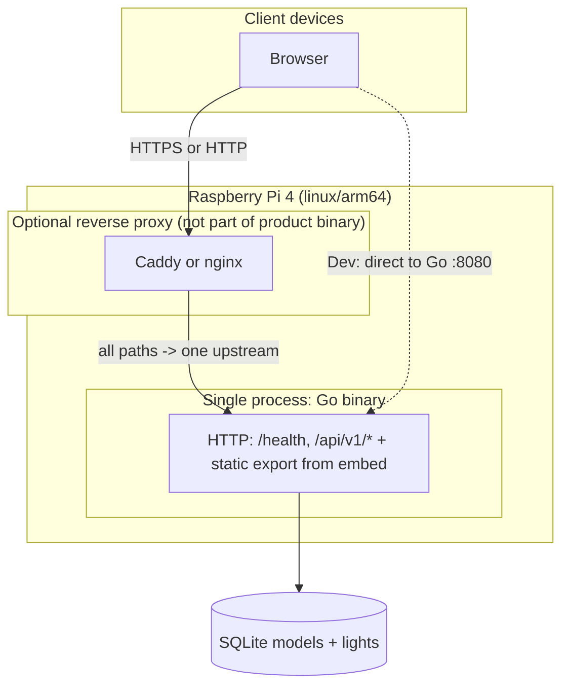
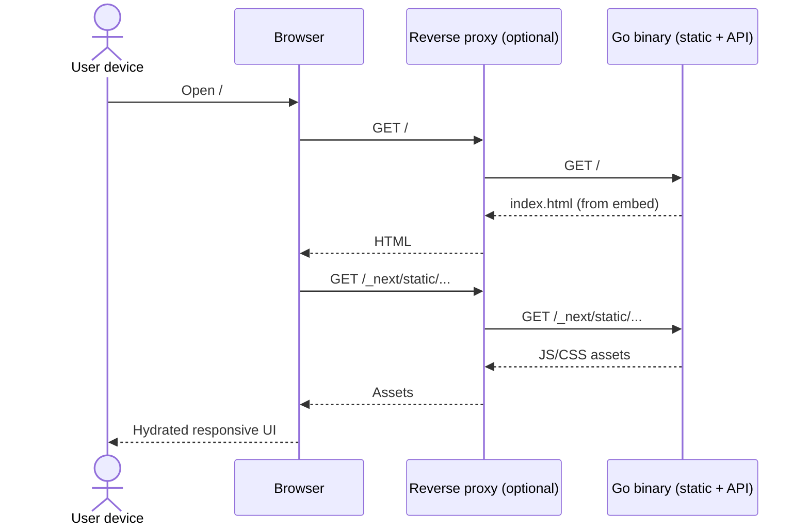
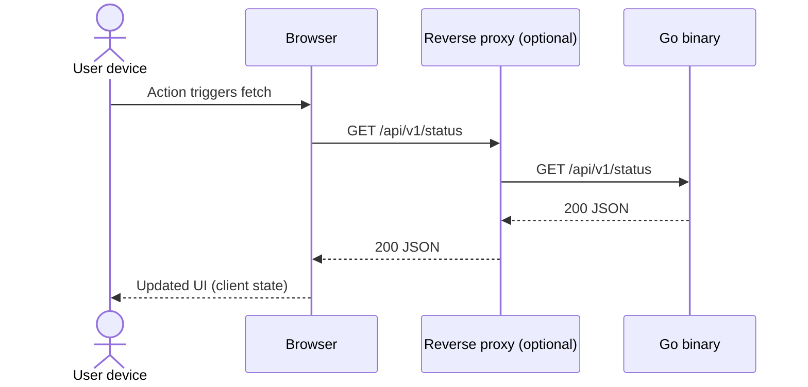
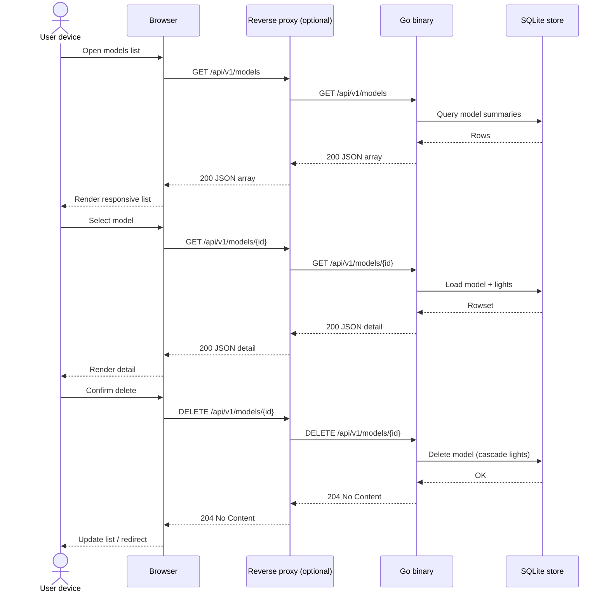

# Architecture

This document defines technical structure and deployment for the product described in `docs/requirements.md` (**REQ-001–REQ-009**). It satisfies **REQ-001** (Go + Next.js + Tailwind), **REQ-002** (responsive, client-interactive UI), **REQ-003** (Raspberry Pi 4 Model B, **ARM64**, resource awareness), **REQ-004** (**one runnable executable** per release target; **no** mandatory Docker/OCI/compose packaging at this stage), **REQ-005** (wire light model shape, CSV interchange, metadata), **REQ-006** (list / view / delete / create via CSV upload), **REQ-007** (server-side CSV validation and actionable errors), **REQ-008** (single command to build UI and run the Go server locally), and **REQ-009** (default geometric sample models: sphere, cube, cone; **0.1 m** consecutive spacing; **~2 m** characteristic size).

## Architectural resolution: REQ-004 (single binary) vs Next.js

**Decision:** **Full Next.js SSR/Node at runtime is out of scope** for the shipped product. The open item in REQ-004 is resolved as follows:

- **Next.js + App Router + Tailwind** remain the **authoring** stack under `web/` (toolchain, components, styling).
- **Runtime** on the Pi is a **single Go process** that:
  - Serves the **JSON API** (`/health`, `/api/v1/...`).
  - Serves the UI as **static assets** produced by **`next build` with `output: 'export'`** (static HTML, JS, CSS), **embedded** in the binary via Go **`embed`**, or **baked in at link time** from a generated filesystem tree.
- **REQ-002 (reactive UI):** Achieved with **client-side React** (hydration and **`"use client"`** components) and browser **`fetch`** to **same-origin** `/api/v1/...` on the Go listener. **No** React Server Components that require a Node runtime at request time; any **async server-only** data patterns used during development MUST be replaced or duplicated with **client** fetches or **build-time** data before release.

This meets REQ-004 rule 1 (**no separate Node.js runtime** in the distribution) and aligns with Pi RAM constraints (**§6**).

---

## 1. Goals and constraints

| Requirement | Architectural response |
|-------------|-------------------------|
| REQ-001 | **Go** binary serves **HTTP API** + **embedded static UI** built from **Next.js + Tailwind** source in `web/`. |
| REQ-002 | **Mobile-first** Tailwind, **Client Components** for interactivity; **`fetch('/api/v1/…')`** from the browser to the same Go origin. |
| REQ-003 | Primary release target **linux/arm64** (Pi 4B, 64-bit OS); document **CPU/RAM**; **one** long-lived app process. |
| REQ-004 | **One executable file** per release target; assets **embedded** (or generated inside the process); **Docker/compose not** the canonical install path. |
| REQ-005 | **Domain types** + **CSV** contract; **metadata** (**name**, **creation instant**) stored with each model; coordinates as **float64** in Go/API JSON. |
| REQ-006 | **REST JSON API** for models + **Next.js** client pages (list, detail, upload, delete); **multipart** upload for CSV. |
| REQ-007 | **Authoritative validation** in Go when ingesting CSV; **transactional** create (all-or-nothing); **400** responses with clear **error** envelope. |
| REQ-008 | **`scripts/run.sh`** (or documented equivalent) from repo root: **`npm run release:sync`** in `web/` then **`go run ./cmd/server`** in `backend/`; **README** documents exact invocation (**§3.7**). |
| REQ-009 | **`internal/samples`** generates three polylines in **SI meters**; **`store`** (or **`cmd/server`**) **seeds** when **`models`** row count is **0** at startup (**§3.8**). |

**Assumed Pi context:** Raspberry Pi 4 Model B, **64-bit OS**, **ARM64** userspace. **2–8 GB RAM** — with **no Node** at runtime, **4 GB** is practical for modest traffic; **off-device** `next export` builds recommended.

**Canonical production listener:** Single Go process on **one TCP address** (e.g. **`:8080`** or behind an **optional** reverse proxy on **`:80`/`443`** that forwards **all** paths to that one upstream). **No** second application process from the product distribution.

**Dev vs prod:** Local development **may** still run **`next dev`** alongside **`go run`** for fast iteration; that **two-process** pattern is **not** part of the **shipped** artifact (REQ-004).

---

## 2. Repository layout

Monorepo (single Git root), **one Go module** under `backend/`, **no `go.work`** unless later expanded.

```
dlm/
  scripts/
    run.sh                    # REQ-008: release:sync + go run server (repo root relative paths)
  backend/
    cmd/
      server/                 # main() — single binary entry; calls seed-if-empty (REQ-009)
    internal/
      config/
      httpapi/                # API mux + middleware + JSON handlers (incl. models HTTP)
      wiremodel/              # domain types, CSV parse + validation (REQ-005/007)
      samples/                # deterministic 3D polylines: sphere, cube, cone (REQ-009)
      store/                  # persistence for models (SQLite, REQ-006); SeedDefaultSamples (REQ-009)
      webdist/                # holds embedded payload (see §3.5); populated by build, not hand-edited
        placeholder.txt       # optional tiny file so empty embed works in dev before first UI build
  web/                        # Next.js + Tailwind (source only for runtime; sibling of backend/)
    app/
    components/
    lib/
  docs/
```

**Boundaries:**

- **`backend/` MUST NOT import** TypeScript sources from `web/` — only **built static files** under `internal/webdist/` (or equivalent) prepared by the **build pipeline**.
- **`web/` MUST NOT** import Go.
- **Public HTTP contract:** **`GET /health`**, **`/api/v1/*`** JSON API; **static paths** for UI (`/`, `/_next/...`, assets) from embedded FS.

---

## 3. Golang service (runtime)

### 3.1 Module and packages

- **Module path:** `example.com/dlm/backend` (or successor); unchanged conceptually.
- **`cmd/server`:** Load config; construct **`http.Server`**; mount **API sub-router** and **static file server** from **`embed`**; graceful **SIGINT/SIGTERM** shutdown.
- **`internal/config`:** **Env-based** listen address, timeouts, optional **CORS** (primarily for **dev** when UI dev server uses another origin); production **same-origin** reduces CORS; **SQLite** path via **`DLM_DB_PATH`** and/or **`DLM_DATA_DIR`** (**§3.3**).
- **`internal/httpapi`:** Middleware (**request ID**, **slog**, **recover**, optional **CORS**); **JSON** handlers and error envelope `{ "error": { "code", "message" } }`; **models** routes delegate to **`internal/store`** and **`internal/wiremodel`**.
- **`internal/wiremodel`:** Parses and validates uploaded **CSV** per **§3.6**; returns structured errors for HTTP **400** responses (**REQ-007**).
- **`internal/store`:** **SQLite** repository (see **§3.3**); opened at process start; migrations or `CREATE IF NOT EXISTS` for schema (**REQ-006**); **idempotent default seed** when no models exist (**§3.8**, **REQ-009**).
- **`internal/samples`:** Pure functions that return **`[]wiremodel.Light`** (sequential **id**s from **0**) for the three canonical shapes; no I/O (**REQ-009**).

### 3.2 HTTP surface

| Kind | Path | Purpose |
|------|------|--------|
| API | `GET /health` | Liveness; **no auth**. |
| API | `GET /api/v1/models` | List models (**metadata** + **light_count**). **REQ-006** |
| API | `POST /api/v1/models` | Create model: **`multipart/form-data`** with **`name`** (string) + **`file`** (CSV). **REQ-006/007** |
| API | `GET /api/v1/models/{id}` | Model **metadata** + ordered **lights** `{ id, x, y, z }[]`. **REQ-006** |
| API | `DELETE /api/v1/models/{id}` | Delete model (**204** / **404**). **REQ-006** |
| API | `/api/v1/*` | Other versioned **JSON** endpoints as the product grows. |
| Static | `/`, `/*.html`, **`/_next/**`**, other export assets | **Next static export** tree from embed; **SPA / HTML5** fallback policy: serve **`index.html`** for unmatched **non-API** GET if needed (implementor defines exact fallback rules). |

**Ordering:** Register **API** routes **before** static/`NotFound` handling so `/api/v1` is never swallowed by UI fallback.

### 3.3 Persistence (**REQ-006**)

- **Engine:** **SQLite** accessed from the **same Go process** (prefer a **pure Go** driver such as **`modernc.org/sqlite`** to avoid **cgo** cross-compile friction on **linux/arm64**).
- **Location:** Configurable path via environment (e.g. **`DLM_DB_PATH`**), defaulting to a file under an application **data directory** (e.g. **`DLM_DATA_DIR`** + `dlm.db`). The DB file is **runtime state**, not embedded in the binary; creating/opening it at startup satisfies **REQ-004** (no extra shipped daemon).
- **Schema (logical):**
  - **`models`:** `id` (TEXT UUID primary key), `name` (TEXT **NOT NULL**, **UNIQUE**), `created_at` (TEXT **RFC3339 UTC**).
  - **`lights`:** `model_id` (TEXT FK → `models.id`), `idx` (INTEGER light index), `x`, `y`, `z` (REAL), primary key **`(model_id, idx)`**.
- **Transactions:** **`POST /api/v1/models`** MUST parse+validate CSV, then insert **`models`** + all **`lights`** in **one transaction**; rollback on any validation failure so **no partial model** is stored (**REQ-007**).
- **Migrations:** Implementor MAY use a minimal migration hook or `CREATE TABLE IF NOT EXISTS` at startup; document schema version if evolved.

**Architectural resolutions (requirements open questions):**

- **Model name uniqueness:** **UNIQUE** on `models.name` so the list UI stays unambiguous; duplicate names return **409** with a clear message (product may relax later if requirements change).
- **Creation date:** Set by the **server** at successful create time, stored and exposed as **UTC RFC3339** (no client clock trust).
- **Upload naming:** **`name`** is a **required** multipart field (non-empty after trim); **not** inferred from filename alone.
- **Empty model:** **Allowed**: CSV may contain **only** the header row (**0** lights); still creates a model row with **light_count = 0**.

### 3.4 Build and cross-compile (release artifact)

- **Release binary (Pi):** After the **web static bundle** is copied into **`internal/webdist/`** (or embed path the implementor chooses):

  `GOOS=linux GOARCH=arm64 go build -o bin/dlm-arm64 ./cmd/server`

- **Single file:** The **only** shipped application binary is **`dlm-arm64`** (name per project convention). **systemd** may wrap it with **`ExecStart=/usr/local/bin/dlm`** etc.; that is allowed per REQ-004.

### 3.5 Embedding static UI

- **Mechanism:** `//go:embed` on a package (e.g. **`internal/webdist`**), embedding the **full** `out/` tree from **`next export`** (path names preserved: **`_next/static/...`**).
- **Build contract:** A **documented** step (**Make**, `task`, or **CI** script) runs **`npm ci && npm run build`** in `web/` (with **`output: 'export'`**), then **syncs** `web/out/` → `backend/internal/webdist/` (or `backend/web/build/`).
- **`embed` empty-dir issue:** Repository may keep a **small placeholder** file under `webdist/` so **`go test ./...`** works **before** the first UI bake; release builds **replace** the directory contents with the real export.

### 3.6 CSV interchange and validation (**REQ-005**, **REQ-007**)

- **Encoding:** **UTF-8** text; parse with Go **`encoding/csv`**.
- **Delimiter:** Comma (`,`). **RFC 4180** quoting rules SHOULD be supported so numeric fields may be quoted.
- **Header row:** **Required** first record; must be **exactly** the four fields **`id`**, **`x`**, **`y`**, **`z`** in that order (case-sensitive, no extra columns). Wrong or missing header → **400** with **format** error (matches acceptance scenario for `idx,x,y,z`).
- **Data rows:** Each row provides one light; **`id`** must parse as an integer; **`x`**, **`y`**, **`z`** must parse as **finite** floating-point numbers (reject **NaN** / **Inf**).
- **Row count:** After the header, **0 ≤ n ≤ 1000** data rows; **n > 1000** → **400** referencing the cap.
- **Id sequence:** Let **n** be the number of data rows. Sorting rows by **`id`**, the multiset of ids MUST equal **`{0,1,…,n−1}`** exactly once each (contiguous from **0**, no gaps, no duplicates). Implementor MAY require rows to appear sorted by **`id`** ascending for simpler validation, or accept any order and validate the set—behavior MUST match tests derived from **`docs/acceptance_criteria.md`**.
- **Authoritative checks:** All rules above are enforced **in Go** on upload; the UI MAY add client-side hints but MUST NOT trust them for security or integrity.

**JSON API shapes (illustrative):**

- **List item:** `{ "id": "<uuid>", "name": "…", "created_at": "<RFC3339>", "light_count": <int> }`
- **Detail:** same metadata plus `"lights": [ { "id": 0, "x": 0, "y": 0, "z": 0 }, … ]` ordered by **`id`** ascending.

**HTTP errors:** Use existing **`{ "error": { "code", "message" } }`** envelope; optional **`details`** field for row/column hints (**REQ-007**). **409 Conflict** for duplicate **`name`**.

### 3.7 Local build-and-run script (**REQ-008**)

- **Canonical path:** **`scripts/run.sh`** at the **repository root**, executable (`chmod +x`), **`#!/usr/bin/env bash`** with **`set -euo pipefail`** (or equivalent strictness).
- **Behavior (single invocation):**
  1. Resolve repo root (e.g. `ROOT="$(cd "$(dirname "$0")/.." && pwd)"`).
  2. Under **`cwd = $ROOT/web`**: run **`npm ci`** when **`node_modules`** is missing or **`DLM_FORCE_NPM_CI=1`**; skip **`npm ci`** when **`DLM_SKIP_NPM_CI=1`** or when **`node_modules`** already exists (see **README** for trade-offs). Then **`npm run release:sync`** so **`web/out/`** is copied to **`backend/internal/webdist/dist/`**.
  3. Run **`go run ./cmd/server`** with **`cwd = $ROOT/backend`** (or **`go build -o … && exec ./dlm`** if preferred—document in **README**). Use **`exec`** for the final Go process so **SIGINT** reaches the server.
- **Prerequisites:** **Node.js** + **npm** on **PATH**, **Go** on **PATH**; network for **`npm ci`** on cold clone or when forcing a clean install.
- **README.md** MUST show the exact line, e.g. **`./scripts/run.sh`** or **`bash scripts/run.sh`**, and note **WSL / Git Bash** on Windows if applicable.
- **AGENTS.md** already references **REQ-008**; keep **README** and this section aligned when the script changes.
- **Not** a substitute for **Pi** production install (still **one binary** + optional **systemd**); operators may build off-device and copy **`dlm-arm64`** per **§3.4**.

### 3.8 Default sample models (**REQ-009**)

**Units:** All coordinates in **meters**; consecutive lights (**id** **i** → **i+1**) have Euclidean distance **exactly `0.1`** (10 cm), within **floating-point tolerance** used in tests (e.g. **`1e-9`** m or **ulp**-aware assert—implementor picks one and documents it).

**Architectural resolutions (requirements open questions):**

- **Sphere vs multiple rings:** Use a **single** open polyline (or closed loop) in **3D** whose vertices lie on the **sphere surface**. Recommended approach: **radius `R = 1.0` m** (diameter **2 m**); generate vertices by walking a **space curve** on the sphere (e.g. **parametric loxodrome / approximate spiral** from south toward north) such that each step has chord length **0.1** m until the curve completes a visually clear sphere outline; **cap total lights ≤ 1000** by **stopping early** or **coarsening** only if needed (REQ-005).
- **User deletes samples:** **Seed only when `SELECT COUNT(*) FROM models` is 0** immediately after migrations on **process startup**. Deleting a subset does **not** re-seed during that run; if the user deletes **all** models, **next** process start seeds again.
- **Fixed English names** (must remain **unique** vs typical user uploads): **`Sample sphere`**, **`Sample cube`**, **`Sample cone`** (adjust only if **i18n** is added later).

**Per-shape geometry (implement `internal/samples`):**

| Shape | Characteristic size | Path / sampling |
|-------|---------------------|-----------------|
| **Sphere** | Diameter **2 m** (`R = 1` m) | Surface polyline as above; chord step **0.1** m. |
| **Cube** | Edge length **2 m** | Axis-aligned cube; traverse **all 12 edges** as one continuous **3D** polyline (order implementor’s choice). Insert vertices so **consecutive** Euclidean distance is **0.1** m (interpolate along edges); total path length **24** m ⇒ **~240** segments if corners are shared—stay **≤ 1000** lights. |
| **Cone** | Height **2 m**, right circular | Base radius **`r = 1` m** (base diameter **2 m**); path: **base circle** (circumference **2π** m) sampled at **0.1** m chords, then **slant** from base rim to **apex** (slant height **`√(r² + h²) = √5` m**) with **0.1** m steps—**concatenate** into one **id** order. Verify total lights **≤ 1000**. |

**Integration:**

- After **`store.Open`** + **`migrate`**, if **model count is 0**, **`store.SeedDefaultSamples(ctx)`** (or equivalent) runs **one transaction** inserting three models and their lights using **`samples.SphereLights()`**, **`samples.CubeLights()`**, **`samples.ConeLights()`** (names as above, server **`created_at`**).
- Samples use the **same** insert path as user CSV (reuse **`Create`-style** logic or bulk insert) so **invariants** match **REQ-005**.

**Tests:** Unit tests in **`internal/samples`** assert **consecutive distance ≈ 0.1**, bounding **height** / diameter / edge within documented tolerance of **2 m**; optional integration test that **list** after fresh DB returns **three** expected names.

---

## 4. Next.js + Tailwind (build-time / authoring)

### 4.1 Stack

- **Next.js App Router** under `web/app/` for structure and layouts.
- **Tailwind** + **TypeScript** as today.
- **`next.config`:** **`output: 'export'`** (static HTML export). **`images`:** use **`unoptimized: true`** or avoid `next/image` features incompatible with export.

### 4.2 Runtime-incompatible patterns (must not ship)

- **`next start`**, **standalone** Node output, **SSR** dependencies, **Route Handlers** or **middleware** that must execute on Node for **navigations**, **rewrites** to a separate upstream for **HTML**.
- **Server Components** that **fetch at request time** without a static **generateStaticParams** strategy — for MVP, prefer **client `fetch`** to **`/api/v1/...`**.

### 4.3 Data access patterns (shipped UI)

| Pattern | Use |
|--------|-----|
| **Client `fetch('/api/v1/...')`** | Primary pattern for reactive UI (**REQ-002**) against **same Go origin**. |
| **Build-time static** | `generateStaticParams` / SSG **only** if values are fixed at build; API must still be available at runtime for live data where needed. |

### 4.4 Environment

- **Runtime** UI has **no** `process.env.NEXT_PUBLIC_*` server injection from Node; **build-time** env may set **`NEXT_PUBLIC_API_BASE`** to **`''`** (same origin) so client code calls relative URLs.

### 4.5 Responsive behavior (**REQ-002**)

Unchanged intent: **Tailwind breakpoints**, **touch targets**, **`"use client"`** for interactivity.

### 4.6 Models UI (**REQ-002**, **REQ-006**)

- **Routes (App Router):** e.g. **`/models`** (list), **`/models/new`** (upload form: **name** text input + **file** input), **`/models/[id]`** (detail: metadata + table or compact list of lights; responsive stacking on small viewports).
- **Client data:** **`"use client"`** pages/components call **`fetch`** with **`GET`**, **`POST`** (**`FormData`** for multipart), **`DELETE`** against **`/api/v1/models…`** on the **same origin** (**§4.3**).
- **Feedback:** Inline / banner display of **400** / **409** **`message`** from API; loading states on list, detail, upload, and delete (**REQ-002**).
- **Navigation:** Clear entry point from **home** or **app shell** to **models** list (**implementor** chooses IA).

---

## 5. UI ↔ API coordination (single process)

**Production:**

1. User opens **`https://host/`** (or `http://host:8080/`).
2. **Go** serves **`index.html`** and **JS/CSS** from embed.
3. React hydrates; components call **`fetch('/api/v1/…')`** (e.g. **models** endpoints, **`/api/v1/status`** if present) → **same Go server**.
4. Optional **Caddy/nginx** terminates TLS and proxies **everything** to **one** Go port.

**No** path-based split between Node and Go inside the product.

**Development (non-shipping):** Engineers may use **`next dev`** with **proxy** to Go API or **dual ports** + CORS; **document** in `README` as dev-only.

---

## 6. Raspberry Pi 4 Model B deployment

### 6.1 ARM64 and resources

- **Target:** **linux/arm64** executable.
- **RAM:** **Single Go** process + embedded static assets — significantly lower than **Go + Node**; **2–4 GB** can suffice for light use; **4 GB+** recommended headroom.
- **CPU:** **No SSR** on device; Go serves files and JSON — suitable for Pi **4**.

### 6.2 Process model

- **One** `systemd` service — the **application binary** only.
- **Optional** separate **`caddy.service`** or **`nginx`** is **OS/infrastructure**, not part of REQ-004’s single binary (the **product** remains one file).

### 6.3 Distribution (**REQ-004** / anti-Docker)

- **Canonical install:** copy **one binary** + optional **unit file**; **not** Docker-first.
- **Docs** (`README`, this file) MUST describe **binary + systemd** path; **do not** require **Dockerfile** or **compose** for production.

### 6.4 Networking

- Go binds **`:8080`** (or configured); reverse proxy maps **80/443** → that socket.

---

## 7. System boundaries (flowchart)



---

## 8. Request flows (sequence diagrams)

### 8.1 Initial page load (static + hydration)



### 8.2 Client calls JSON API (same origin)



### 8.3 Create model (multipart CSV upload)

```mermaid
sequenceDiagram
  actor User as User device
  participant B as Browser
  participant P as Reverse proxy (optional)
  participant G as Go binary
  participant S as SQLite store

  User->>B: Submit name + CSV file
  B->>P: POST /api/v1/models (multipart)
  P->>G: POST /api/v1/models (multipart)
  G->>G: Parse CSV + validate (wiremodel)
  alt validation failure
    G-->>P: 400 JSON error
    P-->>B: 400 JSON error
    B-->>User: Show actionable message
  else duplicate name
    G-->>P: 409 JSON error
    P-->>B: 409 JSON error
    B-->>User: Show conflict message
  else success
    G->>S: BEGIN; insert model + lights; COMMIT
    S-->>G: OK
    G-->>P: 201 JSON (id, metadata, light_count)
    P-->>B: 201 JSON
    B-->>User: Navigate or refresh list
  end
```

### 8.4 List, view, and delete models



---

## 9. Security notes (baseline)

- Prefer **same-origin** in production to minimize **CORS** surface.
- **Secrets** via env only; **no** secrets baked into client bundles beyond **public** constants.
- **No** mandatory **container** trust boundary from the product’s perspective (REQ-004).
- **Upload limits:** Enforce a **maximum request body size** on **`POST /api/v1/models`** (e.g. **`http.MaxBytesReader`** or server limit) large enough for **1000** CSV rows but small enough to bound **memory** and **DoS** risk on the Pi.
- **SQLite file:** Treat **`DLM_DB_PATH`** as **persistent** storage on the Pi (e.g. SD card or USB); operators should **back up** the DB file with normal file backup practices.

---

## 10. Traceability to requirements

| REQ | Addressed in sections |
|-----|------------------------|
| REQ-001 | §1–§5, §7–§8 |
| REQ-002 | §1, §4, §5, §8 |
| REQ-003 | §1, §3.4, §6, §7 |
| REQ-004 | §1 (resolution), §3.3–§3.5, §4.1–§4.2, §5–§6 |
| REQ-005 | §1, §3.1, §3.6 |
| REQ-006 | §1, §3.1–§3.3, §3.2, §4.3, §4.6, §7–§8 |
| REQ-007 | §1, §3.3, §3.6, §8.3 |
| REQ-008 | §1, §2, §3.1, §3.7, §3.5 (release:sync contract) |
| REQ-009 | §1, §2, §3.1, §3.3, §3.8 |

---

**Next step:** Invoke the **`@implementor`** agent to add **`scripts/run.sh`**, **`internal/samples`**, **`store.SeedDefaultSamples`** (or equivalent) wired from **`cmd/server`**, and update **`README.md`** with the exact **REQ-008** command. Then invoke the **`@verifier`** agent to audit, run tests, and update **`docs/traceability_matrix.md`**.
