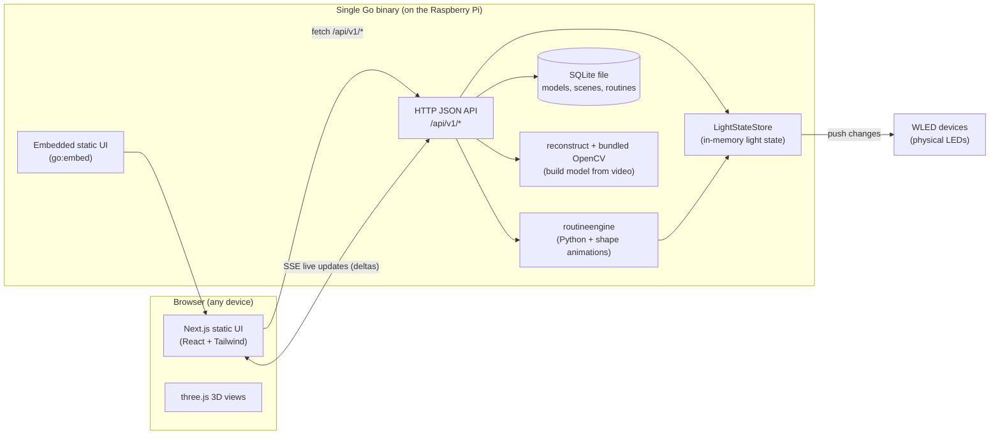

# Architecture

This is the entry point to the technical design of **dlm (Domestic Light & Magic)**. It describes how
the product in [`../requirements/requirements.md`](../requirements/requirements.md)
(**REQ-001–REQ-049**) is built.

New to the project? Read this page top to bottom, then follow the [reading order](#how-to-read-this-design)
below. Keep the [glossary](glossary.md) open for unfamiliar words.

## What dlm is (in plain terms)

dlm lets a hobbyist design and animate home LED light installations from a web browser.

- You import a **model**: a 3D shape made of many individual lights, each with a position. Models come
  from a simple CSV file (or, later, from video — see below).
- You combine models into a **scene** and control the lights: turn them on/off, set colour and
  brightness, individually or in bulk.
- You animate a scene with a **routine**: either a **Python script** you write, or a configurable
  **shape animation**. Routines run on the server, so animations keep going even with no browser open.
- You connect physical **devices** (WLED LED controllers) so the on-screen lights drive real LEDs.
- You can even build a model **from video**: record the lights blinking in a set order, upload two or
  more clips, and the server reconstructs each light's 3D position with computer vision.

Everything ships as **one downloadable app per platform** (REQ-004): the web UI is embedded in the Go
binary. On Linux the release may be a `.tar.gz` that also includes a sibling `runtime/cv/` folder for
camera capture; Windows may be a bare `.exe`. There is no separate database server, no Node.js server,
and no Docker requirement. It is designed to run on a small **Raspberry Pi 4** on your home network.

## The big picture

The one idea to take away: **the Go binary is authoritative**. The browser is a thin, reactive view
that reads and writes state through the API and observes live changes over SSE (Server-Sent Events).
The current on/off/colour/brightness of every light lives in memory on the server
(`LightStateStore`), not in the database.

## The key architectural decision

The product must ship as a single binary (REQ-004), but the UI is built with Next.js — which normally
wants a Node.js server. dlm resolves this by using Next.js purely as an **authoring tool**: the UI is
compiled to a **static export** (plain HTML/JS/CSS, no Node at runtime) and embedded into the Go
binary. Interactivity is achieved with client-side React and browser `fetch` to the same-origin API.
The full reasoning and rules are in [overview.md](overview.md).

## How to read this design

The design is split into focused topic pages. A good reading order for someone new:

1. [overview.md](overview.md) — goals, constraints, the single-binary decision, and the repo layout.
2. [backend-service.md](backend-service.md) — the Go service: HTTP API, database, models, scenes.
3. [backend-lights-and-automation.md](backend-lights-and-automation.md) — scene geometry, routines,
   devices, and camera capture (the harder backend parts).
4. [frontend.md](frontend.md) — the Next.js/Tailwind/three.js UI.
5. [deployment.md](deployment.md) — how the UI and API cooperate, and running on a Raspberry Pi.
6. [request-flows.md](request-flows.md) — diagrams of how requests move through the system.
7. [security.md](security.md) — baseline security expectations.

Supporting references: the [glossary](glossary.md) and the
[requirements traceability appendix](appendix-traceability.md).

## Section index (§ → file)

The design uses stable section numbers like `§3.18`. These are cited from source-code comments and
other docs, so **the numbers never change**. Content moved into separate files, but the numbering is
preserved. Use this table to find any `§` reference:

| Sections | Topic | File |
|----------|-------|------|
| §1 | Goals and constraints (the per-requirement response table) | [overview.md](overview.md) |
| §2 | Repository layout | [overview.md](overview.md) |
| §3.1–§3.14 | Go service: modules, HTTP surface, persistence, build, samples, per-light state, scenes, factory reset | [backend-service.md](backend-service.md) |
| §3.15–§3.23.2 | Scene spatial API, routines (Python + shape animation), light-state push/elision, WLED devices, capture sweep, camera reconstruction | [backend-lights-and-automation.md](backend-lights-and-automation.md) |
| §4.1–§4.17 | Next.js + Tailwind + three.js frontend | [frontend.md](frontend.md) |
| §5 | UI ↔ API coordination | [deployment.md](deployment.md) |
| §6.1–§6.12 | Raspberry Pi deployment, release targets, CI/CD | [deployment.md](deployment.md) |
| §7 | System boundaries (flowchart) | [request-flows.md](request-flows.md) |
| §8.1–§8.25 | Request flows (sequence diagrams) | [request-flows.md](request-flows.md) |
| §9 | Security notes | [security.md](security.md) |
| (appendix) | REQ → section cross-reference blocks | [appendix-traceability.md](appendix-traceability.md) |

## Editing this design

Requirements and acceptance criteria in [`../requirements/`](../requirements) are authoritative. If
implementation reveals a genuine conflict with this design, fix the specification first (see
[`../engineering/coding-standards.md`](../engineering/coding-standards.md) → "Writing design docs"),
then implement.

When you edit these pages, keep them readable for a junior developer, and **never** change a `§`
number or a `REQ-NNN` code — both are cited from source code. Add new sections with new numbers, and
new requirements with new `REQ-NNN` codes.
