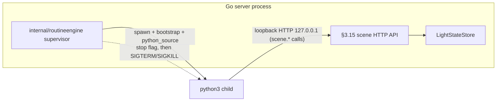
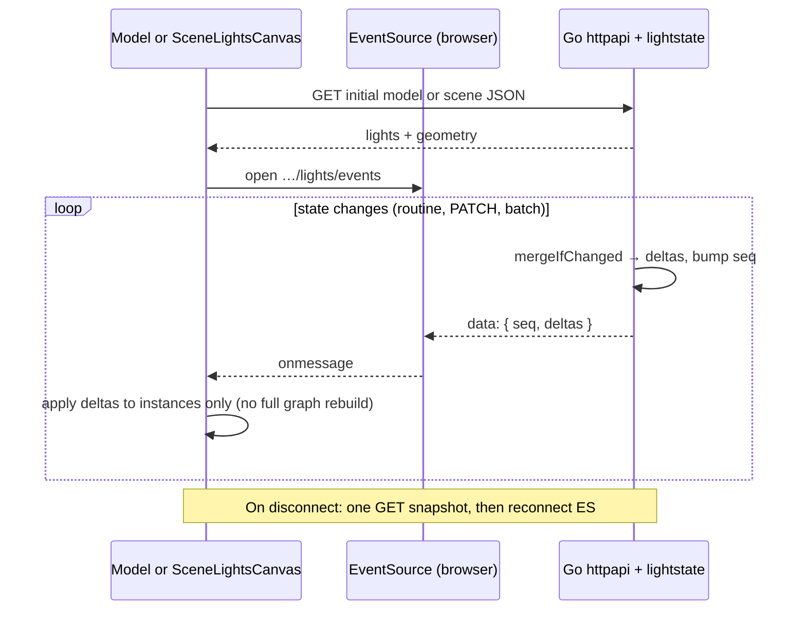
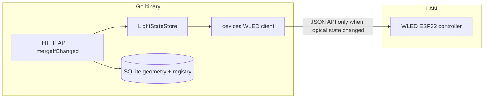
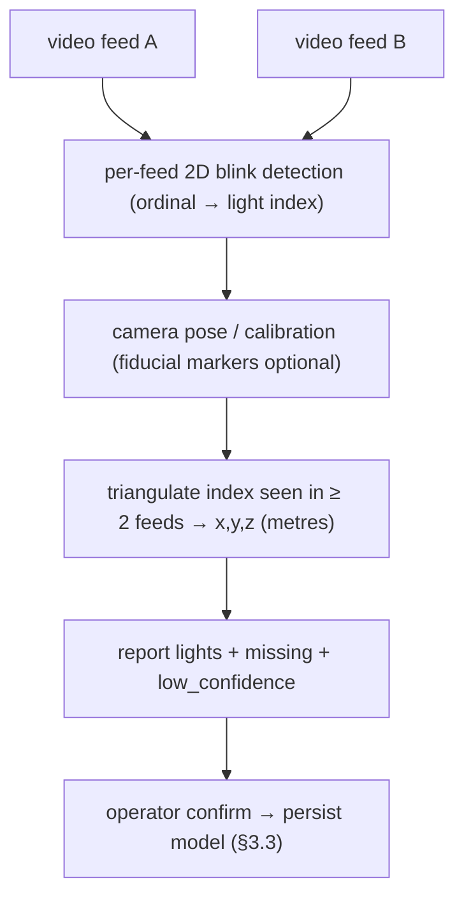

# Backend: scene geometry, routines, devices, and camera capture (§3.15–§3.23)

This file covers the parts of the Go service that make lights *do things*: querying and
updating lights by 3D geometry, running animated "routines" (either user Python scripts or
declarative shape animations), pushing state to physical LED controllers, and reconstructing a
model's 3D light positions from uploaded videos. It assumes you know basic Go, JS/TS, and HTTP but
not this project's domain, so jargon is explained on first use.

Part of the [dlm architecture](architecture.md); see the [glossary](glossary.md) for unfamiliar terms.

---

### 3.15 Scene spatial API (dimensions, region queries, and region bulk updates) (REQ-020)

**In plain terms:** a "scene" places one or more imported light "models" into a shared 3D space.
This API lets you ask "which lights fall inside this box/sphere?" and "turn every light in this
region on/blue/50%". All the geometry math uses each light's *scene-space* position, not its
original per-model position.

This section extends REQ-015 scene composition with explicit API contracts for querying and
updating lights by scene-space geometry. Every region check is done against *derived* coordinates
(`sx/sy/sz` — where a light actually sits in the scene), never the canonical model coordinates
(`x/y/z` — where the light sits inside its own model).

Canonical invariants reused from §3.12 / §3.13:

1. **Derived coordinate rule:** `sx = x + offset_x`, `sy = y + offset_y`, `sz = z + offset_z`. (A
   scene positions each model by adding a per-model offset.)
2. **No canonical rewrite:** region reads and writes must not mutate the stored canonical
   coordinates.
3. **State semantics:** bulk update fields follow REQ-011 exactly (`on`, canonical `#RRGGBB`
   `color`, `brightness_pct` in `0..100`).

**Geometry payload contracts (JSON):**

- Cuboid query/update body
  - `position`: `{ "x": number, "y": number, "z": number }` (minimum corner in scene space).
  - `dimensions`: `{ "width": number, "height": number, "depth": number }` (all strictly `> 0`).
- Sphere query/update body
  - `center`: `{ "x": number, "y": number, "z": number }`.
  - `radius`: number strictly `> 0`.
- All numeric inputs must be finite (`NaN` / `Inf` rejected).
- **Boundary policy resolution (REQ-020 open question):** inclusion is *inclusive*:
  - Cuboid: `sx ∈ [x, x+width]`, `sy ∈ [y, y+height]`, `sz ∈ [z, z+depth]`.
  - Sphere: Euclidean distance `dist((sx,sy,sz), center) <= radius`.

**Dimensions endpoint (resolves REQ-020 dimensions shape):**

- `GET /api/v1/scenes/{id}/dimensions` returns the axis-aligned bounding box (AABB — a box whose
  sides line up with the X/Y/Z axes) of *all* lights in scene space (`sx/sy/sz`), expanded by
  `margin_m` on each side (REQ-033 motion and region queries share this box):
  - `origin`: `{ "x", "y", "z" }` = lower corner (`max(0, min(sx) − margin_m)` per axis — clamp so
    origin never goes negative).
  - `max`: `{ "x", "y", "z" }` = upper corner (`max(sx) + margin_m` per axis over all lights).
  - `size`: `{ "width", "height", "depth" }` = `max − origin` per axis (true extent of the lit
    volume plus padding).
  - `margin_m`: per-scene persisted value (REQ-015 BR 12) — default `0.3` SI metres on create, the
    same default applied to legacy rows via the `ALTER TABLE` migration in §3.3. Implementations
    must read the scene's own `margin_m` here rather than a global constant — the prior `1.0`
    baseline is superseded; shape animation (REQ-033) and routine scripts (REQ-022) inherit the
    same value via `scene.width` / `scene.height` / `scene.depth`.
  - Empty scene (no lights): `origin` `(0,0,0)`, `max` `(margin_m, margin_m, margin_m)`, `size`
    matches.
- REQ-015 still requires lights `sx,sy,sz ≥ 0`; `origin.x` is usually `0` for single-model scenes
  but may be `> 0` when multiple models leave a gap along +X (shape animation must use
  `origin`..`max`, not assume `0`..`max` alone).

**Axis mapping for `size` (REQ-026, REQ-015 "right" convention):** `width` = extent along scene +X
(the default "right" axis when adding models after create); `height` = extent along +Y (vertical up
in the default three.js view — must match `SceneLightsCanvas` / `ModelLightsCanvas` orientation);
`depth` = extent along +Z (depth into the screen in the same default camera framing). Python
`scene.width`, `scene.height`, `scene.depth` must read these same three numbers from one
`GET …/dimensions` response (cached in the worker for the iteration if needed).

**Read endpoints (scene coordinates only):**

- `GET /api/v1/scenes/{id}/lights` → flattened list:
  - Each item includes at minimum `{ "scene_id", "model_id", "light_id", "x", "y", "z", "sx", "sy", "sz", "on", "color", "brightness_pct" }`.
  - `x/y/z` are canonical for traceability; region matching and client spatial behavior must use
    `sx/sy/sz`.
- `POST /api/v1/scenes/{id}/lights/query/cuboid` and `.../query/sphere`:
  - Validate the geometry payload then return only matching lights in the same flattened shape.

**Bulk update endpoints (all-or-nothing):**

- `PATCH /api/v1/scenes/{id}/lights/state/cuboid`
- `PATCH /api/v1/scenes/{id}/lights/state/sphere`
- `PATCH /api/v1/scenes/{id}/lights/state/scene` — whole-scene uniform update (REQ-020 + REQ-021):
  - Body: `{ "on"?, "color"?, "brightness_pct"? }` with at least one field present (same
    partial-merge semantics as the per-light PATCH in §3.9 — omitted fields leave the existing
    in-memory authoritative values unchanged; no SQLite writes for these fields).
  - Matching set: every light row reachable through the current `scene_models` for `scene_id` (zero
    lights is valid — `updated_count: 0`).
  - Transaction: one locked update wave on `LightStateStore` per matched `(model_id, idx)` (§3.9 /
    §3.19); rollback on any validation failure (e.g. invalid hex after merge); then SSE (Server-Sent
    Events, a one-way server→browser push stream) + §3.20 as for other mutations.
  - Response: same shape as region bulk updates (recommended `updated_count` + `states[]`) — may omit
    `sx/sy/sz` in `states` if payload size is a concern.

- `PATCH /api/v1/scenes/{id}/lights/state/batch` — per-light updates scoped to one scene (REQ-020
  extension for REQ-021 and integrators):
  - Body: `{ "updates": [ { "model_id": "<uuid>", "light_id": <int>, "on"?, "color"?, "brightness_pct"? }, … ] }`.
  - Rules: `updates` non-empty; no duplicate `(model_id, light_id)` in the array; each
    `(model_id, light_id)` must exist in `lights` and `scene_models` for `scene_id`; each element has
    ≥ 1 of `on`, `color`, `brightness_pct`; validate the merged state per row like §3.9 / §3.10.
  - Transaction: all rows updated in one `BEGIN…COMMIT`; on any error, rollback (no partial apply).
  - Response: `{ "updated_count": <int>, "states": [ { "model_id", "id", "on", "color", "brightness_pct" }, … ] }`
    in request order or sorted by `model_id` then `id` (document the chosen order).

- Request body for cuboid/sphere = geometry payload + at least one state field (`on`, `color`,
  `brightness_pct`).
- Execution model:
  1. Validate scene id exists and geometry/state payload is valid.
  2. Resolve matching lights by derived coordinates (`sx/sy/sz`) from the current scene composition.
  3. In one DB transaction, apply validated state fields to all matched `(model_id, idx)` rows.
  4. On any validation/store failure, rollback the entire operation (no partial updates).
- Recommended response shape:
  - `{ "updated_count": <int>, "states": [ { "model_id", "id", "on", "color", "brightness_pct", "sx", "sy", "sz" }, ... ] }`
  - `updated_count` may be `0` (a valid no-op if the region matches no lights).

**Error model (REQ-020 rule 9):**

- Geometry validation failure → `400` with `error.code = "validation_failed"` and actionable
  `details`.
- Scene missing → `404`.
- Any transactional failure after validation → `500` with a generic message (no partial writes
  committed).

### 3.16 Scene routines — persistence and HTTP (REQ-021, REQ-022, REQ-033, REQ-040)

**In plain terms:** a "routine" is an animation attached to a scene. There are exactly two kinds you
can create: a Python script you write, or a declarative "shape animation" (moving spheres/cuboids
that paint lights). Crucially, **routines run on the server**, not in your browser — the browser can
only start, stop, and watch them. This section is about storing routines and the HTTP endpoints to
start/stop them; the actual run mechanics are in §3.17 and §3.17.2.

**Normative placement (REQ-021, REQ-038):** `docs/requirements/requirements.md` states *what*; this
document states *how*. All production routine ticks run inside the single Go server process. Python
routines use a supervised `python3` child process whose injected `scene` binding issues HTTP to the
same listener's scene spatial API (§3.15, typically loopback `127.0.0.1` — i.e. the server calling
back into itself) so validation matches external clients. Shape animation uses a Go-driven periodic
simulation (§3.17.2) that commits light updates via internal calls equivalent to the §3.15
region/bulk routes (direct function calls preferred over loopback for latency). The browser never
hosts production routine loops; it does start/stop/observe only (REQ-041). Supervisor code lives
under `internal/routineengine` (§2). REQ-030: CodeMirror completions and any authoring-only worker
must stay aligned with the documented `scene` API names and sync/async semantics of §3.17.

**Architectural resolution (two creatable kinds):**

- Creatable `routines.type` values are `python_scene_script` and `shape_animation` only.
  `POST /api/v1/routines` must reject any other `type` with `400`. If `type` is omitted, default to
  `python_scene_script` (backward compatibility with clients that only send
  `name` / `description` / `python_source`).
- `python_scene_script`: `python_source` TEXT NOT NULL (may be `""` before client template
  substitution); `definition_json` NULL or an absent column treated as no shape definition.
- `shape_animation`: `definition_json` TEXT NOT NULL storing canonical JSON (UTF-8) of the
  declarative spec (§3.17.2); `python_source` stored as `""` or omitted from API responses as
  documented in the §3.2 table.
- Legacy `random_colour_cycle_all` rows should be removed or migrated to `python_scene_script`
  (§3.17.1 sample) or cleared on factory reset (§3.14).
- **Normative execution (REQ-021, REQ-038):** `POST …/start` persists `routine_runs.status=running`
  and `internal/routineengine` starts a supervisor for that run. Python kind: spawn `python3` with
  bootstrap + `python_source` (§3.17). Shape kind: start a Go `time.Ticker` (a repeating timer;
  §3.17.2) that calls the same store/lightstate merge paths as §3.15 (internal function calls
  preferred over loopback HTTP for latency — either is valid if validation is identical).
  `POST …/stop` sets `stopped`; the supervisor cooperatively stops, then `SIGTERM`/`SIGKILL`s the
  child / cancels the ticker within REQ-040. (`SIGTERM` politely asks a process to exit; `SIGKILL`
  force-terminates it.) The browser never hosts production routine loops; it only calls start/stop
  and subscribes to SSE/GET (REQ-041).
- **Concurrency:** at most one `routine_runs` row with `status = 'running'` per `scene_id`. Any
  second `POST …/start` while that row exists (same or different `routine_id`) → `409`
  `scene_routine_conflict` (REQ-021 BR 5) — no `200` "already running" success for duplicate starts.
- **Delete / PATCH while running:** `409` `routine_run_active` when any `routine_runs` row for that
  `routine_id` has `status = 'running'`.

**Tables (logical, SQLite):**

| Table | Columns | Notes |
|-------|---------|--------|
| `routines` | `id` (TEXT UUID PK), `name`, `description`, `type` (`python_scene_script` \| `shape_animation` \| legacy), `python_source` (TEXT NOT NULL, `""` allowed), `definition_json` (TEXT NULL — required non-null for `shape_animation` rows), `created_at` | Unchanged from prior architecture. |
| `routine_runs` | *(unchanged)* | One `running` per `scene_id`. |

**Execution model (normative):** `internal/routineengine` owns all production routine ticks. Python:
§3.17 `python3` child. Shape: §3.17.2 Go `time.Ticker` + internal §3.15 merge. Browser: observer
only (REQ-038).

**REQ-021:** neither kind may mutate lights through `PATCH /api/v1/models/{id}/lights/…` for routine
effects; only §3.15 scene semantics (HTTP or direct store calls — same validation).

**Start/stop semantics:**

- `POST …/start`: validate scene + routine; `type` must be `python_scene_script` or
  `shape_animation`. If no `running` row exists for `scene_id`, create one and return `201`. If a
  `running` row already exists for `scene_id`, return `409` `scene_routine_conflict` without starting
  a second supervisor (REQ-021 BR 5). Notify `routineengine` only on a successful `201`.
- `POST …/stop`: set `stopped`, `stopped_at`; signal the supervisor to tear down the child / ticker
  (REQ-040).
- REQ-038 business rule 6 (headless control): the same `/api/v1` routes serve both the UI and
  integrators.

**Scene deletion:** `ON DELETE CASCADE` on `routine_runs.scene_id`.

**UI support:** §4.12 (REQ-023); §4.13 (Python editor + unified viewport observe SSE); §4.14 (shape
authoring + optional ghost preview only); §4.9 (scene detail start/stop + viewport — no production
routine worker in the bundle).

**Shape animation engine (production):** a Go package (e.g. `internal/routineengine/shapeanim`) plus
optional reuse of `web/lib/shapeAnimationEngine.ts` logic ported or duplicated in Go for parity; the
TypeScript `shapeAnimationEngine.ts` remains valid for authoring ghost overlays only.

### 3.17 Python scene routines — editor, supervised `python3` child, `scene` shim, loop, and forced stop (REQ-022, REQ-026, REQ-030, REQ-032, REQ-038, REQ-040)

**In plain terms:** when a Python routine runs, the server launches a real `python3` process and
feeds it the user's code plus a small bootstrap. That bootstrap injects a `scene` object; calling
`scene.set_lights_in_sphere(...)` just makes an HTTP request back to the server's own scene API over
loopback (`127.0.0.1`). So the user's Python is effectively an ordinary HTTP client that happens to
run on the same machine, and it gets exactly the same validation as any external caller.

**Execution placement (production):** `internal/routineengine` spawns `python3` (from the system
`PATH` on the Pi — document this in `README.md`) with a small bootstrap that injects `scene` and runs
`python_source` in a loop. `scene` methods are thin wrappers around `urllib.request` / `httpx` / a
documented HTTP client to `http://127.0.0.1:{listenPort}/api/v1/scenes/{sceneId}/…` (§3.15) — same
JSON and validation as any external client. REQ-004: no Node runtime; `python3` is an OS dependency
for routine execution (not bundled in the Go binary). Browser: CodeMirror + optional Pyodide / worker
for REQ-022 lint/format only — never for production routine runs (REQ-038 BR 7).

**`scene` API (Python, bound per run):** inject a `scene` object into the user's globals before each
iteration (or once per `python3` process lifetime with captured `sceneId` and `listenPort`). Most
members are thin wrappers around HTTP (e.g. `urllib.request`, `httpx`, or documented equivalent) to
`http://127.0.0.1:{listenPort}/api/v1/scenes/{sceneId}/…` (§3.15) — same JSON and validation as any
other client. REQ-030 resolved: `scene.random_hex_colour()` is synchronous, invokes no HTTP, and uses
only the standard Python `random` module: each call returns `"#%06x" % random.randrange(0x1000000)`
(lowercase hex digits — same string shape and uniform 24-bit distribution as that expression in
CPython). Canonical mapping (names in the §4.13 REQ-024 API reference manifest must match these or
document aliases):

| Python surface (canonical names) | HTTP (§3.15) |
|----------------------------------|--------------|
| `scene.random_hex_colour()` (returns `str`, REQ-030) | None — local `random.randrange(0x1000000)` → `"#%06x"` |
| `scene.width` (float, meters) | `GET …/dimensions` → `size.width` (REQ-026 — +X extent per §3.15 mapping) |
| `scene.height` (float, meters) | `GET …/dimensions` → `size.height` (+Y extent) |
| `scene.depth` (float, meters) | `GET …/dimensions` → `size.depth` (+Z extent) |
| `scene.max_x`, `scene.max_y`, `scene.max_z` (float, meters, REQ-032 + general dimensions access) | `GET …/dimensions` → `max.x`, `max.y`, `max.z` (inclusive upper corner of query AABB — §3.15) |
| `scene.get_lights_within_sphere(center, radius)` | `POST …/lights/query/sphere` with `center`, `radius` |
| `scene.get_lights_within_cuboid(position, dimensions)` | `POST …/lights/query/cuboid` |
| `scene.get_all_lights()` | `GET …/lights` |
| `scene.set_lights_in_sphere(center, radius, on=…, color=…, brightness_pct=…)` | `PATCH …/lights/state/sphere` |
| `scene.set_lights_in_cuboid(…)` | `PATCH …/lights/state/cuboid` |
| `scene.set_all_lights(…)` | `PATCH …/lights/state/scene` |
| `scene.update_lights_batch(updates)` | `PATCH …/lights/state/batch` with `{ "updates": … }` |

Return types should mirror JSON (e.g. lists of dicts with `model_id`, `light_id`, `sx`, `sy`, `sz`,
state fields) — exact shapes documented in §4.13 for novices.

The diagram below shows how a running Python routine talks back to the server it lives in:

**Loop (`python_scene_script` only):** the supervisor passes `python_source` + `sceneId` into the
child process. Each iteration runs the user body once; default gap ≈ 50 ms between iterations unless
the script uses `asyncio.sleep`. Shape animation §3.17.2 uses `time.Ticker` in Go instead.

**Cooperative stop:** the supervisor sets a shared stop flag or closes a pipe when `POST …/stop`
commits; the bootstrap checks it between iterations. SQLite `routine_runs` reflects `stopped` for the
concurrency rules.

**Stop latency (REQ-040):** from a successful `POST …/stop`, within ≤ 2 s: no further §3.15 writes
from that `python3` child and no further shape ticks (§3.17.2). Path: cooperative exit; then
`SIGTERM`; then `SIGKILL` after `T_force` (aggregate ≤ 2 s).

**Forced stop (REQ-022 rule 8, bounded by REQ-040):** `SIGTERM` then `SIGKILL` on the `python3`
process.

**Editor (§4.13, REQ-022 rules 2–4):** CodeMirror 6 unchanged. Lint/format may use
`dlm-python-editor-worker.mjs` / Pyodide — not the production runner.

**REQ-021 rule 3 (scene API only):** Python must not call `/models/.../lights` for routine effects;
the `scene` shim only targets §3.15 scene routes.

### 3.17.1 REQ-032 default sample routines — geometry, timing, random cycle, and delivery

**In plain terms:** dlm ships three ready-made Python routines so a new user has working examples: a
growing sphere, a sweeping cuboid slab, and a "cycle every light through random colours". They use
only the `scene` API from §3.17 and are the canonical place a user reads a full example script.

**Purpose:** three complete `python_source` bodies (growing sphere, sweeping cuboid, random colour
cycle — all scene lights) that use only the §3.17 `scene` surface (plus `scene.random_hex_colour()`
per REQ-030 where needed), with short `#` comments for novices (REQ-024 sample style). They are
inserted by `SeedDefaultPythonRoutines` (§3.8.1) and are the authoritative place users read full
scripts (not REQ-024 catalog rows for whole programs — REQ-024 rule 7).

**Single source of truth:** `web/lib/pythonRoutineSamples.ts` exports three strings (e.g.
`PYTHON_SAMPLE_GROWING_SPHERE_SOURCE`, `PYTHON_SAMPLE_SWEEPING_CUBOID_SOURCE`,
`PYTHON_SAMPLE_RANDOM_COLOUR_CYCLE_ALL_SOURCE`) — the same bytes are seeded into SQLite and optionally
reused by toolbar "Load sample" actions (§4.13). The REQ-024 catalog lists only `scene.*` API items
with small per-method snippets; it must not be the only delivery mechanism for these three defaults.

**Relation to REQ-025:** `PYTHON_ROUTINE_DEFAULT_SOURCE` remains the minimal sphere demo for
brand-new blank routines unless product replaces it later.

**Scene axes (§3.15 + REQ-026) for geometric samples:** `origin` is `(0,0,0)`; `size.width` → +X
(`scene.width`); `size.height` → +Y (`scene.height`); `size.depth` → +Z (`scene.depth`). `max` from
`GET …/dimensions` is `(max.x, max.y, max.z)` (§3.15).

**Time base:** `time.monotonic()` for 10 s animation cycles in the two geometric samples.

**Growing-sphere routine (REQ-032 business rule 3):**

1. Per cycle: `colour = scene.random_hex_colour()` (REQ-030).
2. Center: `cx = scene.width / 2`, `cy = scene.height / 2`, `cz = scene.depth / 2` (scene center in
   scene space).
3. Final radius so every light is inside the closed sphere (§3.15 inclusive `<=`): read
   `scene.max_x`, `scene.max_y`, `scene.max_z` from the same `GET …/dimensions` payload the shim
   caches (§3.17 table); `R = math.hypot(scene.max_x - cx, scene.max_y - cy, scene.max_z - cz)`
   (distance from center to the far corner of the query box — worst-case light) + a tiny epsilon
   (e.g. `1e-6` m) so boundary lights are not missed by floating rounding.
4. Growth: choose starting radius `r0` with `0 < r0 < R` (e.g. `0.05` m or `R * 0.02` — document in
   sample comments). For `elapsed` from `0` to `10` s (SI), `r = r0 + (R - r0) * (elapsed / 10.0)`
   (linear interpolation — simplest for novices).
5. Updates per frame:
   `await scene.set_lights_in_sphere({"x": cx, "y": cy, "z": cz}, r, on=True, color=colour, brightness_pct=100)`
   (or equivalent positional args per shim signature). Do not issue a second call to force off lights
   outside the sphere during growth (REQ-032).
6. Loop structure (pseudocode for the `python3` iteration model): outer `while` run active
   (cooperative stop check between cycles — §3.17); inner `while elapsed < 10` with
   `await asyncio.sleep(step)` where the architecture default `step = 0.05` s (20 updates/s during
   motion — same order as the default iteration gap §3.17); after the inner loop completes,
   immediately start the next cycle with a new colour.

**Sweeping-cuboid routine (REQ-032 business rule 4):**

1. Per cycle: `colour = scene.random_hex_colour()`.
2. Cuboid size: `w = scene.width`, `d = scene.depth`, `h = 0.2` (20 cm SI meters) — full footprint on
   the XZ plane (width×depth per §3.15 mapping).
3. Vertical motion along +Y: place the cuboid's minimum corner at `y_min = 0` at cycle start (bottom
   of scene volume). For the top of the sweep, use `y_top = max(0, scene.max_y - h)` so the slab fits
   under the dimensions `max.y` (if `scene.max_y < h`, `y_top = 0` — degenerate but valid; comment in
   sample). Linear interpolate `y0 = y_min + (y_top - y_min) * (elapsed / 10.0)` for `elapsed` from
   `0` to `10` s. Minimum corner `position = {"x": 0, "y": y0, "z": 0}`,
   `dimensions = {"width": w, "height": h, "depth": d}` (§3.15 cuboid JSON).
4. Per frame: `inside = await scene.get_lights_within_cuboid(position, dimensions)` (or sync
   equivalent). Build `current_inside` as a set of `(model_id, light_id)` from `inside`. Then:
   - `await scene.set_lights_in_cuboid(position, dimensions, on=True, color=colour, brightness_pct=100)`
     (one bulk call for all lights in the slab).
   - For each pair that was in `previous_inside` but not in `current_inside`,
     `await scene.update_lights_batch([{ "model_id", "light_id", "on": False }, …])` (REQ-011 `on`
     false). (The sample comments should explain why batch is used for exited lights.)
5. Store `previous_inside` for the next iteration; on cycle start (new colour at bottom), reset
   `previous_inside` to empty so no spurious offs fire before the first query.
6. Same inner `step = 0.05` s cadence as the sphere routine unless profiling on the Pi motivates a
   documented larger step (trade-off: smoothness vs HTTP load — REQ-029 §3.18).

**Random colour cycle — all scene lights (REQ-032 business rule 5; replaces legacy server
`random_colour_cycle_all`):**

1. On first entry after start (or once per outer loop iteration):
   `await scene.set_all_lights(on=True, color=…, brightness_pct=100)` with a valid initial hex (e.g.
   `#ffffff` or `scene.random_hex_colour()`) so every light in the scene is on at 100%.
2. Thereafter, at most once per ~1 s wall clock (SI) while the run stays active: build `updates[]`
   with one entry per light from `scene.get_all_lights()` (or equivalent), each `on: true`,
   `brightness_pct: 100`, `color: scene.random_hex_colour()` (REQ-030); `await scene.update_lights_batch(updates)`.
3. Use `time.monotonic()` and a stored `last_tick` (or `asyncio.sleep(1)` between colour passes if the
   host iteration gap is small enough) so the ~1 s cadence is approximate but not faster than once per
   elapsed second per REQ-032 (document the exact approach in sample `#` comments and `README.md`).
4. Stopping is only via `POST …/stop` (§3.16) — the script must cooperate with the supervisor stop
   check between iterations (§3.17).

**Performance note:** geometric samples at ~20 updates/s stress loopback HTTP to §3.15; reuse
keep-alive and the §3.19 equivalence short-circuits where helpful (REQ-029).

### 3.17.2 Shape animation routines — `definition_json`, Go simulation, light painting (REQ-033, REQ-020, REQ-026, REQ-030, REQ-038, REQ-040)

**In plain terms:** the other kind of routine needs no Python at all. You describe moving shapes
(spheres/cuboids with a colour, speed, direction, and edge behaviour) as JSON. The Go server runs a
~60 Hz ticker, moves the shapes a little each tick, works out which lights fall inside which shape,
and paints them. It's a pure simulation in Go — no child process, no HTTP callbacks.

**Placement (production):** `internal/routineengine` runs a `time.Ticker` (default ~60 Hz — tunable)
per active `shape_animation` run. Each tick advances simulation state (a Go port of
`shapeAnimationEngine.ts` semantics or shared tested pure functions) and calls `BatchPatchSceneLights`
/ equivalent so `mergeIfChanged` (§3.19) and SSE `deltas[]` behave like an HTTP
`PATCH …/lights/state/batch`. Observers (browser) use SSE only (REQ-041). Preview: TypeScript
`shapeAnimationEngine.ts` may drive non-authoritative ghost overlays in §4.14 — never production
ticks.

**Persistence (`definition_json` — normative field names for the implementor):** a single JSON object
validated on `POST` / `PATCH`. Top-level:

- `version`: integer `1` (bump when the schema breaks).
- `background`: `{ "mode": "lights_on" | "lights_off", "color"?: "#rrggbb", "brightness_pct"?: number }`
  — `lights_on` requires `color` + `brightness_pct` 0–100; `lights_off` ignores colour fields for the
  background (REQ-033 rule 1).
- `shapes`: array length 1–20, each element (order = precedence index for overlap — REQ-033 rule 8
  default: lower index wins over higher when a light is inside multiple volumes):

| Field | Purpose |
|-------|---------|
| `kind` | `"sphere"` \| `"cuboid"` |
| `size` | `{ "mode": "fixed", "radius_m"?: number, "width_m"?, "height_m"?, "depth_m"? }` or `{ "mode": "random_uniform", "radius_min_m"?, "radius_max_m"?, … }` — sphere uses `radius_m` (REQ-033 — architecture fixes radius vs diameter here); cuboid uses three positive extents along scene +X/+Y/+Z (§3.15 mapping). |
| `color` | `{ "mode": "fixed", "color": "#rrggbb" }` or `{ "mode": "random" }` — random draws uniform 24-bit as `"#%06x" % randrange(0x1000000)` (same as REQ-030) in the Go tick (no HTTP); editor ghost preview may use the same draw in TS. |
| `brightness_pct` | number 0–100 (per shape — REQ-033). |
| `placement` | `{ "mode": "fixed", "center_m": {x,y,z} }` for sphere or `{ "mode": "fixed", "min_corner_m": {x,y,z} }` for cuboid (minimum corner inclusive — matches §3.15 `position`) or `{ "mode": "random_face", "face": "top"|"bottom"|"left"|"right"|"back"|"front" }`. |
| `motion` | `{ "direction": { "dx": number, "dy": number, "dz": number }, "speed": { "mode": "fixed", "m_s": number } | { "mode": "random_uniform", "min_m_s": number, "max_m_s": number } }` — not all `dx,dy,dz` zero; normalize to unit vector û; velocity = û × `speed_m_s` (stored speed always SI m/s; UI may label cm/s and multiply by 0.01 on save). |
| `edge_behavior` | `"wrap"` (Pac-Man) \| `"stop"` (stop and disappear) \| `"deflect_random"` \| `"deflect_specular"` (inflection — reflect velocity component across the struck AABB face). |

Resolved values (random size / speed / colour / placement) are re-drawn on each run start and each
loop cycle (REQ-033 rules 3, 6, 10) unless tests require a documented deterministic seed (optional
`seed` field in v2 — not required for MVP).

**Simulation tick:** default `Δt = 1/60` s (~60 Hz Go `time.Ticker` for smooth motion — tunable).
Integrate `position += velocity * Δt`. Boundary (the closed scene AABB from `GET …/dimensions`:
`origin.x ≤ x ≤ max.x`, same for `y`, `z`, using `sx/sy/sz` semantics for shape centers / corners —
the implementor documents the sphere vs cuboid collision test against that box):

- `wrap`: when the shape would exit, translate its reference point (center or min corner) by whole
  scene extents so the volume re-enters from the opposite face (Pac-Man).
- `stop`: remove the shape from the active set for the run.
- `deflect_random`: replace û with a uniform random unit vector (independent per event); keep
  |`speed_m_s`|.
- `deflect_specular`: reflect velocity across the plane of the first struck face (if multiple faces in
  one tick — resolve in axis order +X then +Y then +Z or a documented equivalent so tests are stable).

**Light assignment each tick (REQ-033 rules 8–9) (server path):**

1. Load scene light positions from the store / cache inside the routineengine goroutine.
2. For each active shape, compute inclusion in scene space (§3.15).
3. Build the winning (color, brightness_pct) per light by lowest shape index.
4. Apply `BatchPatchSceneLights` (or internal equivalent) across all lights in one transaction; §3.20
   push when assigned.
5. §3.19: skip writes / device push when unchanged.

**Loop termination (REQ-033 rule 10):** the supervisor stops the `time.Ticker` and does not schedule
another tick after terminal conditions or `POST …/stop` (REQ-040).

**Start hook:** `routineengine` reads `definition_json` from SQLite after `POST …/start`, preloads
the dimensions cache, starts the ticker (§8.22 revised).

### 3.18 High-throughput light state updates (REQ-029, REQ-041)

**In plain terms:** with hundreds of lights updating several times a second on a Raspberry Pi, you
can't afford a flood of tiny per-light HTTP calls. The strategy: batch writes into a few large
requests, reuse TCP connections, and push changes to browsers over one SSE stream instead of having
each browser poll on a timer.

**Design target:** workloads with on the order of hundreds of lights (REQ-005 upper bound) and
multiple aggregate update cycles per second across writes and viewer refresh, while staying credible
on a Raspberry Pi 4 (REQ-003). Prefer fewer, larger HTTP transactions and reused TCP connections over
storms of per-light `PATCH` calls. Server-Sent Events (SSE — a one-way server→browser event stream) is
the default observer transport for live light-state fan-out (see the Observer path below).

**Write path (aggregate APIs — satisfies REQ-029 business rule 2 alongside REQ-011 per-light
endpoints):**

- Model scope: `PATCH /api/v1/models/{id}/lights/state/batch` (§3.10) — one locked update on
  `LightStateStore`; `POST …/lights/state/reset` (§3.11).
- Scene scope: `PATCH /api/v1/scenes/{id}/lights/state/{cuboid|sphere|scene|batch}` (§3.15) — region,
  whole-scene, or explicit per-light rows in one request body.
- Granular control: `PATCH …/lights/{lightId}/state` remains required (REQ-011); integrators driving
  high-frequency multi-light effects should prefer the batch / bulk routes above.

**Connection reuse (REQ-029 business rule 3):**

- Go's `net/http.Server` uses HTTP/1.1 keep-alive by default for eligible clients. Document in the
  README that integrators should reuse connections (Go `http.Client` with a shared `Transport`; curl
  keep-alive; browser `fetch` — same-origin tabs typically pool per origin).
- Optional reverse proxy (§7, canonical production listener note in §1): terminate TLS and expose
  HTTP/2 to browsers (multiplexing many requests over one connection) while proxying HTTP/1.1 to
  `127.0.0.1:8080` (or the configured upstream) — recommended when many parallel API calls are
  expected.

**Observer path — shipped web UI (REQ-041, REQ-029 business rule 5):**

- Primary mechanism for live three.js viewports (§4.7 model detail, §4.9 / §4.13 / §4.14 scene
  composite and unified routine canvases): open `EventSource` on
  `GET /api/v1/models/{id}/lights/events` or `GET /api/v1/scenes/{sceneId}/lights/events` (same origin
  as the API) after the initial `GET` that loads geometry + state. On each `message`, parse JSON
  `{ "seq", "deltas" }` per the §3.2 API table; merge `deltas[]` into client state and update only the
  affected `InstancedMesh` / material instances (§4.7 incremental apply) — do not recreate chain
  `LineSegments`, boundary box edges, or all `setMatrixAt` calls when only a subset of lights changed
  (REQ-031 still skips per-light work when the triple ≡ last-rendered).
- Full snapshot fallback: use one `GET …/lights/state` (model) or `GET …/scenes/{id}` (scene) on first
  mount, after an `EventSource` `error` / disconnect, or when a `seq` gap is detected (document the
  reconnect policy) — not a high-frequency timer. While SSE is connected and healthy, do not use
  `setInterval` / tight loops to poll full state (REQ-041 — at most an occasional slow watchdog, e.g.
  ≥ 30 s if product chooses).
- Degraded mode: if `EventSource` is unsupported or repeatedly fails, fall back to documented slow
  polling (e.g. ≥ 5 s interval) and/or a visible "live updates paused" indicator — never a silent
  multi-Hz GET hammer (REQ-041 responsive note).
- Third-party integrators outside the shipped UI: REQ-029 business rule 4 should still apply (reuse
  connections, prefer bulk writes, SSE or bounded polling as documented); they are not required to use
  the same delta schema unless they opt into `…/lights/events`.
- Transport choice: SSE with `Content-Type: text/event-stream` is the architectural default (one-way
  fan-out, works through typical reverse proxies with buffering disabled). WebSocket may replace SSE if
  the product documents the same `seq` + `deltas` semantics on a named path (bidirectional not required
  today).
- Multi-tab: each browser tab may open its own `EventSource` (simplest); the Pi connection count (§6)
  should be documented (e.g. ≤ a few dozen idle SSE streams).
- SQLite limits: still apply to catalog mutations (models / scenes / routines); per-light state is
  memory-bound (§3.21) so hot paths avoid SQLite writer contention (REQ-039). See §6 / §9 for Pi and
  abuse bounds.
- REQ-031: §3.19 covers equivalence for memory, device push, and client redraw.

**Fan-out failure logging (REQ-041 BR 6):** `RevisionHub.NotifyModelLightsChanged` and
`RevisionHub.NotifyAfterSceneLightPatch` (`backend/internal/httpapi/revision_hub.go`) must not
silently swallow errors from `store.ListSceneIDsForModel`. After the model topic has already been
emitted with the deltas, a failure to enumerate the scenes that contain the model means scene
subscribers will stop receiving the change until the next write or reconnect — so the hub must record
the failure through the structured `*slog.Logger` passed at construction (`NewRevisionHubWithLogger`
or equivalent), at `WARN` level, including at minimum the `model_id` the lookup was performed for and
the wrapped error. A default logger (`slog.Default()`) is acceptable when the caller does not inject
one; the HTTP router wires the same JSON handler already used by `internal/httpapi/middleware.go`.
Subscribers on the scene topic must still see the model topic fire (logging the failure does not roll
back the emit that succeeded).

### 3.19 Redundant light-state elision and WLED traffic (REQ-031, REQ-035–REQ-038, REQ-041)

**In plain terms:** "elision" here means *skipping no-op work*. If a write wouldn't actually change a
light's on/colour/brightness, dlm skips it at three layers: the browser skips re-rendering, the server
skips storing, and the WLED device skips receiving an HTTP call. The shared rule for "did anything
change?" compares one normalized "light state triple": `(on, color, brightness_pct)`.

**Goals:** (1) skip three.js rebuilds when effective triples are unchanged (client); (2) skip
`LightStateStore` writes when the merged state ≡ current (server); (3) skip WLED HTTP calls when the
device output would not change (§3.20 last-applied cache); (4) align SSE `deltas[]` with the same
equivalence rules so the server does not emit redundant delta rows (empty `deltas` when there is no
logical change).

#### Canonical equivalence (logical state)

The effective state for comparison is the triple `(on: bool, color: string, brightness_pct: float64)`
after merge (the partial `PATCH` applied to the current row per §3.9).

Normalization (shared by Go and TypeScript — implement one pure function per language, unit-tested):

1. `on`: boolean as stored / JSON decoded.
2. `color`: lowercase the hex body (`#RRGGBB` → `#rrggbb`); reject invalid shapes before comparison
   (validation unchanged §3.9).
3. `brightness_pct`: treat as numeric in [0, 100]; for equality, compare at a fixed tolerance e.g.
   `|a−b| ≤ 1e-9` (or round to a documented decimal precision if JSON float noise appears).

Two triples are equivalent iff all three normalized fields match.

Not compared here: light `x,y,z`, scene offsets, model metadata — REQ-031 applies only to the
per-light state fields above.

#### Server (`internal/lightstate` + §3.15 handlers)

Single-light `PATCH`, batch, scene region routes, and writes originating from routine automation
(`internal/routineengine`: internal §3.15 equivalents and/or loopback `fetch` to §3.15 from
`python3`): use one helper `mergeIfChanged(modelID, idx, patch) (newTriple, changed bool)` under a
per-model mutex (or RW mutex map) so read + compare + conditional write are atomic in memory. On
`changed==false`, still `200` with the full body and optional `unchanged` / `unchanged_all`. On
`true`, record the triple, bump the SSE `seq`, and enqueue WLED segment updates (§3.20) only for
indices that differ from the last-applied device state.

**Concurrency:** per-model locking prevents lost updates from interleaved HTTP and routine ticks.

#### Client (Next.js + three.js)

**Last-rendered cache:** keep a `Map` or parallel arrays of normalized triples (or hashes) aligned to
`lights[i]` for the mounted model or scene view. On every authoritative merge (successful `PATCH`,
slow `GET` poll in degraded mode, SSE `deltas[]` merge per §3.18, or SSE-triggered full refetch on
reconnect):

1. For each light, if the new triple ≡ the last-rendered triple, skip any per-light material /
   `InstancedMesh` attribute work for that index (including emissive recalc §4.7).
2. If all indices are unchanged (whole payload equivalent): skip the full scene rebuild (no new
   `BufferGeometry`, no re-`setMatrixAt` storm for unchanged instances) — still update React state if
   needed for reference equality (prefer structural sharing / stable references when the server sent
   `unchanged`).
3. On navigation away from model/scene detail, or after factory reset success, drop the cache.

**Optimistic UI (if any):** if the client pre-merges a user edit, do not send `PATCH` when the control
value matches the already-known authoritative triple (reduces HTTP as well as DB work) — still send
when the user explicitly chooses "Apply" on bulk panels if the product defines that as always
confirming (optional UX choice — prefer skip for performance per REQ-031).

**`python3` child (§3.17):** may cache `GET …/dimensions` / light lists inside the process to skip
redundant HTTP when equivalent — the server remains authoritative on each applied write.

#### Observer path alignment (REQ-029, REQ-031, REQ-041)

When `GET …/lights/state` or `GET …/scenes/{id}` returns data unchanged from the client's last merge
(byte-for-byte or per-light equivalence) or an SSE `deltas` array is empty: do not trigger a full
three.js rebuild — update timestamps / refs only if required for React. This complements push + delta
(§3.18) and occasional snapshot refetch without adding jank when nothing moved.

#### WLED push (REQ-035–REQ-038)

(WLED = open-source LED-controller firmware that runs on an ESP32 and exposes a JSON HTTP API.)

After logical state changes (`changed==true` from the §3.19 helper) for a model with an assigned WLED
device (`devices.model_id` = that model), `internal/devices` maps each `idx` to WLED segment / LED
indices (document the mapping table — default 1:1 idx → LED index for a single addressable strip) and
calls the WLED JSON API (e.g. `/json/state`). Maintain `lastApplied[idx]` in memory per device;
suppress HTTP when the projected RGB / brightness / on matches (same normalization + optional 8-bit
quantization). Startup and post-assign sync (REQ-039 business rule 7) — normative for this product:
after loading geometry, initialize `LightStateStore` for that model to REQ-014 defaults (all off,
`#ffffff`, `brightness_pct=100`), then `SyncModelLights` (or equivalent) pushes those triples to WLED
so the running service remains authoritative after restart (device follows server). Reading live state
from WLED into `LightStateStore` on startup is not the default (avoids silent divergence from
REQ-014); if a future product mode trusts the device first, document it as an explicit operator
option.

---

### 3.20 Physical devices (WLED) and discovery (REQ-035, REQ-036, REQ-037)

**In plain terms:** this is the registry of physical LED controllers. Because a device is reached by a
URL you supply, the store must guard against SSRF (server-side request forgery — tricking the server
into calling internal/unexpected URLs) by allowing only `http`/`https` URLs with a real host.
Discovery can find WLED boxes on the LAN via mDNS (multicast DNS — zero-config name resolution on a
local network).

**Device `base_url` validation (REQ-035 BR 6 — SSRF defence):** the device store
(`backend/internal/store/devices.go`) is the canonical validation site for a device `base_url` on both
the `CreateDevice` and `PatchDevice` paths — HTTP handlers must not call the device HTTP client
(`internal/devices/wled.go` `postJSONState`) before the store validator has accepted the input.
Validator rule (single allowlist): parse the trimmed value with the standard-library URL parser
(`net/url.Parse`); the value is accepted only when (a) parsing succeeds, (b) `u.Scheme` ∈
`{"http", "https"}`, and (c) `u.Host` is non-empty. All other shapes (other schemes including `file`,
`ftp`, `gopher`, `javascript`, opaque forms with no host, whitespace-only input) must be rejected.
Stored representation: `strings.TrimRight(u.String(), "/")` so trailing slashes collapse but the
logical destination is preserved. HTTP mapping (`backend/internal/httpapi/devices.go`): store errors
identifying base_url violations return `400` with the §3.2 envelope
`{ "error": { "code": "invalid_base_url", "message": <human-readable> } }` — distinct from the generic
`validation_failed` code used for a missing name / type, so clients and operators can distinguish SSRF
rejection from other input errors. Discovery and assign / unassign handlers do not accept a fresh
`base_url` and therefore do not need the check; stored rows are trusted as canonical.

**HTTP (add to the §3.2 table — exact paths implementor choice):**

| Method | Path | Purpose |
|--------|------|--------|
| GET | `/api/v1/devices` | List registered devices (id, type, name, `model_id`, base_url redacted optional). |
| POST | `/api/v1/devices` | Register (manual): JSON `{ "type":"wled", "name", "base_url", … }`. |
| POST | `/api/v1/devices/discover` | Optional: returns a candidate list (mDNS service `wled` or subnet probe — document). |
| GET | `/api/v1/devices/{id}` | Detail. |
| PATCH | `/api/v1/devices/{id}` | Edit name / connection fields. |
| DELETE | `/api/v1/devices/{id}` | Must clear `model_id` on the device row (if set) and delete the device in one transaction (REQ-037 business rule 6) — no orphaned assignment. |
| POST | `/api/v1/devices/{id}/assign` | Body `{ "model_id" }`; enforce REQ-036 (reject 409 on conflict); after success, run §3.21 sync (push defaults then logical state per §3.19). |
| POST | `/api/v1/devices/{id}/unassign` | Clears `devices.model_id`. Normative physical policy (REQ-039 business rule 8): do not automatically drive a final pattern on the hardware (leave LEDs as last rendered); logical authority for the model remains in `LightStateStore` and the model no longer receives WLED pushes until a new device is assigned or the operator changes lights via API/UI (which would only affect visualization / other outputs, not the old strip). If product later adds "push all off on unassign", document as optional behavior. |

**Security:** LAN-only assumption; the WLED password in the body is never logged; store hashed or as an
opaque blob per the product threat model (§9).

---

### 3.21 `LightStateStore` lifecycle (REQ-039)

**In plain terms:** per-light on/colour/brightness lives in memory, not SQLite. This section is the
authoritative in-memory layer's lifecycle: how slots are allocated at startup and on model create,
what happens when a device is assigned/unassigned, and the rule that operational triples are never
persisted to SQLite.

**Package:** `internal/lightstate` (current code) — this section uses `LightStateStore` as the
conceptual name for that authoritative in-memory layer.

1. **Process start:** for each model in SQLite, allocate `n` slots. If no device is assigned,
   initialize all to REQ-014 defaults. If a WLED device is assigned, apply the same REQ-014 defaults
   into `LightStateStore` first, then invoke the §3.20 `SyncModelLights` so the strip matches server
   authority (§3.19 WLED paragraph — push-after-defaults policy).
2. **Model create / delete:** extend / shrink maps in lockstep with geometry transactions; on create,
   defaults per REQ-014; if the new model is linked to a device, run the assign sync as in (1).
3. **Assign device to model (REQ-039 BR 4):** after the `devices.model_id` update commits, run the
   same sequence as (1) for that model (defaults in memory + push to WLED).
4. **Unassign device:** clear `model_id` only; do not change `LightStateStore` triples for that model
   as part of unassign (the logical view and API still report the prior state); §3.20 stops pushing to
   the former device (hardware left unchanged — §3.20 unassign row).
5. **API read:** always merge geometry from SQLite with triples from `LightStateStore` (O(1) per light
   after load).
6. No SQLite persistence of operational triples (REQ-039).

---

### 3.22 Device capture light sequence (REQ-047)

**In plain terms:** to later rebuild a model from video, you first need a recording where each light
blinks alone. This "capture sweep" lights one LED at a time in order (~1 s each) so a phone camera can
film the whole strip. It's a separate controller — not a scene routine, no `python3`, no shape ticker
— and it drives the device directly by LED index.

**Purpose:** a built-in server-side capture sweep that turns one light on at a time, in ascending
`idx` order, each for ≈ 1 s, so an operator can record the lights blinking individually and later
reconstruct a model from the video (§3.23, REQ-048 / REQ-049). This is not a scene routine (REQ-021 /
REQ-023) and does not use `python3` or the shape ticker; it is a distinct controller in
`internal/capture`.

**Independence from models (REQ-047):** the sweep operates on a device and uses `devices.light_count`
(§3.3) as `n`. The device need not be assigned to any model (REQ-036), so the sweep bypasses
`LightStateStore` (which is per-model — §3.21) and drives the `internal/devices` WLED client directly
by LED index. No durable per-light state is written (REQ-039 unaffected).

**Controller behaviour:**

1. **Start** (`POST …/capture/start`): allocate a single active sweep for the device. Reject `409`
   `capture_conflict` if a sweep is already running for that device or the device is assigned to a
   model that currently has a `status=running` routine run (§3.16) — the sweep and a routine must not
   fight over the same strip. Reject `422` `capture_no_lights` when `light_count = 0`.
2. **Loop:** a Go `time.Ticker` (period = dwell, default ≈ 1000 ms — implementor-tunable per REQ-047
   open question) advances `current_index` `0 → n−1`. Each tick sets the WLED so that only light
   `current_index` is on (a documented default on appearance, e.g. white at full brightness) and all
   others off — a single per-tick device write (one frame), not `n` writes.
3. **Completion:** after the dwell for `n−1`, write all off and transition to `idle`.
4. **Stop** (`POST …/capture/stop`): cancel the ticker before the next tick and write all off; from an
   accepted stop, no further sweep-originated device writes and the strip is dark within ≤ 2 s (REQ-040
   bound reused).
5. **Status** (`GET …/capture`): `state` plus `light_count` and `current_index` while running, for the
   Device screen to poll during recording.

**Determinism for reconstruction (REQ-047 BR 5):** the k-th dwell window corresponds exactly to light
index k. Because the order is fixed and one light is lit at a time, §3.23 can assign each detected
blink to an index by its ordinal in the recording without clock sync between camera and server. An
optional sync cue (e.g. an all-on frame bookending the sweep, or a documented start gesture) may be
added later to make trimming the recording easier; it is not required for MVP.

**Headless (REQ-038 alignment):** the sweep runs in the Go process and continues regardless of any
open browser; the Device screen is a control / observability surface only.

### 3.23 Camera capture reconstruction engine (REQ-048, REQ-049)

**In plain terms:** given two or more videos of the capture sweep filmed from different angles, this
engine figures out where each light is in 3D. In each video it finds the bright blob for each blink
(the blink's order tells it which light index it is), estimates where each camera was, then
*triangulates* — using the same point seen from two known viewpoints to solve for its 3D position.
Go orchestrates; the actual computer-vision (CV) work runs in a bundled OpenCV (a popular CV library)
runtime so operators install no Python.

**Goal:** turn ≥ 2 uploaded videos of one capture sweep (§3.22), recorded from different angles, into a
set of per-light `x, y, z` coordinates in SI metres suitable for a model (REQ-005). Orchestration is
Go (`internal/reconstruct`); the computer-vision work runs in a bundled OpenCV runtime with no operator
Python install (§3.23.1).

**Job model (async, Pi-feasible — REQ-003, REQ-048 BR 6):**

1. `POST /api/v1/models/capture` accepts `multipart/form-data` with two or more `files` (video),
   optional `marker` (fiducial dictionary / board identifier) and optional scale hints (e.g. known
   marker edge length in metres). The handler streams uploads to a work directory under
   `DLM_DATA_DIR` (e.g. `runtime/capture/<job_id>/`), enforces an upload size limit and an allowed
   container list (§9 notes), and returns `202 { job_id, status:"pending" }`.
2. A bounded worker (one job at a time on a Pi by default; implementor may add a small queue) runs the
   pipeline below, updating `progress` as feeds are processed. State is held in memory keyed by
   `job_id`; no `capture_jobs` SQLite table is required because nothing is persisted until confirm. A
   job lost to a process restart is acceptable (operator re-uploads); the work dir is cleaned on
   terminal states and on the startup sweep of stale dirs.
3. `GET /api/v1/models/capture/{jobId}` returns `status`, `progress`, and on `succeeded` the `result`
   (candidate `lights` + `missing` / `low_confidence` id lists).
4. `POST …/{jobId}/confirm` with `{ name }` re-validates the candidate lights against REQ-005 / REQ-007
   (ids `0 … n−1`, finite numeric coordinates, `≤ 1000`) and persists a normal model in the same
   transaction as §3.3 (then `LightStateStore` allocates REQ-014 defaults). `DELETE …/{jobId}` discards
   and removes the work dir.

**Pipeline (inside the CV child — §3.23.1):**

- **Per-feed 2D blink detection:** for each video, detect the single bright blob that appears during
  each dwell and record its 2D image coordinate and the ordinal of the blink. Because §3.22 lights one
  index at a time, the sequence of detected blinks yields an ordered list mapping ordinal → light index
  (REQ-047 / REQ-048 BR 2). Frames are downscaled as needed for Pi performance.
- **Camera pose / calibration:** estimate each camera's pose. When fiducial markers (a printed pattern
  like an ArUco/AprilTag used as a visual reference; §3.23.2) are visible, use them (e.g. ArUco /
  ChArUco detection) to recover pose, improve cross-feed alignment, and fix metric scale from the known
  marker size (REQ-048 BR 4). Markers are optional: without them the pipeline still attempts
  reconstruction (e.g. relative pose up to scale), and scale falls back to a documented default or a
  user-supplied hint.
- **Triangulation:** for each light index present in ≥ 2 feeds, triangulate the corresponding 2D
  detections into a 3D point; optionally refine with a small bundle adjustment. Output coordinates in
  metres.
- **Reporting (REQ-048 BR 7):** indices not seen in enough feeds to triangulate are returned in
  `missing`; weakly-supported points in `low_confidence`. The pipeline never fabricates coordinates for
  undetected lights; the review step (§4.17) surfaces these so the user can re-record before confirming.

**Result contract (Go ↔ CV child):** the child reads a small JSON job spec (input file paths, marker
config, hints) and writes a JSON result
(`{ "light_count", "lights":[{"id","x","y","z"}], "missing":[…], "low_confidence":[…] }`) to stdout or
a result file; `internal/reconstruct` parses it. Failures surface as `status:"failed"` with a
human-readable `error`.

#### 3.23.1 Bundled OpenCV runtime — no separate Python install (REQ-048 BR 5)

**In plain terms:** the CV pipeline ships *with* the product as a frozen, self-contained interpreter +
OpenCV, so operators never install Python or OpenCV themselves. This is a completely different Python
surface from user scene routines (§3.17), which use the operator's own `python3`.

**Decision:** the CV pipeline runs in a self-contained runtime bundle that ships with the product, so
operators do not install Python or OpenCV. This is independent of REQ-045, which governs only
user-authored Python scene routines (those still use the operator's system `python3` — §3.17). The two
Python surfaces are deliberately separate: user routines = operator-provided interpreter (REQ-045);
capture CV = bundled interpreter the product controls (REQ-048).

- **Bundle contents:** a frozen runtime built from `opencv-python-headless` (no GUI/X deps — important
  on a headless Pi) plus a small `reconstruct` driver script, produced with PyInstaller / Nuitka
  (single-folder) or a `python-build-standalone` interpreter + pinned wheels. The bundle is
  platform-specific and built per release target (REQ-043: `linux/arm64`, `linux/amd64`,
  `windows/amd64`); `aarch64` OpenCV wheels exist for the Pi.
- **Packaging vs REQ-004 (single executable):** the default is `//go:embed` of the compressed
  platform-matched bundle into `internal/cvruntime`, extracted on first use to
  `DLM_DATA_DIR/runtime/cv/<version>/` (checksum-gated; re-extract on version change). This keeps the
  single-file deliverable at the cost of a larger binary and first-run extraction. Alternative (when
  binary size matters): ship the bundle as a sibling directory inside the same release archive and
  resolve it relative to the executable. The implementor picks one and documents it in
  `docs/engineering/`; either way the operator installs no Python (REQ-048 BR 5).
- **Invocation:** `internal/cvruntime` exposes `Run(ctx, jobSpec)`; it launches the bundled interpreter
  as a supervised child (timeout, cancellation on `ctx`, captured stderr) — the same supervision
  discipline as §3.17 but with a product-shipped interpreter rather than `PATH` `python3`.
- **Rejected alternative — `gocv` (cgo bindings):** reintroduces cgo (conflicts with the pure-Go
  cross-compile posture of §3.4) and still requires native OpenCV shared libraries present on the host
  at runtime — i.e. an operator install — which violates REQ-048 BR 5. Not used.

#### 3.23.2 Printable fiducial marker (REQ-049 BR 5)

**In plain terms:** a fiducial marker is a printed pattern (like a QR-ish ArUco square) the camera can
recognize; placing one in the shot gives the reconstruction a known-size reference so it can fix real
metric scale. dlm can hand you a printable one, but it's always optional.

- `GET /api/v1/capture/marker` returns a printable marker artifact (PDF preferred for print fidelity,
  or PNG) with brief on-page guidance (place flat and fully visible in all feeds; keep it stationary
  during the sweep). Query params may select `type` (e.g. ArUco single marker vs ChArUco board) and
  `size`; a sensible default is served when omitted.
- **Generation:** markers may be static embedded assets (simplest) or generated on demand by the CV
  bundle's marker module so the dictionary / size matches what §3.23 detects. The marker's printed edge
  length is documented so it can supply metric scale to reconstruction.
- **Optional, never gating:** obtaining or printing a marker is optional; reconstruction proceeds
  without it (REQ-048 BR 4 / REQ-049 BR 5).

---
