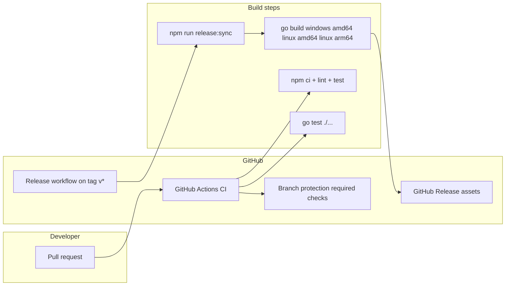

# UI/API coordination and Raspberry Pi deployment (§5–§6)

This file explains how the web UI and the JSON API cooperate inside a single running program, and how the whole thing is shipped to and run on a Raspberry Pi 4 Model B (a small, low-power single-board computer). It also covers how releases are built and published automatically. dlm ("Domestic Light & Magic") is a hobbyist app for controlling home LED light installations: one Go binary serves both the API and the embedded web UI.

Part of the [dlm architecture](architecture.md); see the [glossary](glossary.md) for unfamiliar terms.

---

## 5. UI ↔ API coordination (single process)

**In plain terms:** In production there is only one server — the Go binary. It serves the web page *and* answers the API calls the page makes. There is no separate Node.js server involved at runtime.

**Production flow:**

1. The user opens `https://host/` (or `http://host:8080/`).
2. The Go binary serves `index.html` and the JS/CSS. These files are "embedded" — compiled directly into the binary — so there are no loose web files to deploy.
3. React "hydrates" (the browser JS wakes up the static HTML into a live app); components then call `fetch('/api/v1/…')` — for example the models endpoints, or `/api/v1/status` if present. Those requests go to the *same* Go server.
4. Optionally, a reverse proxy (a front server such as Caddy or nginx that sits in front and forwards requests) terminates TLS and proxies everything to the one Go port. Per REQ-029 (see §3.18), enabling HTTP/2 toward clients here is recommended when many API requests are in flight at once.

There is no path-based split between a Node server and the Go server inside the product — Go handles both the page and the API.

**Development (non-shipping):** Engineers may run `next dev` (the Next.js hot-reload dev server) and either proxy its requests to the Go API, or run two ports plus CORS (Cross-Origin Resource Sharing, the browser rule that lets one origin call another). This is a developer convenience only and should be documented in the `README` as dev-only.

---

## 6. Raspberry Pi 4 Model B deployment

**In plain terms:** The Pi is a small ARM-based computer with limited CPU and RAM. dlm targets it by shipping one native executable, running it under `systemd`, and keeping heavy work (like 3D rendering) in the user's browser rather than on the Pi.

### 6.1 ARM64 and resources

ARM64 (also written `arm64`) is the 64-bit instruction set the Pi's CPU uses — different from the `amd64` used by most desktops/laptops.

- **Target:** a `linux/arm64` executable.
- **RAM:** A single Go process plus embedded static assets uses far less memory than running Go *and* Node. 2–4 GB can suffice for light use; 4 GB+ gives comfortable headroom.
- **CPU:** There is no server-side rendering (SSR) on the device — Go just serves files and JSON — which suits the Pi 4.

### 6.2 Process model

**In plain terms:** Only the app binary runs as a managed service. Light routines keep running headless on the server, so lights update even with no browser open.

- **One `systemd` service** — the application binary only. (`systemd` is the standard Linux service manager that starts programs on boot and restarts them if they crash.)
- **Scene routines (REQ-021 / REQ-038):** `internal/routineengine` (see §3.16–§3.17.2) runs a supervised `python3` process (§3.17) and a Go `time.Ticker`-driven shape simulation (§3.17.2) headless — meaning no browser tab is required for lights to keep updating. The UI only calls start/stop and observes progress via SSE (Server-Sent Events, a one-way stream from server to browser) or GET.
- **Python (REQ-022):** In production, execution uses the operating system's `python3` — it is not bundled into the Go binary (REQ-004). Pi docs should note installing `python3`, the child process's RAM use, and the loopback HTTP cadence back to §3.15. Pyodide (Python compiled to run in the browser) in the static bundle is optional and editor-only, for lint/format — see §3.17.
- **Optional proxy:** A separate `caddy.service` or `nginx` is OS/infrastructure, not part of REQ-004's product download. The product itself is one binary (Linux: plus sibling `runtime/cv/` from the archive).

### 6.3 Distribution (REQ-004 / anti-Docker)

**In plain terms:** You install dlm by copying one download (Windows: a bare `.exe`; Linux: unpack the `.tar.gz` so the binary and sibling `runtime/cv/` stay together — §6.6) plus an optional service file. Docker is deliberately not the primary path.

- **Canonical install:** copy the release binary (Linux: unpack the `.tar.gz` so the binary and sibling `runtime/cv/` stay together) plus an optional unit file. It is not Docker-first.
- **Docs** ([user guide](../userguide/), this file) must describe the binary + `systemd` path. Production does not require a Dockerfile or Docker Compose.

### 6.4 Networking

**In plain terms:** Go listens on a high port; an optional front proxy maps the standard web ports to it.

- Go binds `:8080` (or a configured port); a reverse proxy maps ports 80/443 to that socket.
- **REQ-029:** Enabling HTTP/2 (and TLS) on the proxy toward browsers reduces connection churn when many parallel `fetch` calls happen — see §3.18. The Go listener itself may stay HTTP/1.1 behind the proxy.

### 6.5 Browser WebGL / three.js on constrained clients (REQ-003, REQ-028)

**In plain terms:** The 3D view renders in the *user's* browser using WebGL (the browser API for GPU-accelerated graphics) via three.js, so the Pi's CPU is usually not doing the rendering — unless someone opens the UI on the Pi itself.

- Rendering runs in the user's browser, not on the Pi CPU — unless the user opens the UI on the Pi itself (Chromium on Raspberry Pi OS). REQ-028 emissive spheres (glowing light points) use standard three.js material paths — `MeshStandardMaterial` plus `emissive`/`emissiveIntensity` — which are broadly supported on WebGL2. Avoid depending on optional post-processing bloom for baseline compliance.
- **Integrated GPUs** (the Pi browser, older laptops): keep fragment (per-pixel) work bounded. The expected ceiling is ≤ 1000 instanced spheres plus tone mapping, as in §4.7; profile before adding extra render passes.

### 6.6 Canonical release targets and artifact map (REQ-043)

**In plain terms:** Every release publishes prebuilt downloads ("artifacts") for three OS/CPU pairs. Pick the one matching your machine. `GOOS`/`GOARCH` are the Go environment variables that select the target operating system and CPU when cross-compiling (building for a machine other than the one doing the build).

- **Windows desktop / laptop:** download `dlm_windows_amd64.exe` (`GOOS=windows` `GOARCH=amd64`) — bare executable (CV runtime bundle for Windows is optional / pending).
- **Linux x86_64:** download `dlm_linux_amd64.tar.gz` (`GOOS=linux` `GOARCH=amd64`) — archive contains the binary plus sibling `runtime/cv/` (§6.9).
- **Raspberry Pi (64-bit OS, REQ-003):** download `dlm_linux_arm64.tar.gz` (`GOOS=linux` `GOARCH=arm64`) — same archive layout. Do not deploy the amd64 archive on Pi 64-bit images.

### 6.7 GitHub Actions — continuous integration (REQ-044)

**In plain terms:** CI (continuous integration) is automation that builds and tests every change. GitHub Actions runs the test suite on each pull request and push to `main`.

- **Workflow** (example name `ci.yml`): triggers on `pull_request` and on `push` to `main` (or the default branch). Jobs should run in parallel where possible:
  - **Frontend:** `cd web && npm ci && npm run lint && npm test` (Node LTS — match the README/AGENTS pin).
  - **Backend:** `cd backend && go test ./...` (plus `go vet` / `staticcheck` if adopted) on `ubuntu-latest`, with a Go toolchain matching `go.mod` (≥ 1.25 per the module).
- **Optional integration job:** after the `release:sync` equivalent (build the web UI and copy it into `internal/webdist/`), run `go build ./cmd/server` on `ubuntu-latest`. This proves the embed tree and compile succeed, giving fast feedback before the slower release cross-builds.

### 6.8 GitHub Actions — release and downloadable binaries (REQ-044)

**In plain terms:** A separate workflow builds the three release assets (§6.6: Linux arm64/amd64 as `.tar.gz` with sibling `runtime/cv/`, Windows as `.exe`) and attaches them to a GitHub Release whenever a version tag is pushed.

- **Workflow** (example name `release.yml`): triggered by pushing a tag matching `v*` (a semantic version is recommended — e.g. `v1.2.3`), or manually via `workflow_dispatch` with a tag input (per team policy).
- **Steps (normative shape):**
  1. Checkout the tag.
  2. `npm ci` + `npm run release:sync` (or equivalent) to populate `backend/internal/webdist/`.
  3. Cross-compile per §3.4, then package Linux targets into `.tar.gz` (binary + sibling `runtime/cv/`) and stage the Windows `.exe` into `dist/` (or an artifact staging directory) with the §6.6 names.
  4. Attach those three release assets to a GitHub Release for the tag (`softprops/action-gh-release` or `gh release upload` — implementor's choice).

### 6.9 Deployment runtime prerequisites (REQ-045)

**In plain terms:** To *run* the shipped product you need the downloaded binary (Linux: unpack the `.tar.gz` so the binary and `runtime/cv/` stay side by side) plus normal OS facilities. `python3` is needed only when running user-authored Python scene routines; camera capture uses the sibling CV runtime.

- **Always:** no Node.js, no npm, and no Go toolchain on the Pi / production host to run the shipped product — only the downloaded binary (plus OS facilities like `systemd`). On Linux, keep the sibling `runtime/cv/` directory next to the binary after unpacking the release archive.
- **`python3`:** required on the server only when the operator runs user-authored Python scene routines (§3.17). The routine engine finds the interpreter via `PATH`, overridden by `DLM_PYTHON3` when set (an existing `internal/routineengine` convention). The minimum CPython version (e.g. 3.11+) must be stated in the [user guide](../userguide/) (for operators) and in this section after implementor verification.
- **Shape animation only** (no Python routines started): may run without `python3` installed. Starting a Python routine then fails lazily with a clear error — this resolves the REQ-045 open question.
- **Camera capture / OpenCV (REQ-048, mechanism B):** requires no separate Python install. The computer-vision (CV) pipeline runs from a product-shipped, self-contained OpenCV runtime (§3.23.1) that ships as a **sibling** `runtime/cv/` directory next to the binary inside the Linux release archive. The resolver looks beside the executable — it does **not** extract the bundle under `DLM_DATA_DIR`. This is distinct from the user-routine `python3` above: an operator who never authors Python routines but does use camera capture still needs no system Python. `docs/engineering/cv-runtime.md` and the [user guide](../userguide/getting-started.md) document the layout and on-disk footprint.

### 6.10 README operator documentation (REQ-046)

**In plain terms:** `README.md` is a short hobbyist landing page. Download, run, and `systemd` details live in the user guide so the README stays approachable.

- **`README.md`** (hobbyist-facing) stays short: what the product is, point at `./scripts/run.sh` for contributors, and link the [user guide](../userguide/) for operators. It must **not** expand into a full install/systemd tutorial, and must not mention `REQ-*` IDs (repository policy).
- **Download / first run:** documented in [`docs/userguide/getting-started.md`](../userguide/getting-started.md) — choose the §6.6 asset from GitHub Releases, unpack Linux `.tar.gz` (keep `runtime/cv/` beside the binary), `chmod +x` on Unix, run with `HTTP_LISTEN` unset defaulting to `:8080` per `internal/config`.
- **Raspberry Pi as a service:** documented in [`docs/userguide/running-as-a-service.md`](../userguide/running-as-a-service.md) — worked `systemd` unit (`User=`, `WorkingDirectory=`, `Environment=DLM_DATA_DIR=…`, `ExecStart=` with the full path to the binary, `Restart=on-failure`) so the service starts on boot.
- **Updating:** stop the service → replace the binary (and sibling `runtime/cv/` from the new archive) → `systemctl daemon-reload` (if the unit changed) → start the service. Note that the SQLite file lives under `DLM_DATA_DIR` / `DLM_DB_PATH` and should be preserved across updates unless release notes require a migration.
- The developer build via `./scripts/run.sh` stays documented as the local contributor path (REQ-008), with detail in `docs/engineering/` if needed.

### 6.11 Branch protection and merge gates (REQ-044)

**In plain terms:** Branch protection is a GitHub setting that blocks merges until required checks pass. dlm requires the CI checks to be green before code lands on `main`.

- **Repository settings:** require the status checks from the CI workflow (§6.7) to pass before merging PRs into `main`. The exact check names depend on the workflow's job IDs — the implementor lists them in `docs/engineering/` for maintainers.
- **Release cut procedure (maintainers):** document in `docs/engineering/` — tag `vX.Y.Z`, push the tag, and verify the release workflow uploads the §3.4 artifacts.

### 6.12 CI/CD automation boundary (REQ-044)

**In plain terms:** CI/CD means the automated build/test (CI) and build/publish-on-tag (CD) pipelines. The diagram below shows where each piece runs: pull requests trigger CI and required checks; a `v*` tag triggers the release workflow that builds and publishes the assets.

---
