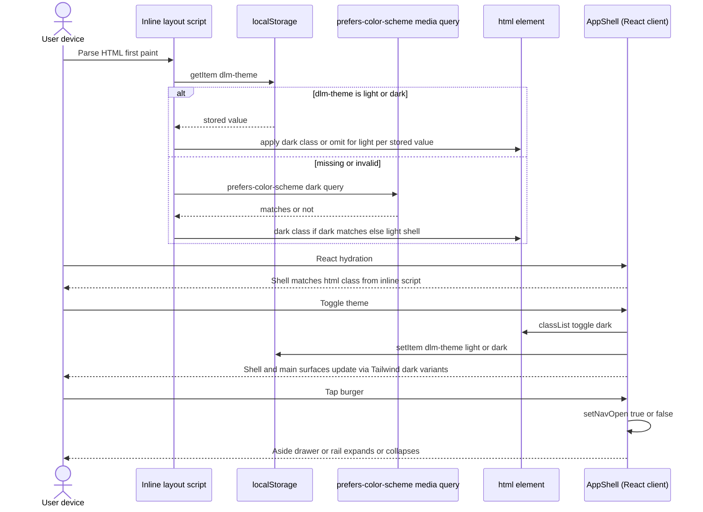
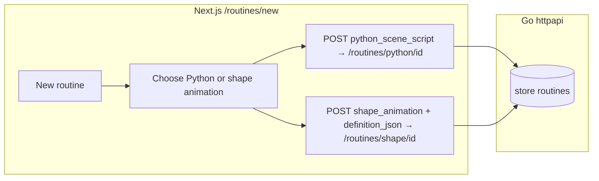
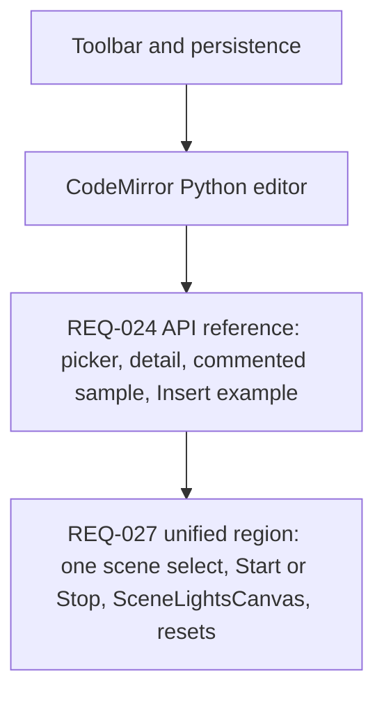
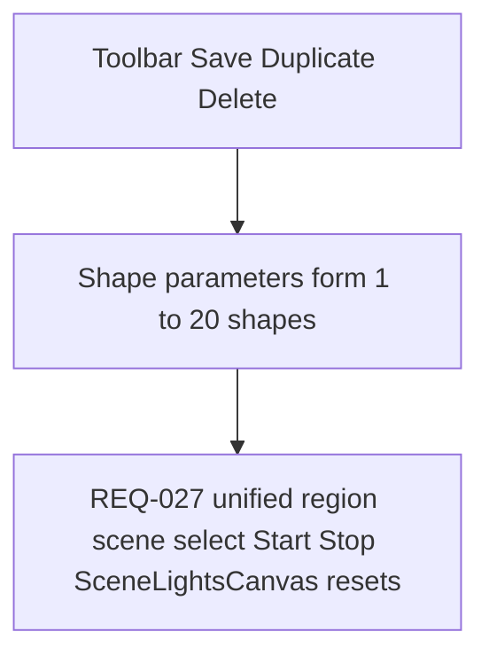

# Frontend: Next.js, Tailwind, and three.js (§4)

This is the authoring/build-time side of dlm: the Next.js web UI that a hobbyist uses to import 3D light models, compose scenes, run routines, and watch the lights change live in a 3D view. The UI is built to a **static export** (plain HTML/JS/CSS with no Node server at runtime), embedded into the Go binary, and talks to the Go API from the browser with `fetch` and `EventSource`. This document explains how each screen and the three.js (a WebGL 3D library) viewport are put together.

Part of the [dlm architecture](architecture.md); see the [glossary](glossary.md) for unfamiliar terms.

## 4. Next.js + Tailwind (build-time / authoring)

**In plain terms:** The frontend is a normal Next.js + Tailwind app, but with one hard constraint: it must compile to a static export and run entirely in the browser. Everything below flows from that rule.

### 4.1 Stack

**In plain terms:** Standard Next.js App Router, Tailwind, and TypeScript, configured for static HTML output.

- **Next.js App Router** under `web/app/` for structure and layouts.
- Tailwind + TypeScript, as today.
- `next.config`: set `output: 'export'` (static HTML export). For `images`, use `unoptimized: true` or avoid `next/image` features that are incompatible with export.

### 4.2 Runtime-incompatible patterns (must not ship)

**In plain terms:** Anything that needs a live Node server at runtime is banned, because at runtime there is no Node — just the Go binary serving static files.

Do not ship:

- `next start`, standalone Node output, SSR (server-side rendering) dependencies, or Route Handlers/middleware that must execute on Node to handle navigations, and rewrites that proxy HTML to a separate upstream.
- Server Components (React components rendered on the server) that fetch at request time without a static `generateStaticParams` strategy. For the MVP, prefer a client-side `fetch` to `/api/v1/...` instead.

### 4.3 Data access patterns (shipped UI)

**In plain terms:** In the shipped UI you get data two ways — a normal `fetch` for requests, and an `EventSource` (a browser Server-Sent Events / SSE stream) for live pushed updates.

| Pattern | Use |
|--------|-----|
| Client `fetch('/api/v1/...')` | Primary pattern for the reactive UI (REQ-002), against the same Go origin. The browser reuses connections per origin by default; prefer batch/bulk endpoints when updating many lights at once (§3.18, REQ-029). |
| `EventSource` on `…/lights/events` (REQ-041) | Required for the shipped live three.js viewports (§4.7, §4.9, §4.13, §4.14). Open it after the initial `GET`, merge the `deltas[]` from each `message`, and on failure reconnect plus do one snapshot `GET`, per §3.18. |
| Build-time static | `generateStaticParams` / SSG only if values are fixed at build time. The API must still be available at runtime wherever live data is needed. |

### 4.4 Environment

**In plain terms:** There is no server injecting env vars at runtime, so client code calls the API using relative URLs on the same origin.

- The runtime UI has no `process.env.NEXT_PUBLIC_*` server injection from Node. At build time you may set `NEXT_PUBLIC_API_BASE` to `''` (same origin) so client code calls relative URLs.

### 4.5 Responsive behavior (REQ-002)

**In plain terms:** The UI must work on mobile, tablet, and desktop, so use responsive Tailwind styles and mark interactive components as client components.

Unchanged intent: Tailwind breakpoints, touch-friendly targets, and `"use client"` (Next.js marker for a Client Component — code that runs in the browser) for interactivity.

### 4.6 Models UI (REQ-002, REQ-006, REQ-010, REQ-011, REQ-012, REQ-014)

**In plain terms:** The Models area lists models (a model = a set of 3D light positions), lets you upload one, and shows a detail page with a table of lights plus a 3D view and controls to change light state.

- **Routes (App Router):** e.g. `/models` (list), `/models/new` (upload form: a **name** text input plus a **file** input), `/models/[id]` (detail: metadata, the §4.8 paginated light table plus the §4.7 3D view, per-light or bulk controls per REQ-011 / REQ-013, and a **Reset lights** button calling `POST …/lights/state/reset` per §3.11 (REQ-014)). Everything must be reachable on mobile / tablet / desktop with no hover-only interactions. **Model delete control:** on a `409` `model_in_scenes`, show `error.message` and `details.scenes` (names/links to `/scenes/{id}`) per §3.13.
- **Client data:** `"use client"` pages/components call `fetch` with `GET`, `POST` (`FormData` for multipart uploads), `DELETE`, and `PATCH` (JSON) against `/api/v1/models…` on the same origin (§4.3).
- **Feedback:** Inline or banner display of the `400` / `409` `message` from the API; loading states on list, detail, upload, and delete (REQ-002).
- **Navigation:** The primary IA (information architecture — how you get around the app) is the collapsible left nav in §4.11 (Models, Scenes, Routines, Devices, Options, and home `/` if distinct). There must be no hover-only path to these destinations (REQ-002, REQ-018).

### 4.7 Three.js visualization on model detail (REQ-010, REQ-012, REQ-016, REQ-019, REQ-028, REQ-031, REQ-034, REQ-041)

**In plain terms:** This is the core 3D view. Each light is a small sphere, "on" lights glow with their colour, "off" lights are faint grey, a faint wire connects consecutive lights, and a faint box shows the model's bounds. It updates live over SSE and lets you click lights to inspect them.

**Dependency:** Declare `three` in `web/package.json` as a **direct** dependency (satisfies REQ-010 business rule 2). Pin a stable semver range in the lockfile; bump intentionally when upgrading. Using `@react-three/fiber` / `@react-three/drei` is optional — but if used, `three` MUST still appear directly in `dependencies` (not only as a transitive peer).

**Where:** The model detail route (`/models/[id]` or equivalent, e.g. `/models/detail?id=` for static export) must mount a client-only visualization after `GET /api/v1/models/{id}` returns `lights` including `on`, `color`, `brightness_pct` (§3.6, §3.9). All geometry uses world-space meters (REQ-005 / REQ-009).

**SSR / static export:** WebGL is browser-only, so the three.js entry must run only on the client — e.g. `"use client"` + `WebGLRenderer` after mount, or `next/dynamic` with `ssr: false`. Do not assume `window`, `document`, or a GPU exists during Node prerender of that subtree.

#### Geometry and materials (REQ-010 rules 4–5, 7; REQ-012; REQ-028)

- **Per-light marker:** Each light is a sphere with **diameter 0.02 m** (2 cm) → a `SphereGeometry` with radius `0.01`.
- **Canonical visualization grey:** `#D0D0D0` — parse once to a `THREE.Color` and reuse it for the wire segments and the "off" spheres (REQ-010 / REQ-012).
- **On vs off (REQ-012):**
  - `on === true`: A filled, opaque (or effectively opaque) surface that also satisfies REQ-028 (emissive glow — a material that appears to glow; see the subsection below). Canonical material: `MeshStandardMaterial` (or `MeshPhysicalMaterial`) with `side: FrontSide`, `transparent: false` (or opacity 1), `metalness: 0`, and `roughness` in ~0.25–0.45 (pick constants and document them in code). For the base `color`, parse the API `color` hex to a `THREE.Color`, convert to linear working space as appropriate for the renderer, then multiply RGB by `brightness_pct / 100` for the diffuse albedo (REQ-012), clamping each channel to [0,1]. `MeshBasicMaterial` without an additional documented glow technique does not meet REQ-028. At `brightness_pct === 0`, the "on" sphere MAY appear nearly black with minimal emissive; note that "off" in the persistence sense still means `on: false`.
  - `on === false`: A filled sphere (same geometry as "on") with `MeshBasicMaterial` (or equivalent): `color` = `#D0D0D0`, `transparent: true`, `opacity: 0.15` (85% transparency per requirements), and `depthWrite: false` if needed to reduce z-fighting with the segments and neighbors. `emissive` MUST be black and `emissiveIntensity` MUST be 0 if the material exposes those fields (REQ-028 rule 4). Do not make "off" lights look more visually prominent than "on" lights or than the wire segments (REQ-012).
- **Emissive glow (REQ-028, on lights only):**
  - `emissive`: Set from the same hex as the light (typically the linear RGB of the parsed `color`, either before or after brightness scaling — choose one rule and apply it consistently so the hue matches the sphere).
  - `emissiveIntensity`: Map `brightness_pct` (0–100) monotonically to a non-negative intensity, e.g. `k * (brightness_pct / 100)` with a documented `k` (tune ~0.6–1.2 so 100% reads clearly bright on `VIZ_VIEWPORT_BG` and low percents read weaker), or `k * max(ε, brightness_pct/100)^γ` with a small ε and γ ≥ 1 for perceptual spacing. A higher `brightness_pct` MUST never produce a weaker glow than a lower `brightness_pct` for the same `color` (REQ-028 rule 3).
  - **Scene lights in three.js:** Use a modest `AmbientLight` and optionally a very low-intensity `DirectionalLight` so the non-emissive shading does not flatten or wash out the emissive read; avoid bright key lights that make all spheres look evenly lit plastic.
  - **Clipping and many 100% lights (REQ-028 open question):** Apply a per-instance cap on `emissiveIntensity` after the brightness curve if needed; use renderer `outputColorSpace = THREE.SRGBColorSpace` (or the current equivalent) and sane `toneMapping` (e.g. `ACESFilmic` or `Reinhard`) with `toneMappingExposure` tuned so the frame does not blow out to flat white. Prefer this over mandatory full-screen bloom passes on Pi-class or integrated GPUs unless profiling shows headroom (§6.5).
  - **Instancing:** When using `InstancedMesh` (one mesh that efficiently draws many copies) for on lights, either use one shared `MeshStandardMaterial` with per-instance `setColorAt` / `instanceColor` for the base and a custom `onBeforeCompile` or `ShaderMaterial` variant for per-instance `emissiveIntensity`, or document an equivalent approach (e.g. rebuild instance attributes on state change — O(n) is acceptable for n ≤ 1000).
- **Draw all lights (no omission):** For n lights (n ≤ 1000), the scene must contain exactly n visible markers at the correct positions — no decimation. **Rendering strategy (implementor picks one):**
  - **A.** Two `InstancedMesh` layers: (1) on lights — `InstancedMesh` + `instanceColor` (with brightness factored per instance or via a custom attribute); (2) off lights — a second `InstancedMesh` with the shared `#D0D0D0`, `opacity 0.15`, non-wireframe material. When `on` toggles, move instances between layers or rebuild both from authoritative state (O(n) OK for n ≤ 1000).
  - **B.** Up to n individual `Mesh` nodes — acceptable if performance on Pi-class clients remains acceptable.
- **Wire polyline (REQ-005 chain, REQ-010):** `LineSegments` (or `LineBasicMaterial` lines) only between (i, i+1) for i = 0 … n−2. Colour `#D0D0D0`, `transparent: true`, `opacity: 0.15`; `linewidth` where supported is thin (note: WebGL line width is often 1 px). The segments must read subtler than the spheres. Style does not vary with on/off (REQ-012 is out of scope for segment state).
- **Shared wire material (REQ-034 rule 6):** Export one reusable constant or factory, e.g. `makeFaintWireLineMaterial()` in `web/lib/`, that returns a `LineBasicMaterial` (or documented equivalent) with the same `#D0D0D0` / `opacity` 0.15 as the chain segments above. Use it both for the inter-light segments and for the 12-edge axis-aligned boundary cuboid (REQ-034 — the tight light AABB (axis-aligned bounding box) ± 0.3 m padding on the model view) so the box and wire read as one visual family.
- **Boundary cuboid geometry (REQ-034):** Build the 12 edges as a single `THREE.LineSegments` whose `BufferGeometry` is derived from `new THREE.EdgesGeometry(new THREE.BoxGeometry(width, height, depth))` (or the equivalent manual 12-edge buffer) and positioned at the AABB centre. Dimensions come from the shared helper `boundaryCornersForLights(lights, margin)` in `web/lib/vizViewport.ts`, which returns `{ min: Vec3, max: Vec3 }` after expanding the tight AABB by `margin` on each axis in both directions (REQ-034 rule 2). The model view uses the exported constant `MODEL_BOUNDARY_MARGIN_M = 0.3` (REQ-034 rule 2 — fixed, not user-editable in MVP).
- **Boundary cuboid framing (REQ-034 + REQ-016):** The default framing distance must use the padded AABB, not the tight light bounds alone, so the cuboid is fully visible on first mount and after Reset camera (REQ-016). Canonical formula: `framedDim = max(sizeX, sizeY, sizeZ) + 2 * margin` where `sizeX/Y/Z` are the tight light-bound extents and `margin` is `MODEL_BOUNDARY_MARGIN_M` (model view) or the scene's persisted `margin_m` (scene view).
- **Boundary cuboid rebuild trigger (REQ-034 rule 4 + REQ-041):** Rebuild the boundary `LineSegments` only when (a) the tight light AABB changes (positions added / removed / moved — the existing `structureSig` / scene item structure signature already captures this) or (b) `margin` changes (model: constant, never changes at runtime; scene: `margin_m` PATCH echo per §3.13). Per-light `on` / `color` / `brightness_pct` SSE deltas (REQ-041) MUST NOT trigger a boundary rebuild — the box only tracks geometry, never state.
- **Boundary cuboid material (REQ-034 rule 6):** Reuse `createInterLightWireLineMaterial()` (`web/lib/vizWireMaterial.ts` — `#D0D0D0`, `opacity: 0.15`, `transparent: true`, `depthWrite: false`, `linewidth: 1`) so the box and the REQ-010 chain segments read as one visual family. Do not use a separate darker/brighter material, and do not fill the box with a surface.
- **Framing (baseline for REQ-016):** Implement a pure helper `applyDefaultFraming(bounds: THREE.Box3, camera, controls, viewportWidth, viewportHeight)` (name local to the codebase) that:
  - Sets `controls.target` to the center of `bounds` (the AABB of all light positions ± 0.01 m sphere radius).
  - Positions `camera` outside the bounds on a stable direction (e.g. normalized `(1, 1, 1)` from center, scaled so the entire bounds fits in the vertical and horizontal FOV with a small padding factor ≥ 1.1) — document the chosen vector and padding in code comments so reset and first load match.
  - Calls `camera.updateProjectionMatrix()` and `controls.update()` as needed after `ResizeObserver`-driven size changes.
- **Initial load:** After `lights` arrive, compute `bounds`, then call `applyDefaultFraming` once.
- **Reset camera (REQ-016):** A secondary button (e.g. labelled "Reset camera") next to the canvas toolbar or in an overlay corner calls `applyDefaultFraming` again using the current `lights` bounds (recomputed if data changed) — no `fetch`. Repeat clicks yield the same baseline for the same `lights` and viewport size (REQ-016 rule 4). Architectural resolution for the REQ-016 open question: reset affects only the camera and `OrbitControls` (mouse/touch orbit-zoom-pan controls) state; the implementor MAY clear the hover/tap label for less confusion but is not required to clear list selection or pagination.

#### State sync (REQ-012 rule 3; REQ-041 push + deltas; REQ-031 elision)

**In plain terms:** After you change a light and the write succeeds, update the 3D view immediately; also keep a live SSE stream open to reflect changes made elsewhere, and skip redundant redraws when nothing actually changed.

- **After a successful `PATCH …/lights/{lightId}/state`**, `PATCH …/lights/state/batch` (§3.10, REQ-013), or `POST …/lights/state/reset` (§3.11, REQ-014) initiated from this browser session, the client must merge the JSON response and update the three.js meshes before the next `requestAnimationFrame` paint following the `fetch` resolution (i.e. no indefinite staleness after a confirmed write). REQ-031: when the merged per-light state is equivalent to what was already rendered (§3.19 normalization), skip the redundant mesh/material/instance rebuild for those lights (§3.19 client subsection).
- **Live observer (REQ-041):** While `/models/[id]` is mounted, keep `EventSource` on `GET /api/v1/models/{id}/lights/events` open; on each event, apply `deltas[]` incrementally per §3.18 without tearing down the scene graph. Do not run a parallel `setInterval` full-state poll at ≤ 2–5 s while SSE is healthy. If SSE disconnects, do one `GET …/lights/state` or model detail `GET`, then re-open `EventSource`. Degraded browsers: slow polling only as the §3.18 fallback.

#### Picking, hover, and touch (REQ-010 rule 6; REQ-012 rule 4)

**In plain terms:** Clicking or tapping into the 3D scene must identify which light is under the cursor and show its details, on both desktop (hover) and touch devices (tap).

- **Raycasting:** Use `THREE.Raycaster` (raycasting = shooting a ray into the 3D scene to find what's under the cursor) against the same meshes used for the filled/wire markers (the union of both `InstancedMesh` layers or all `Mesh` targets). Map `instanceId` / object back to `lights[i]`.
- **Desktop hover:** Show `id`, `x`, `y`, `z`; MAY also show `on`, `color`, `brightness_pct` (the REQ-012 open question is resolved here as optional but recommended for debuggability).
- **Touch / tablet equivalent:** Same tap threshold behavior as before; the pinned label may include state fields.

**Interaction (orbit, REQ-002, REQ-016):** Retain `OrbitControls` for rotate / zoom / pan; touch gestures as today. The REQ-016 reset does not change polar/azimuth limits unless they are already set; if limits exist, ensure the default camera pose remains within them or temporarily relax limits during reset (implementor picks the simplest consistent behavior).

**Layout:** The WebGL canvas sits in a responsive container (full width, bounded height via `min-h-[…]` / a max viewport height). A `ResizeObserver` updates `camera.aspect` and `renderer.setSize`.

**Viewport background (REQ-019):** Independently of the REQ-018 shell light/dark theme, set `scene.background` and `WebGLRenderer.setClearColor` (same RGB) to one fixed dark grey that clearly reads as grey (not white or near-white) — architecture default `#262626` (≈ Tailwind `neutral-800`), centralized as a named constant e.g. `VIZ_VIEWPORT_BG` in `web/lib/` so the model and scene canvases stay aligned. If the canvas is letterboxed inside a wrapper, style that wrapper (and any padding region inside the same visual frame as the WebGL element) with the same hex so light shell mode does not show white margins around the 3D view. Do not tie this colour to `html` `dark` or to shell `bg-white`/`bg-gray-900` tokens.

**Edge cases:** `n === 0`: initialize the renderer + an empty scene + overlay copy; no spheres or segments. `n === 1`: one sphere, no segments. WebGL unavailable: inline / console error is acceptable per the prior REQ-010 note.

**Testing note:** Unit-test the pure helpers (hex + brightness → `THREE.Color`, segment vertex pairs, instance matrices, pick index) in `web/lib/`; manually verify on/off appearance, PATCH refresh, and hover and tap on mobile + desktop.

### 4.8 Model detail: paginated light list, go-to-id, multi-select, bulk apply (REQ-013)

**In plain terms:** The detail page loads all lights in one fetch, then paginates the table client-side (25/50/100 per page). You can jump to a light by id, multi-select rows across pages, and apply on/off/colour/brightness to the whole selection at once.

**Data source:** The detail page already loads all `lights` (positions + state) via `GET /api/v1/models/{id}` (§3.6, §3.9). Pagination is purely client-side: slice `lights` by `page` and `pageSize` so REQ-005's n ≤ 1000 stays a single HTTP fetch while the table shows one page at a time.

**Page size:** Expose exactly three choices: 25, 50, 100 lights per page (REQ-013 rule 2). Default `pageSize = 50`. Changing the page size resets `page` to 1, or clamps so the first light on the prior page stays visible if possible (implementor picks the simplest: resetting to 1 is acceptable).

**Trivial case:** For n = 1 light, REQ-013 allows omitting pagination chrome or showing a single row without page controls.

**Navigation controls:** Previous / Next (disabled at bounds); "Page X of Y" (derived from n and `pageSize`); optional first/last if space allows (REQ-002 touch targets).

**Go to light id:** A text field (or number input) + "Go" / submit: parse an integer; if `id ∉ [0, n−1]`, show an inline error (do not change page); else set `page = floor(id / pageSize) + 1` (0-based indexing: the `page` for `id` is `⌊id / pageSize⌋ + 1` in 1-based UI terms). Scroll or focus the row for that id if the table is scrollable within the page.

**Multi-select:**

- **Per row:** a checkbox in the first column (touch-friendly, REQ-002).
- **Header:** "Select page" toggles all ids on the current page only.
- **Shift+click** (desktop): optional range select between the last anchor and the clicked row, on the same page only (reduces accidental cross-page ambiguity).
- **Cross-page selection (architectural resolution for REQ-013 open question):** Maintain `selectedIds: Set<number>` in component state. Changing pages does not clear the selection. A "Clear selection" button and unmounting the detail route do clear it. Bulk apply sends `selectedIds` (as an array) to `PATCH …/state/batch`.

**Bulk apply panel:** When `selectedIds.size ≥ 1`, show controls mirroring the REQ-011 fields: on/off toggle, colour (`#RRGGBB` input or picker), brightness (0–100). Apply calls `PATCH /api/v1/models/{id}/lights/state/batch` (§3.10). Disable Apply while the request is in flight; on success, merge `states` into `lights` and refresh the table + the §4.7 scene (REQ-012). On `400`, show the API `message`.

**Accessibility / responsive:** The table MAY stack as cards on narrow viewports; checkboxes and the bulk panel remain reachable without hover-only affordances (REQ-013 rule 7).

### 4.9 Scenes UI and composite three.js (REQ-015, REQ-010, REQ-012, REQ-016, REQ-019, REQ-021, REQ-022, REQ-023, REQ-027, REQ-028, REQ-029, REQ-031, REQ-033, REQ-034, REQ-041, REQ-042)

**In plain terms:** A scene combines several models into one 3D space. This screen creates/edits scenes, shows a combined 3D view (`SceneLightsCanvas`) with live updates, lets you start/stop routines against the scene, edit per-model offsets and the boundary margin, and reuses the §4.7 rendering rules.

- **Routes:** `/scenes` (list), `/scenes/new` (create flow: a scene name + an ordered multi-select of ≥ 1 model — no per-row offset inputs; submit `POST /api/v1/scenes` with `models` in that order and let the server compute offsets per §3.12), `/scenes/[id]` (detail composite view + optional offset editing via `PATCH …/models/{modelId}` after create).
- **Routines on scene detail (REQ-021, REQ-022, REQ-023, REQ-033):** A panel or toolbar with `GET /api/v1/routines` (a `<select>` or list — each row shows the `type` or an icon for Python vs shape animation); `POST …/start` and `POST …/stop` with Font Awesome icons. After `GET …/routines/runs`, show the active run (name + Stop) or "No routine running". On a `409` `scene_routine_conflict`, surface `error.message`. An optional "Edit routine" → `/routines/python/[id]` or `/routines/shape/[id]` by `type` (§4.13 / §4.14) — this must not replace the primary create via `/routines/new` (§4.12).
- **Data:** `GET /api/v1/scenes`, `POST /api/v1/scenes`, `GET /api/v1/scenes/{id}`, `POST …/models`, `PATCH …/models/{modelId}`, `DELETE …/models/{modelId}`, `DELETE /api/v1/scenes/{id}` per §3.13. On a `409` `scene_last_model`, show modal copy that removing the last model deletes the entire scene; on confirm, `DELETE /api/v1/scenes/{id}` then redirect to `/scenes`.
- **Live updates (REQ-012, REQ-029, REQ-031, REQ-041):** While `/scenes/[id]` is mounted, open `EventSource` on `GET /api/v1/scenes/{id}/lights/events` after the initial `GET /api/v1/scenes/{id}`; merge each `deltas[]` payload into `SceneLightsCanvas` incrementally per §3.18 (no full graph rebuild when only a subset of lights changed). Both routine runs (`GET …/routines/runs` shows `running`) and idle scenes use the same SSE path for external / server-driven changes. Do not replace SSE with a `GET …/scenes/{id}` every ≤ 2 s while the stream is healthy. On SSE failure, do one snapshot `GET`, then reconnect (§3.18).
- **Composite three.js:** Refactor or duplicate the §4.7 patterns into a `SceneLightsCanvas` (or extend `ModelLightsCanvas`) that accepts `items[]`: for each model, build the same 2 cm spheres and `#D0D0D0` `opacity` 0.15 segments between consecutive `id` only within that model, using `sx`, `sy`, `sz` from the API (or client-composed positions identical to the server rules). No segments between models. Per-light state materials match §4.7 (REQ-012, REQ-028 emissive rules). REQ-034: draw one scene-space padded AABB wire (tight bounds over all `sx,sy,sz` + the scene `margin_m` per §3.12 / §3.13) using the same shared faint line material as the §4.7 chain segments. Apply the same REQ-019 fixed dark-grey viewport treatment as §4.7 (scene background + renderer clear + letterbox wrapper). Picking must identify which model and which light id for hover/tap (show scene coordinates and model id + light `id` as needed).
- **Framing (REQ-016):** Fit the camera to the tight light AABB over all scene-space positions `(sx,sy,sz)` expanded by the scene's persisted `margin_m` (framing margin — §3.12 / §3.15), plus a marker-radius margin, using the same `applyDefaultFraming` pattern as §4.7. A "Reset camera" control on the scene canvas re-invokes that same fit (no API call).
- **Add model control:** calls `POST …/scenes/{id}/models` without offsets to get the default +X placement, or with explicit integers after user edit. Placement inputs validate ≥ 0 client-side for fast feedback; authoritative errors come from API `400`.
- **Boundary margin editor (REQ-015 BR 13 / REQ-034):** Scene detail must expose a numeric input labelled e.g. `Boundary margin (m)` bound to the scene's persisted `margin_m` (from `GET /api/v1/scenes/{id}`). Step `0.05`, `min: 0`, `max: 5`, with 2 decimals shown; the `Apply` button (REQ-002 — not hover-only) submits `PATCH /api/v1/scenes/{id}` with `{ "margin_m": <parsedFloat> }` per §3.13 and surfaces `invalid_margin_m` inline on a `400`. Optimistic preview: the input MAY drive `SceneLightsCanvas` with the pending value (via a local `pendingMarginM` state) so the boundary cuboid "breathes" as the user drags, but the value must NOT be considered persisted until the PATCH resolves 200; on error, revert to the last server-confirmed value. `SceneLightsCanvas` must NOT rebuild the light cloud on `margin_m` changes — only the boundary `LineSegments` and the camera framing distance (REQ-041 incremental rule, §4.7). `/scenes/new` does not need a margin input — the server applies the `0.3` default on create; users edit it afterward on scene detail.
- **REQ-002:** Same touch/pointer expectations as model detail; no hover-only blocking flows for add/remove/confirm.

### 4.10 Options and factory reset (REQ-017)

**In plain terms:** A simple Options page holds destructive maintenance actions. The main one is Factory reset, which wipes all data (behind a confirm dialog) and restores the sample models.

**Route:** `/options` (App Router) or an equivalent single page with `<h1>Options</h1>` (or the product title + "Options") and a short explanation that this area holds destructive maintenance actions.

**Information architecture:** "Options" lives in the same collapsible left navigation as Models, Scenes, and Routines (§4.11); when the aside is collapsed on mobile, open it with the burger to reach primary destinations (REQ-002, REQ-018).

**Factory reset row:** A primary button or destructive-styled control labeled Factory reset (or Reset all data) opens a native `<dialog>` or modal with:

- A title, e.g. "Erase all data?"
- Body text stating explicitly that all models (including uploads), all scenes, and all saved routines (built-in and Python, including any routine run records) will be permanently deleted, that the action cannot be undone, and that after completion only the three default sample models will remain.
- Cancel (default focus on desktop where appropriate) closes with no request.
- Confirm (e.g. button label Erase everything) submits `POST /api/v1/system/factory-reset` (disable while in-flight to prevent double submit).

**Client behavior on success:** On `200`, clear any client-cached model/scene detail state (React Query cache or router refresh); navigate to `/models` via `router.push` or `router.replace` and show a non-blocking success banner e.g. "All data was reset. Sample models were restored." This resolves the REQ-017 post-reset navigation open question as the architectural default.

**Client behavior on failure:** Show the API `error.message` or generic failure text; leave the user on Options with the dialog closed or open per UX consistency.

**REQ-017 typed phrase (e.g. type RESET):** Not required for the MVP per this architecture (optional hardening later).

**Accessibility:** The modal must trap focus or use a native `dialog` with visible Cancel/Confirm; Escape cancels if the implementor enables it (recommended).

### 4.11 Application shell, themes, navigation, and Font Awesome (REQ-018)

**In plain terms:** One `AppShell` client component wraps every page and provides the header (burger, brand, theme toggle), the collapsible left nav, light/dark theming, and consistent Font Awesome icons on buttons.

**Goal:** One client-side shell wraps all App Router pages (`web/app/layout.tsx` mounts `AppShell` as a `"use client"` wrapper or a layout composition that does not break static export): branding, theme, burger/aside, and icon conventions stay consistent across models, scenes, and options.

#### Layout structure

- **Top header** (full width, sticky optional):
  - **Burger `<button>`** (left): toggles `navOpen` state; icon `faBars` (solid) or an equivalent from the same Font Awesome Free kit.
  - **Branding** (after the burger): `FontAwesomeIcon` with `faLightbulb` from `@fortawesome/free-regular-svg-icons` — the same glyph as [Font Awesome lightbulb classic regular](https://fontawesome.com/icons/lightbulb?f=classic&s=regular). The adjacent visible title text must be exactly `Domestic Light & Magic` (REQ-018 rule 5).
  - **Theme toggle `<button>`** (right, or next to branding per space): icons `faSun` / `faMoon` (solid), or one icon that flips with `aria-pressed`; toggles between light and dark modes.
- **Left `<aside>`** (primary navigation):
  - **When expanded:** a vertical list of `next/link` entries (or buttons that `router.push`) for `/` (home), `/models`, `/scenes`, `/routines`, `/options` — each row is a button-styled control with a Font Awesome icon + label (REQ-018 rule 7). Do not add a separate nav destination that only creates Python routines (REQ-023 — Python is chosen on `/routines/new` via a `type` `<select>`, §4.12).
  - **When collapsed (narrow viewport):** the aside is off-screen or `hidden` except as an overlay drawer (a full-height `fixed` panel with `z-index` above `main`) opened by the burger; tapping a backdrop or a close control dismisses the drawer (REQ-018 responsive notes — no focus trap without escape).
  - **When collapsed (wide desktop):** an optional pattern — a narrow rail (icons only) vs full labels; the burger still toggles between those two widths so REQ-018 "collapsible left menu" is satisfied even if the default is expanded at `lg+`.
- **`<main>`** fills the remaining width with page content; apply the shell background/text tokens here per REQ-018. The three.js viewports (REQ-019) do not inherit the shell background for the WebGL clear / scene fill: they use the fixed dark-grey policy in §4.7 regardless of the light/dark shell.

#### Theming (Tailwind)

- **Mechanism:** Enable Tailwind `darkMode: 'class'` (v3) or the v4 equivalent so light = the absence of `dark` on `<html>`, dark = `class="dark"` on `<html>` (set from a small client effect on mount + on toggle).
- **Initial vs persisted (REQ-018 rule 1):** On load, if `localStorage` `dlm-theme` is `light` or `dark`, apply that value and ignore `prefers-color-scheme` for the shell. If the key is absent or invalid, read `window.matchMedia('(prefers-color-scheme: dark)')` (or equivalent) and apply `dark` when it matches, else `light` when the API exists but does not match dark; if no media-query signal is available, default the shell to `light`. When the user presses the theme toggle, write `dlm-theme` to `light` or `dark` and update `<html>` immediately. Optional product enhancement (not required by REQ-018): a third "Use system" control that removes `dlm-theme` and re-subscribes to `prefers-color-scheme` changes.
- **Tokens** (implement via Tailwind `bg-*`, `text-*`, `border-*` with `dark:` variants):
  - **Light:** `bg-white` (or `bg-neutral-50`) for the shell + `main`; `text-gray-900` (or `text-neutral-900`) for primary reading text and nav labels.
  - **Dark:** `bg-gray-900` for the shell + `main` — dark grey background per REQ-018 (not `#000` as the only choice); `text-white` for primary text. Cards/panels inside `main` MAY use `bg-gray-800` for elevation contrast against `bg-gray-900` (the architecture allows one step lighter grey for nested surfaces).
- **Contrast:** Keep WCAG-minded pairings for shell body text vs surface (REQ-018). The three.js backdrop is governed by REQ-019 (§4.7) and is not required to match the shell grey; pick helper/grid colours that stay visible on `VIZ_VIEWPORT_BG` without competing with lights and segments.

#### Font Awesome (delivery and licensing)

- **Packages** (npm, bundled into the static export): `@fortawesome/fontawesome-svg-core`, `@fortawesome/react-fontawesome`, `@fortawesome/free-regular-svg-icons` (contains `faLightbulb`), `@fortawesome/free-solid-svg-icons` (e.g. `faBars`, `faSun`, `faMoon`, `faTrash`, `faUpload`, `faPlus`). Pin versions in `package-lock.json`; respect the [Font Awesome Free license](https://fontawesome.com/license/free) (attribution in `README` or About if required by the license at ship time).
- **Alternative not preferred for MVP:** a Kit script tag from a CDN — it adds a runtime network dependency and complicates offline/Pi use; SVG-in-JS tree-shaking above is the default architecture.
- **Button rule (REQ-018 rule 7):** Every `<button>` used for actions (submit, delete, cancel, reset, camera reset, pagination, bulk apply, modal confirm/cancel, factory reset, go to id, etc.) must render a `<FontAwesomeIcon icon={…} />` before or after the visible label (consistent placement per component family). Exempt: native form fields (`<input>`, `<textarea>`, `<select>`, `type="file"`) and plain text links without button styling. Button-styled links whose `className` matches the primary/secondary button treatment must also include an icon. Icon-only buttons must have an `aria-label` or visually hidden text.

#### Interaction with existing sections

- **§4.6–§4.9, §4.12–§4.13:** Replace ad-hoc page headers with reliance on the `AppShell` title area where redundant; a page `<h1>` MAY remain for the route topic (e.g. "Models") below the global brand strip, or be omitted if the nav already disambiguates (implementor chooses minimal duplication).
- **§4.7 / §4.9 "Reset camera"** and other toolbar buttons: each gets a Font Awesome icon per above.

#### Static export note

- Font Awesome SVG icons are pure React + tree-shaken JS — compatible with `output: 'export'`; no server runtime required.

(In the diagram above, "hydration" means React attaching to the already-rendered HTML in the browser; the inline layout script runs before hydration so the theme is correct on first paint and the shell matches it.)

### 4.12 Routines management UI (REQ-021, REQ-023, REQ-033)

**In plain terms:** The Routines area lists routines (each is either a Python script or a shape animation), and `/routines/new` lets you pick which kind, then branches to the right editor. One flow per action — no duplicate create buttons.

- **Routes:** `/routines` — list `GET /api/v1/routines` with a `type` column or badge (`Python` / `Shape animation`). `/routines/new` — a kind choice, then branch (REQ-023).
- **Create:** Step 1: `name` (required), `description`. Step 2: kind radio or two equal primary actions ("Python" / "Shape animation") — no third engine. Python path: substitute `PYTHON_ROUTINE_DEFAULT_SOURCE` if needed, `POST` with `type: python_scene_script`, navigate to `/routines/python/[id]`. Shape path: `POST` with `type: shape_animation` and minimal valid `definition_json` (defaults from a `SHAPE_ANIMATION_DEFAULT_DEFINITION` constant in `web/`), or navigate to `/routines/shape/[id]` with a wizard that `PATCH`es before the first save — implementor chooses (document in `README`). REQ-023 rule 3: no duplicate buttons for the same flow.
- **Delete:** `DELETE /api/v1/routines/{id}`; `409` when a run is active.
- **Rows:** Edit → `/routines/python/[id]` or `/routines/shape/[id]` by `type`. Duplicate: `POST` a copy with the appropriate payload (Python: source text; shape: parsed `definition_json`).
- **Run/stop** are optional here; the primary run UX remains §4.9 scene detail and the unified panels in §4.13 / §4.14.
- **REQ-002 / REQ-018:** Font Awesome on buttons; no hover-only essential steps.

**REQ-023 — create flow (browser → API):**

### 4.13 Python routine editor, API reference below editor, unified run and live viewport (REQ-022–REQ-032, REQ-023, REQ-042)

**In plain terms:** This page edits a Python routine in a CodeMirror (in-browser code editor) area, shows a beginner-friendly `scene.*` API reference right below it, and then has one unified "run and watch" region: a single scene picker, Start/Stop, and a live `SceneLightsCanvas`. The Python actually runs on the Go server, never in the browser.

- **Routes (App Router):** `/routines/python/[id]` (edit existing — the primary path after `POST` from §4.12). `/routines/python/new` MAY redirect to `/routines/new` or `POST` a placeholder then redirect — it must NOT be the only documented primary create path (REQ-023).
- **Vertical page order (REQ-002, REQ-022, REQ-024, REQ-027):** (1) toolbar + persistence actions; (2) the CodeMirror editor (full-width primary code area); (3) `<section id="python-scene-api-catalog">` or an equivalent landmark — the REQ-024 API reference — placed immediately below the editor in DOM order with no other primary workflow block between the editor and the reference except a single heading/divider if needed; (4) one unified "run and watch" region (REQ-027) after the reference section, containing together: a single `GET /api/v1/scenes` `<select>` (or accessible combobox) that is the only scene target for both routine start/stop and `SceneLightsCanvas`, Start/Stop buttons, `SceneLightsCanvas` (§4.9 reuse), Reset scene lights, and Reset camera. Forbidden: two parallel top-level sections that separate "run in scene" from "visual debug" with duplicate scene pickers or viewports. Mobile (REQ-002): stack (1)–(4) vertically; an optional accordion only if every panel remains discoverable and does not place the API reference above the editor or split the unified run/viewport into two primary accordions for the same workflow. Desktop MAY widen the editor and reference but must NOT move REQ-024 above the editor or interleave other primary blocks between editor and reference.
- **Editor stack (mandatory per REQ-022):** CodeMirror 6 only. Primary pattern in this repo: a client component (e.g. `web/components/PythonCodeMirrorEditor.tsx`) creates `EditorView` in `React.useEffect`, `EditorState.create({ doc, extensions })` with `basicSetup` from `codemirror`, `python()` from `@codemirror/lang-python`, `lintGutter` / `linter` / `autocompletion` from `@codemirror/lint` / `@codemirror/autocomplete`, `oneDark` (or equivalent) from `@codemirror/theme-one-dark`, `keymap.of([indentWithTab])`, and `EditorView.updateListener` for `onChange`; expose an `EditorView` ref or callback to the parent so the REQ-024 insert can `dispatch` transactions. Sync the external `value` when it differs from the document (e.g. after `GET /api/v1/routines/{id}`). Alternatives: a thin React wrapper such as `@uiw/react-codemirror` MAY replace the hand-rolled `EditorView` lifecycle if the buffer remains pure CodeMirror 6. Do not use Monaco or other non-CodeMirror editors. Wire `scene.` completion from the same manifest as §3.17 / REQ-024 (parameter snippets for novices). Format button and/or format-on-save per §3.17.
- **Instructional copy (REQ-022 rule 10):** Section headings, form labels, primary tooltips, empty states, and short inline help on this page must use simple language appropriate for a twelve-year-old who has just started Python — short sentences, common words, brief explanations when a technical term is required, and no long expository paragraphs in page chrome.
- **Default template (REQ-025):** Define `PYTHON_ROUTINE_DEFAULT_SOURCE` (or equivalent) in `web/` as the initial `doc` when the client creates `python_scene_script` with `python_source: ""` (or omit and let the client substitute before `PATCH`) — the content must demonstrate `await scene.set_lights_in_sphere(center, radius, {"on": True, "color": colour, "brightness_pct": 100})` (positional `patch` dict — §3.17) with reasonable `center` / `radius`. For the random demo colour, it SHOULD use `colour = scene.random_hex_colour()` (REQ-030) rather than `import random` and `"#%06x" % random.randrange(0x1000000)` alone — so beginners see the documented helper first. Every template line or logical block must include brief Python `#` comments matching the brevity standard for REQ-024 samples. An optional toolbar "Reset to template" MAY replace the buffer after confirm.
- **Default sample routines (REQ-032):** Three full scripts in `web/lib/pythonRoutineSamples.ts` (§3.8.1, §3.17.1) are seeded into `routines` and listed on `/routines` — users open them like any definition. Optional toolbar "Load sample" actions MAY replace the editor buffer from the same exports (after confirm if dirty). The REQ-024 catalog must remain focused on `scene.*` API items with short per-entry snippets (REQ-024 rule 7) — do not require three dedicated catalog rows that are the only way to obtain the full default scripts.
- **API reference (REQ-024):** Rendered from the same ordered manifest as §3.17 (every `scene` property and method, including `scene.random_hex_colour` per REQ-030). UI requirements: (a) a picker — `<select>`, searchable list, or equivalent — so exactly one catalog entry is in focus at a time; (b) a detail area showing a plain-language description, parameters/returns at novice level, and at least one sample usage string that includes Python `#` comments with short, non-verbose explanations; (c) an Insert example button (REQ-018 icon + label in simple wording) that inserts the currently shown sample via `EditorView.dispatch` of a CodeMirror 6 `Transaction` (e.g. `insert`, `replaceSelection`, or an equivalent change spec) at the main selection anchor when the editor view has focus and a defined anchor (the implementor MAY replace the current selection or insert at caret only — document the choice when implemented); if no caret is available, append at the end of the document. Sample rendering MAY use a read-only CodeMirror or a styled `<pre>`. Heading e.g. "Scene API (pick one to read more)" with anchor `#python-scene-api-catalog`. The implementor must keep the manifest and §3.17 in sync (a single TS module exporting rows is recommended).
- **Unified live viewport (REQ-027, REQ-028, REQ-031, REQ-041):** The single scene `<select>` in the unified region determines `sceneId` for `SceneLightsCanvas`, fed by the initial `GET /api/v1/scenes/{id}` (per-light state + `sx/sy/sz`). Subscribe `EventSource` `GET /api/v1/scenes/{sceneId}/lights/events` and apply `deltas[]` as in §4.9 (do not poll `GET …/scenes/{id}` every ≤ 2 s while SSE works). Reset scene lights (REQ-027): when the UI tracks an active routine run for the selected `sceneId`, it must `POST …/routines/runs/{runId}/stop` (or an equivalent documented stop for that run) first and await success (REQ-040), then `PATCH /api/v1/scenes/{sceneId}/lights/state/scene` with `{ "on": false, "color": "#ffffff", "brightness_pct": 100 }` and merge the response. Reset camera → `applyDefaultFraming` (REQ-016, client-only). The viewport is usable with no active run (static inspection) and with an active run (live updates).
- **Persistence actions (toolbar):** Load `GET /api/v1/routines/{id}` on mount; Save `PATCH /api/v1/routines/{id}` (or an initial `POST` on new); Duplicate — `POST /api/v1/routines` with copied fields; Delete `DELETE …` (same 409 rules); the Load list is the `/routines` page — this page MAY include a `<select>` of other Python routines for quick switch (optional).
- **Start / Stop (same `sceneId` as canvas):** An optional `?scene=id` from `/scenes/[id]` (§4.9) pre-selects the unified scene `<select>`. Start `POST …/scenes/{sceneId}/routines/{routineId}/start` — Go persists `routine_runs` and `internal/routineengine` spawns the supervised `python3` child (§3.17); the browser does not run the script (REQ-038). Stop `POST …/stop` — Go marks `stopped` and cancels the supervisor context (`exec.CommandContext` → OS kill / SIGKILL on Unix) within REQ-040's 2 s bound (§3.17).
- **REQ-018:** Toolbar and reference buttons (Save, Format, Run/Stop, Duplicate, Delete, Insert example, Reset scene lights, Reset camera where present) each include a visible Font Awesome icon.

**Vertical layout (summary — REQ-024 + REQ-027):**

### 4.14 Shape animation routine editor and unified run / live viewport (REQ-033, REQ-027, REQ-028, REQ-002, REQ-042)

**In plain terms:** Same page shape as §4.13, but for shape animations (moving shapes instead of Python). There's no code editor or API reference — just a form for the background and up to 20 shapes — followed by the same unified run-and-watch region. Ticks run on the Go server.

- **Route:** `/routines/shape/[id]` (App Router) — edits `shape_animation` definitions only (`404` or redirect if `type` ≠ `shape_animation`).
- **Page structure (mirror REQ-027 without CodeMirror or REQ-024):** (1) toolbar — Save `PATCH` (merge `definition_json` from form state), Duplicate, Delete (same §3.16 rules); (2) authoring panel — a responsive form for `background` and an ordered list of up to 20 shapes (add / remove / reorder — touch-friendly per REQ-002) mapping to the §3.17.2 schema (speed inputs MAY use cm/s labels with a 0.01 × conversion to `m_s` in JSON); (3) one unified region after the form — exactly one scene `<select>`, Start/Stop, `SceneLightsCanvas`, Reset scene lights, Reset camera (same behavior as the §4.13 unified block). Forbidden: a second scene picker or viewport for this workflow.
- **Run driver (REQ-038):** On Start, `POST …/start` creates the `running` row and `internal/routineengine` starts a `time.Ticker` (§3.17.2); ticks run in Go — not in the browser. Observe scene state via SSE `deltas[]` (REQ-041, §4.9) and `GET …/routines/runs` for run status. On Stop, `POST …/stop` (idempotent); unmounting the page does not stop the run (headless operation — REQ-038). Closing all tabs without stop leaves automation running until `POST …/stop`, process exit, or factory reset (§3.16).
- **Viewport sync (REQ-041):** Use `EventSource` `…/scenes/{id}/lights/events` + `deltas[]` merge as in §4.9 / §4.13; routine ticks commit through `LightStateStore` on the server (§3.17.2) and emit SSE like any other writer (§3.19 skips redundant per-light work when triples are unchanged).
- **Instructional copy:** Use plain language (short sentences) for non-Python users; no REQ-022 twelve-year-old Python tone requirement on this page unless the product unifies copy style later.
- **REQ-018:** Toolbar and form actions that are buttons include Font Awesome icons.

**Vertical layout summary:**

### 4.15 Devices UI (REQ-037, REQ-035, REQ-002, REQ-018)

**In plain terms:** The Devices area lists and edits physical light controllers (WLED at first), supports manual add without discovery, and — for the video-capture feature — lets you start/stop a per-light capture sweep and watch its progress.

- **Priority:** REQ-037 is a Must; polish is secondary to correct §3.20 / §3.21 sync and routine/device behavior (REQ-039). The MVP SHOULD ship a readable list + detail with REQ-002 touch/keyboard baselines.
- **Routes:** `/devices` (list); `/devices/new` (manual add — form fields at minimum `name`, `type` (`wled` only at first), `base_url` (a full URL or `http://host:port` as the architecture normalizes)); `/devices/[id]` (detail — edit name / connection, assign/unassign via `POST …/assign` / `POST …/unassign` or an equivalent combined save).
- **Manual-first (REQ-035 BR 5):** "Add device" must work without discovery; do not gate the MVP on `POST …/discover`. A Discovery button MAY call `POST /api/v1/devices/discover` when the backend implements it; until then, hide the button or show a disabled state with copy that manual entry is supported.
- **Model detail (REQ-036 BR 5):** SHOULD show the linked device name/id (read-only or a link to `/devices/[id]`); MAY duplicate assign/unassign if the same API is used.
- **Nav:** "Devices" in the `AppShell` aside with a Font Awesome icon (REQ-018), a peer to Models/Scenes/Routines.
- **Light count (REQ-047):** The add/edit device form includes an integer `light_count` field (`0 … 1000`, §3.3) — the number of lights the device drives — so the capture sweep knows its length even when the device is unassigned.
- **Capture sweep controls (REQ-047):** Device detail (`/devices/[id]`) exposes Start capture / Stop capture buttons (visible Font Awesome icon + label, no hover-only path — REQ-002) calling `POST …/capture/start` / `POST …/capture/stop`, and polls `GET …/capture` to show `running` + `current_index` progress. Start is disabled with explanatory copy when `light_count = 0` or a `capture_conflict` is returned (a sweep is already running, or the assigned model has an active routine run — §3.22). Copy reminds the operator to begin recording from each camera angle before/while the sweep runs (feeds are uploaded later in §4.17).

### 4.16 Routine run visibility and visualization resync on return (REQ-042)

**In plain terms:** Because routines keep running on the server even after you leave the page, the UI must re-check "is something running on this scene?" and re-open the SSE stream whenever you return, so Start/Stop chrome and light colours match reality.

- **Server truth for "is a routine running on this scene?"** `GET /api/v1/scenes/{id}/routines/runs` (§3.2) returns `{ "runs": [ … ] }` with at most one `status=running` row per the REQ-021 concurrency rule. Scene detail (`/scenes/detail`) and the unified routine authoring pages (§4.13, §4.14) must use this endpoint (plus local React state updated after a successful `POST …/start` / `POST …/stop`) so the Start/Stop chrome matches the database after a refresh, deep link, or new tab.
- **Visualization alignment:** `GET /api/v1/scenes/{id}` loads the initial positions + authoritative per-light triples (REQ-039); `EventSource` `GET …/scenes/{id}/lights/events` (§3.18, REQ-041) merges `deltas[]` into `SceneLightsCanvas` props via `web/lib/useSceneLightsSSE.ts`. Production (embedded UI + Go same origin) uses relative SSE URLs; `next dev` (`:3000` + a rewrite to Go) must bypass the rewrite for SSE (rewrites buffer `text/event-stream`) — `web/lib/sseUrl.ts` defaults to `http://127.0.0.1:8080` in development and requires `CORS_ALLOWED_ORIGINS` on the Go process for the dev page origin.
- **Navigate away and back:** On mount (or when the `sceneId` / target scene selection changes), re-fetch `GET …/scenes/{id}` and `GET …/routines/runs` (order MAY be parallel); open a fresh `EventSource` (effect cleanup closes the previous subscription). That restores both run awareness and light colours if automation continued headless (REQ-038). While a run is active and SSE is unhealthy, a slow timer MAY poll `GET …/scenes/{id}` (REQ-041 degradation notes) — see §8.23.
- **Start when already running:** `POST …/start` returns 409 `scene_routine_conflict` with `error.details.run_id` and `routine_id` (§3.2). The client must reconcile (e.g. throw `SceneRoutineConflictError` in `web/lib/routines.ts`, set `activeRun` / refresh `routineRuns`, and clear the error when the requested routine already owns the run) so the user can `POST …/stop` without stuck UI (REQ-042 BR 4).

### 4.17 Models "create from video" flow (REQ-049, REQ-048, REQ-002, REQ-010)

**In plain terms:** Besides CSV upload, you can build a model from videos of the lights: upload ≥ 2 videos, the server processes them into candidate 3D positions, you review the result (optionally in a read-only 3D preview), then confirm to create the model or cancel to discard.

- **Entry:** On `/models/new` (or a sibling `/models/new/video`), present two clearly-distinguished creation paths: CSV upload (existing REQ-006 / REQ-007, §4.6) and Create from video (REQ-049). The video path is a multi-file uploader requiring ≥ 2 videos (a client hint; the server enforces it — §3.23), with optional inputs for a fiducial marker (a printed reference marker for scale/orientation) selection and a scale hint.
- **Marker (optional):** A "Download printable marker" action links to `GET /api/v1/capture/marker` (§3.23.2) with brief guidance; it is optional and never blocks submission (REQ-049 BR 5).
- **Submit + progress:** Submitting calls `POST /api/v1/models/capture` (`multipart`) → `job_id`; the page polls `GET /api/v1/models/capture/{jobId}` showing `progress` and a pending state. Processing is server-side (§3.23), so navigating away/closing the tab does not abort it; returning to the job (e.g. via a job link) resumes the review (REQ-049 BR 6).
- **Review before save (REQ-049 BR 3):** On `succeeded`, show the detected light count and any `missing` / `low_confidence` ids, plus (optionally) a read-only three.js preview reusing `ModelLightsCanvas` (§4.7, REQ-010) on the candidate coordinates. The user must explicitly Confirm (with a name field) to create, or Cancel to discard.
- **Confirm / cancel:** Confirm → `POST …/{jobId}/confirm` with `{ name }`; on 201 route to the new `/models/[id]`. Surface 400 validation (REQ-005 / REQ-007) and 409 duplicate-name messages inline (§3.6). Cancel → `DELETE …/{jobId}`.
- **Responsive (REQ-002):** Mobile stacks uploader → progress → review with full-width controls and a non-hover-only Confirm; tablet/desktop MAY split upload and review side-by-side.
