# System boundaries and request flows (§7–§8)

This page shows where the dlm system's pieces live (what runs on the Raspberry Pi, what runs in the browser) and walks through the concrete request/response flows behind each feature — importing light models, editing light state, composing scenes, running routines, capturing device layouts, and building a model from video. Each flow is captured as a Mermaid diagram with a short plain-language lead-in so you can follow it without knowing the domain yet.

Part of the [dlm architecture](architecture.md); see the [glossary](glossary.md) for unfamiliar terms.

---

## 7. System boundaries (flowchart)

**In plain terms:** This diagram shows what talks to what. A browser reaches the single Go binary on a Raspberry Pi, optionally through a reverse proxy (a front door that forwards traffic — WLED is unrelated here; a reverse proxy is just Caddy or nginx). The Go process keeps light state in RAM and persistent data in SQLite, and can optionally reach WLED (Wemos/ESP LED controllers) on the local network.

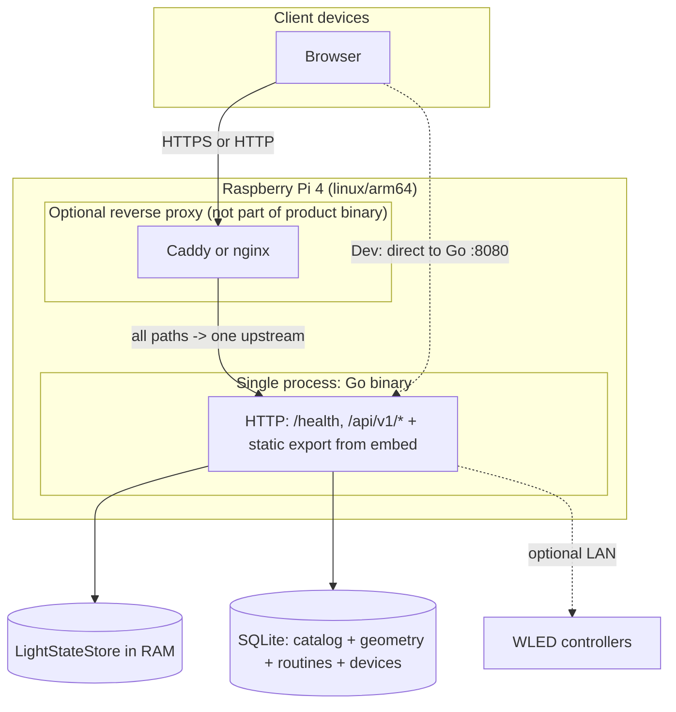

The key boundary: the Go binary serves both the JSON API and the pre-built web UI (an "embed" is a static export compiled into the binary). Light state lives in RAM in the `LightStateStore`; SQLite holds catalog data and geometry (the 3D positions of lights).

---

## 8. Request flows (sequence diagrams)

Each flow below is a Mermaid **sequence diagram**. To read one: the boxes across the top are the participants (browser, Go binary, SQLite, etc.); time flows downward; each arrow is a message or request from one participant to another; a dashed arrow (`-->>`) is a response coming back. `alt`/`else` blocks show branching (e.g. success vs. error), and `loop` blocks show something that repeats.

A few acronyms used throughout: **SSE** (Server-Sent Events — a one-way stream the server pushes to the browser), **SPA** (Single-Page Application — the JS app that runs entirely in the browser after load), **hydration** (React attaching event handlers to already-rendered HTML), and **PATCH** (the HTTP method for partial updates).

### 8.1 Initial page load (static + hydration)

**In plain terms:** How the first visit works. The browser asks for the page, gets static HTML and JS/CSS from the Go binary's embedded export, then React attaches to that HTML (hydration) to make it interactive.

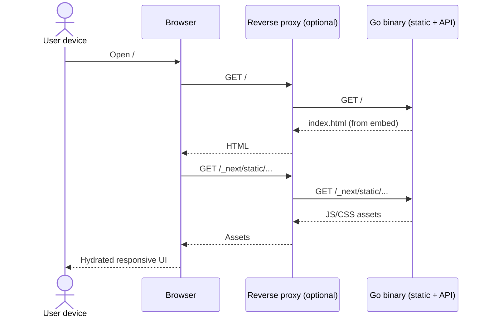

REQ-018 (shell theme): before first paint, an inline script in `web/app/layout.tsx` (or equivalent) reads the `localStorage` key `dlm-theme`, falling back to `prefers-color-scheme` when the key is absent or invalid, then sets the `html` element's `class` per §4.11 (frontend.md). This avoids a flash of the wrong light/dark shell theme.

### 8.2 Client calls JSON API (same origin)

**In plain terms:** After load, the SPA fetches data from the same origin's JSON API and updates the UI without a full page reload.

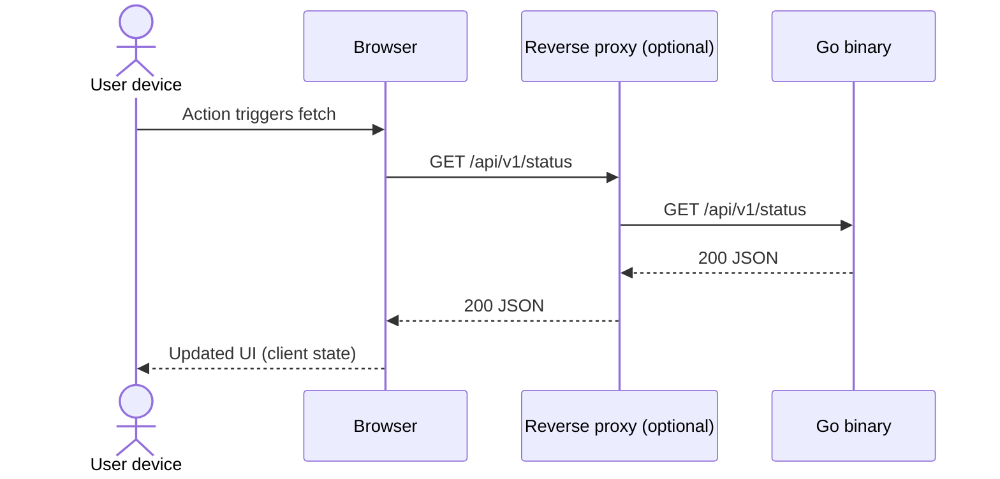

### 8.3 Create model (multipart CSV upload)

**In plain terms:** Importing a "model" (a named set of light positions) by uploading a CSV file. Go parses and validates it, then inserts the model plus its lights in one transaction. Errors come back as JSON with the right status code.

```mermaid
sequenceDiagram
  actor User as User device
  participant B as Browser
  participant P as Reverse proxy (optional)
  participant G as Go binary
  participant S as SQLite store

  User->>B: Submit name + CSV file
  B->>P: POST /api/v1/models (multipart)
  P->>G: POST /api/v1/models (multipart)
  G->>G: Parse CSV + validate (wiremodel)
  alt validation failure
    G-->>P: 400 JSON error
    P-->>B: 400 JSON error
    B-->>User: Show actionable message
  else duplicate name
    G-->>P: 409 JSON error
    P-->>B: 409 JSON error
    B-->>User: Show conflict message
  else success
    G->>S: BEGIN; insert model + lights; COMMIT
    S-->>G: OK
    G-->>P: 201 JSON (id, metadata, light_count)
    P-->>B: 201 JSON
    B-->>User: Navigate or refresh list
  end
```

The upload is `multipart/form-data` with the file field named `file`; the CSV header must be exactly `id,x,y,z`.

### 8.4 List, view, and delete models

**In plain terms:** Browsing the model catalog, opening one for detail, and deleting one. Delete is refused with `409` if the model is still used by any scene (a scene is a composed arrangement of one or more models).

```mermaid
sequenceDiagram
  actor User as User device
  participant B as Browser
  participant P as Reverse proxy (optional)
  participant G as Go binary
  participant S as SQLite store

  User->>B: Open models list
  B->>P: GET /api/v1/models
  P->>G: GET /api/v1/models
  G->>S: Query model summaries
  S-->>G: Rows
  G-->>P: 200 JSON array
  P-->>B: 200 JSON array
  B-->>User: Render responsive list

  User->>B: Select model
  B->>P: GET /api/v1/models/{id}
  P->>G: GET /api/v1/models/{id}
  G->>S: Load model + lights (positions + on color brightness_pct)
  S-->>G: Rowset
  G-->>P: 200 JSON detail
  P-->>B: 200 JSON detail
  B-->>User: Render detail (metadata + three.js 3D of lights + state, client-side)

  User->>B: Confirm delete
  B->>P: DELETE /api/v1/models/{id}
  P->>G: DELETE /api/v1/models/{id}
  alt model referenced by scenes
    G->>S: Check scene_models for model_id
    S-->>G: One or more rows
    G-->>P: 409 JSON model_in_scenes with scene list
    P-->>B: 409 JSON
    B-->>User: Explain model in use; link to scenes
  else success
    G->>S: Delete model (cascade lights)
    S-->>G: OK
    G-->>P: 204 No Content
    P-->>B: 204 No Content
    B-->>User: Update list / redirect
  end
```

### 8.5 Model detail: JSON from Go, WebGL in the browser (REQ-010, REQ-012, REQ-019, REQ-028)

**In plain terms:** The division of labor for the 3D view. Go returns positions and per-light state as JSON; the browser builds the entire three.js/WebGL scene client-side. Nothing 3D is rendered on the server.

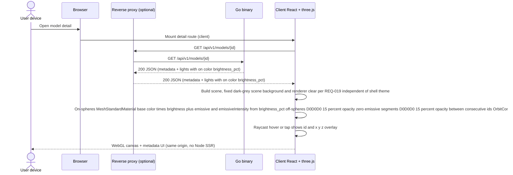

Boundary: Go returns positions and state fields; all WebGL allocation and draw calls run in the browser on the user device. (A "raycast" — casting a ray from the camera through the cursor to find what it hits — is covered in §8.6.)

### 8.6 Picking: raycast → id and coordinates (REQ-010 rule 6)

**In plain terms:** Hovering or tapping a light to identify it. A raycast (a ray fired from the camera through the pointer) finds which sphere was hit, and a DOM overlay shows that light's id and x/y/z. This is entirely client-side.

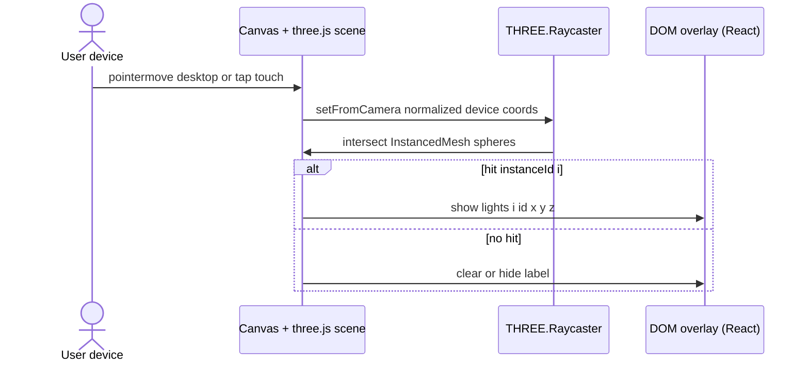

Boundary: no round-trip to Go for hover; labels use the already-fetched `lights` from §8.5.

### 8.7 Update light state (PATCH) and refresh 3D (REQ-011, REQ-012)

**In plain terms:** Changing one light's on/off, color, or brightness. The browser sends a PATCH (partial update); Go merges it into the authoritative in-RAM `LightStateStore` and returns the full new state, which the browser reconciles into the 3D view.

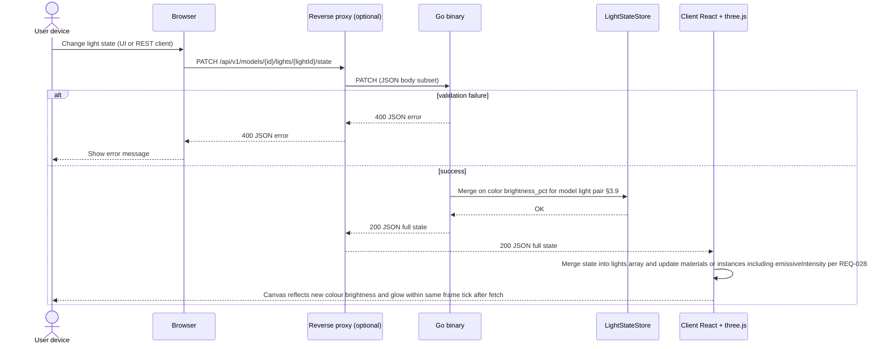

Boundary: validation and the authoritative per-light triples (on / color / brightness_pct) live in Go's `LightStateStore` (REQ-039); SQLite holds geometry only. The browser must reconcile three.js with the `200` response (or an immediate refetch) so the view does not stay stale after a successful write — including REQ-028 emissive (glow) strength when `brightness_pct` or `on` changes. See §3.9 in backend-service.md.

### 8.8 Bulk update light state (REQ-013, §3.10)

**In plain terms:** Selecting many lights and applying one change to all of them at once. Go applies the batch atomically and returns the resulting states, which the UI treats as the source of truth for both the table and the 3D view.

```mermaid
sequenceDiagram
  actor User as User device
  participant B as Browser
  participant P as Reverse proxy (optional)
  participant G as Go binary
  participant L as LightStateStore
  participant R as Client React + three.js + light table

  User->>B: Select multiple lights and apply on color brightness
  B->>R: User confirms bulk apply
  R->>P: PATCH /api/v1/models/{id}/lights/state/batch (ids + patch fields)
  P->>G: PATCH JSON body
  alt validation failure
    G-->>P: 400 JSON error
    P-->>R: 400 JSON error
    R-->>User: Show actionable message
  else success
    G->>L: Merge batch triples §3.10 §3.19 equivalence
    L-->>G: OK
    G-->>P: 200 JSON states array
    P-->>R: 200 JSON states array
    R->>R: Merge states into lights; refresh table and three.js meshes
    R-->>User: List and canvas match authoritative in-memory state
  end
```

Boundary: Go applies the batch atomically to `LightStateStore` (REQ-039); the UI treats the `200` `states` array as authoritative for both the light table (§4.8, frontend.md) and the 3D view (§4.7, frontend.md). See §3.10 and §3.19 in backend-service.md / backend-lights-and-automation.md.

### 8.9 Reset all lights to defaults (REQ-014, §3.11)

**In plain terms:** One button that resets every light in a model to its default state. Same timeliness expectation as a single update: the view must not stay stale after the `200`.

```mermaid
sequenceDiagram
  actor User as User device
  participant B as Browser
  participant P as Reverse proxy (optional)
  participant G as Go binary
  participant L as LightStateStore
  participant R as Client React + three.js + light table

  User->>B: Click Reset lights
  B->>R: Invoke reset handler
  R->>P: POST /api/v1/models/{id}/lights/state/reset (no body)
  P->>G: POST
  alt model missing
    G-->>P: 404 JSON error
    P-->>R: 404
    R-->>User: Show error message
  else success
    G->>L: Set all lights in model to defaults §3.11 REQ-014
    L-->>G: OK
    G-->>P: 200 JSON states array for all lights
    P-->>R: 200 JSON states array
    R->>R: Merge states into lights; refresh table and three.js meshes
    R-->>User: Model matches default visual and list state
  end
```

Boundary: same timeliness expectation as §8.7 — no indefinite staleness after `200`. See §3.11 in backend-service.md.

### 8.10 Create scene with models (REQ-015)

**In plain terms:** Building a scene by naming it and choosing an ordered list of models. The client sends only model ids; Go computes the spatial offsets that place each model in the composite space, validates them, and saves.

```mermaid
sequenceDiagram
  actor User as User device
  participant B as Browser
  participant P as Reverse proxy (optional)
  participant G as Go binary
  participant S as SQLite store

  User->>B: Submit scene name and ordered model list (no offsets)
  B->>P: POST /api/v1/scenes (JSON: model_id list only)
  P->>G: POST /api/v1/scenes
  G->>G: Compute offsets per §3.12 create-time algorithm; validate containment
  alt validation failure
    G-->>P: 400 JSON error
    P-->>B: 400
    B-->>User: Show actionable message
  else success
    G->>S: BEGIN; insert scenes + scene_models; COMMIT
    S-->>G: OK
    G-->>P: 201 JSON scene id
    P-->>B: 201
    B-->>User: Navigate to scene detail
  end
```

The offset algorithm lives in §3.12 (backend-lights-and-automation.md).

### 8.11 Load scene detail and render composite WebGL (REQ-015, REQ-019, REQ-012, REQ-028)

**In plain terms:** Opening a scene and rendering all its models together. Go loads the geometry from SQLite plus the live per-light state from the `LightStateStore`, returns positions already translated into scene coordinates, and the browser builds one combined 3D view.

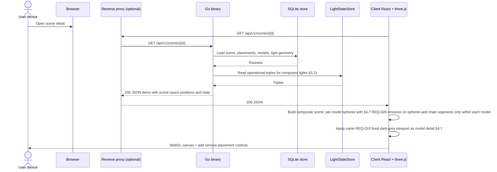

See §3.21 (backend-lights-and-automation.md) for how composed light triples are read, and §4.7 (frontend.md) for the canvas.

### 8.12 Remove last model from scene (REQ-015)

**In plain terms:** Removing a model from a scene. Removing the last remaining model would leave an empty scene, so Go returns `409` and the UI confirms deleting the whole scene instead.

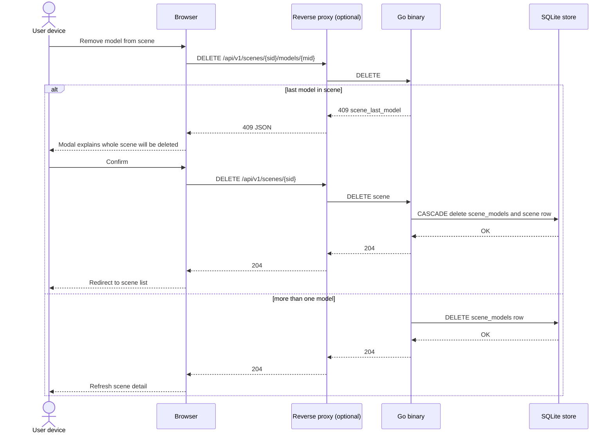

### 8.13 Factory reset all data (REQ-017, §3.14)

**In plain terms:** Wiping everything back to a fresh install. After a blocking confirmation, Go deletes all tables in one transaction, re-seeds the default sample models and Python routines, and rebuilds the in-RAM light state.

```mermaid
sequenceDiagram
  actor User as User device
  participant B as Browser
  participant P as Reverse proxy (optional)
  participant G as Go binary
  participant S as SQLite store

  User->>B: Open Options then Factory reset
  B-->>User: Show blocking warning dialog
  User->>B: Confirm erase
  B->>P: POST /api/v1/system/factory-reset
  P->>G: POST
  alt success
    G->>S: BEGIN; DELETE routine_runs, routines, devices, scene_models, scenes, lights, models; SeedDefaultSamples; SeedDefaultPythonRoutines; COMMIT
    Note over G,S: routines delete removes shape_animation and python_scene_script rows; devices clears registry REQ-017 REQ-035
    S-->>G: OK
    G->>G: Rebuild LightStateStore from seeded models §3.21 REQ-039
    G-->>P: 200 { ok: true }
    P-->>B: 200
    B->>B: Clear client caches; navigate to /models; show success banner
    B-->>User: Model list shows three samples; routines three default Python only; Devices empty
  else failure
    G-->>P: 500 JSON error
    P-->>B: 500
    B-->>User: Show error; data unchanged if transaction rolled back
  end
```

See §3.14 (backend-service.md).

### 8.14 Reset camera (client only) (REQ-016)

**In plain terms:** Returning the 3D camera to its default framing. This is purely client-side — no HTTP request at all.

```mermaid
sequenceDiagram
  actor User as User device
  participant R as Client React + three.js + OrbitControls

  User->>R: Click Reset camera on model or scene view
  R->>R: applyDefaultFraming from current bounds; controls.update()
  R-->>User: View returns to default framing; no HTTP request
```

### 8.15 Scene region query and bulk update in scene coordinates (REQ-020)

**In plain terms:** Selecting lights by a 3D region (a cuboid or sphere) in scene coordinates, then optionally applying a state change to just those lights. Go validates the geometry, resolves which lights fall inside, and (for the update) merges their triples atomically.

```mermaid
sequenceDiagram
  actor User as Integrator or UI user
  participant B as Browser or API client
  participant P as Reverse proxy (optional)
  participant G as Go binary
  participant S as SQLite store
  participant L as LightStateStore

  User->>B: Query cuboid or sphere region in a scene
  B->>P: POST /api/v1/scenes/{id}/lights/query/{shape}
  P->>G: POST
  G->>G: Validate geometry payload (finite numbers, positive dimensions/radius)
  alt invalid geometry
    G-->>P: 400 validation_failed
    P-->>B: 400 JSON error with actionable details
  else valid geometry
    G->>S: Load scene placements + light rows
    S-->>G: Rows
    G->>G: Compute sx,sy,sz and filter inclusion (inclusive boundaries)
    G-->>P: 200 matched lights in scene coordinates
    P-->>B: 200 JSON
  end

  User->>B: Bulk update state for same region
  B->>P: PATCH /api/v1/scenes/{id}/lights/state/{shape}
  P->>G: PATCH
  G->>G: Validate geometry + REQ-011 state fields
  G->>S: Load geometry + placements to resolve matches by sx/sy/sz
  S-->>G: Rowsets
  G->>L: Merge triples for matched lights §3.15 §3.9
  alt validation failure or internal error
    G-->>P: 4xx or 5xx JSON error
    P-->>B: Error response; no partial writes
  else success
    L-->>G: OK
    G-->>P: 200 updated_count + updated states
    P-->>B: 200 JSON
  end
```

`sx,sy,sz` are a light's scene-space coordinates. See §3.15 and §3.9 (backend-lights-and-automation.md / backend-service.md).

### 8.16 Scene routine start, server-supervised `python3` loop, and stop (REQ-021, REQ-038, §3.16, §3.17)

**In plain terms:** Running a Python "routine" (a user animation script) against a scene. Go supervises a real `python3` child process server-side; each loop iteration the script calls back into the local API over loopback HTTP to change lights, and observers watching via SSE receive the deltas. Stopping signals the child to exit.

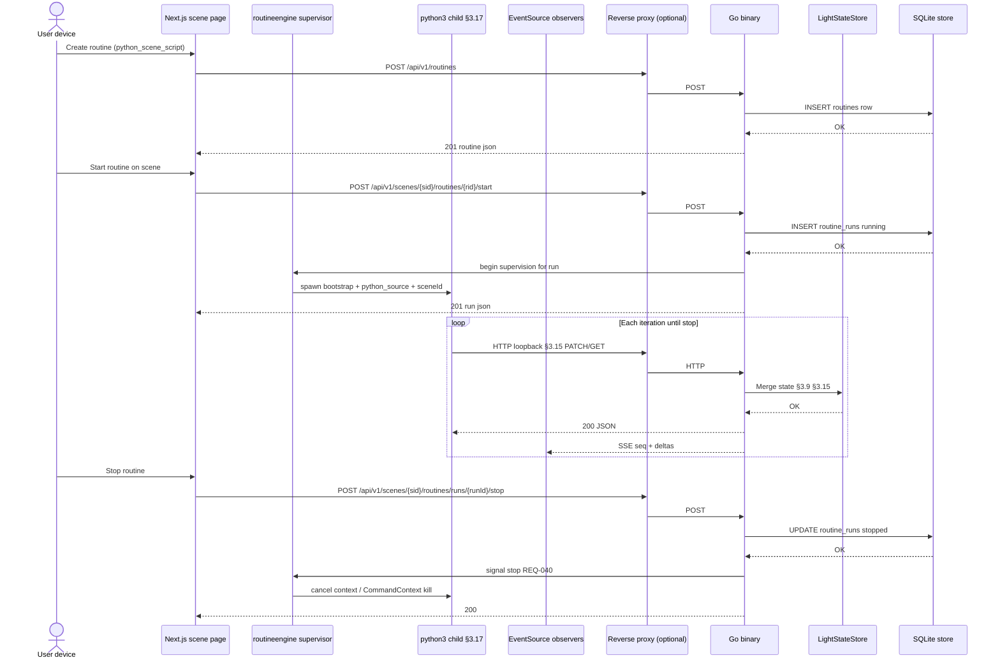

`routineengine` is the Go supervisor for routine runs; "loopback HTTP" means the child calls the same API on `127.0.0.1`. §8.17 adds the Next.js editor save path and REQ-030 (`scene.random_hex_colour()` runs locally inside CPython in the `python3` child only). See §3.16 and §3.17 (backend-lights-and-automation.md).

### 8.17 Python routine: editor save, supervised `python3` child, scene API over loopback HTTP (REQ-022, REQ-030, REQ-038, §3.17)

**In plain terms:** The end-to-end Python routine lifecycle including saving edited source. Same as §8.16, plus the editor's PATCH to persist the script. One thing to note: `scene.random_hex_colour()` runs entirely inside the Python child using the standard `random` module, so it is not an HTTP leg in the diagram.

REQ-030 note: `scene.random_hex_colour()` runs only inside the `python3` child (standard `random` module) and adds no HTTP traffic to §3.15; it does not appear as an HTTP leg in the diagram below.

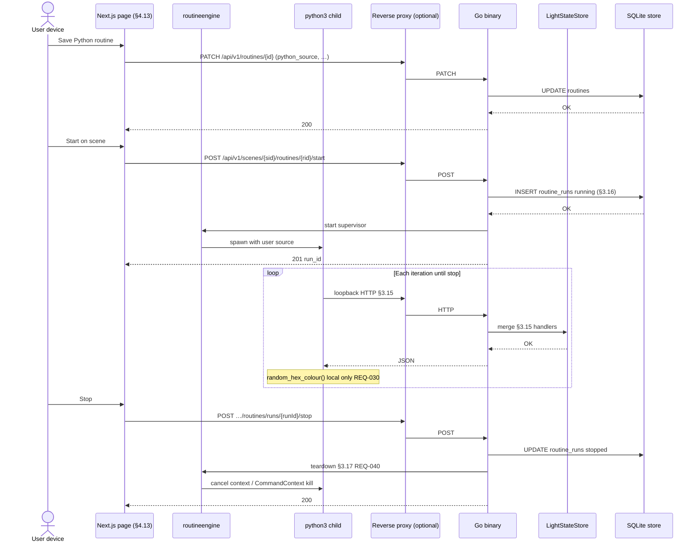

See §4.13 (frontend.md) for the editor page and §3.17 (backend-lights-and-automation.md) for the child-process runtime.

---

### 8.18 Python routine page: unified scene target, SSE viewport sync, and resets (REQ-027, REQ-028, REQ-041, §4.13)

**In plain terms:** The routine editor page and its live 3D preview. The browser opens an SSE stream on the scene's `lights/events`; while a routine runs server-side, the browser only observes and merges the streamed deltas. Reset buttons stop the run and set lights back to defaults.

```mermaid
sequenceDiagram
  actor User as User device
  participant Page as Next.js §4.13 page
  participant Canvas as SceneLightsCanvas
  participant ES as EventSource
  participant G as Go binary §3.15 §3.17

  User->>Page: Select target scene (run + viewport)
  Page->>G: GET /api/v1/scenes/{id}
  G-->>Page: items + lights + state
  Page->>Canvas: mount / update props
  Page->>ES: open …/scenes/{id}/lights/events

  User->>Page: Start routine on same scene
  Page->>G: POST …/routines/…/start
  G-->>Page: 201 run_id
  Note over Page: routineengine runs python3 server-side; browser observes SSE only

  loop SSE while viewport mounted §4.9 §4.13
    G-->>ES: data seq + deltas
    ES-->>Page: onmessage
    Page->>Canvas: merge deltas REQ-012 REQ-028 §3.19 REQ-041
  end

  User->>Page: Reset scene lights (run active)
  Page->>G: POST …/routines/runs/{runId}/stop
  G-->>Page: 200
  Page->>G: PATCH …/lights/state/scene (off, #ffffff, 100%)
  G-->>Page: 200
  Page->>Canvas: merge state

  User->>Page: Reset camera
  Page->>Canvas: applyDefaultFraming (REQ-016, no API)
```

`EventSource` is the browser API for SSE; `SceneLightsCanvas` is the shared 3D component. See §4.9 and §4.13 (frontend.md), and §3.19 (backend-lights-and-automation.md).

### 8.21 Scene routine start — `python3` vs Go shape ticker (REQ-021, REQ-038, §3.16, §3.17, §3.17.2)

**In plain terms:** Starting a routine branches on its type. A `python_scene_script` spawns a `python3` child that drives lights over loopback HTTP; a `shape_animation` is driven entirely inside Go by a periodic ticker (no Python), via internal batch patches.

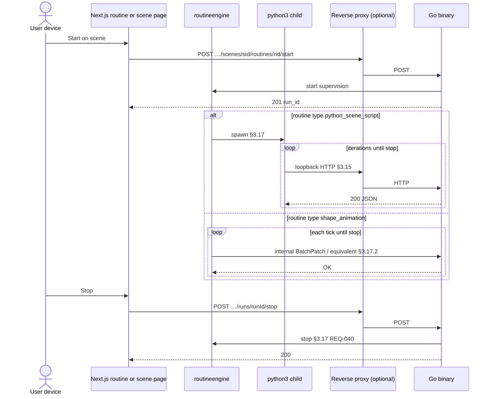

See §3.16, §3.17, and the shape ticker in §3.17.2 (backend-lights-and-automation.md).

### 8.22 Shape animation page — unified viewport; server tick writes (REQ-033, REQ-027, REQ-038, §3.17.2)

**In plain terms:** The shape-animation editor with its live preview. A Go `time.Ticker` produces animation frames server-side and writes light state; the browser never drives production ticks — it just observes the SSE stream and merges deltas.

```mermaid
sequenceDiagram
  actor User as User device
  participant Page as Next.js §4.14
  participant RE as routineengine shape ticker
  participant ES as EventSource
  participant P as Reverse proxy (optional)
  participant G as Go §3.15
  participant C as SceneLightsCanvas

  User->>Page: Select scene in unified panel
  Page->>G: GET /api/v1/scenes/id
  G-->>Page: lights + state
  Page->>C: mount SceneLightsCanvas
  Page->>ES: open …/lights/events

  User->>Page: Start
  Page->>G: POST …/start
  G->>RE: start time.Ticker §3.17.2
  G-->>Page: 201 run_id
  Note over RE: Go ticker applies batch; browser does not drive production ticks

  loop SSE until stop or unmount
    RE->>G: tick → mergeIfChanged §3.19
    G-->>ES: seq + deltas
    ES-->>Page: onmessage
    Page->>C: merge REQ-012 REQ-028 §3.19 REQ-041
  end

  User->>Page: Stop
  Page->>G: POST …/stop
  G->>RE: cancel ticker REQ-040
  G-->>Page: 200
```

See §4.14 (frontend.md) and §3.17.2 / §3.19 (backend-lights-and-automation.md).

### 8.19 Server-push observer path for shipped UI (REQ-041, REQ-029, §3.18)

**In plain terms:** How the shipped UI stays live without polling. After the initial `GET`, the browser keeps an SSE connection open and applies only the changed lights (`deltas[]`) as they arrive — no repeated full fetches, and no full 3D rebuild. Any writer (external client or an internal routine) triggers the same fan-out.

This path is normative for the embedded Next.js/three.js surfaces: after the initial `GET`, the browser keeps `EventSource` on `…/lights/events` and applies `deltas[]` without a full scene rebuild (see the §3.18 diagram). The diagram below shows external writers; the same SSE fan-out applies when `internal/routineengine` (via `python3` loopback HTTP, internal §3.15 calls, or the shape ticker) commits patches.

```mermaid
sequenceDiagram
  participant Ext as External client or routine automation
  participant G as Go binary
  participant L as LightStateStore
  participant S as SQLite store
  participant B as Browser tab EventSource

  Ext->>G: PATCH bulk or internal batch patch
  G->>L: mergeIfChanged §3.9 §3.19
  L-->>G: changed indices + new triples
  Note over G,S: SQLite only for catalog or geometry
  G-->>Ext: 200 JSON
  G-->>B: SSE data seq + deltas for changed lights only
  B->>B: update InstancedMesh or materials per index REQ-031
  Note over B: No GET storm; snapshot GET only on reconnect
```

See §3.18 and §3.19 (backend-lights-and-automation.md).

### 8.20 Light state write with no-op elision (REQ-031, §3.19)

**In plain terms:** Avoiding useless work when a write changes nothing. The client can skip the HTTP call entirely if the new value equals what's shown; if it does send a PATCH, Go compares the merged result against stored state and reports "no logical change" so nobody rebuilds the 3D view for a no-op.

```mermaid
sequenceDiagram
  actor User as User device
  participant R as Client React + three.js
  participant G as Go binary
  participant L as LightStateStore

  User->>R: Edit light to same values as shown
  R->>R: Compare merged triple to last rendered (§3.19)
  alt client skip HTTP
    R-->>User: No fetch; canvas unchanged
  else client sends PATCH
    R->>G: PATCH .../lights/{id}/state
    G->>L: Read current; merge; §3.19 equivalence vs new triple
    alt merged equivalent to stored in L
      L-->>G: no logical change
      G-->>R: 200 full state optional unchanged true
      R->>R: Skip three.js rebuild if triple matches cache
    else state changed
      G->>L: store new triple
      L-->>G: OK
      G-->>R: 200 full state
      R->>R: Update materials instances REQ-012 REQ-028
    end
    R-->>User: Timely correct appearance
  end
```

Note: integrators bypassing the shipped UI still benefit from the server-side §3.19 skip; the client branch in the diagram is optional but recommended for fewer round-trips. See §3.19 (backend-lights-and-automation.md).

### 8.23 Return to scene or routine page while a run stays active (REQ-042)

**In plain terms:** Coming back to a page while a routine keeps running on the server. Because runs are server-side, the page re-fetches the active runs and the current scene state, opens a fresh SSE stream, and picks up live updates — never trusting stale React state from the previous visit.

```mermaid
sequenceDiagram
  actor User as User
  participant R as React (scene detail or routine unified panel)
  participant G as Go binary
  participant ES as EventSource …/lights/events

  Note over User,R: User had started a routine earlier; tab closed or navigated away; run still running on server (REQ-038)

  User->>R: Open /scenes/detail?id=scene or /routines/python?id=…&scene=…
  R->>G: GET /api/v1/scenes/{id}/routines/runs
  G-->>R: 200 { runs: [ { id, routine_id, routine_name, status: running } ] }
  R->>G: GET /api/v1/scenes/{id}
  G-->>R: 200 scene items + current light triples (REQ-039)
  R->>ES: new EventSource (sseUrl per §4.16)
  loop while page open and SSE healthy
    G-->>ES: data: seq + deltas[]
    ES-->>R: merge into SceneLightsCanvas state (REQ-041)
  end
  R-->>User: Stop visible; 3D matches server; live updates continue
```

Boundary: no reliance on stale React state from the previous visit; the first paint after navigation uses a fresh `GET …/scenes/{id}` and `GET …/routines/runs` (see §4.16 in frontend.md).

### 8.24 Device capture light sequence start/stop (REQ-047, §3.22)

**In plain terms:** Lighting one LED at a time on a WLED device (an ESP-based LED controller) so external cameras can record which physical position each light index maps to. Go's capture sweep drives the device directly by index — it does not touch the `LightStateStore` — while the browser starts, stops, and polls status.

```mermaid
sequenceDiagram
  actor User as Operator
  participant Page as Next.js device detail
  participant P as Reverse proxy (optional)
  participant G as Go binary
  participant CAP as internal/capture sweep
  participant W as WLED device

  Note over User: Cameras recording from ≥ 2 angles before start (uploaded later §8.25)

  User->>Page: Start capture
  Page->>P: POST /api/v1/devices/{id}/capture/start
  P->>G: POST
  alt light_count = 0
    G-->>Page: 422 capture_no_lights
  else assigned model has running routine or sweep already active
    G-->>Page: 409 capture_conflict
  else ok
    G->>CAP: begin sweep (n = devices.light_count)
    G-->>Page: 200 { state: running, light_count: n, current_index: 0 }
    loop k = 0 … n-1, dwell ≈ 1 s
      CAP->>W: set only LED k on, others off (one frame)
      CAP->>CAP: time.Ticker advance current_index
    end
    CAP->>W: all off (completion)
  end

  Page->>P: GET /api/v1/devices/{id}/capture (poll)
  P->>G: GET
  G-->>Page: { state, current_index }

  User->>Page: Stop capture
  Page->>P: POST /api/v1/devices/{id}/capture/stop
  P->>G: POST
  G->>CAP: cancel ticker (REQ-040 ≤ 2 s)
  CAP->>W: all off
  G-->>Page: 200 { state: idle }
```

Boundary: the sweep drives the device directly by index and never touches `LightStateStore` (the device may be unassigned — §3.22, backend-lights-and-automation.md); the browser only starts/stops/observes (server-side per REQ-038).

### 8.25 Create a model from uploaded videos: reconstruct, review, confirm (REQ-048, REQ-049, §3.23)

**In plain terms:** Building a light model from uploaded videos using computer vision (CV — analyzing images to extract 3D information). Optionally the user prints a fiducial marker (a printed pattern the CV can detect for scale/orientation). Go runs a bundled OpenCV child that detects each light blinking across feeds and triangulates 3D positions; the user reviews the result and the model is saved only on explicit confirm.

```mermaid
sequenceDiagram
  actor User as User
  participant Page as Next.js /models/new (video)
  participant P as Reverse proxy (optional)
  participant G as Go binary
  participant RC as internal/reconstruct worker
  participant CV as bundled OpenCV child §3.23.1
  participant S as SQLite store
  participant L as LightStateStore

  opt Optional marker
    Page->>G: GET /api/v1/capture/marker
    G-->>Page: printable PDF/PNG (§3.23.2)
  end

  User->>Page: Upload ≥ 2 videos (+ optional marker/scale)
  Page->>P: POST /api/v1/models/capture (multipart files[])
  P->>G: POST
  alt < 2 files or unsupported container
    G-->>Page: 400
  else accepted
    G->>RC: enqueue job; stream files to work dir
    G-->>Page: 202 { job_id, status: pending }
    RC->>CV: Run(jobSpec) — per-feed 2D blink detect, pose, triangulate
    CV-->>RC: JSON { light_count, lights[], missing[], low_confidence[] }
  end

  loop poll until terminal
    Page->>G: GET /api/v1/models/capture/{jobId}
    G-->>Page: { status, progress, result? }
  end

  Note over Page: Review: detected count + missing/low-confidence + optional three.js preview (§4.7)

  alt User confirms
    User->>Page: Confirm with name
    Page->>P: POST /api/v1/models/capture/{jobId}/confirm { name }
    P->>G: POST
    G->>G: Re-validate candidate lights (REQ-005/REQ-007)
    G->>S: INSERT model + geometry lights (one tx §3.3)
    S-->>G: OK
    G->>L: allocate REQ-014 defaults for n lights
    G-->>Page: 201 model → route to /models/{id}
  else User cancels
    Page->>G: DELETE /api/v1/models/capture/{jobId}
    G-->>Page: 204 (work dir removed)
  end
```

Boundary: reconstruction is server-side and needs no operator Python (it uses the bundled CV runtime, §3.23.1); the model is persisted only on explicit confirm after the user reviews detected vs missing lights (REQ-049). See §3.23 (backend-lights-and-automation.md).
