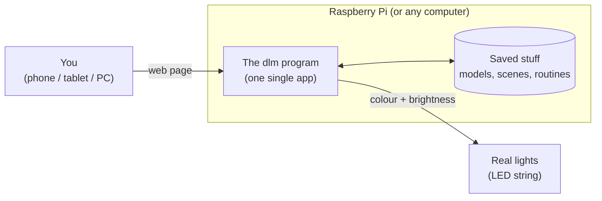
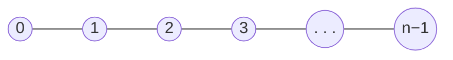
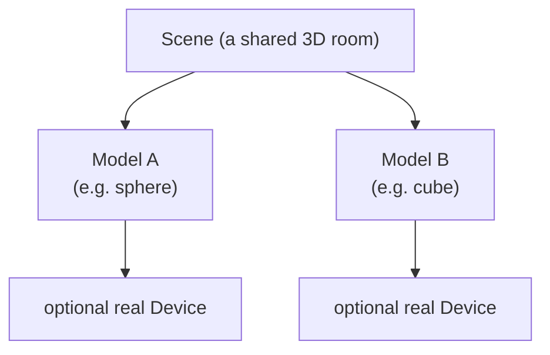
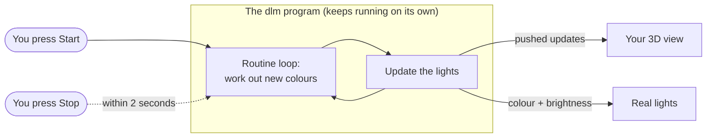

# What Domestic Light & Magic does

This is the plain-English guide to what **Domestic Light & Magic** (or **dlm** for short) is meant to
do. You don't need to be a programmer to read it. If you can picture a string of fairy lights and a web
page, you're ready.

> **Heads up about the funny codes.** Throughout the project's code you'll spot little labels like
> `REQ-011`. Think of them as reference numbers for each feature, the same way a LEGO set gives every
> brick a part number. You can ignore them while reading — but if you're curious what a code means,
> there's a lookup table at the very bottom of this page.

---

## 1. The big idea

Imagine a long string of little lights — like Christmas lights — where **every single bulb can be a
different colour and brightness**, and you can control each one from your phone, tablet, or computer.

Domestic Light & Magic is the software that makes that happen. It lets you:

- Describe **where each light sits in space** (a "model").
- **See your lights in 3D** on screen before you even plug anything in.
- **Turn lights on and off, pick their colour, and set how bright they are.**
- Group several light layouts into one **scene** (like arranging decorations in a room).
- Write little programs called **routines** that make the lights move, pulse, and change colour on
  their own.
- Send all of that to **real lights** in the real world.

The whole thing is designed to run on a **Raspberry Pi** — a small, cheap computer about the size of a
deck of cards — sitting quietly in the corner of your house.

Here's the big picture of how the pieces fit together:



---

## 2. A few words we'll use a lot

You'll meet these ideas again and again, so here's the quick version:

- **Light** — one bulb on the string. Every light has a number (starting at **0**) and a position in
  space.
- **Model** — a saved layout: the list of all the lights and exactly where each one sits. Like a map of
  your light string.
- **Scene** — one or more models arranged together in a shared 3D space, like decorations placed around
  a room.
- **Routine** — a mini light show. A saved set of instructions that changes the lights over time.
- **Device** — a real piece of hardware (a little controller) that drives the physical lights.
- **The 3D view** — an on-screen, spinnable picture of your lights, so you can see what's going on
  without any hardware.

---

## 3. How the app is built and where it runs

You don't need to understand the plumbing to use the app, but here's the shape of it in case you're
curious.

- **Two halves working together.** There's a "brain" (a program written in a language called **Go**)
  that does the thinking and remembers everything, and a "face" (a website built with tools called
  **Next.js** and **Tailwind CSS**) that you actually click on. Keeping the brain and the face separate
  makes the app tidier and easier to fix.
- **Works on any screen.** The website adjusts itself so it's comfortable on a **phone**, a **tablet**,
  or a **desktop computer**. Buttons are big enough to tap, text stays readable, and you shouldn't have
  to scroll sideways to reach things. It also feels alive — pages react instantly instead of behaving
  like a printed leaflet.
- **Made for a Raspberry Pi 4.** The app is designed to run happily on a **Raspberry Pi 4 Model B**,
  which is a small computer with limited memory and processing power (its chip is an "ARM64" type). The
  design keeps this in mind so it doesn't hog more than the little Pi can give.
- **Simple to install.** When you install it, you get **one download per platform** — on Linux that may
  be a `.tar.gz` containing the app plus a small `runtime/cv/` folder that must stay next to it; on
  Windows it may be a bare `.exe`. Copy it across, run it, done. You do *not* need to install a pile of
  other software or juggle "containers" (Docker). Anything extra the app needs is either baked inside
  the program, shipped beside it in that archive, or created automatically when it starts. The only
  acceptable helper is a small system file that simply tells the computer to launch the app on startup.
- **One command for developers.** Someone working on the app can build and start everything with a
  **single command** from the project folder, instead of following a long checklist.

---

## 4. Models: describing where your lights are

A **model** is the heart of everything. It's the map that says "light number 0 is *here*, light number
1 is *there*, and so on."

### How the lights are numbered

The lights are strung together like beads on a single thread. They're numbered in order, starting at
**0**, with no gaps and no repeats. Each light only "touches" the light right before it and right after
it — never skipping ahead.



So light **0** has one neighbour, the last light has one neighbour, and everyone in the middle has
exactly two. There are no branches or webs — just one long chain.

### What each light stores

Every light records **where it is in 3D space** using three numbers:

- **x** — left/right
- **y** — up/down (or however the space is oriented)
- **z** — forward/back

These are measured in **metres**, and they can be any normal (finite) numbers.

### The limits and the file format

- A model can hold **up to 1000 lights** — no more.
- A model has a **name** and a **creation date**.
- You can save or load a model as a **CSV file** (a simple spreadsheet-style text file). The file has
  exactly four columns with this heading:

```text
id,x,y,z
```

Here `id` is the light's number. A tiny valid file with one light looks like:

```text
id,x,y,z
0,0,0,0
```

### What you can do with models

You can:

- **See a list** of all your models.
- **Open** one to look at its lights and details.
- **Delete** ones you don't want — *unless* a model is being used in a scene, in which case the app
  stops you and explains that you need to remove it from the scene first.
- **Add a new model** by uploading a CSV file.

### The app checks your file before saving

When you upload a CSV, the app inspects it **before** saving anything. It will politely refuse the file
(with a clear message about what's wrong) if:

- the columns aren't exactly `id`, `x`, `y`, `z`;
- the light numbers aren't a clean run of `0, 1, 2, …` with no gaps;
- there are more than **1000** lights;
- any x/y/z value isn't a real number.

Crucially, a bad file never gets **half** saved — it's all or nothing.

### Ready-made examples

When you first install the app (with nothing saved yet), it hands you **three example models** so you
have something to play with straight away:

- a **sphere** (ball),
- a **cube** (box),
- a **cone**.

Each one is roughly **2 metres** across and has between **500 and 1000** lights. The lights are spread
**all over the outside surface** — not just traced along the edges like a wireframe — and they sit
neatly on the surface (within about **3 cm** of it), never buried inside. Neighbouring lights are spaced
a comfortable **5 to 10 cm** apart.

---

## 5. Seeing your lights in 3D

Open a model and you get a **spinnable 3D picture** of it, drawn with a graphics library called
**three.js**. This is brilliant because you can check your layout without owning a single real light.

What you'll see:

- **Every light** as a small **white ball**, about **2 cm** wide. All of them are drawn — none are
  hidden to save effort.
- **Faint grey lines** connecting each light to the next one along the chain, showing the "wire." They
  use the colour `#D0D0D0` (a light grey) and are **85% see-through** and thin, so they stay in the
  background and don't distract from the lights.
- A **faint outline box** around everything, marking the edge of the space your lights fill. For a
  single model this box sits **30 cm** out from the lights on every side. It's drawn in the same faint
  grey as the wires so it stays subtle.

**Point at a light** (or **tap** it on a touchscreen) and the app tells you that light's **number and
its x/y/z position**.

### The picture matches reality

The 3D view always reflects each light's **current settings**:

- A light that's **on** shows its actual **colour and brightness** — and it looks like it's genuinely
  **glowing**, brighter for higher brightness, dimmer for lower.
- A light that's **off** fades to that same faint grey as the wires, so it's still visible but clearly
  "not lit."

If something changes a light while you're watching, the picture **updates on its own** — no need to
refresh the page.

### Making the view comfortable

- The 3D area always has a **dark grey background**, whether the rest of the app is in light or dark
  mode, so colours stay easy to see.
- There's a **"Reset camera"** button on both the model view and the scene view. If you spin yourself
  into a mess, one click puts the camera back to its starting position. (This only moves the *camera* —
  it never changes your saved lights.)

### Handling lots of lights at once

With up to 1000 lights, a plain list would be endless, so the model view gives you:

- **Pages** — the light list is split into pages, and you can choose how many lights show per page (at
  least three size options, somewhere between 1 and 1000).
- **Jump to a light** by typing its number (with a friendly error if you type one that doesn't exist).
- **Multi-select** — tick several lights (using checkboxes or similar) and set them **all** to the same
  on/off, colour, and brightness in a single action.

### A tidy starting point

- Every light starts life in a known state: **off**, colour **white** (`#FFFFFF`), brightness **100%**.
- There's a **Reset** button that puts **all** the lights in the current model back to that starting
  state at once.

---

## 6. Controlling the lights

Behind the app there's a set of web addresses (a **REST API**) that both the website and other tools
can use to read and change lights. In plain terms: it's the doorway through which commands travel.

For **each individual light** you can:

- turn it **on or off**,
- set its **colour** as a hex code like `#FF8800` (six characters after the `#`),
- set its **brightness** from **0% to 100%**.

You can change just one light, a chosen bunch, or all of them.

### Where the "current state" lives

Here's an important design choice: a light's live on/off/colour/brightness is kept in the computer's
**memory (RAM)**, *not* saved permanently to disk. That makes it fast enough to run real light shows.
The trade-off is that these live settings aren't remembered across a restart — and that's on purpose.
The app is built to be a fast, always-running "engine," with the website acting as a window to peek in
and make changes.

### Keeping it fast, even on a tiny Pi

Because a light show might change **hundreds of lights several times a second**, the app is careful not
to be wasteful:

- You can update **many lights in one go** (a "batch") instead of sending one message per light.
- Changes are **pushed** out to your browser as they happen (so the 3D view updates smoothly), rather
  than the browser constantly asking "anything new? anything new?" The app only sends the lights that
  **actually changed**.
- If a light is being set to exactly what it already is, the app **skips the redundant work** — no
  pointless redraws, memory updates, or messages to the hardware.

---

## 7. Scenes: arranging models together

A **scene** is like a stage. You take one or more of your models and place them together in one shared
3D space — for example, a wreath model and a tree-outline model side by side.



Key ideas:

- When you create a scene, you give it a **name** and add **at least one model**. A scene always has at
  least one model in it — there's no such thing as an empty scene.
- The app **works out where to place each model automatically**, so you don't have to type in any
  position numbers. New models get dropped in **to the right** of what's already there, without
  overlapping.
- Placing a model in a scene **never changes the model's own saved coordinates**. The scene just
  remembers an "offset" (a nudge) for each model.
- The scene is drawn in the same lovely **three.js** 3D view, showing all the lights of all the models.
- You can **add** models, **remove** models, and **open**, **list**, or **delete** scenes. If you remove
  the *last* model from a scene, the app warns you that this will delete the whole scene, and asks you
  to confirm.
- Each scene has a small amount of "breathing room" drawn around its lights (the faint outline box from
  earlier). By default that's **30 cm** on every side, and you can change it.

There's also a behind-the-scenes API for working with a scene's lights by **region** — for example,
"give me every light inside this box" or "inside this ball," and "change every light in that region."
This is what makes the fancy routines (next section) possible.

---

## 8. Routines: making the lights come alive

A **routine** is a saved light show. Once you start one on a scene, the app changes the lights over and
over, on its own, until you stop it. There are exactly **two kinds** of routine, and when you create one
you simply pick which kind you want:

1. **Python routines** — you write a little program.
2. **Shape animation routines** — you describe moving shapes with menus and boxes, no coding needed.

Importantly, routines **run on the server** (the Go program), not in your browser. That means a show
keeps going even if you close the tab or your phone goes to sleep — the browser is just a window to
watch and to press start/stop.



Some rules that keep things sensible:

- Only **one routine can run on a scene at a time**. Try to start a second and the app says "that scene
  is busy."
- When you press **Stop**, the show actually stops **within about two seconds** — it won't keep
  fiddling with the lights after you've told it to quit.
- You can't delete a routine while it's actively running; stop it first.

### Writing Python routines

For Python routines you get a proper little code editor right in the browser, built with a tool called
**CodeMirror 6**. It has colour-coded text, points out mistakes as you type, suggests words to complete,
and can tidy up your code. The wording throughout is aimed at someone brand new to coding — think "a
twelve-year-old's first Python" — with short sentences and gentle explanations.

You don't have to learn complicated web plumbing. Instead you get a friendly helper called **`scene`**
that does the hard work. For example, it can tell you how big the scene is (`scene.width`,
`scene.depth`, `scene.height`), grab all the lights inside a shape, and even hand you a **random
colour** with a single call.

Right **below the editor** there's a built-in **reference guide** listing everything `scene` can do.
Pick an item, read a short explanation and an example (every example has friendly `# comment` notes),
and press a button to **drop that example straight into your code** where your cursor is.

- A brand-new Python routine isn't blank — it comes with **starter code** that changes the colour of the
  lights inside a sphere, so you can press run and immediately see something happen.
- On the same page you choose a scene, press **Start/Stop**, and watch that exact scene live in the 3D
  view — all in **one place**, so there's no confusion about which scene you're running.

You also get **three ready-made Python routines** out of the box (and again after a factory reset):

- **Growing sphere** — a ball of light swells outward from the centre over about 10 seconds, lighting
  everything it swallows in a fresh random colour each cycle.
- **Sweeping cuboid** — a thin slab (20 cm tall, as wide and deep as the scene) rises from the floor to
  the ceiling over about 10 seconds, lighting whatever it passes.
- **Random colour cycle** — every light turns on and then flickers to a new random colour about once a
  second.

These three are real, editable routines you open from your list — not just examples buried in the
documentation.

### Shape animation routines (no coding)

Don't fancy writing code? A **shape animation** lets you build a moving light show with forms instead of
programming. You describe **1 to 20 shapes** — each a **sphere** or a **box** — and the app moves them
around the scene. Any light a shape passes over takes that shape's colour and brightness; the rest get a
background colour or switch off.

For each shape you set things like:

- its **size** (a fixed value, or a random one between limits you choose),
- its **colour** (a fixed hex colour, or "random") and **brightness** (0–100%),
- where it **starts** and which **direction and speed** it moves (measured in metres per second),
- what happens when it **hits the edge** of the scene — it can wrap around like Pac-Man, stop and
  vanish, or bounce off (either at a random new angle or a mirror-like bounce).

You author it in the same unified page: pick a scene, run it, and watch it live. While you're editing,
the app can show faint "ghost" previews of the shapes to help you line things up.

---

## 9. Talking to real lights (hardware)

So far everything can happen purely on screen. But the whole point is to light up your actual house, so
the app can talk to real **devices** — the little controllers that drive physical LED strings.

- The first supported hardware is the popular **WLED** software running on an **ESP32** chip, which
  controls individually addressable LED strings. The design leaves room to add other kinds of hardware
  later.
- A **device** knows how to map your model's light order (0, 1, 2, …) onto the real LEDs.
- Each device drives **at most one model**, and each model is driven by **at most one device** — a tidy
  one-to-one pairing. You can leave things unpaired until you're ready, and the app won't let two things
  fight over the same lights.
- There's a dedicated **Devices** area where you **add** a device (by typing in how to reach it),
  give it a **name**, **connect or disconnect** it from a model, and (when available) **discover**
  devices on your network. Removing a device also cleanly unlinks it from any model.

When a routine runs, the app updates the on-screen 3D view **and** any connected real lights at the same
time, from the same shared "truth." And because that truth lives in the server's memory, the app runs a
quick **sync** when it starts up, and again when you first link a device to a model, so the screen and
the hardware agree.

---

## 10. The look and feel

The app should feel polished and consistent wherever you are:

- **Light and dark themes.** Light mode has a **white** background with dark text; dark mode has a
  **dark grey** background with light text. It follows your system preference to begin with, then
  remembers whatever you pick.
- **A tidy menu.** The main navigation lives on the **left** and can fold away. A **burger button**
  (the three-lines icon) opens and closes it — and it works with a tap on touchscreens, not just a
  mouse.
- **Branding.** The app is called exactly **Domestic Light & Magic**, and its logo is a **lightbulb**
  icon from **Font Awesome** (a popular icon set). Buttons throughout the app carry Font Awesome icons
  so actions are easy to recognise.
- **Options and factory reset.** There's an **Options** area with a **Factory reset** that wipes
  everything — models, scenes, devices, routines — and puts the app back to a fresh install (the three
  sample models and three sample Python routines return). Because that's permanent, the app makes you
  **confirm** a clear warning first; a single misclick can't trigger it.

---

## 11. Building a model by filming your lights

Typing coordinates into a spreadsheet is no fun. So the app offers a clever alternative: **work out
where your lights are by filming them.**

Here's the idea:

1. **The capture sweep.** From the Devices screen you start a special sweep that lights up **one bulb at
   a time**, in order, for about **one second each**. You film this happening.
2. **Film from two or more angles.** Record the same sweep with a couple of cameras (or your phone from
   different positions).
3. **Upload the videos.** On the model screen there's a **"create from video"** option alongside the CSV
   upload. You upload your clips.
4. **The app figures it out.** Using a computer-vision toolkit called **OpenCV** (built right into the
   app — no separate install needed), it spots each blinking light in each video and works out its real
   **3D position** by comparing the angles.
5. **Review and save.** Before anything is saved, the app shows you what it found — how many lights it
   detected, and any it wasn't sure about — and you decide whether to keep it. Lights it couldn't place
   are honestly reported, never made up.

There's also an **optional** printable **marker** (a special printed pattern) you can place in the shot
to improve accuracy and get real-world scale — but it's genuinely optional; the app works without it.

Because this can take a while, the crunching happens **on the server** and reports its progress, so you
don't have to keep the tab open the whole time.

---

## 12. Getting it and keeping it running

Finally, the practical side of shipping the app to real people:

- **Ready-made downloads.** The app is published as **one download per platform**: **Windows** (may be
  a bare `.exe`), **regular Linux**, and **Linux on ARM** (for the Raspberry Pi). Linux releases may
  ship as a `.tar.gz` with the program plus the `runtime/cv/` folder used for "build from video". No
  building from source required.
- **Automatic building and testing.** The project uses **GitHub Actions** to build and test the code
  automatically whenever someone proposes a change (and those checks must pass before it's accepted),
  and to publish the downloadable files when a new version is released.
- **Almost nothing to install.** To run the app you normally just need that download (and on Linux,
  keeping `runtime/cv/` next to the program). The **only** extra exception is if you want to run your
  own **Python** routines — then you need Python installed on the machine. (Everything else, including
  the no-code shape animations and video-based model building, works without a separate Python install.)
- **Friendly setup guide.** The [user guide](../userguide/) explains, in plain language, how to
  download the right file, run it, set it up on a Raspberry Pi so it starts automatically on boot, and
  update it later when a new version comes out. The main README stays a short landing page that points
  there.

---

## Feature code index

Every feature in the app carries a reference code (`REQ-NNN`) that you'll see in the source code and in
the architecture documents. This table maps each code to the section above where that feature is
described, so those references still make sense.

| Code | In a nutshell | Where it's covered |
|------|---------------|--------------------|
| REQ-001 | Go "brain" + Next.js/Tailwind "face" | §3 How the app is built |
| REQ-002 | Works on phone, tablet, desktop | §3 How the app is built |
| REQ-003 | Runs on a Raspberry Pi 4 | §3 How the app is built |
| REQ-004 | Simple install: one download per platform | §3 How the app is built |
| REQ-005 | The model: lights, numbering, CSV | §4 Models |
| REQ-006 | List, view, delete, upload models | §4 Models |
| REQ-007 | Checking the CSV before saving | §4 Models |
| REQ-008 | One command to build and run | §3 How the app is built |
| REQ-009 | Sample sphere, cube, cone models | §4 Models |
| REQ-010 | The 3D view of a model | §5 Seeing your lights in 3D |
| REQ-011 | Controlling each light (the API) | §6 Controlling the lights |
| REQ-012 | 3D view matches each light's state | §5 Seeing your lights in 3D |
| REQ-013 | Paged light list + multi-select | §5 Seeing your lights in 3D |
| REQ-014 | Default state + reset button | §5 Seeing your lights in 3D |
| REQ-015 | Scenes: arranging models together | §7 Scenes |
| REQ-016 | Reset-camera button | §5 Seeing your lights in 3D |
| REQ-017 | Options + factory reset | §10 The look and feel |
| REQ-018 | Themes, menu, branding, icons | §10 The look and feel |
| REQ-019 | Dark-grey 3D background | §5 Seeing your lights in 3D |
| REQ-020 | Scene "by region" API | §7 Scenes |
| REQ-021 | Routines: two kinds, run/stop | §8 Routines |
| REQ-022 | Python editor + `scene` helper | §8 Routines |
| REQ-023 | Choosing Python vs shape animation | §8 Routines |
| REQ-024 | The API reference under the editor | §8 Routines |
| REQ-025 | Starter code for new Python routines | §8 Routines |
| REQ-026 | `scene` knows width/depth/height | §8 Routines |
| REQ-027 | One place to run + watch a routine | §8 Routines |
| REQ-028 | Lights glow by brightness | §5 Seeing your lights in 3D |
| REQ-029 | Handling lots of fast changes | §6 Controlling the lights |
| REQ-030 | Random-colour helper for Python | §8 Routines |
| REQ-031 | Skipping pointless redraws/updates | §6 Controlling the lights |
| REQ-032 | Three ready-made Python routines | §8 Routines |
| REQ-033 | Shape animation routines (no code) | §8 Routines |
| REQ-034 | Faint outline box around the lights | §5 Seeing your lights in 3D |
| REQ-035 | Real devices (WLED / ESP32) | §9 Talking to real lights |
| REQ-036 | One device ↔ one model pairing | §9 Talking to real lights |
| REQ-037 | The Devices management screen | §9 Talking to real lights |
| REQ-038 | Screen + real lights stay in sync | §9 Talking to real lights |
| REQ-039 | Live state kept in memory | §6 Controlling the lights |
| REQ-040 | Stop finishes within two seconds | §8 Routines |
| REQ-041 | Server pushes only what changed | §6 Controlling the lights |
| REQ-042 | Catching up when you return to a scene | §8 Routines |
| REQ-043 | One download per platform (Linux may be .tar.gz) | §12 Getting it running |
| REQ-044 | Automatic build/test + releases | §12 Getting it running |
| REQ-045 | What you need installed to run it | §12 Getting it running |
| REQ-046 | Setup guide (README → user guide) | §12 Getting it running |
| REQ-047 | Capture sweep (blink lights in order) | §11 Building a model from video |
| REQ-048 | 3D positions from videos (OpenCV) | §11 Building a model from video |
| REQ-049 | Create a model from uploaded videos | §11 Building a model from video |
