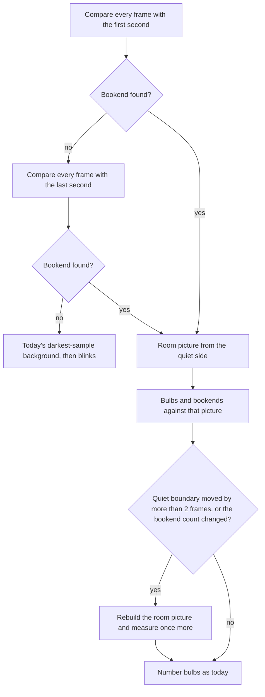

# Capture in a dim room — design

**Date:** 2026-09-29
**Status:** Approved for planning
**Scope:** Ignore a lamp or window that is already in the shot before the capture sweep, so a dim room (not a black room) still reconstructs. This is REQ-051, an addition to how REQ-048 finds bulbs. Numbering from the red–blue–green bookends (REQ-050) does not change.

## Context

A capture failed because a light reflected in a window. The room cannot realistically be pitch black, and a printed marker has to be lit to be seen. The bulbs are still the brightest new thing in the shot.

Today the background is the darkest value of each pixel across samples spread through the whole clip. A window that is only a little brighter than that darkest sample stays "on" for the entire recording, so the one-second bulb flashes never appear as separate lights. The job then says the clip stays bright.

## Decisions (locked)

| Topic | Choice |
|-------|--------|
| Room picture | Middle brightness of each pixel in the quiet frames, not the darkest sample |
| Which quiet frames | Before the opening bookend when that stretch is at least 0.3 s. Otherwise after the closing bookend when that stretch is at least 0.3 s. Never mix the two |
| What counts as on | Brighter than the room picture, after removing the change shared by the middle of the frame. Darkening does not count. Cutoff stays 30 levels |
| No bookend | Keep today's darkest-sample background, so a string left on still says the clip stays bright |
| API and review page | Unchanged. The new sentence travels in the existing `rejected_feeds[].reason` and job `error` |

## In plain terms

Frames before the opening red–blue–green flash are the room with the bulbs off. A window, a lamp, and the light on the printed marker are already in that picture, so they drop out. A pixel counts as a bulb only when it becomes brighter than that picture by more than the small lift or drop shared by the rest of the frame (a phone changing exposure). If the opening flash is missing, the frames after the closing flash are the room picture instead.

## Pipeline

All of this stays inside `backend/internal/cvruntime/src/reconstruct.py`. `analyse_feed` and `find_cues` keep the same required inputs and the same return values. Go and the web app do not change. The printed-marker search does not change.

Phone videos are read straight through. Seeking back to frame 0 is not used. Frames are not stored for the whole clip.

1. **Provisional room, opening.** The first 1.0 s is the temporary room picture (every frame in that second; if the clip is shorter, every frame it has). Each pixel keeps its middle brightness. Every frame is compared with that picture to look for a red–blue–green bookend.
2. **Provisional room, ending.** This read happens only when step 1 found no bookend. The last 1.0 s is the temporary room picture, and the clip is compared again. A recording that started late is the case this covers.
3. **No bookend.** If neither provisional picture shows a bookend, blinks are measured with today's rule: the per-pixel minimum of `BG_FRAMES` samples spread across the clip, then an absolute difference, then the cutoff of 30. `find_cues` returns an empty list. A long rejected bright segment still produces the "stays bright" message.
4. **Real room picture.** When a bookend was found, choose the quiet side from those provisional bookend times. `before` is the frames strictly before the first red frame of the earliest bookend. `after` is the frames strictly after the last green frame of the latest bookend. The sweep between two bookends is never the room picture.
   - Two or more bookends: use `before` when it lasts at least 0.3 s, otherwise `after`.
   - One bookend, and there are more frames after it than before it: it is the opening flash. The only candidate is `before`.
   - One bookend, and there are at least as many frames before it as after it: it is the closing flash. The only candidate is `after`.
   - If the chosen side lasts under 0.3 s, set the clip aside (see Errors). Do not measure bulbs, and do not switch to the other side when that other side is the sweep.
   - The picture is the per-pixel median of up to 15 frames spread evenly across the chosen side. A side with fewer than 15 frames uses all of them. Build both a grey picture (bulb position) and a brightest-channel picture (colour test).
5. **Measure.** Read the clip again. Bulb positions and bookend colours both use this real picture. These bookends are the ones used for numbering, unless step 6 rebuilds.
6. **One rebuild.** Rebuild when the measured bookend count differs from the provisional count, or when the quiet boundary moves by more than 2 frames. The boundary is the first red frame of the earliest bookend when the quiet side is `before`, and the last green frame of the latest bookend when the quiet side is `after`. Rebuild the room picture from the measured bookends and measure once more. The second measurement is the one used for numbering. Do not rebuild again. If the rebuilt quiet side is under 0.3 s, set the clip aside.

`analyse_feed` gains an optional `problems: list[str] | None = None`. Callers that omit it, on a clip whose quiet side is long enough, keep today's results. When the quiet side is too short, `analyse_feed` appends `QUIET_ROOM_REASON` to `problems` if it was passed, returns the bookends it found, and returns no blinks. `main` treats that reason as a dropped clip and does not number the clip. `find_cues` still returns the bookends it found.

## What counts as lit

For each frame, on the grey picture and separately on the brightest channel:

- difference = max(0, frame − room picture) at each pixel
- lift = the median of that difference over the whole frame
- excess = difference − lift
- a pixel is lit when excess is greater than `BLOB_THRESHOLD` (30)

The largest connected lit spot above `MIN_BLOB_AREA` is the bulb, as today. Colour dominance (`CUE_DOMINANCE` 1.5) is the mean of the raw blue, green, and red channels inside the brightest-channel mask, as today. Bookend frames are still treated as dark before numbering.

This assumes the room, not the bulbs, is most of the picture, so the median is the room's change. That matches a dim room where each bulb is a small bright spot.

## Errors

`QUIET_ROOM_REASON` is exactly:

`the recording needs a moment of the room with the bulbs off, before the opening flash or after the closing flash`

| Situation | What the operator sees |
|-----------|------------------------|
| Bookend found, quiet side under 0.3 s | That clip is in `rejected_feeds` with `QUIET_ROOM_REASON`. Other clips are still used |
| No bookend | Existing reason `no start or end signal found`. This includes a clip that starts on the opening flash and stops on the closing flash |
| Fewer than two clips left, and any dropped reason is `QUIET_ROOM_REASON` | The whole message is `Fewer than two clips could be used. Dropped: {dropped}.` `{dropped}` stays `file (reason)` joined with `"; "`. Do not say the flashes were missed |
| Fewer than two clips left, and no dropped reason is `QUIET_ROOM_REASON` | Keep today's lead: `The recordings missed the start and end flashes, so fewer than two clips could be used.` |
| No accepted blinks, and a rejected segment lasts at least 3× the dwell | The "stays bright" message, with the window sentence removed (below) |

The stays-bright paragraph ends at `Keep the camera still.` Delete `and avoid a bright window behind the lights.`

## Product docs

Update these in the same change. No new API fields.

- `docs/requirements/requirements.md` §11, at the end of "The app figures it out": `In a dim room, a light that is already in the picture before the opening flash is ignored. If that opening flash was missed, a light that is still there after the closing flash is ignored instead. Each bulb still has to be the brightest new thing when it turns on.` Append index row **REQ-051** (do not renumber). Point it at §11.
- `docs/requirements/acceptance-criteria.md`, under "Building a model from video": a dim-room try/see (lamp or window already in the shot, camera still, bulbs still found) and a too-short quiet try/see (the clip is named with the moment-of-the-room reason).
- `docs/design/overview.md` and `docs/design/appendix-traceability.md`: REQ-051 row, citing §3.23.
- `docs/design/backend-lights-and-automation.md` §3.23: replace the blink-detection bullet with this room picture, the 0.3 s rule, the brighter-only excess, and the no-bookend fallback. State that §3.23.3 numbering is unchanged.
- `docs/userguide/build-model-from-video.md`, in "Good to know", replace the stays-bright bullet with these three, in this order:
  1. A dim room is enough. A lamp or a window that is already in the shot before the opening colour flash is ignored. The bulbs still need to be the brightest new thing when they turn on, and the camera needs to stay still. Light on the printed marker is fine.
  2. If it says the clip stays bright and no individual blinks were found, the bulbs were on together, or something lit up during the sweep and stayed on. Film again with Start capture, so each bulb lights by itself for about a second, and keep the camera still.
  3. If a clip is set aside because the recording needs a moment of the room with the bulbs off, start filming before Start capture and keep filming until after the closing colour flash, with the bulbs off in those moments.

## Tests

In `backend/internal/cvruntime/src/test_reconstruct.py`, at 30 fps unless noted:

1. A rectangle at value 180 in the same place in every frame, at least 0.3 s of otherwise dark frames before the opening bookend, then a normal one-bulb-at-a-time sweep. Each bulb's centroid is nearer that bulb than the rectangle. The rectangle is not a blink.
2. The same clip, with 40 levels added to every pixel during the sweep only (clipped at 255). Same centroid assertion. No rejected on-duration reaches 3× the dwell.
3. No opening bookend, a closing bookend, at least 0.3 s after it, rectangle present the whole time. Bulbs are found before the closing bookend.
4. A bookend with about 0.1 s of quiet on both sides. Two such feeds: the job fails, `error` is `Fewer than two clips could be used.` plus the dropped list, `error` does not contain `missed the start and end flashes`, and each reason is `QUIET_ROOM_REASON`. Two good feeds plus one short feed: the job succeeds and `rejected_feeds` names only the short file with that reason.
5. The existing continuously-bright clip (no bookend) still contains `stays bright` and does not tell the operator to avoid a window.

`gen_fixtures.py`: default `--leading-gap-ms` becomes 300. The dark pad after the closing bookend becomes exactly 0.3 s (`round(0.3 * fps)` frames; today it is one bookend pulse, 0.2 s). Callers that pass `leading_gap_ms=0` keep that argument and rely on the trailing pad. Existing end-to-end fixture tests stay green.

`test_video_capture_released_on_read_error`: every `VideoCapture` that was constructed is released when a read throws. Assert the release count equals the number of captures constructed, not a hardcoded 2.

Run: `cd backend/internal/cvruntime/src && python3 test_reconstruct.py -v`

## Out of scope

- Daylight, or a bulb that is only a little brighter than the room
- A camera that moves during the clip
- A lamp that switches on only after the opening flash
- Changes to bookend numbering, light count, the marker scan, the Go API, or the review page layout
