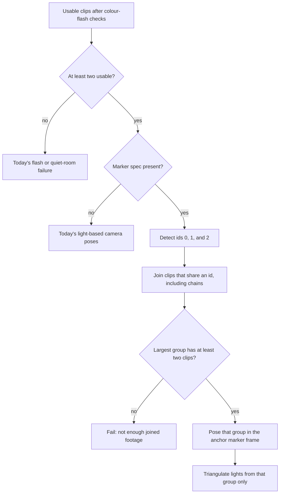

# Three printable capture markers — design

**Date:** 2026-09-30
**Status:** Approved for planning
**Scope:** Offer three distinct printable markers for video capture, and join clips only through those markers when the operator says they used one. This is REQ-052, an addition to the optional marker in REQ-049 and to pose estimation in REQ-048. Building a model with the marker box unchecked does not change.

## Context

Lights wrapped around a tree hide a single printed marker from some cameras. The create-from-video page currently offers one download: ArUco dictionary `DICT_4X4_50`, id 0, 100 mm edge (`GET /api/v1/capture/marker`). Reconstruction treats the first marker it sees as the origin of the scene. If that marker is missing from a clip, the job gives up on markers and lines the cameras up from the blinking lights instead.

The three markers stay where they were placed for every clip. A clip has to share a marker with another clip, or be linked by a clip that shows two markers, before those cameras share one scene. Clips that cannot be joined are named and left out. If fewer than two clips join, the job says there is not enough joined footage.

## Decisions (locked)

| Topic | Choice |
|-------|--------|
| How many markers | Three. Marker 1, Marker 2, and Marker 3 are ArUco ids 0, 1, and 2 |
| Size and dictionary | `DICT_4X4_50`, printed edge 100 mm (`edge_length_m` 0.1), same as today's Marker 1 |
| Placement | Operator prints all three, sticks them on different sides, and does not move them. The app does not assume a measured layout |
| Joining | Only through shared marker ids, including a chain where one clip shows two ids. Blinking lights are not used to line cameras up when the marker box is checked |
| Which group | Largest joined group. Same size: the group that contains the earliest uploaded file |
| A clip left outside that group | Job still succeeds from the joined clips. The outsider is named under Clips set aside |
| Fewer than two clips join | Job fails. Confirm is not offered. Message says there is not enough joined footage |
| Marker box unchecked | Today's no-marker path. No marker scan and no joined-footage failure |
| Other ArUco patterns | Ignored. Only ids 0, 1, and 2 count |

## What the operator sees

On the create-from-video page, the single "Download printable marker" link becomes three links:

- `Download marker 1` → `GET /api/v1/capture/marker?id=0`
- `Download marker 2` → `GET /api/v1/capture/marker?id=1`
- `Download marker 3` → `GET /api/v1/capture/marker?id=2`

Each link downloads a PDF. The links stack on a narrow screen and stay easy to tap. The checkbox label stays `I've placed a printed marker in the scene`.

Short text next to the links:

- Print all three and stick them on different sides of what you are wrapping.
- Keep them flat and do not move them between clips.
- Each clip should show at least one marker. To join two sides that do not share a marker, at least one clip must show two markers at the same time.
- You can still leave the marker box unchecked and build a model without them.

The review page does not gain a new layout. A joined job still lists outsiders under the existing "Clips set aside" heading (`file: reason`). A failed job still shows `error` and does not offer Confirm.

## Downloads

`GET /api/v1/capture/marker`

| Query | Behavior |
|-------|----------|
| `id` omitted or empty | Marker 1 (id 0). Old links keep working |
| `id=0`, `id=1`, or `id=2` | That marker |
| any other `id` | **400** `{ "error": { "code": "bad_request", "message": "marker id must be 0, 1, or 2" } }` |
| `type` omitted, `pdf`, or `aruco` | PDF (`application/pdf`) |
| `type=png` | PNG (`image/png`) |
| any other `type` | PDF for the requested id, as today |

`Content-Disposition` stays `inline` with the filename:

- `fiducial_marker_aruco4x4_50_id0_100mm.pdf` (and `.png`)
- `fiducial_marker_aruco4x4_50_id1_100mm.pdf` (and `.png`)
- `fiducial_marker_aruco4x4_50_id2_100mm.pdf` (and `.png`)

Files are embedded next to today's marker in `backend/internal/httpapi/assets/`. Each PDF includes a short note with the first three placement rules from the page: different sides, keep them still, and one clip must show two markers to join sides that do not share one. The note does not mention the checkbox. Id 0 remains today's pattern so an existing printout is still Marker 1. Generate ids 1 and 2 with the same OpenCV dictionary, the same 100 mm outer edge, and the same quiet zone.

## Upload

Checking the box still sends form field `marker=true` (or `1`). The page does not ask which markers were printed. The server fills:

```json
{
  "dictionary": "DICT_4X4_50",
  "edge_length_m": 0.1,
  "ids": [0, 1, 2]
}
```

`cvruntime.Marker` gains `IDs []int` with JSON name `ids`. Omitting `marker` still omits the object. A marker object whose `ids` field is omitted or null means `[0, 1, 2]`. An explicit empty `ids` list accepts no marker.

## How clips are joined

In plain terms: each remaining clip is checked for Marker 1, 2, and 3. Clips that saw the same marker share a scene. A clip that saw two markers ties those scenes together, including through a longer chain. The biggest such group is reconstructed in metres. Everyone else is set aside.

This runs only when the job spec includes `marker`, and only after the existing colour-flash checks. The camera stays still during a clip, which the capture instructions already require, so one view of a marker fixes that clip's camera. Scan the first `MARKER_SCAN_SECS` (5.0) seconds. A clip "sees" an id only when pose estimation for that id succeeds. Keep the first success for each id. Ignore detections whose id is not in `ids`.



**Groups.** Treat clips as connected when they see the same id. A clip that sees two ids connects the clips of those ids, so a chain counts: clip A sees only id 0, clip B sees ids 0 and 1, clip C sees only id 1, and all three are one group. Clips that see no allowed id are alone.

**Which group.** Use the group with the most clips. If two groups have the same number, use the one that contains the earliest file in upload order (the order of `files` on the capture form, which is the order of feeds in the job spec).

**One scene.** The anchor is the lowest marker id seen anywhere in the chosen group. Store each other marker as a rigid pose in the anchor frame. A clip that sees two markers supplies that link. If several clips could supply the same link, use the earliest uploaded one. A clip that sees the anchor uses that pose directly. A clip that does not see the anchor uses the earliest marker it does see whose pose in the anchor frame is already known; if it sees several, use the lowest such id.

For a bridge camera that sees known marker K and unknown marker U, with camera poses `x_cam = R @ x_marker + t` and with K already expressed as `x_k = R_ak @ x_anchor + t_ak` (`R_ak` identity and `t_ak` zero when K is the anchor):

- `R_au = R_uᵀ @ R_k @ R_ak`
- `t_au = R_uᵀ @ (R_k @ t_ak + t_k − t_u)`

A camera that sees marker M, once M is in the anchor frame, has:

- `R_cam = R_m @ R_am`
- `t_cam = R_m @ t_am + t_m`

Those poses are already in metres because the marker edge is 0.1 m. Triangulation of the chosen group uses metric scale 1.0 and does not multiply by the edge length again. `scale_hint` is not applied on this path. Blinking lights are matched and triangulated as today, and only from clips in the chosen group. They are not used to estimate camera pose.

A clip outside the chosen group is excluded the same way as a clip set aside for missing flashes: its blinks are not used.

**No backup.** When `marker` is present, do not fall back to lining cameras up from the lights, even if no marker is found. When `marker` is absent, do not run this scan.

## Errors

`NOT_JOINED_REASON` is exactly:

`this clip does not share a marker with the clips used for the model`

The joined-footage failure is exactly this lead, then the same dropped list used today (`file (reason)` joined with `"; "`, in upload order):

`Not enough joined footage. At least two clips need to share a marker, or be linked by a clip that shows two markers. Dropped: {dropped}.`

| Situation | What the operator sees |
|-----------|------------------------|
| Marker absent | Today's path. No `NOT_JOINED_REASON` |
| Fewer than two clips survive the colour-flash checks | Today's flash or quiet-room failure. Do not start the message with `Not enough joined footage`. Do not apply `NOT_JOINED_REASON` |
| Marker present, largest group has at least two clips | Job succeeds. Each usable clip outside that group is in `rejected_feeds` with `NOT_JOINED_REASON`. Earlier flash and quiet-room rows stay, with their own reasons |
| Marker present, at least two clips were usable, largest group has fewer than two | Job fails. Every usable clip gets `NOT_JOINED_REASON`, including a clip that saw a marker but could not be paired. The `error` uses the joined-footage lead. The dropped list also includes clips already set aside for flashes or a short quiet room |

## Product docs

Update these in the same change. No new HTTP path. `GET /api/v1/capture/marker` gains `id`. The capture job result does not gain fields.

- `docs/requirements/requirements.md` §11: replace the single-marker paragraph so it describes three different printable patterns, placing them on different sides, leaving them still, and joining clips only when they share a pattern or a clip shows two. Say that a clip which cannot be joined is named, and that too little joined footage stops the job without saving. Append index row **REQ-052** (do not renumber). Point it at §11. Keep the code out of the prose.
- `docs/requirements/acceptance-criteria.md`, under "Building a model from video": the existing review bullet mentions one printable marker; change it to three downloads. Add a try/see for two joined clips plus one clip that shows a different marker and is named with `this clip does not share a marker with the clips used for the model`. Add a try/see for two clips that do not share a marker, where the message starts with `Not enough joined footage` and Confirm is absent.
- `docs/design/overview.md` and `docs/design/appendix-traceability.md`: REQ-052 row, citing §3.23.2 and §4.17.
- `docs/design/backend-lights-and-automation.md` §3.23 pose bullet and §3.23.2: three ids, the group rules, no light-based fallback when a marker spec is present, and the failure sentence. State that the unchecked path is unchanged.
- `docs/design/backend-service.md`: `GET /api/v1/capture/marker` documents `id` 0, 1, or 2. `POST /api/v1/models/capture` with `marker=true` sends `ids: [0, 1, 2]`.
- `docs/design/frontend.md` §4.17: three download links and the placement text. The review layout stays as it is.
- `docs/design/glossary.md`: the fiducial-marker entry notes that video capture offers three patterns so a wrap can hide one of them.
- `docs/userguide/build-model-from-video.md` §5: three downloads, where to stick them, and what "not enough joined footage" means. No `REQ-*` codes.
- `backend/internal/httpapi/assets/README.md`: ids 0, 1, and 2.

## Tests

**Downloads** (`backend/internal/httpapi/capture_marker_test.go`):

- Omitting `id` returns Marker 1 as a PDF named `fiducial_marker_aruco4x4_50_id0_100mm.pdf`.
- `id=1` and `id=2` return different PDF bodies and the matching filenames.
- `type=png` for ids 0, 1, and 2 returns PNG bytes. Id 1's PNG body differs from id 0's.
- Any other `id` returns 400 with message `marker id must be 0, 1, or 2`.

**Upload** (`backend/internal/httpapi/capture_models_test.go`): `marker=true` still sets dictionary `DICT_4X4_50` and edge 0.1, and now sets ids `[0, 1, 2]`.

**Joining** (`backend/internal/cvruntime/src/test_reconstruct.py`). Synthetic still cameras. A marker counts only when its id is drawn in the scan window. Ground truth is in Marker 1's frame unless noted.

1. Clip A sees only id 0, clip B sees ids 0 and 1, clip C sees only id 1, with two lights a known distance apart. The job succeeds, `rejected_feeds` is empty, and the reconstructed distance matches that distance within 20% (the 100 mm edge set the scale, and the bridge put C in the same frame).
2. Clips A and B see only id 0. Clip C sees only id 1. The job succeeds and uses A and B. C's reason is `NOT_JOINED_REASON`.
3. Two clips see different ids and no clip shows both. The job fails, `error` starts with `Not enough joined footage.`, and both files are named with `NOT_JOINED_REASON`.
4. Four clips in upload order A, B, C, D. A and B share id 0. C and D share id 1. Nothing shows both ids. The job succeeds from A and B. C and D are set aside.
5. A group of three clips that share id 0, plus a separate pair that shares id 1. The job uses the three. The pair is set aside.
6. Two clips see id 0. A third sees only id 7. The job succeeds from the id 0 pair. The id 7 clip is set aside with `NOT_JOINED_REASON`.
7. Two clips that never show the colour flashes, with a marker spec present. `error` contains `missed the start and end flashes` and does not start with `Not enough joined footage`.
8. A marker spec with no marker drawn in the picture no longer reconstructs from the lights. The existing test that expected that fallback is changed to expect the joined-footage failure.
9. Marker spec omitted: the existing no-marker reconstruction still finds lights.
10. When every camera in the joined group is posed from a marker, coordinates are not scaled by the edge length a second time. Update the current double-scaling stub if the pose helper is renamed.

Run the reconstruction file with `cd backend/internal/cvruntime/src && python3 test_reconstruct.py -v`, and the Go packages that hold the handler tests with `cd backend && go test ./internal/httpapi/ ./internal/cvruntime/`.

**Page.** There is no component test for the create-from-video screen. When this is implemented, open that screen and confirm the three PDF links, the placement text, and that a failed joined-footage job shows its message without a Confirm button. The review list already renders `rejected_feeds`.

## Out of scope

- A measured layout or fixed spacing between the three markers
- Joining cameras from the blinking lights when the markers do not connect
- Asking the operator which of the three markers they printed
- More than these three markers
- A camera that moves during a clip
- A new review-page layout
