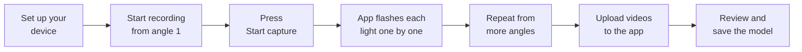
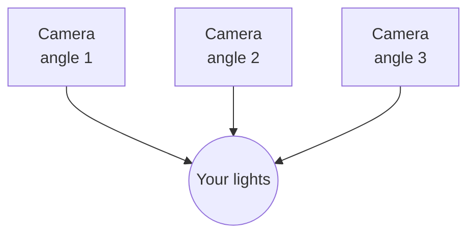

# Build a model from video

This is the coolest trick in the app. Instead of measuring every light and typing in numbers, you
just **film your lights** and let the app work out where they are in 3D. It's the same idea as how
your brain judges distance using two eyes — the app looks at your lights from a few different angles
and figures out the shape.

## How it works, in one picture

## Step by step

### 1. Set up your device

On the **Devices** screen, add your light controller and set its **light count** to match how many
lights are actually on your string. This lets the app flash them one at a time later.

### 2. Get ready to film from a few angles

You'll film your lights from **at least two** different spots — think of it like taking photos of a
statue from the front and the side. More angles usually means a more accurate result.

A phone camera is perfect. For each angle you'll do one recording.

### 3. Record the "capture" light show

For each angle:

1. **Start recording first.** Point your phone at the lights and hit record.
2. On the device's page in the app, press **Start capture**.
3. The app lights up **each bulb in turn** for about a second, then turns them all off.
4. Keep the camera **steady** while this happens — try to hold still or prop your phone up.

Recording *before* you press Start capture matters, so you don't miss the first light. Do this once
per angle, moving the camera to a new spot each time.

### 4. Upload and check the result

On the **Models** screen, choose **Create from video** and upload your recordings. Supported video
types are **MP4, MOV, MKV, and WebM** (those are the formats most phones use, so you're probably
fine).

When the app finishes thinking, it shows you:

- how many lights it found,
- any lights it couldn't quite place, and
- a 3D preview so you can see the result.

If it looks good, type a name and press **Confirm** to save it as a model. Not happy? Press
**Cancel** and try again with better recordings.

### 5. Optional: a printable marker

If you want, you can download and print a special **marker** (a printed square pattern) from the
upload screen and put it in the shot. It helps the app get the *scale* right — basically how big
everything really is. This is totally optional; you can skip it and still build a model.

## Good to know

- The video feature works out of the box on **Linux** (including Raspberry Pi) — nothing extra to
  install.
- It's **not available on Windows yet**. If you're on Windows, you can still build models by
  uploading a file instead (see **[Using the app](using-the-app.md)**).
