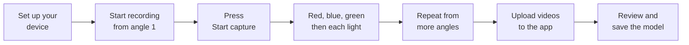
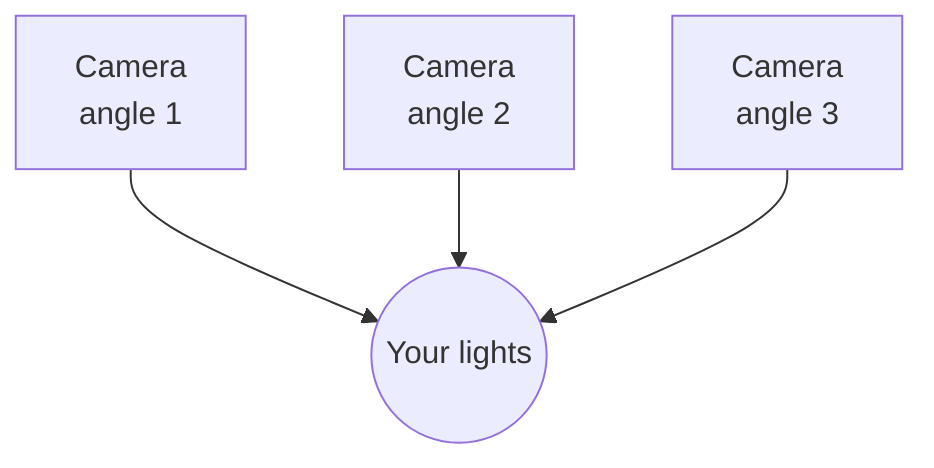

# Build a model from video

This is the coolest trick in the app. Instead of measuring every light and typing in numbers, you
just **film your lights** and let the app work out where they are in 3D. It's the same idea as how
your brain judges distance using two eyes — the app looks at your lights from a few different angles
and figures out the shape.

## How it works, in one picture

```mermaid
flowchart LR
    A[Set up your<br/>device] --> B[Start recording<br/>from angle 1]
    B --> C[Press<br/>Start capture]
    C --> D[Red, blue, green<br/>then each light]
    D --> E[Repeat from<br/>more angles]
    E --> F[Upload videos<br/>to the app]
    F --> G[Review and<br/>save the model]
```

## Step by step

### 1. Set up your device

On the **Devices** screen, add your light controller and set its **light count** to match how many
lights are actually on your string. This lets the app flash them one at a time later.

### 2. Get ready to film from a few angles

You'll film your lights from **at least two** different spots — think of it like taking photos of a
statue from the front and the side. More angles usually means a more accurate result.

```mermaid
flowchart TD
    L((Your lights))
    C1[Camera<br/>angle 1] --> L
    C2[Camera<br/>angle 2] --> L
    C3[Camera<br/>angle 3] --> L
```

A phone camera is perfect. For each angle you'll do one recording.

### 3. Record the "capture" light show

For each angle:

1. **Start recording first.** Point your phone at the lights and hit record.
2. On the device's page in the app, press **Start capture**.
3. Every bulb flashes **red**, then **blue**, then **green**. Each colour is only a brief flash.
4. The app then lights **each bulb in turn** for about a second.
5. The red, blue, and green flashes play once more, and the bulbs go dark. Stop the recording
   after that second colour flash.
6. Keep the camera **steady** the whole time — try to hold still or prop your phone up.

The device page tells you while the colour flash is playing, and it shows which bulb number is on
during the one-by-one part. Starting the recording before you press Start capture catches the opening
flash. If one clip misses that opening flash but still includes the closing flash, you can type the
device's **light count** when you upload and the app will count backward from the end. Do this once
per angle, moving the camera to a new spot each time.

### 4. Upload and check the result

On the **Models** screen, choose **Create from video** and upload your recordings. Supported video
types are **MP4, MOV, MKV, and WebM** (those are the formats most phones use, so you're probably
fine).

When the app finishes thinking, it shows you:

- how many lights it found,
- any lights it couldn't quite place,
- any clip it had to set aside because the red–blue–green flashes were missing, and
- a 3D preview so you can see the result.

There is an optional **light count** box on that page. Leave it empty when every clip includes the
opening colour flash. Fill in the same number you set on the device when a clip only caught the
closing flash.

If it looks good, type a name and press **Confirm** to save it as a model. Not happy? Press
**Cancel** and try again with better recordings.

### 5. Optional: a printable marker

If you want, you can download and print a special **marker** (a printed square pattern) from the
upload screen and put it in the shot. It helps the app get the *scale* right — basically how big
everything really is. This is totally optional; you can skip it and still build a model.

## Good to know

- If the upload fails, the page tells you why — for example the clips are too big (over 2 GB
  together), or they are not a supported video type. If it says the upload stopped before the server
  could reply, the connection dropped. On a Raspberry Pi, `journalctl -u dlm` shows the reason,
  including how long the request took and the error.
- If it says the clip **stays bright** and no individual blinks were found, the bulbs were on
  together (or a bright window filled the shot) instead of one at a time. Film again with **Start
  capture**, so each bulb lights by itself for about a second, and keep a bright window out of the
  background if you can.
- The video feature works out of the box on **Linux** (including Raspberry Pi) — nothing extra to
  install.
- It's **not available on Windows yet**. If you're on Windows, you can still build models by
  uploading a file instead (see **[Using the app](using-the-app.md)**).
