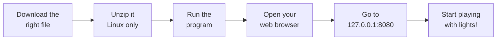

# Getting started

This page gets the app running on your computer. It takes about 10 minutes, and you don't need to
install any programming tools.

## What the app is

**Domestic Light & Magic** (**dlm**) runs like a mini website, but it lives on *your own* computer
instead of the internet. Nothing is uploaded to the cloud, and you don't need an account. Once it's
running, you open it in a normal web browser (Chrome, Safari, Edge, Firefox — whatever you use).

It works on a **phone, tablet, or desktop**, so you can control your lights from the couch too.

## The big picture

Here's the whole journey from download to seeing the app:



That address in the last step, **`127.0.0.1:8080`**, is just a way of saying "the app running right
here on this computer." You'll type it into your browser like a website.

## Step 1: Download the right file

Grab the latest release from **[GitHub Releases](https://github.com/mudged/dlm/releases)**. There's
a different file for each kind of computer, so pick the one that matches yours:

| Your computer | File to download |
|---------------|------------------|
| **Raspberry Pi** (64-bit) | `dlm_linux_arm64.tar.gz` |
| **Linux** PC or server | `dlm_linux_amd64.tar.gz` |
| **Windows** 10 or 11 | `dlm_windows_amd64.exe` |

> **What's a Raspberry Pi?** It's a tiny, cheap computer about the size of a credit card. Lots of
> people use one to run little projects like this all the time. If you don't have one, a normal
> Windows or Linux PC is totally fine.

## Step 2: Run it

Pick the section that matches your computer.

### On a Raspberry Pi or Linux

The Linux download is a `.tar.gz` file — that's a zipped-up folder. Inside it you'll find the app
**plus** a folder called `runtime/cv/` that the app needs for the "build from video" feature. Keep
those two together, like a game and its data folder.

Open a **terminal** (a window where you type commands) and run these lines one at a time:

```bash
mkdir -p ~/dlm && tar -xzf dlm_linux_arm64.tar.gz -C ~/dlm
cd ~/dlm
chmod +x dlm_linux_arm64
./dlm_linux_arm64
```

In plain English, those commands: make a folder called `dlm`, unzip the download into it, go into
that folder, mark the app as "allowed to run", and then start it.

> On a normal Linux PC, swap `dlm_linux_arm64` for `dlm_linux_amd64` (and the same for the
> `.tar.gz` file name).

### On Windows

Even easier — it's a single file:

1. Download `dlm_windows_amd64.exe`.
2. Double-click it to run. (Windows might warn you about an unknown app; that's normal for small
   projects — choose to run it anyway.)

> Heads up: the "build a model from video" feature doesn't work on Windows yet. Everything else does.

## Step 3: Open it in your browser

While the app is running, open your web browser and go to:

**[http://127.0.0.1:8080/](http://127.0.0.1:8080/)**

That's it — you should see the app. Leave the program window/terminal open; if you close it, the app
stops.

Your models, scenes, and settings are saved in a folder called `data` right next to the app, so they
stick around for next time.

## Optional extras

You can ignore these until you actually need them:

- **Python routines.** The app can run little automated light programs written in Python. To use
  *those*, you need **Python 3** installed on the same computer. Without it, everything else still
  works — only starting a Python routine will fail. (Advanced: you can point the app at a specific
  Python with the `DLM_PYTHON3` setting.)
- **Build from video.** Filming your lights to figure out their positions works out of the box on
  Linux — nothing extra to install. See **[Build a model from video](build-model-from-video.md)**.

## Want to build it yourself?

If you're curious about the code and want to build the app from scratch, that's a developer job —
see the **[developer build guide](../engineering/build-and-run.md)**.
