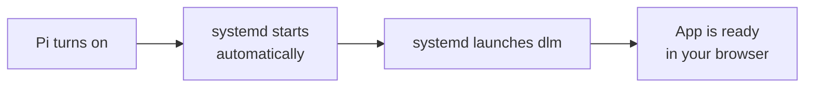

# Make it start on its own (Raspberry Pi)

This page is a bit more advanced — **skip it unless you want the app to start automatically** every
time your Raspberry Pi turns on. Normally you have to start the app by hand each time; this makes the
Pi do it for you, even after a power cut or reboot.

We use something called **systemd**, which is a built-in "manager" on Raspberry Pi OS that starts and
watches over programs. You'll type a few commands, but you can copy-paste them.



> `sudo` in front of a command means "do this as the administrator." The Pi may ask for your
> password. That's expected here.

## Step 1: Put the app in a shared folder

Unpack the download into `/opt/dlm` (a common place for apps like this):

```bash
sudo mkdir -p /opt/dlm
sudo tar -xzf /path/to/dlm_linux_arm64.tar.gz -C /opt/dlm
sudo chmod +x /opt/dlm/dlm_linux_arm64
sudo mkdir -p /opt/dlm/data
sudo chown -R pi:pi /opt/dlm
```

Keep the `runtime/cv/` folder right next to the app (so, `/opt/dlm/runtime/cv/`). It comes inside the
download and the app needs it.

## Step 2: Create the service file

Make a file at **`/etc/systemd/system/dlm.service`** (open it with `sudo nano
/etc/systemd/system/dlm.service`) and paste in this:

```ini
[Unit]
Description=Domestic Light & Magic
After=network.target

[Service]
Type=simple
User=pi
WorkingDirectory=/opt/dlm
Environment=DLM_DATA_DIR=/opt/dlm/data
ExecStart=/opt/dlm/dlm_linux_arm64
Restart=on-failure

[Install]
WantedBy=multi-user.target
```

This is just a set of instructions telling systemd *what* to run, *where*, and to restart it if it
ever crashes.

## Step 3: Turn it on

```bash
sudo systemctl daemon-reload
sudo systemctl enable dlm
sudo systemctl start dlm
```

- `enable` means "start this every time the Pi boots."
- `start` starts it right now, without waiting for a reboot.

## Step 4: Check it worked

Run:

```bash
systemctl status dlm
```

If it says it's running, open **[http://127.0.0.1:8080/](http://127.0.0.1:8080/)** on the Pi itself.
From another phone or computer on the same Wi-Fi, use the **Pi's IP address** instead of
`127.0.0.1` (for example `http://192.168.1.50:8080/`).

> **Changing the port:** the app uses port `8080` by default. To use a different one, add a line like
> `Environment=HTTP_LISTEN=:80` in the `[Service]` section of the service file.

## Updating to a newer version

When a new release comes out:

1. Download the new file for your Pi from
   **[Releases](https://github.com/mudged/dlm/releases)**.
2. Stop the app: `sudo systemctl stop dlm`
3. Replace the old files with the new ones — unpack the new `.tar.gz` over `/opt/dlm`, keeping the
   app and its `runtime/cv/` folder side by side as before.
4. Start it again: `sudo systemctl start dlm`

**Don't delete your `data` folder** when updating — that's where all your models and settings live.
(If you changed where data is stored using `DLM_DATA_DIR` or `DLM_DB_PATH`, keep that location
safe instead.)
