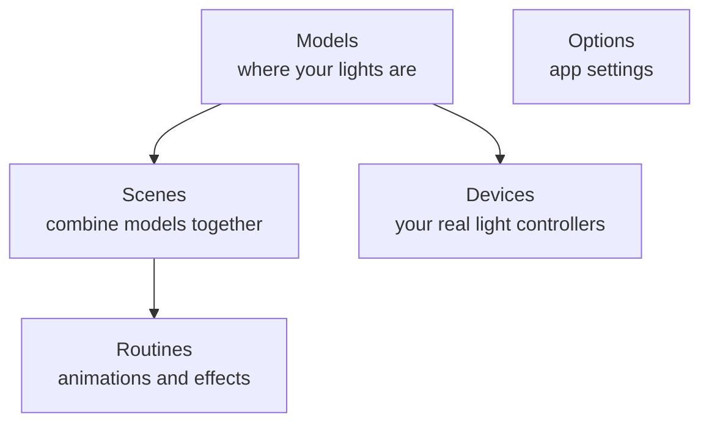

# Using the app

Once the app is running, open **[http://127.0.0.1:8080/](http://127.0.0.1:8080/)** in your browser.
The layout automatically fits your screen, so it looks good on a phone, tablet, or computer.

Here's a tour of what everything does.

## The main areas

The app is split into a few sections. Think of them as different rooms:



- **Models** — A *model* is a map of where your lights are in 3D space. You can build one by
  uploading a file, filming your lights, or using the samples that come with the app. Then you can
  spin it around and look at it in 3D.
- **Scenes** — A *scene* lets you put several models together in one shared 3D space, so you can
  control a whole setup at once (for example, lights on a tree *and* lights along a shelf).
- **Routines** — *Routines* are animations. Some are simple shape-based effects you set up right in
  the app; others are little Python programs (see below) for more advanced patterns.
- **Devices** — A *device* is the real-world box that actually controls your lights, like an
  ESP32 or WLED controller. Here you connect a device, tell the app how many lights it has, and match
  it up with a model. The app can even search your network to find devices for you.
- **Options** — App settings. This includes a **factory reset**, which wipes everything and starts
  fresh (it always asks you to confirm first, so you can't do it by accident).

> **Jargon check:** *ESP32* and *WLED* are popular, cheap gadgets that hobbyists use to control
> strings of LED lights over Wi-Fi. If you have smart fairy lights, there's a good chance something
> like this is behind them.

## Try the samples first

You don't need any real lights to start playing. When you run the app for the first time, it
automatically adds a few **sample models** — a sphere, a cube, and a cone — plus three sample
Python routines. Poke around with those to get a feel for things.

If you ever delete every model and restart the app, the samples come back automatically.

## Three ways to make a model

You have a few options for telling the app where your lights are:

1. **Use a sample** — easiest; already there when you start.
2. **Film your lights** — the app watches videos of your lights and works out their positions for
   you. This is the fun one: **[Build a model from video](build-model-from-video.md)**.
3. **Upload a file** — if you already know your light positions, you can type them into a
   spreadsheet and upload it (see below).

### Uploading a file (CSV)

A **CSV** is just a simple spreadsheet saved as text. On the **Models** screen you can upload one to
create a model. The file has to be laid out exactly like this:

```csv
id,x,y,z
0,0.0,1.0,0.0
1,0.1,1.0,0.0
2,0.2,1.0,0.0
```

The rules:

- The first line must be exactly `id,x,y,z`.
- The `id` numbers start at `0` and count up one at a time (`0`, `1`, `2`, …) with no gaps.
- `x`, `y`, and `z` are the position of each light in 3D space.

## For tinkerers: live light updates

If you like to code and want to connect your own tools to the app, it can stream light changes to
them live (using a technique called Server-Sent Events) instead of your tool having to ask over and
over. That's a developer topic — the details are in the
**[environment and API guide](../engineering/environment-and-api.md)**.
