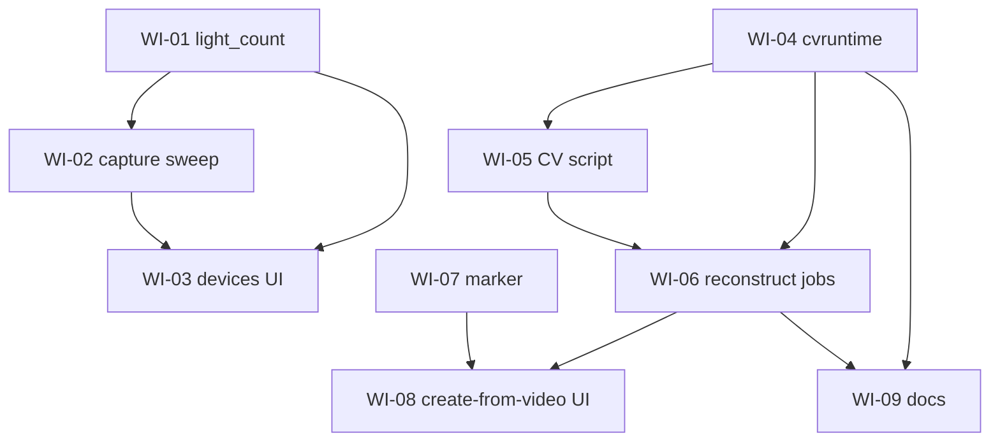

# Work items: camera-based model capture (REQ-047, REQ-048, REQ-049)

This folder breaks the implementation of the camera-capture feature into small,
independent work items. **Each `WI-*.md` file is a self-contained prompt**: you can
start a fresh chat with only that file's contents and the agent has everything it
needs (it points back to the relevant requirement IDs and architecture sections).

Source specs (read-only background, already merged):

- Requirements: [`docs/requirements.md`](../requirements.md) — REQ-047, REQ-048, REQ-049
- Acceptance: [`docs/acceptance_criteria.md`](../acceptance_criteria.md)
- Architecture: [`docs/architecture.md`](../architecture.md) — §3.22, §3.23/§3.23.1/§3.23.2, §4.15, §4.17, §6.9, §8.24, §8.25

## Model legend

| Tag | Meaning |
|-----|---------|
| **Small/fast** | Mechanical, well-scoped change — use **Composer 2.5** |
| **Medium** | Non-trivial logic, concurrency, packaging, or UI state — use **Sonnet** |

## Items

| ID | Title | Area | Model | Depends on |
|----|-------|------|-------|------------|
| [WI-01](WI-01-device-light-count.md) | Device `light_count` field (store + API) | Backend Go | Small/fast | — |
| [WI-02](WI-02-capture-sweep-backend.md) | Capture light-sequence controller + endpoints | Backend Go | Medium | WI-01 |
| [WI-03](WI-03-devices-ui-capture.md) | Devices UI: light count + capture controls | Frontend | Medium | WI-01, WI-02 |
| [WI-04](WI-04-cvruntime-packaging.md) | Bundled OpenCV runtime + packaging/CI | Infra / Go | Medium (spike) | — |
| [WI-05](WI-05-reconstruction-cv-script.md) | Reconstruction CV script (detect/pose/triangulate) | CV / Python | Medium | WI-04 (contract) |
| [WI-06](WI-06-reconstruction-orchestration.md) | Reconstruction jobs + `/models/capture*` API | Backend Go | Medium | WI-04, WI-05 |
| [WI-07](WI-07-fiducial-marker.md) | Printable fiducial marker endpoint | Backend Go | Small/fast | — |
| [WI-08](WI-08-create-from-video-ui.md) | Models "create from video" UI | Frontend | Medium | WI-06, WI-07 |
| [WI-09](WI-09-docs.md) | README + advanced-setup docs | Docs | Small/fast | WI-04, WI-06 |

## Dependency graph

## Suggested order / parallelism

- **Track A (device sweep):** WI-01 → WI-02 → WI-03.
- **Track B (reconstruction):** WI-04 and WI-05 can start in parallel (WI-05 develops the
  script against the JSON contract; WI-04 produces the runtime that ships it), then WI-06, then WI-08.
- **Anytime:** WI-07 (marker) is independent; WI-09 (docs) last once WI-04/WI-06 land.

## Conventions every item must follow

- Repo root: `/workspaces/dlm`. Monorepo: Go module in `backend/`, Next.js in `web/`. See [`AGENTS.md`](../../AGENTS.md).
- **Single binary, pure-Go, no cgo** for the product build (SQLite is `modernc.org/sqlite`). Do not introduce cgo into the main binary.
- Backend tests: `cd backend && go test ./...`. Frontend: `cd web && npm test` and `cd web && npm run lint`.
- HTTP error envelope: `{ "error": { "code", "message", "details"? } }` (helpers in `backend/internal/httpapi/json.go`).
- Add/adjust tests with each change; do not break existing tests. Do **not** edit `docs/requirements.md` or `docs/architecture.md` (those are settled); if you find a genuine conflict, stop and flag it.
