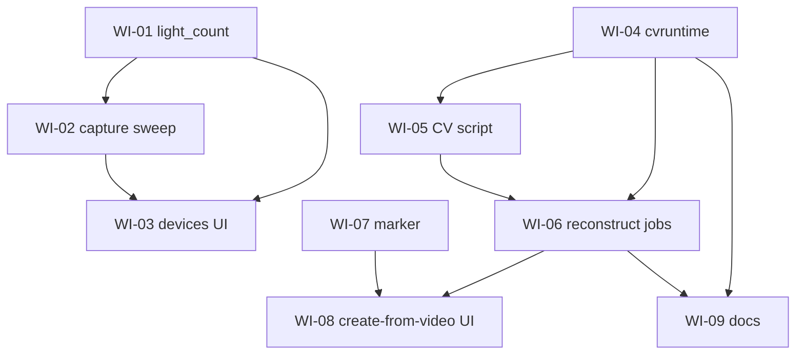

# Work items: camera-based model capture (REQ-047, REQ-048, REQ-049)

This folder breaks the implementation of the camera-capture feature into small,
independent work items. **Each `WI-*.md` file is a self-contained prompt**: you can
start a fresh chat with only that file's contents and the agent has everything it
needs (it points back to the relevant requirement IDs and architecture sections).

Source specs (read-only background, already merged):

- Requirements: [`docs/requirements.md`](../requirements.md) — REQ-047, REQ-048, REQ-049
- Acceptance: [`docs/acceptance_criteria.md`](../acceptance_criteria.md)
- Architecture: [`docs/architecture.md`](../architecture.md) — §3.22, §3.23/§3.23.1/§3.23.2, §4.15, §4.17, §6.9, §8.24, §8.25

## Model legend

| Tag | Meaning |
|-----|---------|
| **Small/fast** | Mechanical, well-scoped change — use **Composer 2.5** |
| **Medium** | Non-trivial logic, concurrency, packaging, or UI state — use **Sonnet** |
| **Hard** | Algorithmic correctness / geometry reasoning — use **Opus** |

> **Note:** WI-01…WI-09 build the camera-capture feature. **WI-10…WI-30** are
> code-review remediation items (bug fixes/hardening) — see
> [Code-review remediation items](#code-review-remediation-items-wi-10wi-30) below.

## Items

| ID | Title | Area | Model | Depends on |
|----|-------|------|-------|------------|
| [WI-01](WI-01-device-light-count.md) | Device `light_count` field (store + API) | Backend Go | Small/fast | — |
| [WI-02](WI-02-capture-sweep-backend.md) | Capture light-sequence controller + endpoints | Backend Go | Medium | WI-01 |
| [WI-03](WI-03-devices-ui-capture.md) | Devices UI: light count + capture controls | Frontend | Medium | WI-01, WI-02 |
| [WI-04](WI-04-cvruntime-packaging.md) | Bundled OpenCV runtime + packaging/CI | Infra / Go | Medium (spike) | — |
| [WI-05](WI-05-reconstruction-cv-script.md) | Reconstruction CV script (detect/pose/triangulate) | CV / Python | Medium | WI-04 (contract) |
| [WI-06](WI-06-reconstruction-orchestration.md) | Reconstruction jobs + `/models/capture*` API | Backend Go | Medium | WI-04, WI-05 |
| [WI-07](WI-07-fiducial-marker.md) | Printable fiducial marker endpoint | Backend Go | Small/fast | — |
| [WI-08](WI-08-create-from-video-ui.md) | Models "create from video" UI | Frontend | Medium | WI-06, WI-07 |
| [WI-09](WI-09-docs.md) | README + advanced-setup docs | Docs | Small/fast | WI-04, WI-06 |

## Dependency graph

## Suggested order / parallelism

- **Track A (device sweep):** WI-01 → WI-02 → WI-03.
- **Track B (reconstruction):** WI-04 and WI-05 can start in parallel (WI-05 develops the
  script against the JSON contract; WI-04 produces the runtime that ships it), then WI-06, then WI-08.
- **Anytime:** WI-07 (marker) is independent; WI-09 (docs) last once WI-04/WI-06 land.

## Conventions every item must follow

- Repo root: `/workspaces/dlm`. Monorepo: Go module in `backend/`, Next.js in `web/`. See [`AGENTS.md`](../../AGENTS.md).
- **Single binary, pure-Go, no cgo** for the product build (SQLite is `modernc.org/sqlite`). Do not introduce cgo into the main binary.
- Backend tests: `cd backend && go test ./...`. Frontend: `cd web && npm test` and `cd web && npm run lint`.
- HTTP error envelope: `{ "error": { "code", "message", "details"? } }` (helpers in `backend/internal/httpapi/json.go`).
- Add/adjust tests with each change; do not break existing tests. Do **not** edit `docs/requirements.md` or `docs/architecture.md` (those are settled); if you find a genuine conflict, stop and flag it.

## Code-review remediation items (WI-10…WI-30)

These items address defects found in a whole-codebase review (Go backend, Next.js frontend, Python CV
runtime). Each `WI-*.md` is a **self-contained prompt** — start a fresh chat with only that file's
contents. Line numbers in the items are approximate (from review time); verify against the current
source before editing. Severity reflects the review's assessment.

### Backend (Go)

| ID | Title | Sev | Model | Depends on |
|----|-------|-----|-------|------------|
| [WI-10](WI-10-routine-run-termination.md) | Persist routine-run termination on exit & init failure | High | Sonnet | — |
| [WI-11](WI-11-shutdown-and-reset-coordination.md) | Stop background workers on factory reset & shutdown | High | Sonnet | WI-10 |
| [WI-12](WI-12-nonblocking-sse-fanout.md) | Non-blocking SSE fan-out | Medium | Sonnet | — |
| [WI-13](WI-13-capture-conflict-failclosed.md) | Capture conflict guard fail-closed on DB error | Medium | Composer 2.5 | — |
| [WI-14](WI-14-device-push-ssrf-hardening.md) | Harden device push against redirect SSRF | Medium | Composer 2.5 | — |
| [WI-15](WI-15-factory-reset-confirmation.md) | Factory reset confirmation guard | Medium | Sonnet | — |
| [WI-16](WI-16-bound-reconstruction-resources.md) | Bound reconstruction jobs & child output buffers | Medium | Sonnet | — |
| [WI-17](WI-17-backend-minor-cleanups.md) | Backend minor cleanups (sweep map, stop state, body limit, progress) | Low | Composer 2.5 | — |

### Frontend (Next.js)

| ID | Title | Sev | Model | Depends on |
|----|-------|-----|-------|------------|
| [WI-18](WI-18-sse-reconnect.md) | SSE auto-reconnect with backoff | High | Sonnet | — |
| [WI-19](WI-19-capture-progress-polling.md) | Capture progress polling after start | High | Sonnet | — |
| [WI-20](WI-20-stale-load-guards.md) | Guard async loads against stale responses | High | Sonnet | — |
| [WI-21](WI-21-sse-resync-ux.md) | Lightweight SSE resync (no flash, no lost edits, no race) | Medium | Sonnet | WI-18, WI-20 |
| [WI-22](WI-22-preserve-video-jobid.md) | Preserve in-progress video job across tab switch | Medium | Composer 2.5 | — |
| [WI-23](WI-23-frontend-minor-cleanups.md) | Frontend minor cleanups (unmount guards, submitting, editor theme) | Low | Composer 2.5 | — |

### CV runtime (Python) + contract

| ID | Title | Sev | Model | Depends on |
|----|-------|-----|-------|------------|
| [WI-24](WI-24-aruco-metric-scale.md) | Fix ArUco metric double-scaling | **Critical** | Sonnet | — |
| [WI-25](WI-25-blink-ordinal-drift.md) | Robust cross-feed blink correspondence (ordinal drift) | High | Opus | — |
| [WI-26](WI-26-triangulation-sanity-guards.md) | Triangulation sanity guards (cheirality + NaN/Inf) | High | Opus | — |
| [WI-27](WI-27-noncontiguous-light-ids.md) | Handle non-contiguous light IDs end-to-end | High | Sonnet | — |
| [WI-28](WI-28-per-feed-intrinsics.md) | Per-feed intrinsics in essential-matrix path | Medium | Composer 2.5 | — |
| [WI-29](WI-29-robust-blink-detection.md) | Robust background model & reliable frame rewind | Medium | Sonnet | — |
| [WI-30](WI-30-python-robustness-misc.md) | Python robustness misc (dwell, exit codes, release, scale) | Low | Composer 2.5 | — |

### Suggested order

- **Fix first (correctness/availability):** WI-24 (Critical scale bug), WI-10 → WI-11 (routine/lifecycle),
  WI-18/WI-19/WI-20 (frontend high-impact), WI-25/WI-26 (CV fabrication risks).
- **Then hardening:** WI-12, WI-13, WI-14, WI-15, WI-16, WI-27, WI-28, WI-29, WI-21.
- **Anytime / low risk:** WI-17, WI-22, WI-23, WI-30.

Original review detail is available in the three review sub-reports referenced in the chat that
generated these items.
